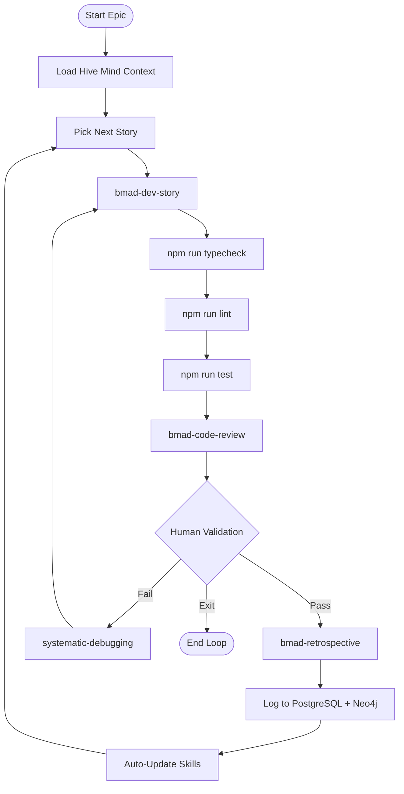

# Epic Build Loop

**Purpose:** Autonomous execution of epic stories with validation gates, code review, and continuous improvement.

**When to Use:**
- Starting a new epic
- Implementing stories in sequence
- Need autonomous agent execution with human checkpoints
- Want butter-smooth handoffs between sessions

**Prerequisites:**
- ARCH-001 fixed (groupIdEnforcer wired)
- Stories defined in sprint-status.yaml
- Memory system connected (PostgreSQL + Neo4j)

---

## Execution Loop Architecture



---

## Phase 1: Context Hydration

### Step 1.1: Hive Mind Connect

**Auto-execute at loop start:**

```bash
# Load full context
/opencode invoke roninmemory-hive-mind

# Verify connection
✅ PostgreSQL: Events loaded
✅ Neo4j: Insights loaded  
✅ Memory-Bank: Context loaded
✅ Unified: BUTTER SMOOTH
```

### Step 1.2: Load Epic Context

**Read from sprint-status.yaml:**

```typescript
const epic = await loadEpic('Epic 1');
const stories = epic.stories.filter(s => s.status !== 'done');
const currentStory = stories[0];

console.log(`🎯 Current Story: ${currentStory.id} - ${currentStory.title}`);
console.log(`📋 Status: ${currentStory.status}`);
console.log(`🚧 Blocker: ${currentStory.blocker || 'None'}`);
```

---

## Phase 2: Story Implementation

### Step 2.1: Dev Story

**Execute:**

```bash
/opencode invoke bmad-dev-story \
  --story=${currentStory.id} \
  --epic=${epic.id} \
  --context=full
```

**Requirements:**
- Implement story per acceptance criteria
- Follow existing patterns from memory-bank
- Add tests for new functionality
- Update documentation

### Step 2.2: Validation Gates

**Gate 1: Type Check**

```bash
npm run typecheck
```
- ✅ PASS: Continue
- ❌ FAIL: systematic-debugging → fix → retry

**Gate 2: Lint**

```bash
npm run lint
```
- ✅ PASS: Continue
- ❌ FAIL: Fix lint errors → retry

**Gate 3: Tests**

```bash
bun test
```
- ✅ PASS: Continue
- ❌ FAIL: systematic-debugging → fix → retry

**Gate 4: Code Review**

```bash
/opencode invoke bmad-code-review \
  --files="changed-files" \
  --depth=adversarial
```

**Review Criteria:**
- Security vulnerabilities
- Edge cases
- Pattern consistency
- Documentation completeness

---

## Phase 3: Human Validation Gate

### Critical Checkpoint

**🛑 STOP. HUMAN VALIDATION REQUIRED.**

**Validate:**
- [ ] No runtime errors
- [ ] No type errors (npm run typecheck)
- [ ] UI loads correctly (if applicable)
- [ ] Tests pass (bun test)
- [ ] Lint passes (npm run lint)
- [ ] Configuration correct
- [ ] Behavioral prompts work
- [ ] Implementation functional

**User Decision:**
- **Y** (Yes): Continue to retrospective
- **N** (No): systematic-debugging → retry
- **E** (Exit): Pause loop, save state

---

## Phase 4: Retrospective

### Step 4.1: Extract Learnings

**Execute:**

```bash
/opencode invoke bmad-retrospective \
  --story=${currentStory.id} \
  --outcome=success
```

**Extract:**
- What worked?
- What failed?
- New patterns discovered
- Anti-patterns to avoid

### Step 4.2: Log to Memory

**PostgreSQL:**

```sql
INSERT INTO events (event_type, context, agent_id, group_id)
VALUES (
  'story_completed',
  'Story ${currentStory.id} implemented successfully',
  'epic-build-loop',
  'allura-agent-os'
);
```

**Neo4j:**

```cypher
CREATE (i:Insight {
  name: 'Pattern: ${pattern_name}',
  type: 'Pattern',
  observations: ['What worked', 'How to replicate'],
  groupId: 'allura-agent-os'
})

MATCH (s:Session), (i:Insight)
WHERE s.id = '${sessionId}'
CREATE (s)-[:CONTRIBUTED]->(i)
```

---

## Phase 5: Skill Evolution

### Step 5.1: Pattern Detection

**Check for repeatable patterns:**

```typescript
if (isRepeatedPattern(session, 3)) {
  await createSkillFromPattern({
    name: `auto-${pattern.name}`,
    description: pattern.description,
    trigger: pattern.trigger,
    action: pattern.action
  });
}
```

### Step 5.2: Skill Update

**Update existing skills:**

```typescript
await updateSkill('bmad-dev-story', {
  patterns: extractPatterns(session),
  antiPatterns: extractFailures(session)
});
```

---

## Phase 6: Loop Continuation

### Auto-Continue

**If stories remain:**

```typescript
const remainingStories = epic.stories.filter(s => s.status !== 'done');

if (remainingStories.length > 0) {
  console.log(`🔄 ${remainingStories.length} stories remaining`);
  console.log(`🎯 Next: ${remainingStories[0].id}`);
  
  // Continue loop
  await epicBuildLoop();
} else {
  console.log('✅ Epic Complete!');
  await epicRetrospective(epic);
}
```

---

## Error Handling

### On Failure

**If any gate fails:**

1. **Log failure** to PostgreSQL
2. **Invoke** systematic-debugging
3. **Analyze** root cause
4. **Fix** issue
5. **Retry** from failed gate
6. **Update** skills with anti-pattern

**Max Retries:** 3 attempts per story
**On 3rd failure:** Escalate to human

---

## Integration with BMad

### BMad Skills Enhanced

**Updated:**
- `bmad-dev-story` - Auto-loads hive mind context
- `bmad-code-review` - Logs review findings to memory
- `bmad-retrospective` - Auto-extracts patterns
- `systematic-debugging` - Consults prior failures

**New:**
- `epic-build-loop` - This skill
- `roninmemory-hive-mind` - Context hydration

---

## Session Handoff

### Butter Smooth Continuation

**When session ends:**

```typescript
await logSessionEnd({
  sessionId,
  epicId,
  currentStory,
  status: 'paused',
  nextAction: 'Continue epic-build-loop'
});
```

**Next session:**

```bash
# Auto-loads context
/opencode invoke epic-build-loop --continue

🧠 Hive Mind Connected
🔄 Resuming Epic 1
🎯 Current Story: 1.1 Record Raw Execution Traces
📊 Progress: 2/7 stories complete

Butter smooth. Continuing...
```

---

## Commands

### Start Epic

```bash
/opencode invoke epic-build-loop \
  --epic="Epic 1" \
  --auto=true
```

### Continue Epic

```bash
/opencode invoke epic-build-loop --continue
```

### Run Single Story

```bash
/opencode invoke epic-build-loop \
  --story="1.1" \
  --single=true
```

### Pause Loop

```bash
/opencode invoke epic-build-loop --pause
```

---

## Success Metrics

- [ ] Stories implement without human intervention (except validation gate)
- [ ] Failures auto-debugged and resolved
- [ ] Patterns auto-extracted and skills updated
- [ ] Next session starts butter smooth
- [ ] Epic completes with full traceability

---

**Next Action:** Start Epic 1 with `epic-build-loop --epic="Epic 1"`
