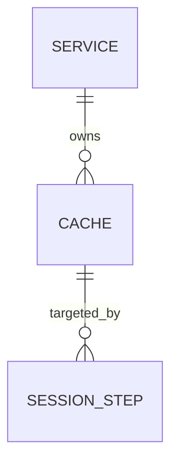

# AI Guidelines: Repository Documentation Standards

> [!IMPORTANT]
> This document provides guidelines for using AI assistance (e.g., GitHub Copilot) effectively within this repository. It captures the documentation patterns, required artifacts, and quality standards that every contributor — human or AI-assisted — must follow.

---

## Table of Contents

- [1. Purpose](#1-purpose)
- [2. Required Documentation Artifacts](#2-required-documentation-artifacts)
  - [The Cohesive Project Document](#the-cohesive-project-document)
- [3. AI-Assisted Documentation Policy](#3-ai-assisted-documentation-policy)
  - [Disclosure Requirement](#disclosure-requirement)
  - [What AI Should Help With](#what-ai-should-help-with)
  - [What AI Must Not Decide Alone](#what-ai-must-not-decide-alone)
- [4. Document Quality Standards](#4-document-quality-standards)
  - [Accuracy & Source of Truth](#accuracy--source-of-truth)
  - [Cross-Referencing](#cross-referencing)
  - [Completeness Checklist](#completeness-checklist)
- [5. Diagrams](#5-diagrams)
  - [When Diagrams Are Required](#when-diagrams-are-required)
  - [Diagram Types & Tools](#diagram-types--tools)
- [6. Naming & File Conventions](#6-naming--file-conventions)
- [7. Templates](#7-templates)
- [8. Review & Maintenance](#8-review--maintenance)

---

## 1. Purpose

This repository uses **structured documentation as a first-class engineering artifact**. Before writing code, operators and engineers are expected to define:

- **What** the system does (Blueprint and Requirements)
- **Why** design decisions were made (Risks & Decisions)
- **How** data is structured and named (Data Dictionary)
- **Where** each requirement is satisfied (Implementation Tasks)

AI assistance (GitHub Copilot, LLMs, etc.) is encouraged for drafting these documents — but all AI-generated content must be reviewed, validated against the source of truth (code, schemas, team consensus), and disclosed.

---

## 2. Required Documentation Artifacts

### The Cohesive Project Document

**File:** `docs/<project-name>/PROJECT.md`  
**Template:** [`templates/PROJECT.template.md`](templates/PROJECT.template.md)

To prevent AI context fragmentation and improve maintainability, every new feature or project must be documented in a **single, cohesive Master Document**. This document serves as the absolute source of truth for the initiative.

A complete `PROJECT.md` document must include the following core sections:

| Section | Purpose |
|---------|---------|
| **1. Blueprint (Core Concepts)** | Summary, domain entities, states and execution rules. Gives the AI bounded context. |
| **2. Requirements Matrix** | Business (`B#`) and Functional (`F#`) requirements. Outlines what the system must do. |
| **3. Solution Architecture** | Mermaid topology diagrams, execution flow, component interactions, and state machines. |
| **4. Data Dictionary** | Canonical definitions of all tables, fields, enums, required flags, and data schemas. |
| **5. Risks & Decisions** | Architectural Decisions (`AD-##`) and Risks (`RK-##`). Answers *why* the design acts the way it does. |
| **6. Tasks** | Implementation tasks and progress tracking. |

> **Why this matters for AI:** An LLM generating code without context will hallucinate domain rules. The Master Document gives the AI the exact state machines, schemas, and requirements it needs in one continuous context window, preventing inconsistencies between separated documentation files.

---

## 3. AI-Assisted Documentation Policy

### Disclosure Requirement

Any document that was drafted or substantially modified with AI assistance **must include the following notice block** at the top (below the title):

```markdown
> [!NOTE]
> **AI-Assisted Documentation**
> Portions of this document were drafted with the assistance of an AI language model (GitHub Copilot).
> Content has not yet been fully reviewed — this is a working design reference, not a final specification.
> AI-generated content may contain inaccuracies or omissions.
> When in doubt, defer to the source code, JSON schemas, and team consensus.
```

Remove this notice only after a full human review has been completed and signed off in a PR.

---

### What AI Should Help With

- Drafting initial document structure from a verbal or bullet-point brief
- Generating field tables from JSON schemas or Go struct definitions
- Producing Mermaid diagram markup from described flows
- Filling in repetitive traceability table rows
- Suggesting enum value descriptions and edge-case rules
- Identifying gaps in requirement coverage

---

### What AI Must Not Decide Alone

- **Concurrency rules** — e.g., whether locks are per-task or per-session; transaction boundaries
- **Failure semantics** — e.g., whether a partial failure rolls back or continues
- **Security boundaries** — credential handling, isolation protocols
- **Naming conventions** — field names and enum values must be confirmed against schemas
- **Business requirements** — what the system should do is a product/team decision
- **Breaking changes** — any schema or API change that affects existing consumers

---

## 4. Document Quality Standards

### Documentation Hierarchy

**When conflict exists between documents, follow this precedence:**

| Priority | Source | Scope |
|----------|--------|-------|
| 1 | Notion — Allura Memory Control Center | Product vision |
| 2 | `_bmad-output/planning-artifacts/*` | Implementation canon |
| 3 | `_bmad-output/planning-artifacts/*` | BMad outputs (superseded) |
| 4 | `_bmad-output/implementation-artifacts/*` | Sprint stories |
| 5 | `memory-bank/*` | Session context |

**KEY RULE:** `_bmad-output/planning-artifacts/` is the single source of truth. BMad-generated documents in `_bmad-output/planning-artifacts/` are superseded when they conflict with `_bmad-output/planning-artifacts/`.

### Tenant Naming Convention

**STANDARD:** All tenant `group_id` values use the `allura-*` namespace.

| Workspace | `group_id` |
|-----------|------------|
| Faith Meats | `allura-faith-meats` |
| Creative Studio | `allura-creative` |
| Personal Assistant | `allura-personal` |
| Nonprofit | `allura-nonprofit` |
| Bank Audits | `allura-audits` |
| HACCP | `allura-haccp` |

**LEGACY:** `roninclaw-*` naming is deprecated. If found in active docs/code, flag as drift.

### Accuracy & Source of Truth

| If a conflict exists between… | Defer to… |
|-------------------------------|-----------|
| A document and the JSON schema | JSON schema |
| A document and the source code | Source code |
| Two documents/sections | The Blueprint section, then team consensus |
| An AI suggestion and any of the above | The source of truth |

### Cross-Referencing

Because the project documentation is unified into a single `PROJECT.md` file, you must cross-reference extensively using **Internal Markdown Anchors**. 

Rules:
- When writing a Functional Requirement (`F1`), map it directly to a Business Requirement (`B1`).
- When logging an Architectural Decision (`AD-01`), explicitly write down which section of the Solution Architecture it influences.
- Do not use bare file names for internal links — always use `#anchor` syntax to link between the sections of the `PROJECT.md` file.

---

### Completeness Checklist

Before merging a documentation PR, verify:

- [ ] All `B#` IDs appear in the Requirements section and trace down to implementation tasks.
- [ ] All `AD-##` decisions have a logged status (Decided, Proposed, Deferred).
- [ ] All diagram logic renders correctly (Mermaid syntax validated).
- [ ] AI disclosure notice is present on any AI-drafted document.
- [ ] No secrets, credentials, or PII appear in any documentation.

---

## 5. Diagrams

### When Diagrams Are Required

| Diagram Type | Required In | Condition |
|---|---|---|
| Component overview | Solution Architecture | Always |
| Data flow / execution flow | Solution Architecture | Whenever the system processes multi-step operations |
| Sequence diagram | Solution Architecture | Whenever async or multi-party interaction exists |
| ER diagram | Data Dictionary | Whenever there are two or more related entities |

### Diagram Types & Tools

This repository uses **Mermaid** diagrams embedded in Markdown. All diagrams must be written as fenced code blocks with the `mermaid` language tag.

Supported and recommended diagram types:

| Mermaid Type | Use For |
|---|---|
| `graph TD` / `graph LR` | Component overviews, dependency graphs |
| `sequenceDiagram` | Request/response flows, async interactions |
| `erDiagram` | Data model entity-relationship diagrams |
| `stateDiagram-v2` | State machines |
| `flowchart TD` | Execution logic, decision trees |

Example:

````markdown

````

---

## 6. Naming & File Conventions

| Artifact | File Name Pattern | Location |
|---|---|---|
| Cohesive Project Document | `PROJECT.md` | `docs/<project-name>/` |
| JSON Schema | `<entity>.schema.json` | `json-schema/` |
| AI Guidelines | `AI-GUIDELINES.md` | Repository root |
| Document templates | `PROJECT.template.md` | `templates/` |

**Rule:** Keep each project folder flat - no nested `plans/`, `drafts/`, or `adas/` directories inside `docs/<project-name>/`.

---

## 7. Templates

The unified document template is provided in the [`templates/`](templates/) directory:

| Template | Description |
|---|---|
| [`PROJECT.template.md`](templates/PROJECT.template.md) | The single Master Document template. Contains Blueprint, Architecture, Data Dictionary, Requirements Matrix, Risks/Decisions, and Tasks. |

To start a new project, copy `templates/PROJECT.template.md` to `docs/<project-name>/PROJECT.md` and replace all `<!-- placeholders -->` with project-specific content.

*(Note: Legacy individual templates like `BLUEPRINT.template.md` may remain in the system, but `PROJECT.template.md` is strictly enforced for new projects).*

---

## 8. Review & Maintenance

- Documentation PRs require at least one reviewer outside of the original author.
- The Data Dictionary and Requirements sections must be updated in the **same PR** as any schema or API change.
- AI-disclosure notices are only removed after a full human review sign-off noted in the PR description.
- Stale documents should be flagged in the next team retrospective.
