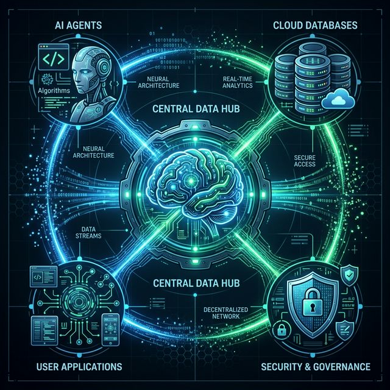

# Allura's Memory


**MISSION:** Give AI agents a brain that does not forget. We separate raw flight logs (PostgreSQL) from refined intel (Neo4j). Humans stay in control.

**THE PROBLEM:** AI agents wake up with amnesia. They do not remember past missions. They repeat mistakes. They build zero ongoing knowledge.

**THE SOLUTION:** A 6-layer memory system. It locks in agent knowledge with strict rules, clear audit trails, and totally isolated project zones.

---

## MISSION DIRECTIVES 

- [Quick Start](#quick-start)
- [Capabilities](#capabilities)
- [Architecture](#architecture)
- [Boot Protocol](#boot-protocol)
- [Field Usage](#field-usage)
- [API Intel](#api-intel)
- [Testing](#testing)
- [Ops Docs](#ops-docs)
- [Enlistment](#enlistment)
- [License](#license)

---

## QUICK START

*Execute via Bun for maximum security. Npm/npx are banned.*

```bash
# Clone and build
git clone https://github.com/Charitablebusinessronin/roninmemory.git
cd roninmemory

# We only use Bun. Period.
bun install

# Start the data engines
docker compose up -d

# Verify system integrity
bun test

# Launch the MCP comms server
bun run mcp
```

---

## CAPABILITIES

### Core Tools

| Feature | Description |
|---------|-------------|
| **Dual-Layer Brain** | Raw logs go to PostgreSQL. Curated truth goes to Neo4j. |
| **Versioned Truth** | Knowledge is locked. Old truth is SUPERSEDED, never erased. |
| **Human Checkpoint** | High-level changes require a human to say YES. |
| **Data Lockdown** | Projects are separated by `group_id`. No cross-talk. |
| **Audit Trails** | We store 5 layers of decision records for compliance. |
| **MCP Ready** | Connects to Claude Desktop, OpenClaw, and MCP agents. |
| **OpenCode Skills** | Loaded with custom tools for memory-first coding. |

### Command & Control

- **Approval Gates:** Humans review big changes.
- **Circuit Breakers:** Shuts down operations if too many errors hit.
- **Strict Limits:** Budgets, timers, and absolute hard-stops control the AI.
- **Steel Frame:** History is set in stone. You cannot change the past.

---

## ARCHITECTURE

<p align="center">
  
</p>

The machine thinks in six layers. Top to bottom:

1. **AGENT:** The front-line operator (OpenClaw).
2. **AUDIT:** 5-layer decision logs (ADR Layer).
3. **GOVERNANCE:** Human checkpoints and circuit breakers.
4. **DISCOVERY (ADAS):** Agent upgrades itself with Ollama + Docker.
5. **CONTROL:** Self-correcting loop (Perceive -> Plan -> Act -> Check).
6. **MEMORY (Base):** Neo4j (Curated Intel) linked to PostgreSQL (Raw Logs).

---

## BOOT PROTOCOL (Installation)

### Gear Required

- Node.js 18+ runtime via Bun
- Docker (Runs the databases)
- 4GB RAM minimum

### Setup

```bash
git clone https://github.com/Charitablebusinessronin/roninmemory.git
cd roninmemory
bun install
docker compose up -d
bun test
```

### Environment Keys

```bash
POSTGRES_PASSWORD=your_password
NEO4J_PASSWORD=your_password
NOTION_API_KEY=optional
```

---

## FIELD USAGE

### MCP Comms Link

Plug into Claude Desktop or OpenClaw:

```json
{
  "mcpServers": {
    "memory": {
      "command": "bun",
      "args": ["run", "src/mcp/memory-server.ts"]
    }
  }
}
```

### Memory Snapshots

Before a long mission, build a snapshot to brief your agents. 

```bash
# Build the brief
bun run snapshot:build \
  --source docs/roninmemory \
  --output memory-bank \
  --group-id roninmemory \
  --max-summary-chars 600

# Hydrate the databases with the brief
GROUP_ID=roninmemory bun run session:hydrate \
  --snapshot memory-bank/index.json \
  --concurrency 4
```

### Quick Boot

Run the whole brief and hydrate cycle in one shot:

```bash
POSTGRES_PASSWORD="..." NEO4J_PASSWORD="..." bun run session:bootstrap
```

---

## API INTEL

### Core Tools

| Tool | Mission |
|------|---------|
| `store_memory` | Save a new piece of truth. |
| `search_memories` | Find target intel fast. |
| `get_memory` | Pull an exact file. |
| `promote_memory` | Move info from Draft to Active. Requires human YES. |
| `deprecate_memory` | Mark info as old/useless. |
| `archive_memory` | Lock info away for audits. |

*(Full spec in `.skills/memory-management/resources/tool-reference.md`)*

---

## TESTING

Validate the gear before deployment.

```bash
# Basic check
bun test

# E2E integration
RUN_E2E_TESTS=true bun test

# Stress tests
bun run test:e2e
```

**Status:** Over 1,854 tests passing across 6 heavy epics.

---

## OPS DOCS

| File | Content |
|----------|---------|
| `AGENTS.md` | Standard Operating Procedures (SOPs). |
| `docs/roninmemory/PROJECT.md` | Master plan and architecture. |
| `.opencode/skills/` | Tool loadouts for your agents. |
| `memory-bank/` | Active mission context. |
| `README.md` | This document. You are here. |

---

## TECH STACK

| Slot | Gear |
|-------|-------------|
| Language | TypeScript (Strict Rules) |
| Runtime | Bun |
| Data Engines | PostgreSQL 16, Neo4j 5.26 |
| Comms Protocol | Model Context Protocol (MCP) |
| Testing | Vitest |

---

## ENLISTMENT (Contributing)

If you join the fight, follow these rules:

1. **Pass the Checks:** All code must pass `bun run typecheck`.
2. **Prove It Works:** Send tests with every change.
3. **Follow the SOP:** Read and obey `AGENTS.md`.
4. **Stay in Your Lane:** Always use `group_id` so data does not mix.
5. **Log Everything:** Use MCP tools (`log_event`, `create_insight`) to track history.

---

## ZERO-TRUST SECURITY

- **No npm/npx:** We only use `bun`. Supply chain attacks stop here.
- **Total Isolation:** Data is locked by `group_id`.
- **Self-Editing Logs:** MemFS safely handles agent reflections securely.

---

## LICENSE

MIT

---

## COMMANDER

Built by [ronin4life](https://github.com/Charitablebusinessronin) for AI agent memory dominance.
