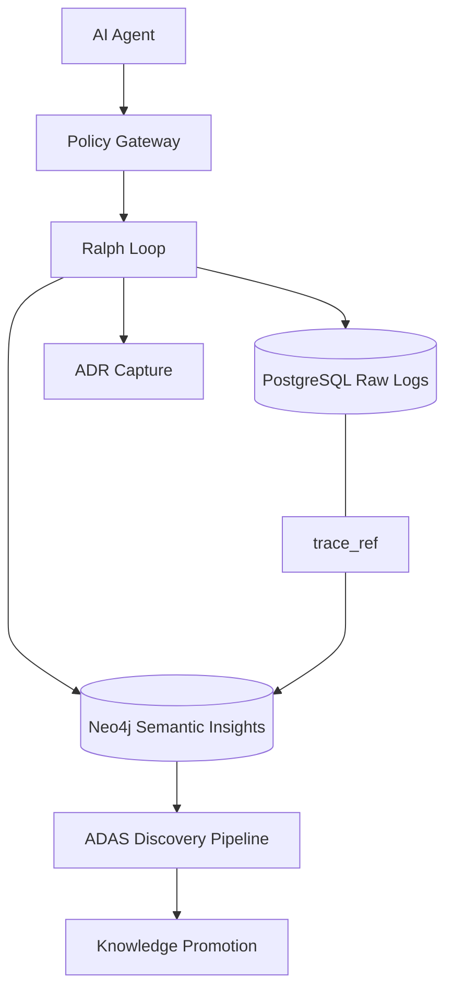

# Memory - Unified Memory System for AI Agents


A production memory system for AI agents that persists knowledge across sessions. Separates raw execution traces (PostgreSQL) from curated insights (Neo4j) with human-in-the-loop governance.

## Quick Start

```bash
git clone <repo-url> && cd memory && npm install
docker compose up -d
npm test
```

## Core Concepts

The system operates across six architectural layers:

1. **Raw Memory (PostgreSQL):** Immutable logs of every event, action, and outcome.
2. **Semantic Memory (Neo4j):** High-confidence, versioned knowledge graph with SUPERSEDES relationships.
3. **Control (Ralph Loops):** Self-correcting execution loops (Perceive, Plan, Act, Check, Adapt).
4. **Discovery (ADAS):** Automated Design of Agent Systems pipeline for testing and promoting designs.
5. **Governance:** Rule enforcement through Policy Gateway and Circuit Breakers to prevent cascade failures.
6. **Audit (ADR):** Five-layer Agent Decision Records (Action, Context, Reasoning, Counterfactuals, Oversight).

## Documentation

- [AGENTS.md](./AGENTS.md) — Coding standards and architectural principles
- [docs/PROJECT.md](./docs/PROJECT.md) — Architecture overview and hiring profile
- [.skills/memory-management/](./.skills/memory-management/) — Skill package for agent frameworks

## Architecture



## API Examples

### Store a Raw Event
```typescript
import { insertEvent } from '@/lib/postgres/queries';

await insertEvent({
  group_id: 'alpha',
  event_type: 'agent_action',
  agent_id: 'assistant_01',
  metadata: { action: 'write_file', path: 'src/main.ts' }
});
```

### Create a Semantic Insight
```typescript
import { insertInsight } from '@/lib/neo4j/queries';

await insertInsight({
  insight_id: 'ins_101',
  group_id: 'alpha',
  summary: 'Strict typing reduces runtime errors by 40%',
  confidence: 0.95,
  trace_ref: 'events:evt_555'
});
```

### Run a Ralph Loop
```typescript
import { RalphLoop } from '@/lib/ralph/loop';

const loop = new RalphLoop(sessionId, input, promise, config, {
  act: async (i, p, it) => { /* agent logic */ return result; }
});
const result = await loop.execute();
```

## Testing

Run the full suite of 1854 tests:
```bash
npm test
```

For behavioral integration tests (requires databases):
```bash
RUN_E2E_TESTS=true npm test
```

## Contributing

We follow strict TypeScript standards and TDD. Please read [AGENTS.md](./AGENTS.md) for detailed coding guidelines and architectural principles.

## License

MIT
