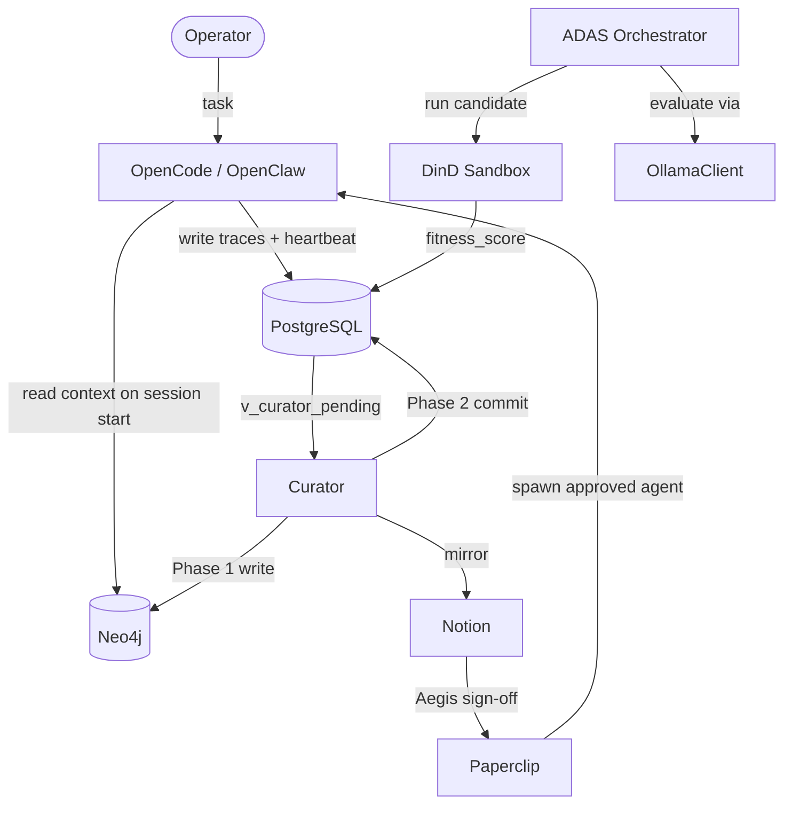
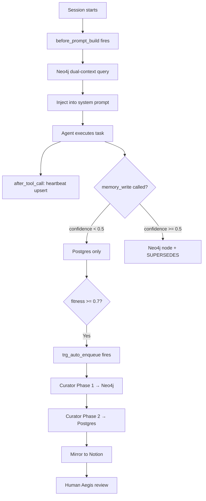
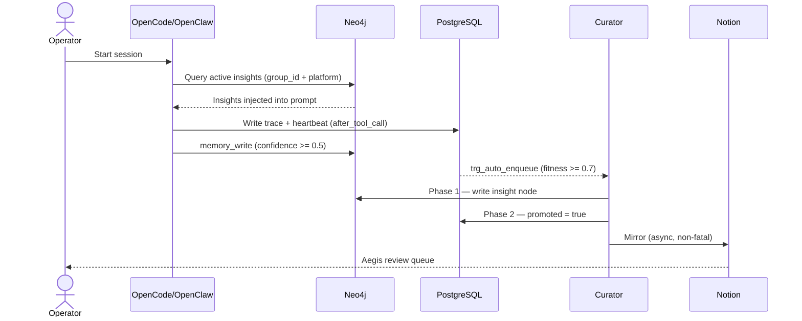
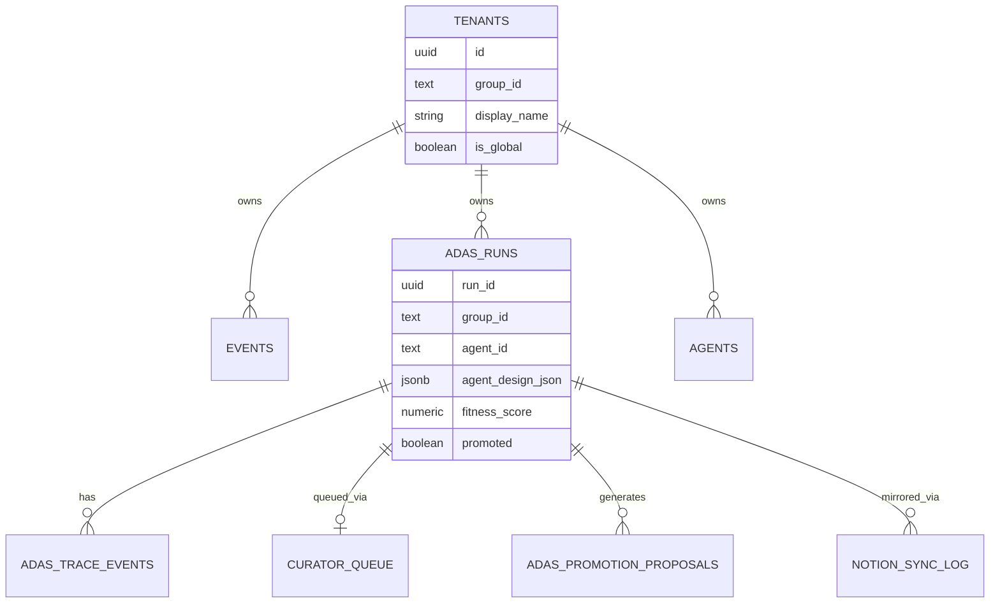

# roninmemory Blueprint

> [!NOTE]
> **AI-Assisted Documentation**
> Portions of this document were drafted with the assistance of an AI language model.
> Content has not yet been fully reviewed — this is a working design reference, not a final specification.
> When in doubt, defer to the source code, JSON schemas, and team consensus.

roninmemory is the dual-database memory engine for Allura Agent-OS. It provides persistent, tenant-isolated, human-governed knowledge accumulation across all agent sessions via a PostgreSQL raw event store and a Neo4j semantic knowledge graph.

---

## Table of Contents

- [1. Core Concepts](#1-core-concepts)
- [2. Requirements](#2-requirements)
- [3. Architecture](#3-architecture)
- [4. Diagrams](#4-diagrams)
- [5. Data Model](#5-data-model)
- [6. Execution Rules](#6-execution-rules)
- [7. Global Constraints](#7-global-constraints)
- [8. API Surface](#8-api-surface)
- [9. Logging & Audit](#9-logging--audit)
- [10. Admin Workflow](#10-admin-workflow)
- [11. Event-Driven Architecture](#11-event-driven-architecture)
- [12. References](#12-references)

---

## 1. Core Concepts

### Insight

A versioned knowledge node in Neo4j. Represents a validated, behavior-shaping rule or pattern. Never mutated — every update creates a new node linked by `(:new)-[:SUPERSEDES]->(:old)`.

**States:** `active` | `degraded` | `expired` | `superseded`  
**Key fields:** `insight_id`, `group_id`, `agent_id`, `title`, `content`, `confidence` (0.0–1.0), `version`, `status`, `rule_version`, `StartDate`, `EndDate`

---

### AgentDesign

A promoted, versioned agent configuration discovered by ADAS evolutionary search. Spawning as a live agent requires Aegis human sign-off.

**ADAS pipeline states:** `draft` → `evaluating` → `ranked` → `proposed` → `approved` → `promoted` | `rejected`  
**Neo4j states:** `active` | `deprecated`  
**Key fields:** `run_id`, `group_id`, `agent_id`, `version`, `status`, `agent_design_json`, `fitness_score`

---

### ADAS Run

One candidate agent design evaluation. A raw trace row in PostgreSQL. Immutable after insert except `status` and `promoted`.

**States:** `pending` | `running` | `succeeded` | `failed`  
**Key fields:** `run_id`, `group_id`, `agent_id`, `agent_design_json`, `fitness_score`, `promoted`

---

### Tenant

A workspace namespace. Every PostgreSQL row and every Neo4j node carries `group_id` using the `allura-*` convention.

**Key fields:** `group_id` (e.g. `allura-faith-meats`), `display_name`, `is_global`

---

### Dual Logging Policy

| Store | Purpose | Content | Write Condition |
|-------|---------|---------|----------------|
| **PostgreSQL** | System of Record for the Present | Raw traces, events, audit logs, heartbeats | All writes |
| **Neo4j** | System of Reason | Curated insights, versioned patterns | Confidence `>= 0.5` |

---

### MemoryOrchestrator (Brooks-Bound)

The primary orchestrator bound to the Frederick P. Brooks Jr. persona. Governs all memory operations, enforces the dual logging policy, and delegates execution to canonical `Memory{Role}` agents.

| Agent | Role |
|-------|------|
| `MemoryOrchestrator` | Governs all memory ops; delegates to specialists |
| `MemoryArchitect` | System design, ADRs |
| `MemoryBuilder` | Infrastructure implementation |
| `MemoryAnalyst` | Metrics, drift detection |
| `MemoryScribe` | Documentation |
| `MemoryCopywriter` | Agent prompt authoring |
| `MemoryRepoManager` | Git operations |

---

## 2. Requirements

### Business Requirements

| # | Requirement |
|---|-------------|
| B1 | Operator work logs captured as structured activities linked to the correct workspace |
| B2 | Every session starts with current knowledge loaded automatically |
| B3 | ADAS designs promoted to Neo4j and mirrored to Notion without manual intervention |
| B4 | All promoted knowledge traceable to raw PostgreSQL evidence |
| B5 | Workspace-specific knowledge takes priority over platform knowledge |
| B6 | No agent design deploys without human Aegis sign-off |
| B7 | Neo4j nodes never mutated — all updates via `SUPERSEDES` |
| B8 | All services run in Docker — no local execution (except OpenClaw) |
| B9 | ADAS auto-designs agents via evolutionary search |
| B10 | Real LLM inference (Ollama) — no mocked responses in production |
| B11 | CLI entry point for standalone ADAS runs |
| B12 | All ADAS events and proposals persisted to PostgreSQL |
| B13 | Two-tier model selection — stable baselines + experimental opt-in |
| B14 | All memory operations governed by MemoryOrchestrator |
| B15 | Tenant isolation via `group_id` — `allura-*` namespace |
| B16 | Dual logging: PostgreSQL for events, Neo4j for insights |

### Functional Requirements

See [`REQUIREMENTS-MATRIX.md`](./REQUIREMENTS-MATRIX.md) for F1–F33 with traces to B# and implementation status.

#### Memory & Promotion (F1–F8)

| # | Requirement |
|---|-------------|
| F1 | `before_prompt_build` hook queries Neo4j for active insights scoped to `group_id` + `allura-platform` |
| F2 | Workspace-specific insights injected before platform-wide ones |
| F3 | `memory_write` tool: confidence `< 0.5` → Postgres only; `>= 0.5` → Neo4j + `SUPERSEDES` |
| F4 | Runs with `fitness_score >= 0.7` and `status = succeeded` auto-enqueued via `trg_auto_enqueue_curator` |
| F5 | Curator 2-phase commit: Phase 1 → Neo4j; Phase 2 → `promoted = true` in Postgres |
| F6 | Phase 2 failure triggers compensating `DETACH DELETE` of orphaned Neo4j node |
| F7 | Insights with `confidence >= 0.7` mirrored to Notion (async, non-fatal) |
| F8 | `trg_promotion_guard` enforces `neo4j_written = true` before `promoted = true` |

---

## 3. Architecture

### Components

| Component | Responsibility | Technology |
|-----------|---------------|------------|
| MemoryOrchestrator | Primary orchestrator; governs all memory ops | OpenCode Agent |
| Memory{Role} agents | Specialized execution (Architect, Builder, Analyst, Scribe, Copywriter, RepoManager) | OpenCode Subagents |
| PostgreSQL 16 | Append-only raw trace store; agent registry; promotion queue | Docker |
| Neo4j 5.26 + APOC | Persistent semantic memory graph; versioned insights | Docker |
| Curator | 2-phase promotion cron; Notion mirror | Bun, node-cron, Docker |
| ADAS Orchestrator | Evolutionary agent design search | Bun, Dockerode, Docker |
| OllamaClient | HTTP client — local + cloud model routing | TypeScript |
| DinD Sidecar | Blast-radius-bounded ADAS candidate execution | docker:26-dind |
| RuVix Kernel | L1 proof-gated mutation kernel | Docker |
| Paperclip | Multi-tenant governance dashboard; Aegis gate | Docker |
| OpenClaw | Human communication gateway (WhatsApp, Telegram, Discord) | Ubuntu (local only) |

---

## 4. Diagrams

### Component Overview

### Execution Flow

### Sequence Diagram

### Data Model (ER Diagram)

---

## 5. Data Model

See [`DATA-DICTIONARY.md`](./DATA-DICTIONARY.md) for full field-level definitions.

**PostgreSQL tables:** `tenants`, `events`, `adas_runs`, `adas_trace_events`, `adas_promotion_proposals`, `curator_queue`, `agents`, `notion_sync_log`, `decisions`, `audit_history`, `rule_versions`

**Neo4j labels:** `Insight`, `InsightHead`, `AgentDesign`, `ProposedKnowledge`, `Entity`, `CodeFile`

**Neo4j relationships:** `SUPERSEDES`, `VERSION_OF`, `MENTIONS`, `CONTRIBUTED`, `LEARNED`, `DECIDED`, `COLLABORATED_WITH`, `INCLUDES`, `KNOWS`, `DERIVED_FROM`

---

## 6. Execution Rules

### Promotion Eligibility
- `fitness_score >= 0.7` AND `status = succeeded` AND `promoted = false`

### Phase 1 Failure
Retry on next Curator poll cycle. Neo4j node not written — no orphan risk.

### Phase 2 Failure
Compensating `DETACH DELETE` removes the Phase 1 Neo4j node. `curator_queue` entry remains for retry with `attempt_count` increment (max 4).

### Notion Failure
Non-fatal. Logged to `notion_sync_log`. Backfilled on next Curator cycle.

### Memory Write Routing
- Confidence `< 0.5` → PostgreSQL `events` only (raw trace)
- Confidence `>= 0.5` → PostgreSQL + Neo4j Insight node with `SUPERSEDES` edge

### ADAS Fitness Formula
`fitness = (accuracyWeight × accuracy) + (costWeight × normCost) + (latencyWeight × normLatency)`, range 0.0–1.0

---

## 7. Global Constraints

- `group_id` MUST be present on every PostgreSQL row and Neo4j node — schema-level NOT NULL
- PostgreSQL traces are append-only — no UPDATE/DELETE on `events` or `adas_runs` after insert
- Neo4j Insight nodes are never edited — use `SUPERSEDES` chain for all updates
- HITL approval is required before any knowledge promotes to Neo4j or goes live as an agent
- All DB access via MCP_DOCKER tools — never `docker exec`
- Bun only — npm and npx are banned (supply chain policy)
- `group_id` must match `allura-{org}` pattern — `roninclaw-*` is deprecated drift

---

## 8. API Surface

roninmemory has no external REST API. All integration is via:

| Method | Path / Channel | Description |
|--------|---------------|-------------|
| Hook | `before_prompt_build` | Context load on session start |
| Hook | `after_tool_call` | Heartbeat + cost tracking |
| MCP Tool | `memory_write` | Agent-initiated graph writes |
| MCP Tool | `read_graph`, `search_memories` | Context queries |
| MCP Tool | `tavily_search` | Web research (BYOB) |
| MCP Tool | `exa_search` | Semantic discovery (BYOB) |
| MCP Tool | `crawl4ai_rag` | Private knowledge base (BYOB) |
| MCP Tool | `neo4j_kg_query` | Knowledge graph operations (BYOB) |
| CLI | `bun run mcp` | MCP server entry point |
| CLI | ADAS CLI | Standalone evolutionary search |

### BYOB MCP Integration (Bring Your Own Bot)

**Research Sources:** Tavily, Exa, Context7, Neo4j MCP servers (researched 2026-04-04)

**Recommended Stack:**

| MCP Server | Purpose | Cost/Month | Integration |
|------------|---------|------------|-------------|
| **Tavily** | Fast web search, structured results | ~$100 | GitHub Copilot context loading |
| **Exa** | Deep semantic search, neural retrieval | ~$150 | Knowledge discovery |
| **Crawl4AI-RAG** | Private knowledge base | Free (self-hosted) | Tech-stack-specific docs |
| **neo4j-knowledge-graph** | Temporal versioning + semantic search | Free (self-hosted) | Steel Frame versioning |

**Architecture Decision (AD-17):** Use Crawl4AI-RAG instead of Context7 for open-source, private knowledge base. Context7 is "becoming a mess" and isn't truly open source.

**Pattern:** Connected Agents - each BYOB agent has own orchestration, Aura Kernel provides governance.

---

## 9. Logging & Audit

| What | Where | Notes |
|------|-------|-------|
| Raw execution traces | `events` (PostgreSQL) | Append-only, never deleted |
| ADAS evaluation events | `adas_trace_events` (PostgreSQL) | One row per evaluation step |
| Agent heartbeats + cost | `agents` (PostgreSQL) | Updated by `after_tool_call` |
| Promotion decisions | `curator_queue`, `adas_promotion_proposals` | 2-phase commit state |
| Notion sync status | `notion_sync_log` | Async mirror audit trail |
| Governance decisions | `decisions`, `audit_history` | Regulator-grade provenance |
| Rule versions | `rule_versions` | Active rule at write time |

**Redacted fields:** PII, client-identifying strings, financial figures, raw `group_id`-tagged data in cross-tenant promotions.

---

## 10. Admin Workflow

1. Start Docker services: PostgreSQL, Neo4j, Curator, ADAS, Paperclip
2. Verify health via MCP_DOCKER tools (never `docker exec`)
3. Session starts — `before_prompt_build` hydrates agent context from Neo4j
4. Agent executes tasks — traces written to PostgreSQL
5. High-confidence results auto-promoted via Curator pipeline
6. Notion mirrors pending insights for human review
7. Human approves/rejects via Paperclip Aegis gate
8. Approved designs become available as live agents
9. Session ends — `end-session` command persists reflection to Neo4j

---

## 11. Event-Driven Architecture

**Producer:** Curator, ADAS Orchestrator, OpenCode hooks  
**Consumer(s):** Notion (mirror), Paperclip (Aegis gate), Neo4j (knowledge graph)

| Event | Trigger |
|-------|---------|
| `trg_auto_enqueue_curator` | `adas_runs` row with `fitness_score >= 0.7` and `status = succeeded` |
| `trg_promotion_guard` | Any attempt to set `promoted = true` without `neo4j_written = true` |
| `after_tool_call` | Every agent tool call — upserts heartbeat and cost to `agents` |
| `before_prompt_build` | Session start — queries Neo4j for context injection |

---

## 12. References

- [`SOLUTION-ARCHITECTURE.md`](./SOLUTION-ARCHITECTURE.md) — Full topology and sequence diagrams
- [`DATA-DICTIONARY.md`](./DATA-DICTIONARY.md) — Complete field definitions
- [`REQUIREMENTS-MATRIX.md`](./REQUIREMENTS-MATRIX.md) — B1–B16, F1–F33
- [`RISKS-AND-DECISIONS.md`](./RISKS-AND-DECISIONS.md) — AD-01–AD-16, RK-01–RK-10
- [`_bmad-output/planning-artifacts/prd-v2.md`](../_bmad-output/planning-artifacts/prd-v2.md) — Product requirements
- [`_bmad-output/planning-artifacts/architectural-brief.md`](../_bmad-output/planning-artifacts/architectural-brief.md) — 5-layer Allura architecture
