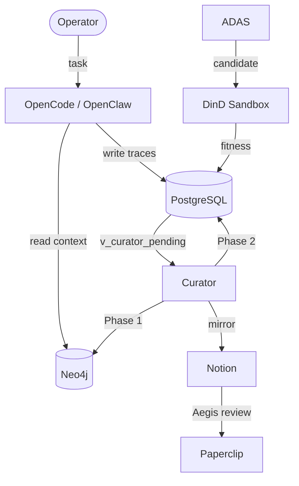

# roninmemory — Project Overview

> [!NOTE]
> **AI-Assisted Documentation**
> Portions of this document were drafted with the assistance of an AI language model.
> Content has not yet been fully reviewed — this is a working design reference, not a final specification.
> When in doubt, defer to the source code, JSON schemas, and team consensus.

roninmemory is the persistent memory and knowledge curation infrastructure for the **Allura Agent-OS** — a Docker-first, multi-tenant AI operating system that gives agents institutional memory across sessions. It transforms stateless session agents into goal-directed teammates by combining a raw event store (PostgreSQL), a semantic knowledge graph (Neo4j), an automated curation pipeline, and a human-in-the-loop governance layer.

---

## 1. Blueprint (Core Concepts & Scope)

### Insight
A versioned knowledge node in Neo4j representing a validated, behavior-shaping rule or pattern.

**States:** `active` | `degraded` | `expired` | `superseded`  
**Key fields:** `insight_id`, `group_id`, `title`, `content`, `confidence`, `status`, `version`, `StartDate`, `EndDate`

### AgentDesign
A promoted, versioned agent configuration node originating from ADAS evolutionary search. Requires Aegis human sign-off before deployment.

**States:** `draft` → `evaluating` → `ranked` → `proposed` → `approved` → `promoted` | `rejected`  
**Key fields:** `run_id`, `group_id`, `version`, `status`, `agent_design_json`, `fitness_score`

### ADAS Run
A raw execution trace row in PostgreSQL — one candidate agent design evaluation.

**States:** `pending` | `running` | `succeeded` | `failed`  
**Key fields:** `run_id`, `group_id`, `agent_id`, `fitness_score`, `promoted`

### Tenant
A workspace namespace isolating all memory, agents, and decisions. Every node in Neo4j and every row in PostgreSQL carries `group_id`.

**Current workspaces:** `allura-faith-meats` (P1), `allura-creative` (P2), `allura-personal` (P2), `allura-nonprofit` (P3), `allura-audits` (P3), `allura-haccp` (P3), `allura-platform` (global)

---

## 2. Requirements Matrix

See [`REQUIREMENTS-MATRIX.md`](./REQUIREMENTS-MATRIX.md) for full B1–B16 and F1–F33 traceability.

| # | Business Requirement | Status |
|---|----------------------|--------|
| B1 | Structured activity capture from operator voice/text | ✅ |
| B2 | Every session starts with current knowledge loaded automatically | ✅ |
| B3 | ADAS designs promoted to Neo4j and mirrored to Notion | ✅ |
| B4 | All knowledge traceable to raw PostgreSQL evidence | ✅ |
| B5 | Workspace-specific knowledge before platform knowledge | ✅ |
| B6 | No agent design goes live without human Aegis sign-off | ✅ |
| B7 | Neo4j nodes are never mutated — all updates create new versions via `SUPERSEDES` | ✅ |
| B8 | All services run in Docker — no local execution (except OpenClaw on Ubuntu) | ✅ |
| B9 | ADAS auto-designs agents via evolutionary search | ✅ |
| B14 | All memory operations governed by MemoryOrchestrator (Brooks-bound) | ✅ |
| B15 | Tenant isolation via `group_id` — `allura-*` namespace | ✅ |
| B16 | Dual logging: PostgreSQL for events, Neo4j for insights | ✅ |

---

## 3. Solution Architecture

See [`SOLUTION-ARCHITECTURE.md`](./SOLUTION-ARCHITECTURE.md) for full topology and Mermaid diagrams.

### Component Overview

---

## 4. Data Dictionary

See [`DATA-DICTIONARY.md`](./DATA-DICTIONARY.md) for full PostgreSQL table schemas and Neo4j graph schema.

**PostgreSQL tables:** `tenants`, `events`, `adas_runs`, `adas_trace_events`, `adas_promotion_proposals`, `curator_queue`, `agents`, `notion_sync_log`, `decisions`, `audit_history`, `rule_versions`

**Neo4j labels:** `Insight`, `InsightHead`, `AgentDesign`, `ProposedKnowledge`, `Entity`, `CodeFile`

---

## 5. Risks and Decisions

See [`RISKS-AND-DECISIONS.md`](./RISKS-AND-DECISIONS.md) for AD-01–AD-16 and RK-01–RK-10.

**Critical open risk:** RK-04 / RK-10 — `groupIdEnforcer.ts` is broken (ARCH-001). Blocks all multi-tenant feature work. Fix spec: `_bmad-output/implementation-artifacts/ARCH-001-rk01-fix.md`.

---

## 6. Implementation Tasks

- [ ] **ARCH-001** — Fix `groupIdEnforcer.ts` (`src/lib/runtime/groupIdEnforcer.ts`) — 🔴 Critical
- [ ] **Story 1.1** — Record raw execution traces (blocked by ARCH-001)
- [ ] **Story 1.2** — Implement NOTION_SYNC workflow
- [ ] **Story 1.5** — Implement CONTRIBUTED relationship
- [ ] **Story 1.6** — Implement LEARNED relationship
- [ ] **Story 1.7** — Create `memory()` TypeScript wrapper
- [ ] **F29** — MemFS self-editing layers (Letta-inspired)
- [ ] **F30** — Sleep-time reflection daemon
- [ ] **Epic 3** — Human-in-the-Loop Governance (Paperclip dashboard)
- [ ] **Epic 6** — Production Workflows (bank-auditor first)

---

## References

- [`BLUEPRINT.md`](./BLUEPRINT.md) — Core architecture and execution rules
- [`SOLUTION-ARCHITECTURE.md`](./SOLUTION-ARCHITECTURE.md) — Component topology and diagrams
- [`DATA-DICTIONARY.md`](./DATA-DICTIONARY.md) — Full schema reference
- [`REQUIREMENTS-MATRIX.md`](./REQUIREMENTS-MATRIX.md) — B1–B16, F1–F33
- [`RISKS-AND-DECISIONS.md`](./RISKS-AND-DECISIONS.md) — AD-01–AD-16, RK-01–RK-10
- [`_bmad-output/planning-artifacts/`](../_bmad-output/planning-artifacts/) — PRD, epics, architectural brief
- [`_bmad-output/implementation-artifacts/`](../_bmad-output/implementation-artifacts/) — Sprint tracker, plugin specs
