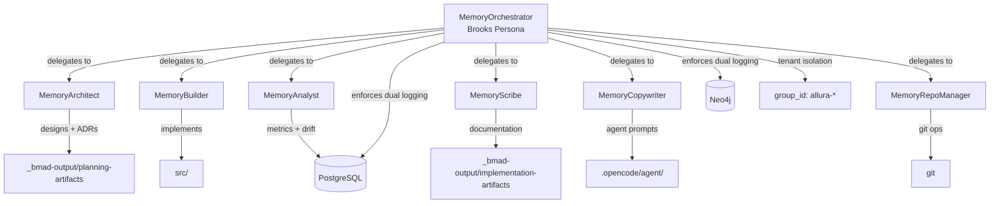
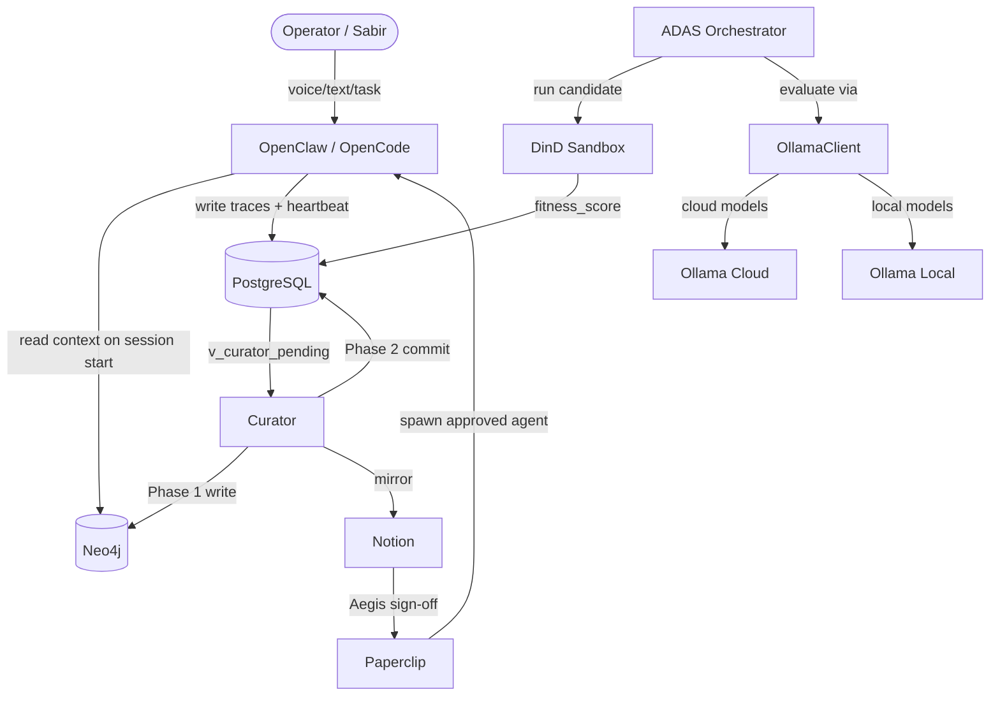
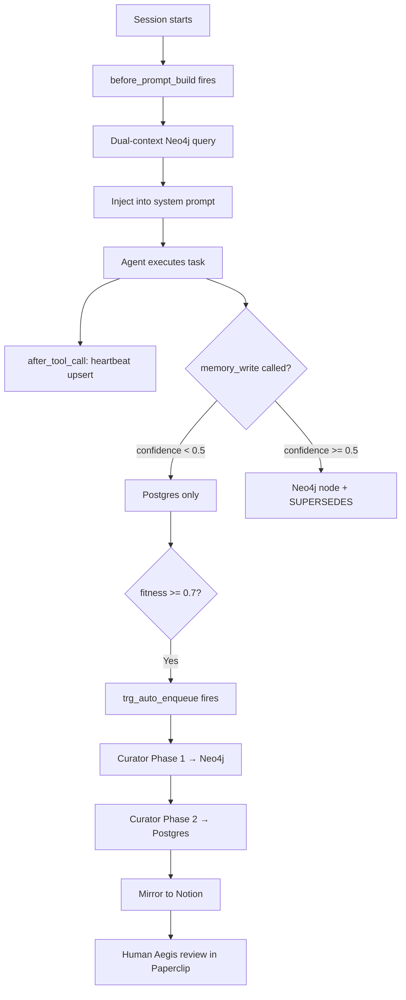
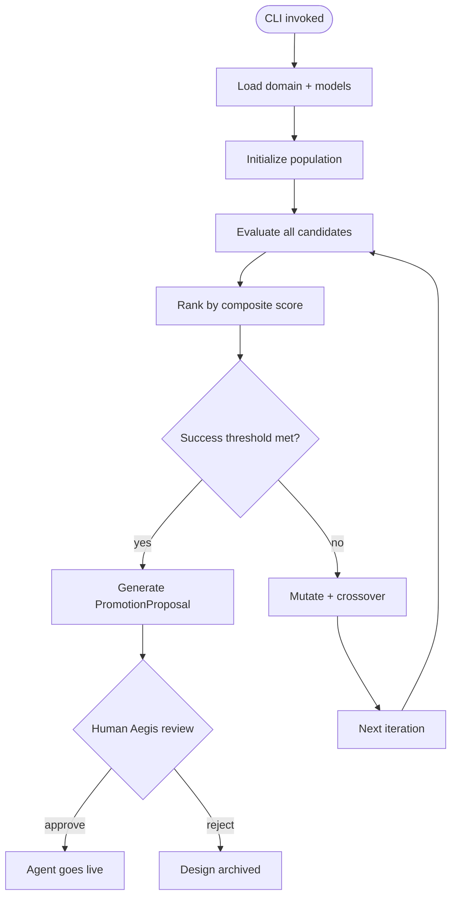
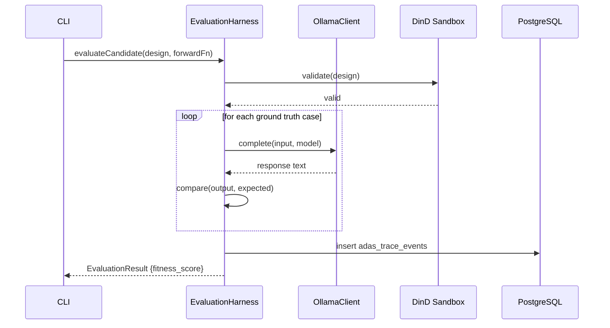
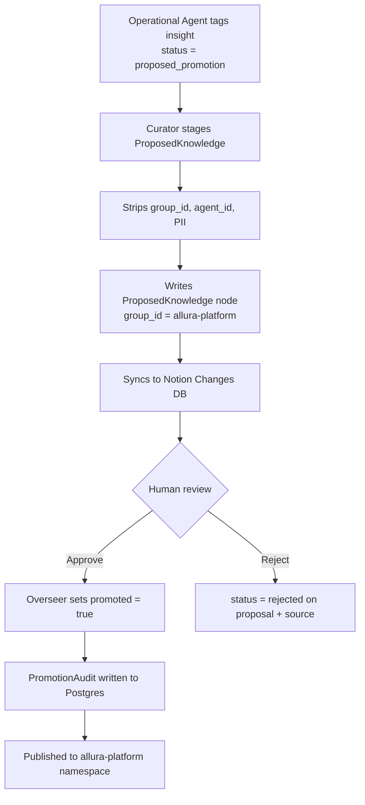

# Solution Architecture — roninmemory

> [!NOTE]
> **AI-Assisted Documentation**
> Portions of this document were drafted with the assistance of an AI language model.
> Content has not yet been fully reviewed — this is a working design reference, not a final specification.
> When in doubt, defer to the source code, JSON schemas, and team consensus.

Promoted from archive `roninmemory/SOLUTION-ARCHITECTURE.md`. Updated to Allura v2 naming (`allura-*` namespace, `Memory{Role}` agents).

---

## Table of Contents

- [1. Components & Execution Surface](#1-components--execution-surface)
- [2. Logical Topologies](#2-logical-topologies)
- [3. Key Architectural Constraints](#3-key-architectural-constraints)
- [4. Interface Catalogue](#4-interface-catalogue)
- [5. Risk-Architecture Traceability](#5-risk-architecture-traceability)

---

## 1. Components & Execution Surface

### Core Components

| Component | Responsibility | Technology |
|-----------|---------------|------------|
| **MemoryOrchestrator** | Brooks-bound primary orchestrator; governs all memory operations; enforces dual logging and tenant boundaries | OpenCode Agent |
| **Memory{Role} agents** | Specialized execution: Architect, Builder, Analyst, Scribe, Copywriter, RepoManager | OpenCode Subagents |
| **OpenClaw** | AI reasoning controller; task execution; MCP tool runtime; human communication gateway | Ubuntu (local only) |
| **PostgreSQL 16** | Raw trace store; agent registry; promotion queue; event audit trail | Docker |
| **Neo4j 5.26 + APOC** | Persistent semantic memory graph; versioned insights with `SUPERSEDES` | Docker |
| **Curator** | 2-phase promotion cron; Notion mirror | Node.js / Bun, node-cron |
| **ADAS Orchestrator** | Meta-agent design search; evolutionary SearchLoop | Bun, Dockerode |
| **OllamaClient** | HTTP client for Ollama API — local + cloud routing | TypeScript |
| **DinD Sidecar** | Blast-radius-bounded ADAS candidate execution | docker:26-dind |
| **Paperclip** | Multi-tenant governance dashboard; agent spawn; budget monitoring; Aegis gate UI | Docker |
| **RuVix Kernel** | L1 proof-gated mutation kernel; 6 primitives, 12 syscalls | Docker |

### Agent Orchestration Topology

### API Surface

roninmemory has no external REST API. All integration is via:

| Method | Channel | Used By |
|--------|---------|---------|
| `before_prompt_build` hook | OpenCode / OpenClaw plugin | Context load on session start |
| `after_tool_call` hook | OpenCode / OpenClaw plugin | Heartbeat + cost tracking |
| `memory_write` tool | MCP tool | Agent-initiated graph writes |
| ADAS CLI | Terminal | Standalone evolutionary search |
| Bolt (port 7687) | Neo4j driver | Curator, context-loader |
| Postgres TCP | pg client | Curator, ADAS, heartbeat hook |
| Notion REST API | HTTPS | Curator mirror |
| MCP_DOCKER tools | Docker network | All DB operations (never `docker exec`) |
| Paperclip | Docker | Agent spawn, Aegis gate, budget monitoring |

---

## 2. Logical Topologies

### 2.1 Overall Component Topology

### 2.2 Memory Session Flow

### 2.3 ADAS Evolutionary Search Flow

### 2.4 ADAS Evaluation Sequence

### 2.5 Cross-Tenant Promotion Flow

---

## 3. Key Architectural Constraints

| Constraint | Rationale |
|---|---|
| `group_id` MUST be present on every DB read/write | Tenant isolation — missing it causes schema constraint failure |
| PostgreSQL traces MUST be append-only | Audit integrity — no UPDATE/DELETE on trace rows ever |
| Neo4j mutations MUST use `SUPERSEDES` | History preservation — never edit existing nodes |
| HITL approval MUST precede any promotion to Neo4j | Governance invariant — agents cannot self-promote |
| All DB access MUST use MCP_DOCKER tools | Auditability — `docker exec` bypasses MCP layer |
| Bun MUST be the only package manager | Supply chain security — npm postinstall hooks are banned |
| All execution MUST run in Docker | Reproducibility and blast radius containment |
| `group_id` format MUST match `allura-{org}` | Drift prevention — `roninclaw-*` is deprecated |

---

## 4. Interface Catalogue

| Interface | Direction | Channel | Payload / Contract | Risk / Decision |
|---|---|---|---|---|
| OpenCode / OpenClaw plugin | Inbound | Hook callbacks | `before_prompt_build`, `after_tool_call` | AD-14 |
| MCP memory tools | Inbound | MCP protocol | `memory_write`, `read_graph`, `search_memories` | AD-16 |
| Notion API | Outbound | HTTPS REST | Curator mirror, HITL proposals, Aegis gate | AD-04, RK-03 |
| Ollama (local) | Outbound | HTTP | Model inference, no auth | AD-08 |
| Ollama (cloud) | Outbound | HTTPS | Model inference, Bearer auth | AD-08 |
| Neo4j Bolt | Outbound | TCP 7687 | Cypher queries — Curator, context-loader | AD-02, AD-16 |
| PostgreSQL | Outbound | TCP 5432 | SQL — Curator, ADAS, heartbeat | AD-10, AD-16 |
| DinD Sandbox | Outbound | Docker API | ADAS candidate execution | AD-05 |

---

## 5. Risk-Architecture Traceability

| Section | Risks and Decisions Addressed |
|---|---|
| §2.1 Overall Component Topology | AD-06, AD-14, AD-16 |
| §2.2 Memory Session Flow | AD-02, AD-03, AD-16, RK-04, RK-10 |
| §2.3 ADAS Evolutionary Search | AD-07, AD-09, AD-11, RK-05, RK-07 |
| §2.4 ADAS Evaluation Sequence | AD-05, AD-08, AD-10, RK-06 |
| §2.5 Cross-Tenant Promotion | AD-15, RK-04, RK-10 |

---

## See Also

- [`_bmad-output/planning-artifacts/architectural-brief.md`](../planning-artifacts/architectural-brief.md) — 5-layer Allura architecture
- [`_bmad-output/planning-artifacts/architectural-decisions.md`](../planning-artifacts/architectural-decisions.md) — AD-01 to AD-16, RK-01 to RK-10
- [`_bmad-output/planning-artifacts/requirements-matrix.md`](../planning-artifacts/requirements-matrix.md) — B1-B16, F1-F33
- [`_bmad-output/implementation-artifacts/data-dictionary.md`](./data-dictionary.md) — full schema definitions
