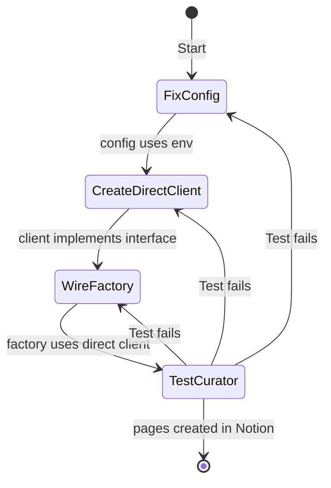

# Fix Notion Integration

> [!NOTE]
> **AI-Assisted Planning**
> This plan was drafted with AI assistance. Review before execution.

---

## Overview

The Curator Agent needs to promote insights from Neo4j to Notion for human approval. Currently, the curator fails due to:
1. **Hardcoded database ID** — `INSIGHTS_DATABASE_ID` in `src/curator/config.ts` ignores the `.env` value
2. **MCP tool failures** — `NotionClientImpl` in `src/integrations/notion.client.ts` calls MCP tools (`API-post-page`, `API-query-data-source`) which fail with validation errors
3. **Valid credentials unused** — Working direct Notion client exists in `src/lib/notion/client.ts` but isn't wired to curator

**Solution**: Replace MCP-based Notion integration with direct API client, read database ID from environment.

---

## Requirements

| # | Requirement | Source |
|---|-------------|--------|
| R1 | Curator must create pages in Notion without MCP validation errors | User context |
| R2 | `INSIGHTS_DATABASE_ID` must read from `NOTION_INSIGHTS_DB_ID` env var | User context |
| R3 | Pages must appear in Ronin Agents Command Center database | User context |
| R4 | Direct Notion API client must be used (no MCP tools) | User context |
| R5 | All existing NotionClient interface methods must be preserved | Architecture |

---

## Work Items

| # | Task | File | What to Do | Acceptance Criteria |
|---|------|------|------------|---------------------|
| W1 | Fix config to use env var | `src/curator/config.ts` | Change hardcoded ID to read `process.env.NOTION_INSIGHTS_DB_ID` with fallback | `process.env.NOTION_INSIGHTS_DB_ID` is used; fallback preserves existing ID |
| W2 | Create direct Notion client | `src/curator/direct-notion-client.ts` | Implement `NotionClient` interface using `getNotionClient()` from `lib/notion` | All interface methods implemented: `createPage`, `updatePage`, `findExistingInsights`, `getPageBySourceInsightId`, `listApprovedInsights`, `findApprovedDuplicateGroups`, `cleanupApprovedDuplicates`, `getInsightsDatabasePropertyNames` |
| W3 | Wire direct client in factory | `src/curator/service-factory.ts` | Replace `NotionClientImpl(mcpClient, ...)` with `DirectNotionClient` | Factory returns `DirectNotionClient` instance; no MCP dependency for Notion |
| W4 | Integration test | CLI | Run `npm run curator:run` and verify Notion pages created | Output shows "Processed N insights. N promoted", no errors; pages visible in Notion database |

---

## State Machine



**State descriptions**

| State | Description | Entry Trigger | Next State |
|-------|-------------|---------------|------------|
| FixConfig | Update config.ts to use env var | Start or test failure | CreateDirectClient |
| CreateDirectClient | Create DirectNotionClient implementing NotionClient | Config fixed | WireFactory |
| WireFactory | Update service-factory to use DirectNotionClient | Client created | TestCurator |
| TestCurator | Run curator and verify pages in Notion | Factory wired | Done (or back to failed step) |

---

## Implementation Details

### W1: Fix config.ts

**File**: `src/curator/config.ts`

**Current code** (line 10):
```typescript
export const INSIGHTS_DATABASE_ID = "9fac87b0-6429-4144-80a4-c34d05bb5d02";
```

**Target code**:
```typescript
export const INSIGHTS_DATABASE_ID = process.env.NOTION_INSIGHTS_DB_ID || "9fac87b0-6429-4144-80a4-c34d05bb5d02";
```

**Verification**: `console.log` shows correct ID from `.env`

---

### W2: Create DirectNotionClient

**File**: `src/curator/direct-notion-client.ts` (NEW FILE)

**Interface to implement** (from `src/integrations/notion.client.ts`):
```typescript
export interface NotionClient {
  createPage(payload: Record<string, unknown>): Promise<{ pageId: string }>;
  updatePage(payload: Record<string, unknown>): Promise<void>;
  findExistingInsights(canonicalTag?: string): Promise<NotionInsightRecord[]>;
  getPageBySourceInsightId(sourceInsightId: string): Promise<NotionInsightRecord | null>;
  listApprovedInsights(): Promise<NotionInsightRecord[]>;
  findApprovedDuplicateGroups(approvedRecordsInput?: NotionInsightRecord[]): Promise<ApprovedDuplicateGroup[]>;
  cleanupApprovedDuplicates(): Promise<ApprovedDuplicateCleanupResult>;
  getInsightsDatabasePropertyNames(): Promise<Set<string>>;
}
```

**Key implementation points**:
1. Use `getNotionClient()` from `@/lib/notion` for all API calls
2. Use `process.env.NOTION_INSIGHTS_DB_ID` for database ID
3. Map Notion API responses to `NotionInsightRecord` using existing `mapInsightRow` logic
4. Preserve all property extraction methods from `NotionClientImpl`

**Dependencies**:
- `@/lib/notion` — `getNotionClient`, `NotionClient`
- `./types` — `NotionInsightRecord`, `ApprovedDuplicateGroup`, etc.
- `./config` — `INSIGHTS_DATABASE_ID`

---

### W3: Wire Direct Client

**File**: `src/curator/service-factory.ts`

**Current code** (lines 4-6, 12):
```typescript
import { McpClientImpl } from '../integrations/mcp.client'
import { NotionClientImpl } from '../integrations/notion.client'
// ...
const notionClient = new NotionClientImpl(mcpClient, INSIGHTS_DATABASE_ID)
```

**Target code**:
```typescript
import { DirectNotionClient } from './direct-notion-client'
// Remove: import { McpClientImpl } ... and NotionClientImpl import
// ...
const notionClient = new DirectNotionClient()
```

**Note**: If other services still need `McpClientImpl`, keep it. Only remove if unused.

---

### W4: Test Curator

**Prerequisites**:
1. `.env` has valid `NOTION_API_KEY` and `NOTION_INSIGHTS_DB_ID`
2. Neo4j has candidate insights to promote
3. PostgreSQL is running

**Test command**:
```bash
npm run curator:run
```

**Expected output**:
```
[Curator] Found N candidate insights
[Curator] Found M existing insights in Notion
[Curator] Promotion run complete. Processed N insights. K promoted, L skipped, M duplicates
```

**Failure mode** (what we're fixing):
```
[NotionClient] createPage result: "MCP error -32602: Invalid arguments..."
[Curator] Promotion run complete. Processed N insights. N errors
```

---

## Constraints

### MUST
- **C1**: All Notion API calls must use `getNotionClient()` from `lib/notion/client.ts`
- **C2**: Database ID must come from `process.env.NOTION_INSIGHTS_DB_ID`
- **C3**: `NotionClient` interface must be fully implemented (all 8 methods)
- **C4**: Property mapping must handle both snake_case and Title Case property names (Notion schema flexibility)

### MUST NOT
- **C5**: Do NOT call MCP tools (`API-post-page`, `API-query-data-source`, `notion-fetch`)
- **C6**: Do NOT mutate existing `NotionInsightRecord` type structure
- **C7**: Do NOT break existing curator service logic

---

## Testing Strategy

### Unit Tests
- Test `DirectNotionClient.createPage` with mock Notion API
- Test property mapping (snake_case vs Title Case)
- Test duplicate detection logic

### Integration Tests
```bash
# Test curator end-to-end
npm run curator:run

# Verify in Notion
# 1. Open Ronin Agents Command Center
# 2. Check Insights database
# 3. Look for new "Pending Review" pages
```

### Regression Tests
```bash
npm test  # Run existing test suite
npm run typecheck  # TypeScript validation
```

---

## Acceptance Criteria

| # | Criteria | Verification |
|---|----------|--------------|
| AC1 | `INSIGHTS_DATABASE_ID` reads from `process.env.NOTION_INSIGHTS_DB_ID` | `grep INSIGHTS_DATABASE_ID src/curator/config.ts` shows env var usage |
| AC2 | Direct Notion client exists and implements full interface | `src/curator/direct-notion-client.ts` with all 8 methods |
| AC3 | Service factory uses direct client | `src/curator/service-factory.ts` imports `DirectNotionClient` |
| AC4 | Curator creates pages in Notion | `npm run curator:run` shows "promoted" count > 0 |
| AC5 | No MCP validation errors in curator output | Output does NOT contain "MCP error -32602" |
| AC6 | All existing tests pass | `npm test` exits with 0 |

---

## References

- **`.env`** — Contains `NOTION_API_KEY` and `NOTION_INSIGHTS_DB_ID`
- **`src/lib/notion/client.ts`** — Working direct Notion API client
- **`src/integrations/notion.client.ts`** — MCP-based client (to be replaced)
- **`src/curator/service-factory.ts`** — Wire point for clients
- **`src/curator/types.ts`** — Interface definitions

---

## Commit Strategy

```bash
# Commit 1: Fix environment variable
git add src/curator/config.ts
git commit -m "fix(curator): use NOTION_INSIGHTS_DB_ID from environment"

# Commit 2: Add direct client
git add src/curator/direct-notion-client.ts
git commit -m "feat(curator): add direct Notion API client wrapper"

# Commit 3: Wire factory
git add src/curator/service-factory.ts
git commit -m "fix(curator): use direct Notion client instead of MCP tools"
```

---

## Notes

### Why MCP tools fail
The MCP tools (`API-post-page`, `API-query-data-source`) require specific schema validation that the curator's payload doesn't match. The direct Notion API client (`lib/notion/client.ts`) uses the official Notion REST API directly, bypassing MCP entirely.

### Why NotionClientImpl exists
Originally designed for MCP-based integration (via Smithery). Now deprecated in favor of direct API calls.

### Related files
- `src/integrations/mcp.client.ts` — MCP caller (may still be used for other integrations)
- `src/integrations/neo4j.client.ts` — Neo4j client (unchanged)
- `src/integrations/postgres.client.ts` — PostgreSQL client (unchanged)