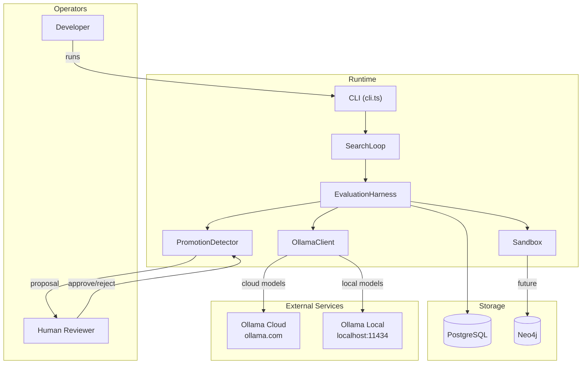
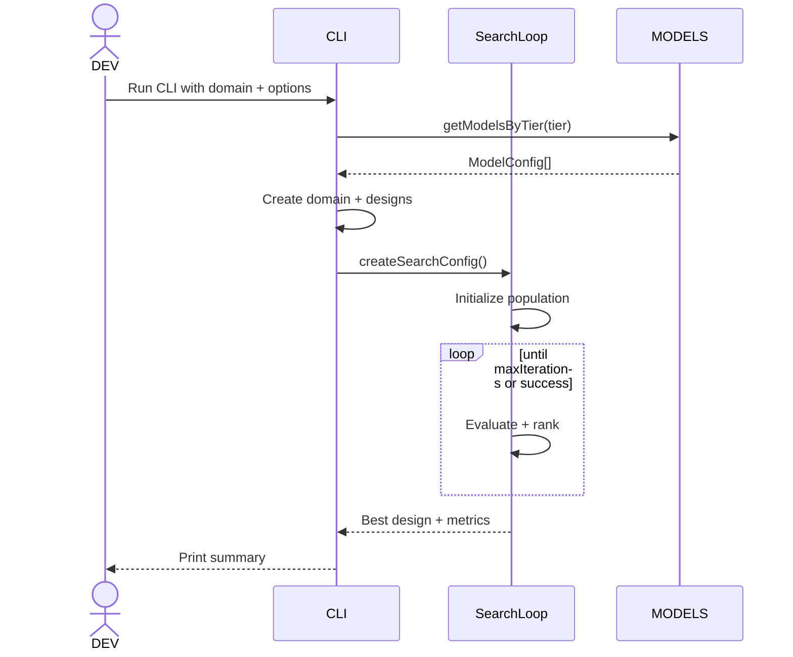
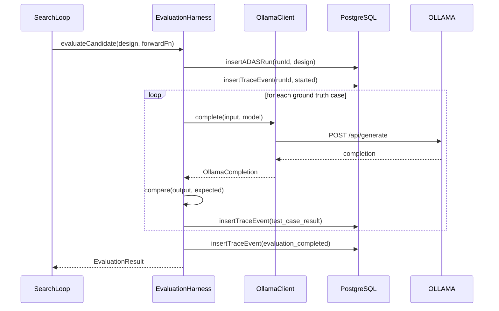
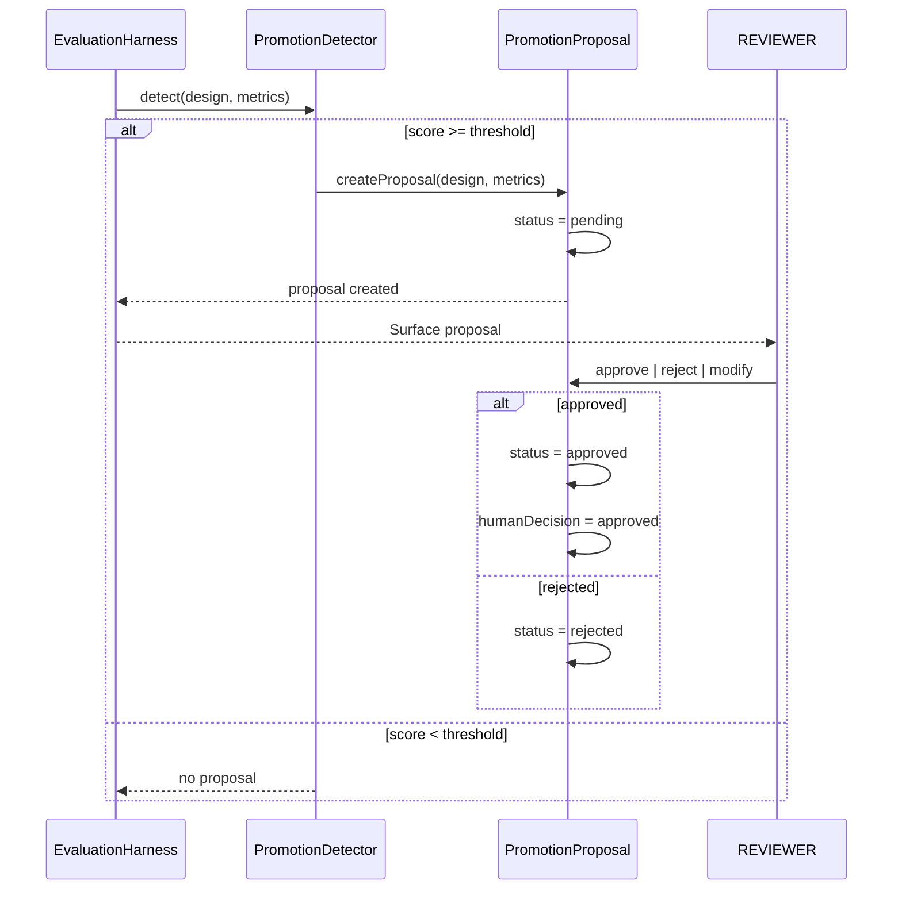

# ADAS Solution Architecture

> [!NOTE]
> **AI-Assisted Documentation**
> Portions of this document were drafted with the assistance of an AI language model (Claude).
> Content has not yet been fully reviewed — this is a working design reference, not a final specification.

<!-- This document describes the topological structure of the ADAS system — who calls what, how external actors interface with the system, and how architectural decisions shape interaction patterns. -->

---

## Table of Contents

- [1. Architectural Positioning](#1-architectural-positioning)
- [2. System Boundary and External Actors](#2-system-boundary-and-external-actors)
- [3. Logical Topologies](#3-logical-topologies)
  - [3.1 CLI Search Path](#31-cli-search-path)
  - [3.2 Evaluation Path](#32-evaluation-path)
  - [3.3 Governance Path](#33-governance-path)
- [4. Interface Catalogue](#4-interface-catalogue)
- [5. Risk-Architecture Traceability](#5-risk-architecture-traceability)
- [6. Key Architectural Constraints](#6-key-architectural-constraints)
- [7. References](#7-references)

---

## 1. Architectural Positioning

| Attribute | Value |
|-----------|-------|
| **Role** | Control plane for agent design — generates, evaluates, and governs agent designs |
| **Authoritative state** | PostgreSQL (`adas_runs`, `adas_trace_events`, `adas_promotion_proposals`) |
| **Operators** | Developer running CLI; human reviewer approving proposals |
| **Consumes** | Ollama API (LLM inference); PostgreSQL (state) |
| **Produces** | Evaluated agent designs; promotion proposals |

---

## 2. System Boundary and External Actors

---

## 3. Logical Topologies

### 3.1 CLI Search Path

**Actor:** Developer  
**Trigger:** `bun tsx src/lib/adas/cli.ts [options]`  
**Frequency:** On-demand per search run

**Key constraints:**
- CLI is the only human-facing entry point (no REST API yet)
- Models loaded from `MODEL_CONFIGS` — no dynamic discovery [AD-01]

---

### 3.2 Evaluation Path

**Actor:** SearchLoop (via EvaluationHarness)  
**Trigger:** Each candidate in each evolutionary iteration  
**Frequency:** `populationSize * maxIterations` times per search run

**Key constraints:**
- Each harness instance gets unique `runId` — no reuse across candidates [AD-05]
- Cloud vs local routing determined by `:cloud` suffix [AD-02]

---

### 3.3 Governance Path

**Actor:** Human Reviewer  
**Trigger:** Candidate composite score >= promotion threshold  
**Frequency:** Per qualifying candidate

**Key constraints:**
- Human MUST review before promotion [AD-03]
- Only `approved` designs may be instantiated

---

## 4. Interface Catalogue

| Interface | Direction | Channel | Payload / Contract | Risk / Decision |
|---|---|---|---|---|
| Ollama Cloud API | Outbound | HTTPS REST | `POST /api/generate` · Bearer auth | [AD-02](#ad-02-ollama-cloud-vs-local-routing-by-model-name-suffix), [RK-01](#rk-01-ollama-api-errors) |
| Ollama Local API | Outbound | HTTP REST | `POST /api/generate` · No auth | [AD-02](#ad-02-ollama-cloud-vs-local-routing-by-model-name-suffix) |
| PostgreSQL | Outbound | pg protocol | `adas_runs`, `adas_trace_events`, `adas_promotion_proposals` | [AD-04](#ad-04-postgresql-for-all-evaluation-state), [RK-01](#rk-01-ollama-api-errors) |
| Neo4j | Outbound (future) | Bolt | Agent memory graph | Future |

---

## 5. Risk-Architecture Traceability

| Section | Risks and Decisions Addressed |
|---|---|
| §3.1 CLI Search Path | [AD-01](#ad-01-two-tier-model-selection-stable-vs-experimental) |
| §3.2 Evaluation Path | [AD-02](#ad-02-ollama-cloud-vs-local-routing-by-model-name-suffix), [AD-04](#ad-04-postgresql-for-all-evaluation-state), [AD-05](#ad-05-single-harness-per-evaluation-to-avoid-run-id-collision), [RK-01](#rk-01-ollama-api-errors) |
| §3.3 Governance Path | [AD-03](#ad-03-hitl-governance-for-agent-promotion), [RK-02](#rk-02-sandbox-escape), [RK-03](#rk-03-promotion-threshold-gaming) |

---

## 6. Key Architectural Constraints

| Constraint | Rationale |
|---|---|
| CLI MUST create one EvaluationHarness per candidate evaluation | PostgreSQL unique constraint on `run_id`; concurrent evaluations with same ID cause constraint violation |
| Cloud models MUST use `:cloud` suffix; local models MUST NOT | Suffix drives routing decision in `OllamaClient` — wrong suffix means wrong endpoint |
| Agent designs MUST NOT be promoted without human approval | Safety-critical — autonomous promotion violates HITL governance principle |
| Domain weights (accuracy + cost + latency) MUST sum to 1.0 | Composite score normalization requires valid weights |

---

## 7. References

- [BLUEPRINT.md](BLUEPRINT.md) — Core data model, API surface, execution rules, and event catalogue
- [RISKS-AND-DECISIONS.md](RISKS-AND-DECISIONS.md) — Architectural decisions and risk mitigations
- [REQUIREMENTS-MATRIX.md](REQUIREMENTS-MATRIX.md) — Business and functional requirement traceability
- [src/lib/adas/cli.ts](src/lib/adas/cli.ts) — CLI entry point
- [src/lib/adas/search-loop.ts](src/lib/adas/search-loop.ts) — Evolutionary search
- [src/lib/adas/evaluation-harness.ts](src/lib/adas/evaluation-harness.ts) — Evaluation engine
- [src/lib/ollama/client.ts](src/lib/ollama/client.ts) — Ollama HTTP client
