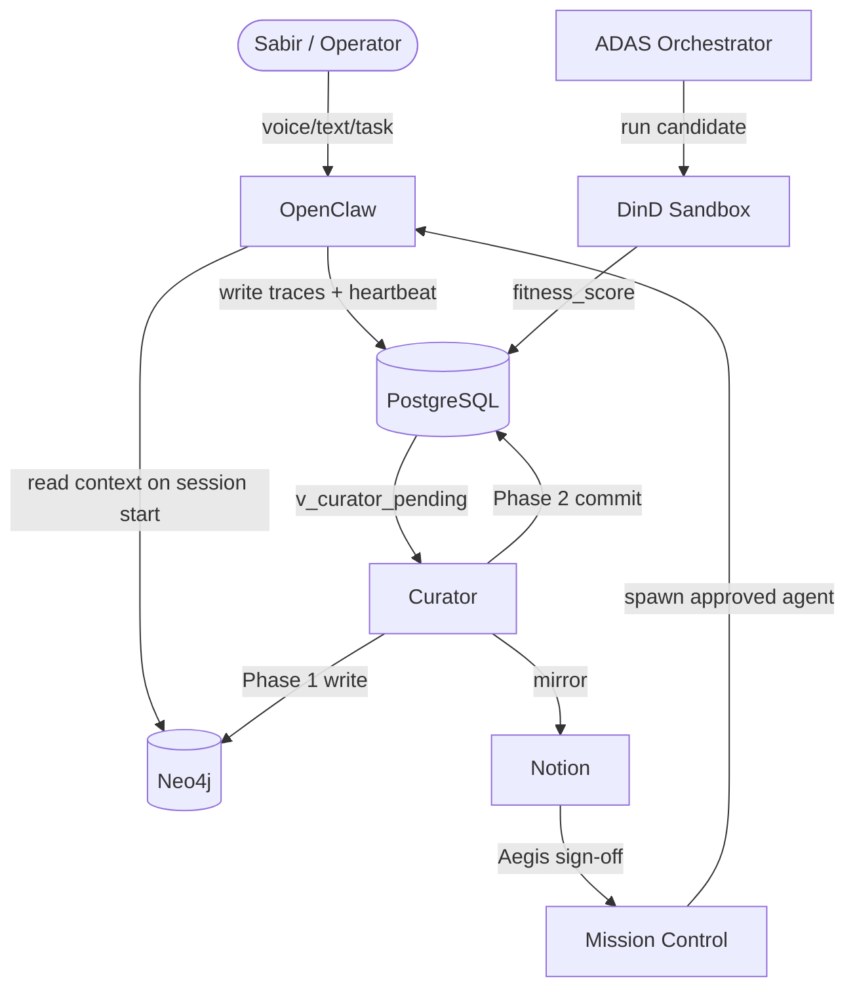
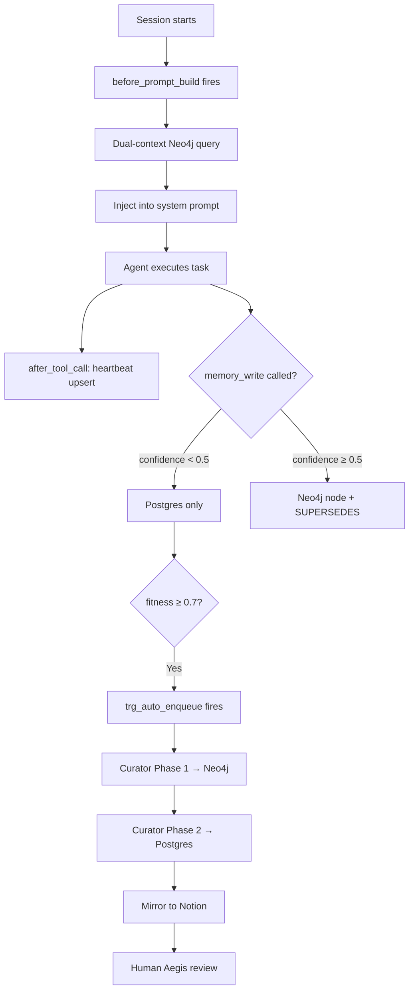

> [!NOTE]
> **AI-Assisted Documentation**
> Drafted by Winston Architect (BMAD) | March 2026. Not yet fully reviewed — working design reference only. Remove this notice after human sign-off in a PR.

# roninmemory Blueprint

## Summary

roninmemory is the persistent memory and knowledge curation infrastructure for the Charitable Business Ronin agent fleet. It transforms OpenClaw agents from stateless session-bots into goal-directed teammates by maintaining a semantic memory graph (Neo4j), a raw trace store (PostgreSQL), and an automated curation pipeline that promotes high-confidence ADAS-discovered agent designs into durable, versioned knowledge. Human oversight is enforced through Notion mirroring and a Mission Control Aegis sign-off gate. Primary operator: Sabir Asheed, Charitable Business Ronin nonprofit, Charlotte NC.

***

## 1. Core Concepts

### Insight
A versioned knowledge node in Neo4j representing a validated behavior-shaping rule or pattern. Never mutated — every update creates a new node linked by a `:SUPERSEDES` edge to the prior version.

**States:** `active` | `degraded` | `expired`
**Key fields:** `runId`, `groupId`, `category`, `content`, `confidence`, `status`, `version`, `createdAt`, `notionPageId`

### AgentDesign
A promoted, versioned agent configuration node in Neo4j. Spawning a live OpenClaw agent requires Aegis human sign-off on the AgentDesign.

**States:** `active` | `deprecated`
**Key fields:** `runId`, `groupId`, `version`, `status`, `createdAt`

### ADAS Run
A raw execution trace row in PostgreSQL — one candidate agent design evaluation. Immutable after insert except `status` and `promoted`.

**States:** `pending` | `running` | `succeeded` | `failed`
**Key fields:** `run_id`, `group_id`, `agent_design_json`, `fitness_score`, `promoted`, `started_at`, `finished_at`

### Tenant
A scoped namespace isolating memory and agent configs per project. Every node in Neo4j and every row in Postgres carries a `group_id` / `groupId`.

**Key fields:** `group_id` (e.g. `faith-meats`, `global-coding-skills`), `is_global`, `display_name`

### Curator
The automated Node.js ESM cron service that polls `v_curator_pending`, executes the 2-phase promotion protocol, and mirrors qualifying insights to Notion.

### Aegis Gate
Mandatory human sign-off in Mission Control. Required before any ADAS-promoted AgentDesign can spawn a live agent.

***

## 2. Requirements

### Business Requirements

| ID | Requirement |
|----|-------------|
| B1 | Sabir can dictate or type daily work logs; Agent Zero captures them as CRM Activities + Tasks linked to the correct project (Faith Meats Ops, Client Web, Admin/Finance) |
| B2 | Every OpenClaw agent session starts with current knowledge loaded automatically — no manual prompt engineering |
| B3 | High-confidence ADAS designs are promoted to Neo4j and mirrored to Notion without manual intervention |
| B4 | All promoted knowledge is traceable back to its raw execution evidence in PostgreSQL |
| B5 | Project-specific knowledge (`faith-meats`) takes priority over global knowledge (`global-coding-skills`) in every session |
| B6 | No ADAS-discovered design can deploy as a live agent without human Aegis sign-off |
| B7 | The system must never mutate existing Neo4j nodes — all updates create new versioned nodes |
| B8 | All services run in Docker — no local execution permitted |

### Functional Requirements

#### Memory Loading

| ID | Requirement |
|----|-------------|
| F1 | On every OpenClaw session start, `before_prompt_build` hook queries Neo4j for `active` insights scoped to session `groupId` PLUS `global-coding-skills` |
| F2 | Results injected into system prompt; tenant-specific insights appear before global ones |
| F3 | Agents may call `memory_write` tool; confidence < 0.5 → Postgres only; confidence ≥ 0.5 → Neo4j node + `:SUPERSEDES` edge |

#### Promotion Pipeline

| ID | Requirement |
|----|-------------|
| F4 | `adas_runs` rows with `fitness_score >= 0.7` and `status = succeeded` are auto-enqueued by `trg_auto_enqueue_curator` |
| F5 | Curator performs 2-phase commit: Phase 1 writes Neo4j node; Phase 2 sets `promoted = true` in Postgres |
| F6 | If Phase 2 fails after Phase 1 succeeds, a compensating `DETACH DELETE` removes the orphaned Neo4j node |
| F7 | Curator mirrors insights with `confidence >= 0.7` to Notion Master Knowledge Base (async, non-fatal) |
| F8 | `trg_promotion_guard` at DB level enforces `neo4j_written = true` before `promoted = true` is accepted |

#### Multi-Tenancy

| ID | Requirement |
|----|-------------|
| F9 | Every Postgres row carries `group_id`; every Neo4j node carries `groupId` |
| F10 | All queries are scoped by `groupId`; cross-tenant access is prohibited |

#### ADAS Discovery

| ID | Requirement |
|----|-------------|
| F11 | ADAS meta-agent generates Python candidate designs via Anthropic API |
| F12 | Each candidate runs in a DinD sandbox: `--network=none`, `--cap-drop=ALL`, `--memory=256m`, `--pids-limit=64`, `--read-only` |
| F13 | Fitness = `accuracy − token_penalty + speed_bonus`, range 0.0–1.0, written to `adas_runs` |

#### Observability

| ID | Requirement |
|----|-------------|
| F14 | `after_tool_call` hook upserts agent heartbeat, cumulative `token_cost_usd`, and task counters to `agents` table after every tool execution |
| F15 | Anonymous sessions write raw traces to `adas_runs` for Curator candidate discovery |

***

## 3. Architecture

### Components

| Component | Responsibility | Technology |
|-----------|---------------|------------|
| OpenClaw | AI reasoning controller; task execution; MCP tool runtime | OpenClaw / Paperclip |
| PostgreSQL | Raw trace store; agent registry; promotion queue; governance triggers | Postgres 16 |
| Neo4j | Persistent semantic memory graph; versioned `:Insight` / `:AgentDesign` nodes | Neo4j 5, Bolt port 7687 |
| Curator | 2-phase promotion cron; Notion mirror | Node.js 20 ESM, node-cron |
| ADAS Orchestrator | Meta-agent design search; DinD execution; fitness scoring | Node.js 20, Dockerode |
| DinD Sidecar | Blast-radius-bounded candidate execution | docker:26-dind |
| Notion | Human knowledge workspace; Aegis review surface | Notion API v1 |
| Mission Control | Agent spawn; monitoring; Aegis gate UI | OpenClaw Mission Control |

### Component Overview

### Execution Flow

***

## 4. Data Model ER Diagram

```mermaid
erDiagram
  tenants ||--o{ adas_runs : "group_id"
  tenants ||--o{ agents : "group_id"
  adas_runs ||--o| curator_queue : "run_id"
  adas_runs ||--o{ notion_sync_log : "run_id"

  tenants {
    uuid id
    string group_id
    string display_name
    bool is_global
    datetime created_at
  }
  adas_runs {
    uuid run_id
    string group_id
    jsonb agent_design_json
    float fitness_score
    string status
    bool promoted
    datetime started_at
    datetime finished_at
  }
  curator_queue {
    uuid queue_id
    uuid run_id
    float fitness_score
    bool neo4j_written
    string neo4j_node_id
    int attempt_count
    datetime resolved_at
  }
  agents {
    uuid id
    string name
    string group_id
    string status
    datetime last_heartbeat
    float token_cost_usd
    int tasks_completed
    int tasks_failed
  }
  notion_sync_log {
    uuid log_id
    uuid run_id
    string notion_page_id
    string sync_status
    datetime synced_at
  }
```

***

## 5. Data Model

### Neo4j Graph Schema (Live)

Based on Phase 0 inspect-graph results:

**Node Labels:**
- `CodeFile` - Embedded code files with vector embeddings
- `Entity` - Named entities (people, organizations)
- `Insight` - Versioned knowledge insights
- `Insight:KnowledgeItem` - Knowledge items with tags
- `InsightHead` - Head nodes for insight versioning
- `Module` - Software modules
- `Platform` - Technology platforms
- `Test` - Test entities

**Relationship Types:**
- `MENTIONS` - Entity mentions
- `VERSION_OF` - Versioning relationships

**Key Properties by Node Type:**
- `Insight`: id, group_id, confidence, status, version, content, summary, insight_id, source_type, notion_page_id, promotion_status
- `InsightHead`: insight_id, group_id, current_version, current_id, created_at, updated_at
- `CodeFile`: path, content, embedding, model, embedded_at
- `Test`: entity_id, name, properties, created_at

### PostgreSQL Tables

See [DATA-DICTIONARY.md](./DATA-DICTIONARY.md) for full field definitions.

***

## 6. Execution Rules

### Promotion Eligibility
- `fitness_score >= 0.7` AND `status = 'succeeded'` AND `promoted = false`
- `curator_queue.neo4j_written = true` MUST be set before `adas_runs.promoted = true` (enforced by `trg_promotion_guard`)
- Queue entries with `attempt_count >= 5` are skipped by Curator (poison run protection)

### Failure Semantics
- **Phase 1 fail** → retry on next Curator poll (15 min interval)
- **Phase 2 fail** → compensating `DETACH DELETE` on Neo4j node; queue entry left unresolved for retry
- **Notion fail** → non-fatal; logged to `notion_sync_log`; `notionPageId` backfilled on next cycle

### Retry Semantics
- Curator retries up to `attempt_count = 4` (5th attempt skipped permanently)
- ADAS orchestrator iterates up to `ADAS_MAX_ITERATIONS` env var (default: 5 cycles)

### Cancellation
- Curator: `SIGTERM` triggers graceful drain — completes current promotion cycle before exit
- ADAS: `SIGTERM` stops after current candidate evaluation completes; partial results written to Postgres

***

## 7. Global Constraints

- **Docker-only:** All services MUST run inside Docker. Local execution is prohibited.
- **Immutable nodes:** Neo4j Insight/AgentDesign nodes MUST NOT be mutated. All updates MUST create new nodes with `:SUPERSEDES` edges.
- **2-phase ordering:** `promoted = true` MUST NOT be set before `neo4j_written = true`.
- **Tenant isolation:** All queries MUST be scoped by `groupId`. Cross-tenant access is prohibited.
- **Aegis gate:** ADAS-promoted AgentDesigns MUST NOT spawn live agents without human sign-off.
- **Inspect before seed:** `inspect-graph.cypher` MUST be run before `seed.cypher` or `safe-align.cypher` on any live graph.

***

## 8. API Surface

roninmemory has no external REST API. All integration is via:

| Method | Channel | Used By |
|--------|---------|---------|
| `before_prompt_build` hook | OpenClaw plugin | Context load on session start |
| `after_tool_call` hook | OpenClaw plugin | Heartbeat + cost tracking |
| `memory_write` tool | OpenClaw MCP tool | Agent-initiated graph writes |
| Bolt (port 7687) | Neo4j driver | Curator, context-loader |
| Postgres TCP | pg client | Curator, ADAS, heartbeat hook |
| Notion REST API | HTTPS | Curator mirror |
| Mission Control internal | OpenClaw internal | Agent spawn, Aegis gate |

***

## 9. Logging & Audit

| What | Where Stored | Notes |
|------|-------------|-------|
| Every ADAS run | `adas_runs` | Immutable after insert |
| Promotion events | `curator_queue` | `resolved_at` = Phase 2 commit timestamp |
| Notion sync | `notion_sync_log` | Drift detectable via `v_sync_drift` view |
| Agent heartbeats | `agents.last_heartbeat` | Updated by `after_tool_call` on every tool call |
| Agent cumulative cost | `agents.token_cost_usd` | Incremented per tool call |

**Redacted fields** — must never appear in logs or audit records:
`ANTHROPIC_API_KEY`, `NEO4J_PASSWORD`, `POSTGRES_PASSWORD`, `NOTION_API_KEY`, `OPENAI_API_KEY`

***

## 10. Admin Workflow

1. Clone repo, copy `.env.example` → `.env`, fill all required values
2. `docker compose up --build -d`
3. **Existing graph only:** Run `scripts/inspect-graph.cypher` (read-only)
4. **Existing graph only:** Fill in `DATA-DICTIONARY.md` Section 2 from inspect output
5. **Existing graph only:** Run `neo4j/scripts/safe-align.cypher` (additive only, writes commented out by default)
6. **Fresh install only:** Run `neo4j/init/seed.cypher`
7. `bash verify.sh` — confirm all 5 services healthy
8. `docker compose --profile adas run --rm adas` — first ADAS discovery cycle
9. Monitor Curator logs for first promotion
10. Review promoted insight in Notion → grant Aegis sign-off in Mission Control

***

## 11. References

### Project Documents
- [SOLUTION-ARCHITECTURE.md](./SOLUTION-ARCHITECTURE.md)
- [DATA-DICTIONARY.md](./DATA-DICTIONARY.md)
- [RISKS-AND-DECISIONS.md](./RISKS-AND-DECISIONS.md)
- [REQUIREMENTS-MATRIX.md](./REQUIREMENTS-MATRIX.md)
- [TESTING.md](./TESTING.md)
- [guidelines/AI-GUIDELINES.md](./guidelines/AI-GUIDELINES.md)

### External Resources
- [OpenClaw / Agent-Zero docs](https://agent-zero.ai/p/docs)
- [Payload CMS docs](https://payloadcms.com/docs/getting-started/what-is-payload)
- [Zod docs](https://zod.dev)
- [OpenClaw docs](https://docs.openclaw.ai)
