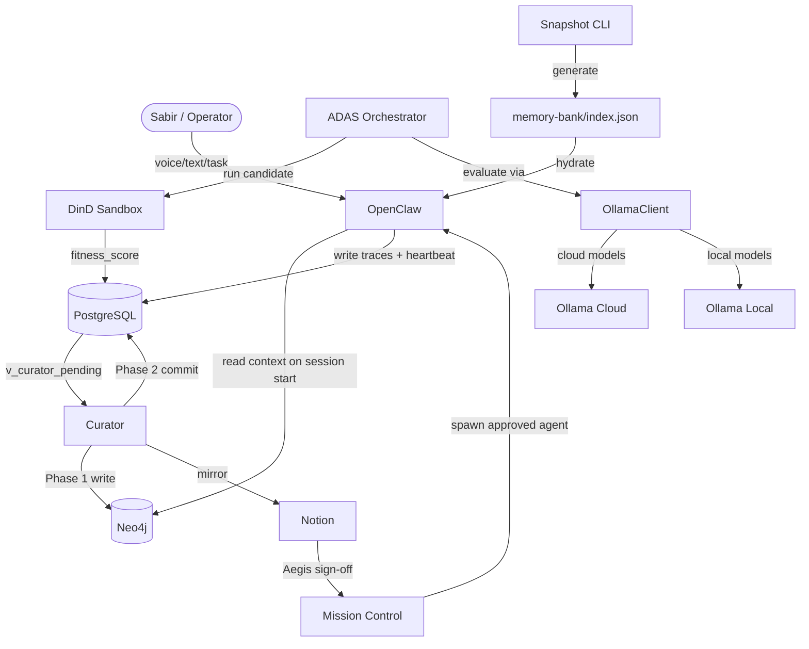
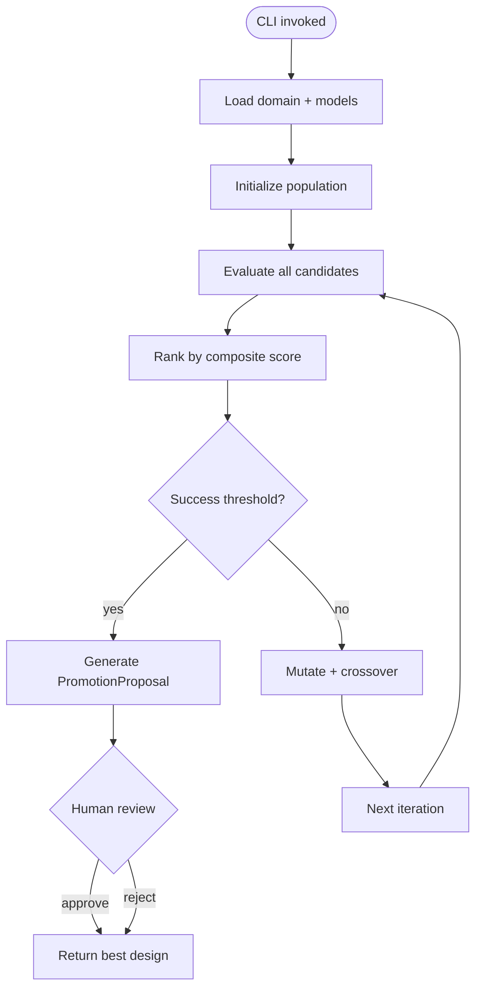
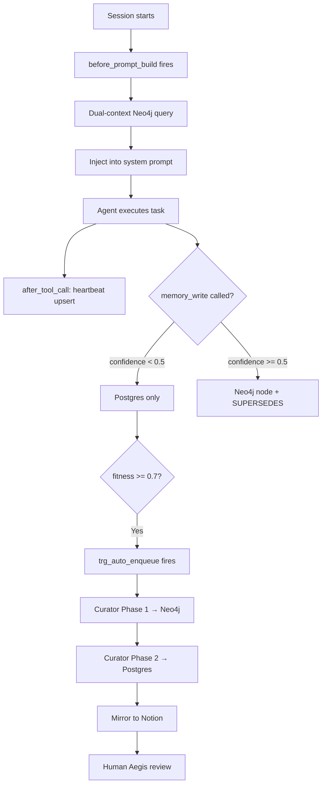
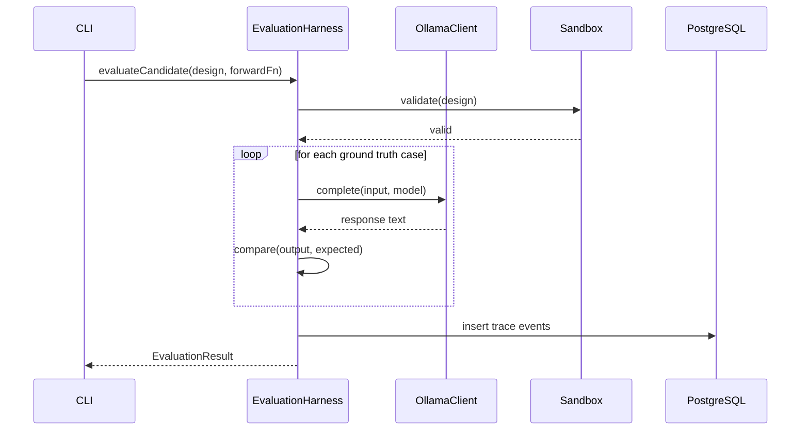
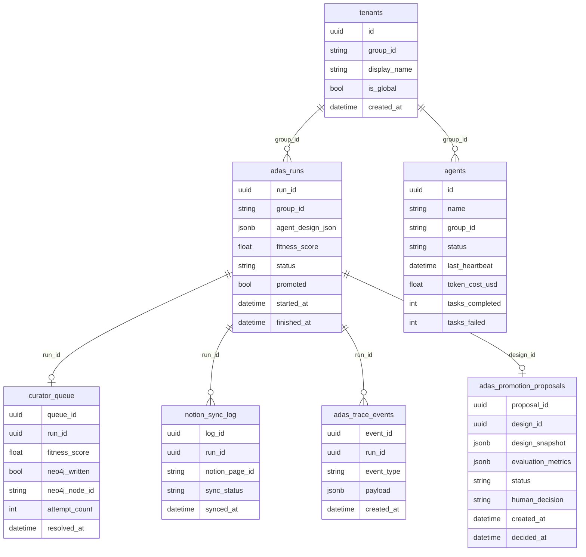

# roninmemory PROJECT

> [!NOTE]
> **AI-Assisted Documentation**
> Portions of this document were drafted with the assistance of AI language models (Claude, GitHub Copilot).
> Content has not yet been fully reviewed — this is a working design reference, not a final specification.
> When in doubt, defer to the source code, JSON schemas, and team consensus.

roninmemory (Allura Memory) is the persistent memory and knowledge curation infrastructure for the Charitable Business Ronin agent fleet. It transforms OpenClaw agents from stateless session-bots into goal-directed teammates by maintaining a semantic memory graph (Neo4j), a raw trace store (PostgreSQL), and an automated curation pipeline — including the ADAS evolutionary agent design system — that promotes high-confidence discoveries into durable, versioned knowledge. Human oversight is enforced through Notion mirroring and a Mission Control Aegis sign-off gate.

The system is governed by a **Brooks-bound orchestrator** (`memory-orchestrator`) that enforces conceptual integrity, plan-and-document discipline, and delegates execution to canonical `memory-*` subagents. All operations respect two-tier tenant isolation: `organization_id` (business boundary) and `group_id` (memory partition).

**Primary operator:** Sabir Asheed, Charitable Business Ronin nonprofit, Charlotte NC.

---

## Table of Contents

- [1. Blueprint (Core Concepts & Scope)](#1-blueprint-core-concepts--scope)
- [2. Requirements Matrix](#2-requirements-matrix)
- [3. Solution Architecture](#3-solution-architecture)
- [4. Data Dictionary](#4-data-dictionary)
- [5. Risks & Decisions](#5-risks--decisions)
- [6. Tasks](#6-tasks)
- [7. Testing Protocol](#7-testing-protocol)
- [8. Operational Workflows](#8-operational-workflows)
- [9. Notion UX Plan](#9-notion-ux-plan)
- [10. References](#10-references)

---

## 1. Blueprint (Core Concepts & Scope)

### Insight

A versioned knowledge node in Neo4j representing a validated behavior-shaping rule or pattern. Never mutated — every update creates a new node linked by a `:SUPERSEDES` edge to the prior version.

**States:** `active` | `degraded` | `expired`
**Key fields:** `runId`, `organization_id`, `group_id`, `category`, `content`, `confidence`, `status`, `version`, `createdAt`, `notionPageId`

### AgentDesign

A promoted, versioned agent configuration node in Neo4j. Originates from ADAS evolutionary search. Spawning a live OpenClaw agent requires Aegis human sign-off.

**States (ADAS lifecycle):** `draft` → `evaluating` → `ranked` → `proposed` → `approved` → `promoted` | `rejected`
**States (Neo4j):** `active` | `deprecated`
**Key fields:** `runId`, `organization_id`, `group_id`, `version`, `status`, `createdAt`, `design_id`, `domain`, `config.model`, `config.reasoningStrategy`, `config.systemPrompt`, `config.tools`

### ADAS Run

A raw execution trace row in PostgreSQL — one candidate agent design evaluation. Immutable after insert except `status` and `promoted`.

**States:** `pending` | `running` | `succeeded` | `failed`
**Key fields:** `run_id`, `organization_id`, `group_id`, `agent_design_json`, `fitness_score`, `promoted`, `started_at`, `finished_at`

### Tenant

A scoped namespace isolating memory and agent configs per organization and project. Every node in Neo4j and every row in Postgres carries both `organization_id` (business boundary) and `group_id` (memory partition) in consistent snake_case.

**Key fields:** `organization_id` (e.g., `charitable-business-ronin`), `group_id` (e.g., `faith-meats`, `global-coding-skills`), `is_global`, `display_name`

**Tenant Hierarchy:**
- `organization_id` — Top-level business/tenant boundary (multi-tenant SaaS isolation)
- `group_id` — Project-specific memory partition within an organization
- All queries MUST scope by both `organization_id` AND `group_id`
- Cross-tenant access is prohibited at the schema level

### Brooks-Bound Orchestrator

The primary orchestrator (`memory-orchestrator`) is bound to the **Frederick P. Brooks Jr. persona** — author of "The Mythical Man-Month" and advocate for:
- **Conceptual integrity** — one mind overseeing system design
- **Plan-and-document** discipline — think before coding
- **Second-system effect** awareness — avoid over-engineering
- **Surgical team** model — specialist subagents, not generalists

The orchestrator:
1. Governs all memory operations and ensures dual logging policy compliance
2. Delegates execution to canonical `memory-*` subagents
3. Enforces two-tier tenant isolation at every request
4. Reviews outcomes for quality, security, and compliance

**Subagent Naming Convention:**
| Subagent | Role |
|----------|------|
| `memory-scout` | Discovers context files before coding |
| `memory-archivist` | Fetches current docs for external packages |
| `memory-curator` | Breaks down complex features into subtasks |
| `memory-chronicler` | Generates and maintains documentation |
| `memory-builder` | Executes delegated coding subtasks |
| `memory-tester` | Testing after implementation |
| `memory-guardian` | Reviews code quality and compliance |
| `memory-validator` | Validates builds and types |
| `memory-organizer` | Organizes context and knowledge |
| `memory-interface` | Designs UI components and interactions |
| `memory-infrastructure` | Manages infrastructure and deployment |

### Dual Logging Policy

The system enforces dual-path logging for complete auditability:

| Store | Purpose | Content |
|-------|---------|---------|
| **PostgreSQL** | System of Record for the Present | Raw traces, events, audit logs, heartbeats, agent executions |
| **Neo4j** | System of Reason | Curated insights, patterns, versioned knowledge with `:SUPERSEDES` chains |

**Writing:**
- Confidence `< 0.5` → PostgreSQL only (raw trace)
- Confidence `>= 0.5` → PostgreSQL + Neo4j (promoted insight)

**Reading:**
- Session hydration queries both stores
- Project-specific insights (`group_id=scoped`) before global (`group_id=global-coding-skills`)

### Notion Control Plane

The Notion backend serves as the human governance surface:

**Backend Hub Page:** `https://www.notion.so/6581d9be65b38262a2218102c1e6dd1d`

The Backend Hub (`6581d9be65b38262a2218102c1e6dd1d`) is the structural governance surface for templates, registries, and migrations. The OpenAgents Control Registry (`3371d9be65b38041bc59fd5cf966ff98`) is the CLI team registry for agent roster, skills, and commands. The Allura Memory Control Center (`3371d9be81a9`) is the HITL oversight surface for approvals and sync. These are three distinct surfaces.

| Database | Purpose |
|----------|---------|
| **Agents** | Track OpenCode agents, statuses, roles, and related metadata |
| **Skills** | Track reusable skills and their usage notes |
| **Commands** | Track commands and their intent |
| **GitHub Repos (Template/Template1/Template2)** | Starter structures for new projects |
| **Changes** | Bundled updates requiring human review |

**Auxiliary Pages:**
- **Backend Governance & Ops** — Policy sections and operational guidance
- **Frameworks** — Agent catalog with persona bindings

**Sync Model:**
- Primary direction: `roninmemory → Notion`
- Sync summaries, relationships, and reviewable change bundles
- Do not mirror raw runtime traces or low-level noise
- Prefer premade MCP servers from `MCP_DOCKER` for Notion integration

### Aegis Gate

### Curator

The automated Node.js ESM cron service that polls `v_curator_pending`, executes the 2-phase promotion protocol, and mirrors qualifying insights to Notion.

### Aegis Gate

Mandatory human sign-off in Mission Control. Required before any ADAS-promoted AgentDesign can spawn a live agent.

### ADAS (Automated Agent Design & Assistant System)

An evolutionary design system for AI agents. Generates, evaluates, mutates, and promotes agent designs using real LLM inference (Ollama) and HITL governance.

**Core subsystems:**

| Subsystem | Responsibility |
|-----------|---------------|
| **SearchLoop** | Evolutionary search — population, mutation, crossover, ranking |
| **EvaluationHarness** | Evaluates designs against ground-truth via Ollama, logs to PostgreSQL |
| **Sandbox** | Isolated code execution (process or Docker mode) |
| **PromotionDetector** | Detects when candidate qualifies for promotion |
| **SafetyMonitor** | Validates design safety before execution |
| **OllamaClient** | HTTP client for Ollama API — local + cloud routing, Bearer auth |

### DomainConfig

Defines evaluation context for a search — ground-truth cases, accuracy weighting, and cost/latency weights for composite scoring.

**Key fields:** `domainId`, `groundTruth[]`, `accuracyWeight`, `costWeight`, `latencyWeight` (must sum to 1.0)

### ModelConfig

Describes an Ollama model available for agent inference.

**Key fields:** `modelId`, `provider` (always `"ollama"`), `tier` (`"stable"` | `"experimental"`), `temperature`, `maxTokens`, `supportsTools`

### Memory Snapshot Cache

A Bun CLI-generated JSON cache (`memory-bank/index.json`) that summarizes canonical documentation trees. Used to accelerate session hydration to <30s without runtime filesystem scanning.

---

## 2. Requirements Matrix

### Business Requirements

| ID | Requirement | Status |
|----|-------------|--------|
| B1 | Sabir can dictate or type daily work logs; Agent Zero captures them as CRM Activities + Tasks linked to the correct project | ✅ Implemented |
| B2 | Every OpenClaw agent session starts with current knowledge loaded automatically — no manual prompt engineering | ✅ Implemented |
| B3 | High-confidence ADAS designs are promoted to Neo4j and mirrored to Notion without manual intervention | ✅ Implemented |
| B4 | All promoted knowledge is traceable back to its raw execution evidence in PostgreSQL | ✅ Implemented |
| B5 | Project-specific knowledge takes priority over global knowledge in every session | ✅ Implemented |
| B6 | No ADAS-discovered design can deploy as a live agent without human Aegis sign-off | ✅ Implemented |
| B7 | The system must never mutate existing Neo4j nodes — all updates create new versioned nodes | ✅ Implemented |
| B8 | All services run in Docker — no local execution permitted | ✅ Implemented |
| B9 | Design AI agents automatically via evolutionary search — generate, evaluate, evolve via mutation/crossover | ✅ Implemented |
| B10 | Use real LLM inference (Ollama) for all agent execution — no mocked responses in production | ✅ Implemented |
| B11 | Provide a CLI entry point for standalone ADAS runs | ✅ Implemented |
| B12 | Persist all ADAS evaluation events and proposals to PostgreSQL — full audit trail | ✅ Implemented |
| B13 | Support two-tier model selection — stable for baselines, experimental opt-in | ✅ Implemented |

### Functional Requirements

#### Memory Loading (F1–F3)

| ID | Requirement | Traces To |
|----|-------------|-----------|
| F1 | On every OpenClaw session start, `before_prompt_build` hook queries Neo4j for `active` insights scoped to session `group_id` PLUS `global-coding-skills` | B2 |
| F2 | Results injected into system prompt; tenant-specific insights appear before global ones | B2, B5 |
| F3 | Agents may call `memory_write` tool; confidence < 0.5 → Postgres only; confidence ≥ 0.5 → Neo4j node + `:SUPERSEDES` edge | B3 |

#### Promotion Pipeline (F4–F8)

| ID | Requirement | Traces To |
|----|-------------|-----------|
| F4 | `adas_runs` rows with `fitness_score >= 0.7` and `status = succeeded` are auto-enqueued by `trg_auto_enqueue_curator` | B3, B4 |
| F5 | Curator performs 2-phase commit: Phase 1 writes Neo4j node; Phase 2 sets `promoted = true` in Postgres | B3, B4 |
| F6 | If Phase 2 fails after Phase 1 succeeds, a compensating `DETACH DELETE` removes the orphaned Neo4j node | B3 |
| F7 | Curator mirrors insights with `confidence >= 0.7` to Notion Master Knowledge Base (async, non-fatal) | B3 |
| F8 | `trg_promotion_guard` at DB level enforces `neo4j_written = true` before `promoted = true` is accepted | B4, B7 |

#### Multi-Tenancy (F9–F10)

| ID | Requirement | Traces To |
|----|-------------|-----------|
| F9 | Every Postgres row carries `group_id`; every Neo4j node carries `group_id` (consistent snake_case naming) | B5, B8 |
| F10 | All queries are scoped by `group_id`; cross-tenant access is prohibited | B5, B8 |

#### ADAS Discovery (F11–F13)

| ID | Requirement | Traces To |
|----|-------------|-----------|
| F11 | ADAS meta-agent generates candidate designs; SearchLoop drives evolutionary search over AgentDesign space | B3, B9 |
| F12 | Each candidate runs in a sandbox: process mode with resource limits, or Docker mode with `--network=none`, `--cap-drop=ALL`, `--memory=256m`, `--read-only` | B8 |
| F13 | Fitness = `accuracyWeight * accuracy + costWeight * normCost + latencyWeight * normLatency`, range 0.0–1.0, written to `adas_runs` | B3, B12 |

#### ADAS Agent Design (F14–F16)

| ID | Requirement | Traces To |
|----|-------------|-----------|
| F14 | Generate random `AgentDesign` from a `SearchSpace` — random model, strategy, and prompt | B9 |
| F15 | Mutate an `AgentDesign` — change prompt, swap model (within tier), change reasoning strategy | B9 |
| F16 | Crossover two `AgentDesign` instances — combine configs to produce a child design | B9 |

#### ADAS Evaluation (F17–F20)

| ID | Requirement | Traces To |
|----|-------------|-----------|
| F17 | Evaluate candidate against `DomainConfig` ground truth — run forward function, compare output to expected | B9 |
| F18 | Log every evaluation event to PostgreSQL (`adas_trace_events` table) | B12 |
| F19 | Rank candidates by composite score — descending order | B9 |
| F20 | Support configurable population size, elite count, mutation rate, crossover rate, early stopping at `successThreshold` | B9, B11 |

#### ADAS Governance (F21–F23)

| ID | Requirement | Traces To |
|----|-------------|-----------|
| F21 | Generate `PromotionProposal` when candidate score >= promotion threshold (default 0.85) | B6 |
| F22 | Human reviewer approves/rejects/modifies proposal | B6 |
| F23 | Only `approved` designs may be promoted to active agent status | B6 |

#### Ollama Integration (F24–F26)

| ID | Requirement | Traces To |
|----|-------------|-----------|
| F24 | Route cloud models (`:cloud` suffix) to `OLLAMA_CLOUD_URL` with Bearer auth | B10 |
| F25 | Route local models to `OLLAMA_BASE_URL` (default `http://localhost:11434`) without auth | B10 |
| F26 | Track token usage and latency per Ollama call | B12 |

#### Observability (F27–F28)

| ID | Requirement | Traces To |
|----|-------------|-----------|
| F27 | `after_tool_call` hook upserts agent heartbeat, cumulative `token_cost_usd`, and task counters to `agents` table | B1, B2 |
| F28 | Anonymous sessions write raw traces to `adas_runs` for Curator candidate discovery | B3 |

#### MemFS & Reflection (F29–F30)

| ID | Requirement | Traces To |
|----|-------------|-----------|
| F29 | System provides git-backed Markdown files for private session reflection, context, and system configuration logic | B2 |
| F30 | Non-blocking sleep-time daemon consolidates private agent insights and escalates them to the persistent graph | B5 |

---

## 3. Solution Architecture

### Components

| Component | Responsibility | Technology |
|-----------|---------------|------------|
| **memory-orchestrator** | Brooks-bound primary orchestrator; governs all memory operations; enforces dual logging and tenant boundaries | OpenCode Agent |
| **memory-scout** | Discovers context files before coding; finds standards and relevant patterns | OpenCode Subagent |
| **memory-archivist** | Fetches current docs for external packages; manages documentation hydration | OpenCode Subagent |
| **memory-curator** | Breaks down complex features into atomic subtasks; manages knowledge promotion | OpenCode Subagent |
| **memory-chronicler** | Generates and maintains documentation; creates ADRs and knowledge artifacts | OpenCode Subagent |
| **memory-builder** | Executes delegated coding subtasks; implements features | OpenCode Subagent |
| **memory-tester** | Testing after implementation; validates outcomes | OpenCode Subagent |
| **memory-guardian** | Reviews code quality, security, and compliance; enforces Steel Frame standards | OpenCode Subagent |
| **memory-validator** | Validates builds and types; ensures Steel Frame versioning compliance | OpenCode Subagent |
| **memory-organizer** | Organizes context and knowledge; structures domain information | OpenCode Subagent |
| **memory-interface** | Designs UI components and interactions; creates visualizations | OpenCode Subagent |
| **memory-infrastructure** | Manages infrastructure, Docker, and deployment | OpenCode Subagent |
| OpenClaw | AI reasoning controller; task execution; MCP tool runtime | OpenClaw / Paperclip |
| PostgreSQL | Raw trace store; agent registry; ADAS runs/events; promotion queue; event audit trail | Postgres 16 |
| Neo4j | Persistent semantic memory graph; versioned `:Insight` / `:AgentDesign` nodes with `:SUPERSEDES` | Neo4j 5, Bolt port 7687 |
| Curator | 2-phase promotion cron; Notion mirror | Node.js 20 ESM, node-cron |
| ADAS Orchestrator | Meta-agent design search; evolutionary SearchLoop; DinD execution; fitness scoring | Node.js 20, Dockerode |
| OllamaClient | HTTP client for Ollama API — local + cloud routing, Bearer auth | TypeScript, `src/lib/ollama/client.ts` |
| DinD Sidecar | Blast-radius-bounded candidate execution | docker:26-dind |
| Notion | Human knowledge workspace; Aegis review surface; backend control plane | Notion API v1 |
| Mission Control | Agent spawn; monitoring; Aegis gate UI | OpenClaw Mission Control |
| Snapshot CLI | Bun CLI that generates `memory-bank/index.json` from doc trees | Bun, TypeScript |

### Component Overview



### ADAS Execution Flow



### Memory Session Flow



### ADAS Evaluation Sequence



---

## 4. Data Dictionary

### PostgreSQL Tables

#### `tenants`

Multi-tenant namespace isolation.

| Field | Type | Required | Description |
|-------|------|----------|-------------|
| `id` | uuid | Yes | Primary key |
| `group_id` | string | Yes | Tenant namespace (e.g. `faith-meats`) |
| `display_name` | string | Yes | Human-readable name |
| `is_global` | boolean | Yes | Whether this is the global fallback tenant |
| `created_at` | datetime | Yes | When tenant was created |

**Constraints:** `group_id` UNIQUE, exactly one `is_global = true`

#### `adas_runs`

Raw execution traces from ADAS discovery. Immutable after insert except `status` and `promoted`.

| Field | Type | Required | Description |
|-------|------|----------|-------------|
| `run_id` | uuid | Yes | Unique run identifier |
| `group_id` | string | Yes | Tenant FK → `tenants.group_id` |
| `agent_design_json` | jsonb | Yes | Full agent design snapshot |
| `fitness_score` | numeric | Yes | Composite score 0.0–1.0 |
| `status` | string | Yes | `pending` \| `running` \| `succeeded` \| `failed` |
| `promoted` | boolean | Yes | Whether Curator promoted to Neo4j |
| `started_at` | datetime | Yes | Run start timestamp |
| `finished_at` | datetime | No | Run completion timestamp |
| `source` | string | No | Source tag (e.g. `smoke-test`) |

**Triggers:** `trg_auto_enqueue_curator` — fires when `fitness_score >= 0.7` AND `status = succeeded`

#### `adas_trace_events`

Every event during ADAS evaluation for audit/debugging.

| Field | Type | Required | Description |
|-------|------|----------|-------------|
| `event_id` | uuid | Yes | Unique event identifier |
| `run_id` | uuid | Yes | FK → `adas_runs.run_id` |
| `event_type` | varchar(50) | Yes | See event type catalogue below |
| `payload` | jsonb | Yes | Event-specific data |
| `created_at` | timestamp | Yes | Event timestamp (UTC) |

**`event_type` values:** `evaluation_started`, `ollama_request`, `ollama_response`, `ollama_error`, `test_case_passed`, `test_case_failed`, `evaluation_completed`, `evaluation_failed`

#### `adas_promotion_proposals`

HITL governance proposals.

| Field | Type | Required | Description |
|-------|------|----------|-------------|
| `proposal_id` | uuid | Yes | Unique proposal identifier |
| `design_id` | uuid | Yes | Candidate design UUID |
| `design_snapshot` | jsonb | Yes | Full design at proposal time |
| `evaluation_metrics` | jsonb | Yes | Scores at proposal time |
| `status` | varchar(20) | Yes | `pending` \| `approved` \| `rejected` \| `modified` |
| `reviewer_notes` | text | No | Human feedback |
| `human_decision` | varchar(20) | No | `approved` \| `rejected` |
| `created_at` | timestamp | Yes | Proposal creation time |
| `decided_at` | timestamp | No | Human decision timestamp |

#### `curator_queue`

Curator promotion queue — tracks 2-phase commit state.

| Field | Type | Required | Description |
|-------|------|----------|-------------|
| `queue_id` | uuid | Yes | Primary key |
| `run_id` | uuid | Yes | FK → `adas_runs.run_id` |
| `fitness_score` | numeric | Yes | Cached score at enqueue time |
| `neo4j_written` | boolean | Yes | Phase 1 complete flag |
| `neo4j_node_id` | string | No | Neo4j node ID from Phase 1 |
| `attempt_count` | integer | Yes | Retry counter (max 4) |
| `enqueued_at` | datetime | Yes | When entry was created |
| `resolved_at` | datetime | No | When Phase 2 committed |

**Constraints:** `trg_promotion_guard` — enforces `neo4j_written = true` before `adas_runs.promoted = true`

#### `agents`

Agent registry with heartbeat and cost tracking.

| Field | Type | Required | Description |
|-------|------|----------|-------------|
| `id` | uuid | Yes | Primary key |
| `name` | string | Yes | Agent identifier |
| `group_id` | string | Yes | Tenant FK |
| `status` | string | Yes | `active` \| `idle` \| `error` |
| `last_heartbeat` | datetime | Yes | Updated by `after_tool_call` hook |
| `token_cost_usd` | numeric | Yes | Cumulative cost across all sessions |
| `tasks_completed` | integer | Yes | Count of successful completions |
| `tasks_failed` | integer | Yes | Count of failed tasks |

#### `notion_sync_log`

Audit trail for Notion mirror operations.

| Field | Type | Required | Description |
|-------|------|----------|-------------|
| `log_id` | uuid | Yes | Primary key |
| `run_id` | uuid | Yes | FK → `adas_runs.run_id` |
| `notion_page_id` | string | No | Notion page ID after successful sync |
| `sync_status` | string | Yes | `pending` \| `synced` \| `failed` |
| `synced_at` | datetime | No | When sync completed |
| `error_message` | text | No | Error details if failed |

### ER Diagram



### Neo4j Graph Schema

Based on live Phase 0 inspect-graph results.

#### Node Labels

| Label | Purpose | Count (approx) |
|-------|---------|----------------|
| `Insight` | Versioned knowledge insights | 5+ |
| `Insight:KnowledgeItem` | Tagged knowledge items | 5+ |
| `InsightHead` | Version tracking heads | 5+ |
| `CodeFile` | Embedded code with vectors | — |
| `Entity` | Named entities | — |
| `Module` | Software modules | — |
| `Platform` | Technology platforms | — |
| `Test` | Test entities | 1 |

#### Relationship Types

| Type | Purpose | Count |
|------|---------|-------|
| `MENTIONS` | Entity mentions in content | — |
| `VERSION_OF` | Version chain links | 6 |
| `SUPERSEDES` | Knowledge lineage | — |

#### Key Node Properties

**`Insight`:** `id`, `insight_id`, `group_id`, `status`, `confidence`, `version`, `content`, `summary`, `source_type`, `source_ref`, `notion_page_id`, `promotion_status`, `promoted_at`, `created_at`, `updated_at`

**`Insight:KnowledgeItem`:** Extends `Insight` with `tags` (string[]), `notion_url`, `promoted_at`

**`InsightHead`:** `insight_id`, `group_id`, `current_version`, `current_id`, `created_at`, `updated_at`

**`CodeFile`:** `path`, `content`, `embedding` (float[]), `model`, `embedded_at`

### Views

**`v_curator_pending`** — Curator polling view:

```sql
SELECT * FROM adas_runs r
WHERE r.fitness_score >= 0.7
  AND r.status = 'succeeded'
  AND r.promoted = false
  AND NOT EXISTS (
    SELECT 1 FROM curator_queue q
    WHERE q.run_id = r.run_id AND q.neo4j_written = true
  );
```

**`v_sync_drift`** — Insights promoted but not synced to Notion:

```cypher
MATCH (i:Insight)
WHERE (i.promoted_to_notion = false OR i.promoted_to_notion IS NULL)
  AND i.status = 'promoted'
RETURN i.insight_id, i.group_id, i.promoted_at
```

### Constraints Summary

| Store | Constraint | Description |
|-------|------------|-------------|
| PostgreSQL | `trg_promotion_guard` | Prevents `promoted = true` without `neo4j_written = true` |
| PostgreSQL | `chk_attempt_limit` | `attempt_count < 5` on `curator_queue` |
| PostgreSQL | `uniq_group_id` | `group_id` must be unique on `tenants` |
| PostgreSQL | Unique `run_id` | Each EvaluationHarness gets unique runId |
| Neo4j | `insight_id` required | All insights need identifier |
| Neo4j | `group_id` required | Tenant isolation enforced |
| Neo4j | `insight_id` + `group_id` unique | One head per insight per tenant |

---

## 5. Risks & Decisions

### Architectural Decisions

| ID | Decision | Status | Rationale |
|----|----------|--------|-----------|
| AD-01 | 2-phase commit for Neo4j+Postgres promotion | ✅ Decided | Ensures atomicity; compensating transaction on failure |
| AD-02 | Immutable Neo4j nodes with `:SUPERSEDES` chain | ✅ Decided | Audit trail integrity; never lose history |
| AD-03 | Trigger-based auto-enqueue at DB level | ✅ Decided | Guarantees consistency; Curator just polls |
| AD-04 | Notion mirror is async and non-fatal | ✅ Decided | Prevents promotion blocking on Notion outages |
| AD-05 | DinD sandbox with `--network=none` | ✅ Decided | Blast radius containment for untrusted code |
| AD-06 | Docker-only execution | ✅ Decided | Reproducibility; eliminates "works on my machine" |
| AD-07 | Two-tier model selection (stable vs experimental) | ✅ Decided | Stable models for reproducible baselines; experimental opt-in per search |
| AD-08 | Ollama cloud vs local routing by `:cloud` suffix | ✅ Decided | Local models faster/free; cloud for larger models; suffix drives routing |
| AD-09 | HITL governance for agent promotion | ✅ Decided | No autonomous promotion; human sanity check required |
| AD-10 | PostgreSQL for all ADAS evaluation state | ✅ Decided | ACID guarantees, relational querying, existing infrastructure |
| AD-11 | Single-harness-per-evaluation (unique runId) | ✅ Decided | Avoids PostgreSQL unique constraint violations in parallel evaluation |

### Known Risks

| ID | Risk | Severity | Likelihood | Mitigation |
|----|------|----------|------------|------------|
| RK-01 | Phase 2 failure creates orphaned Neo4j node | Low | Low | Compensating `DETACH DELETE` in Curator error handler |
| RK-02 | Curator crash leaves queue entry unresolved | Low | Low | `attempt_count` limit; manual intervention for stuck entries |
| RK-03 | Notion API rate limits throttle mirror | Medium | Medium | Async queue; exponential backoff; non-fatal failures |
| RK-04 | Cross-tenant data leakage via missing `group_id` filter | High | Medium | Schema constraints; runtime validation; audit queries |
| RK-05 | DinD sandbox escape via kernel exploit | High | Low | `--cap-drop=ALL`, read-only fs, no network, resource limits |
| RK-06 | Ollama API errors causing evaluation failures | Medium | Medium | Catch errors, log `evaluation_failed`, return `accuracy=0`; retry logic pending |
| RK-07 | Promotion threshold gaming (hard-coded outputs) | Medium | Low | Human reviewer evaluates quality; diverse ground-truth test cases |
| RK-08 | Experimental model degrades search quality | Low | Low | Experimental opt-in only; stable models serve as anchors |

---

## 6. Tasks

### Completed ✅

| Task | Notes |
|------|-------|
| T1: Unified PROJECT.md | Blueprint, Architecture, Data Dictionary, Requirements, Risks, Tasks |
| T2: Core entity models | Insight, AgentDesign, ADAS Run, Tenant |
| T3: Neo4j/Postgres dual-write with `:SUPERSEDES` versioning | |
| T4: Curator 2-phase promotion pipeline | |
| T5: `trg_auto_enqueue_curator` trigger | |
| T6: `trg_promotion_guard` constraint trigger | |
| T7: Notion mirror with async queue | |
| T8: ADAS DinD sandbox | |
| T9: OpenClaw `before_prompt_build` hook | Dual-context loading |
| T10: OpenClaw `after_tool_call` hook | Heartbeat tracking |
| T11: `memory_write` MCP tool | Confidence threshold routing |
| T12: 6-phase testing protocol | |
| T13: Ollama client (local + cloud routing) | Bearer auth for cloud |
| T14: Two-tier model system | 2 stable, 4 experimental |
| T15: EvaluationHarness + PostgreSQL logging | Full audit trail |
| T16: Ranking by composite score | accuracy/cost/latency weighted |
| T17: ADAS CLI (evolutionary search) | `bun tsx src/lib/adas/cli.ts` |
| T18: HITL promotion workflow | Proposal → human review → approve/reject |
| T19: Safety monitor | Design validation before execution |
| T20: Mutation operators | Prompt, model, strategy mutation |
| T21: Crossover/recombination | Single-point crossover on designs |
| T22: 215 ADAS tests passing | |
| T23: Formal documentation suite | All docs generated |
| T24: Memory Snapshot Cache CLI | `bun run snapshot:build` |
| T25: Session hydration script | `bun run session:hydrate` |

### In Progress

| Task | Priority | Notes |
|------|----------|-------|
| T26: MCP Server ADAS Integration | P0 | Expose ADAS as MCP tools (`adas__run_search`, `adas__get_proposals`, `adas__approve_proposal`) |
| T27: Tool Implementations (replace stubs) | P1 | `web_search`, `file_read`, `file_write`, `code_execute`, `memory_search`, `http_get` |
| T28: Aegis Gate UI in Mission Control | P1 | |
| T29: OpenCode MCP Skill Reduction & Alignment | P1 | Reduce overlapping skills; consolidate to exclusively use `mcp-docker` (Exa, Neo4j, Prisma, Tavily, Notion, Playwright, YouTube Transcripts, Redis, Next.js DevTools, context 7 - keep under 50 tools) |
| T30: MemFS Reflection Layer | P1 | Git-backed markdown files (`~/.roninmemory/agents/`) and private `.md` journaling |

### Backlog

| Task | Priority | Notes |
|------|----------|-------|
| T31: Sandbox Docker Execution (test & configure) | P2 | Docker mode defined but not fully tested |
| T32: Web Dashboard — Search Progress & Proposals | P2 | Real-time leaderboard, approve/reject UI |
| T33: Search Persistence — Resume Interrupted Searches | P2 | Checkpoint to PostgreSQL after each iteration |
| T34: Multi-Model Comparison Benchmark | P3 | Run same domain across all models |
| T35: Prompt Templates Library | P3 | Pre-built prompt templates per domain |
| T36: Evolutionary Diversity Metrics | P3 | Hamming distance, entropy measures |
| T37: A/B Agent Deployment | P4 | Requires MCP integration first |
| T38: Agent Self-Improvement Loop | P4 | Self-modification proposals |
| T39: Smoke test automation for CI/CD | P2 | |
| T40: Operational runbooks | P2 | |

### Dependencies

```
MCP ADAS Integration (T26)
├── Requires: Clean public API in src/lib/adas/index.ts
└── Blocks: A/B Deployment (T36), Self-Improvement (T37)

Tool Implementations (T27)
├── Requires: Sandbox Docker Execution (T31)
└── Blocks: Real tool-calling agents

Sandbox Docker (T31)
└── Requires: Docker socket access configured

Search Persistence (T32)
└── Standalone feature
```

---

## 6. Tasks & Implementation Tracking

### Active Epics

#### Epic 7: OpenAgents Control Registry

**Status:** In Progress

**Goal:** Establish a canonical operational registry for OpenCode agents, skills, commands, and workflows that syncs from local `.opencode/` and `_bmad/` sources to Notion, enabling single-pane-of-glass governance and drift detection.

**Artifacts:**
- Epic Definition: [epic-7-openagents-control-registry.md](../superpowers/epics/epic-7-openagents-control-registry.md)
- Tech Spec: [tech-spec-epic-7-openagents-control-registry.md](../superpowers/implementation/tech-spec-epic-7-openagents-control-registry.md)

**Stories:**

| Story | Status | Implementation Spec |
|-------|--------|---------------------|
| Registry Sync Engine | In Progress | [spec-notion-client-implementation.md](../superpowers/implementation/spec-notion-client-implementation.md) |
| Drift Detection | Backlog | - |
| Relation Tracking | Backlog | - |
| Audit Trail | Backlog | - |

**Progress:**
- ✅ Notion MCP connection established (April 2026)
- ✅ Stub client replaced with real implementation (April 2026)
- 🔄 Testing with live Notion workspace (pending)

### Completed Epics

| Epic | Status | Completion Date |
|------|--------|----------------|
| Epic 1: Persistent Knowledge Capture | ✅ Complete | March 2026 |
| Epic 2: Knowledge Curation Pipeline | ✅ Complete | March 2026 |
| Epic 3: Session Hydration | ✅ Complete | March 2026 |
| Epic 4-6: ADAS & Evolutionary Design | ✅ Complete | March 2026 |

---

## 7. Testing Protocol

### Phase Summary

| Phase | What It Tests | Safe on Live? | Command |
|-------|---------------|---------------|---------|
| **Phase 0** | Graph discovery via `inspect-graph.cypher` | Always | `docker exec knowledge-neo4j cypher-shell ...` |
| **Phase 1** | Service health — 5 containers | Read-only | `./scripts/health-check.sh` |
| **Phase 2** | Promotion pipeline smoke test | Cleanup included | `./scripts/smoke-test.sh` |
| **Phase 3** | Dual-context query verification | Read-only | `./scripts/test-dual-context.sh` |
| **Phase 4** | ADAS discovery cycle | Requires `--profile adas` | `docker compose --profile adas run --rm adas` |
| **Phase 5** | Heartbeat verification | Read-only | `./scripts/test-heartbeat.sh` |

### Unit Tests

```bash
bun test                                    # All tests (1854+ passing)
bun vitest run src/lib/adas/               # ADAS tests (215)
bun vitest run -t "should build connection" # Single test by name
```

### Common Failure Modes

| Symptom | Root Cause | Fix |
|---------|-----------|-----|
| `Connection refused` on Neo4j | Container not started | `docker compose up -d neo4j` |
| `Authentication failure` | Wrong NEO4J_PASSWORD | Check `.env` file |
| Phase 2: `promoted` never true | Curator not running | Check `docker logs knowledge-curator` |
| Phase 2: `neo4j_written` false | Phase 1 failed | Check Neo4j connection |
| Phase 4: Sandbox timeout | Resource limits too tight | Increase memory limit in compose |

---

## 8. Operational Workflows

### Admin Quick Start

1. Clone repo, `cp .env.example .env`, fill required values
2. `docker compose up --build -d`
3. **Existing graph:** Run `scripts/inspect-graph.cypher` (read-only Phase 0)
4. **Fresh install:** Run `neo4j/init/seed.cypher`
5. `bash verify.sh` — confirm all 5 services healthy
6. `docker compose --profile adas run --rm adas` — first ADAS cycle
7. Monitor Curator logs for first promotion
8. Review promoted insight in Notion → Aegis sign-off

### Memory Snapshot Workflow

Build a deterministic doc snapshot and hydrate session context:

```bash
# Build snapshot
bun run snapshot:build \
  --source docs/roninmemory \
  --source docs/Carlos_plan_framework \
  --output memory-bank \
  --group-id roninmemory \
  --max-summary-chars 600

# Hydrate session
GROUP_ID=roninmemory bun run session:hydrate \
  --snapshot memory-bank/index.json \
  --metadata memory-bank/index.meta.json \
  --concurrency 4 \
  --dry-run

# Quick bootstrap (build + hydrate in one step)
bun run session:bootstrap [--group-id roninmemory] [--dry-run]
```

**Key flags:**

| Flag | Purpose |
|------|---------|
| `--max-summary-chars` | Summary truncation limit per document |
| `--priority-override <pattern>` | Force rebuild of matching entries |
| `--concurrency <n>` | Concurrent hydration workers |
| `--dry-run` | Preview without writing |
| `--no-incremental` | Force full rebuild |
| `--skip-snapshot` | Skip build step in bootstrap |

### ADAS CLI

```bash
bun tsx src/lib/adas/cli.ts --domain math --iterations 5 --population 5
```

**Options:** `--domain`, `--iterations`, `--population`, `--elite-count`, `--model-tier` (`stable`|`experimental`|`all`)

### Execution Rules

- **Promotion eligibility:** `fitness_score >= 0.7` AND `status = 'succeeded'` AND `promoted = false`
- **Phase 1 fail** → retry on next Curator poll (15 min interval)
- **Phase 2 fail** → compensating `DETACH DELETE`; queue entry left for retry
- **Notion fail** → non-fatal; logged; backfilled on next cycle
- **Curator retries:** up to `attempt_count = 4` (5th permanently skipped)
- **Mutation rules:** prompt mutation (char-level), model mutation (within tier), strategy mutation (random from `cot`/`react`/`plan-and-execute`/`reflexion`)
- **Crossover:** single-point on `systemPrompt`, inherit model from parent 1, strategy from parent 2

### Global Constraints

- **Docker-only:** All services MUST run inside Docker
- **Immutable nodes:** Neo4j nodes MUST NOT be mutated; all updates create `:SUPERSEDES` edges
- **2-phase ordering:** `promoted = true` MUST NOT be set before `neo4j_written = true`
- **Tenant isolation:** All queries MUST scope by `group_id`; cross-tenant access prohibited
- **Aegis gate:** ADAS-promoted designs MUST NOT spawn live agents without human sign-off
- **No autonomous promotion:** Agent designs MUST NOT self-promote
- **Weight normalization:** `accuracyWeight + costWeight + latencyWeight` MUST sum to 1.0
- **Unique run IDs:** Each EvaluationHarness MUST generate unique `runId`
- **Inspect before seed:** `inspect-graph.cypher` MUST run before `seed.cypher` on any live graph

### API Surface

roninmemory has no external REST API. All integration is via:

| Method | Channel | Used By |
|--------|---------|---------|
| `before_prompt_build` hook | OpenClaw plugin | Context load on session start |
| `after_tool_call` hook | OpenClaw plugin | Heartbeat + cost tracking |
| `memory_write` tool | OpenClaw MCP tool | Agent-initiated graph writes |
| ADAS CLI | Terminal | Standalone evolutionary search |
| Bolt (port 7687) | Neo4j driver | Curator, context-loader |
| Postgres TCP | pg client | Curator, ADAS, heartbeat hook |
| Notion REST API | HTTPS | Curator mirror |
| Mission Control | OpenClaw internal | Agent spawn, Aegis gate |

### Logging & Audit

| What | Where | Notes |
|------|-------|-------|
| ADAS runs | `adas_runs` | Immutable after insert |
| ADAS trace events | `adas_trace_events` | Per-event JSON payload |
| Promotion proposals | `adas_promotion_proposals` | Human decisions |
| Promotion events | `curator_queue` | `resolved_at` = Phase 2 timestamp |
| Notion sync | `notion_sync_log` | Drift via `v_sync_drift` |
| Agent heartbeats | `agents.last_heartbeat` | Updated every tool call |
| Agent cost | `agents.token_cost_usd` | Cumulative |

**Redacted fields** — must never appear in logs:
`ANTHROPIC_API_KEY`, `NEO4J_PASSWORD`, `POSTGRES_PASSWORD`, `NOTION_API_KEY`, `OPENAI_API_KEY`, `OLLAMA_API_KEY`

---

## 9. Notion UX Plan

### Purpose

Notion is the human-facing dashboard and knowledge hub for roninmemory. It is the place to review and approve agent changes, browse prompts, skills, lessons, and track project-level AI configuration without exposing raw runtime noise.

### UX Goals

- Keep roninmemory as the source of truth for operational state and memory.
- Use Notion as a clean mirror for humans: dashboard, approvals, knowledge base, and project control center.
- Reduce noise by showing summaries and bundled changes instead of raw diffs first.
- Make approvals fast and legible with risk levels and clear action buttons.

### Per-Project Structure

Each project gets its own Notion control center with separate databases:

| Database | Purpose | Source |
|----------|---------|--------|
| Agents | Track OpenCode agents, statuses, roles, and related metadata | `.opencode/agent/**` |
| Skills | Track reusable skills and their usage notes | `.opencode/skills/**` |
| Commands | Track commands and their intent | `.opencode/command/**` |
| Changes | Track bundled updates requiring human review | roninmemory change summaries |

### Approval Workflow

Changes that affect behavior must be reviewed as a bundle, not as isolated file edits.

**Approval-required changes:**
- agent additions, edits, deprecations
- linked skill additions, edits, deprecations
- linked command additions, edits, deprecations
- relationship changes between agents, skills, and commands

**No approval required:**
- formatting-only edits
- archive/reference docs
- metadata-only tweaks

**Review states:** `Draft` → `Pending Approval` → `Approved` | `Rejected` → `Promoted/Applied`

### Dashboard Layout

Recommended top-level views for each project:

- **Pending Approvals** — bundled changes with summary, risk, and affected components
- **High Risk Changes** — routing/tool-access/prompt behavior changes
- **Recently Approved** — audit trail of accepted bundles
- **Changes by Agent** — impact view per OpenCode agent
- **Knowledge Hub** — prompts, skills, lessons, and reusable guidance

### Sync Model

- Primary direction: `roninmemory → Notion`
- Sync summaries, relationships, and reviewable change bundles
- Do not mirror raw runtime traces or low-level internal noise by default
- Prefer premade MCP servers from `MCP_DOCKER`; avoid custom wrappers when a catalog server already exists

### UX Rules

- Show human summaries before technical detail.
- Group related file changes into one approval item.
- Tag changes with risk level: `Low`, `Medium`, `High`.
- Keep the main dashboard focused on pending decisions, not historical clutter.

---

## 10. References

### Project Documents

- [`AI-GUIDELINES.md`](../../AI-GUIDELINES.md) — Documentation standards and AI policy
- [`AGENTS.md`](../../AGENTS.md) — Coding standards, build commands, TypeScript rules
- [`README.md`](../../README.md) — Quick start, usage, tech stack
- [`epics/epics.md`](./epics/epics.md) — Epic index and FR-to-epic coverage
- [`epics/epic-1-dual-store-memory.md`](./epics/epic-1-dual-store-memory.md) — Dual-store persistent memory
- [`epics/epic-2-knowledge-curation.md`](./epics/epic-2-knowledge-curation.md) — Automated knowledge curation
- [`epics/epic-3-session-hydration.md`](./epics/epic-3-session-hydration.md) — Snapshot and session hydration
- [`epics/epic-4-operational-memory-observability-reflection.md`](./epics/epic-4-operational-memory-observability-reflection.md) — Operational observability and reflection memory
- [`templates/PROJECT.template.md`](../../templates/PROJECT.template.md) — Document template
- [`archive/bmad-output/`](../../archive/bmad-output/) — Historical planning artifacts (6 epics, 1854+ tests)

### Source Code

- `src/lib/adas/` — ADAS runtime (search-loop, evaluation-harness, mutations, sandbox, promotion)
- `src/lib/ollama/client.ts` — Ollama HTTP client
- `src/lib/postgres/` — PostgreSQL client (Layer 1)
- `src/lib/neo4j/` — Neo4j client (Layer 2)
- `src/mcp/` — MCP server (30+ tools)
- `src/curator/` — Knowledge promotion pipeline
- `scripts/build-memory-snapshot.ts` — Snapshot CLI
- `scripts/hydrate-session-from-snapshot.ts` — Session hydration

### External Resources

- [Ollama API docs](https://docs.ollama.com/api/)
- [OpenClaw / Agent-Zero docs](https://agent-zero.ai/p/docs)
- [Neo4j Cypher Manual](https://neo4j.com/docs/cypher-manual/)
- [PostgreSQL Documentation](https://www.postgresql.org/docs/)
- [Notion API Reference](https://developers.notion.com/)

---

## 11. Audit Engine Architecture

### Purpose

Allura Memory functions as a **System of Record for Decisions** that compares real-time agent actions against codified business rules stored in the knowledge graph. This enables SOC 2 compliance by providing an immutable "causality chain" from intent to outcome.

### Three-Layer Audit Kit

| Tier | Storage | Purpose |
|------|---------|---------|
| **Tier 1** | PostgreSQL | System of Record for the Present — raw evidence, immutable traces |
| **Tier 2/3** | Neo4j | System of Reason — AER records + canonical business rules |
| **Auditor** | Curator Agent | Monitors raw traces, evaluates against rules, flags exceptions |

### Agent Execution Records (AER)

Every autonomous decision is captured as an AER with three components:

| Component | Purpose |
|-----------|---------|
| **Intent** | What the agent intended to do |
| **Observation** | What the agent observed from the environment |
| **Inference** | The reasoning or conclusion the agent drew |

### Compliance Query Pattern

```cypher
// Find all decisions that violated a specific rule
MATCH (aer:AgentExecutionRecord)-[:VIOLATED]->(rule:BusinessRule)
WHERE aer.group_id = $tenant_id
  AND aer.timestamp > datetime() - duration('P30D')
RETURN aer.intent, aer.observation, rule.rule_id, rule.description
```

### Exception Flagging Workflow

1. **Audit Agent (Curator)** polls Postgres for new trace events
2. Evaluates each event against business rules in Neo4j
3. If violation detected, creates `ExceptionFlagged` event
4. Pushes **Change Bundle** or **Risk Alert** to Notion Approval Queue
5. Human "Board Partner" reviews AER and approves/rejects
6. Approved exceptions may trigger rollback or remediation

### Immutable Audit Trails

Because roninmemory uses `:SUPERSEDES` relationships, the system can reconstruct the exact state of business rules at any point in the past 12 months—satisfying retrospective justification requirements from auditors.

---

## 12. Industry Workflow Pipeline

### Overview

To create industry-specific organizations, implement a structured pipeline from **industry data ingestion** to **automated agent design** to **governed orchestration**.

### Phase 1: Data Foundation (The "What")

| Step | Action |
|------|--------|
| **Bidirectional Integration** | Ingest both System of Record (raw data) and System of Engagement (context/activities) into roninmemory |
| **Dual-Persistence** | Store high-volume traces in PostgreSQL; distilled knowledge (rules, SOPs) in Neo4j |
| **Domain Maps** | Map entities, relationships, and Decision Provenance (e.g., credit scores, HACCP limits) |

### Phase 2: Design Factory (The "How")

| Step | Action |
|------|--------|
| **Meta Agent Search** | ADAS iteratively programs and tests novel agent designs in isolated Docker sandbox |
| **Benchmark Optimization** | Optimize for industry-specific benchmarks (legal accuracy, coding efficiency, safety compliance) |
| **Discovery Archiving** | Successful designs archived in run archive — single source of truth for evaluated configs |
| **Offline Factory** | ADAS operates offline; cannot activate in production without human oversight |

### Phase 3: Orchestration (The "Who and Why")

| Step | Action |
|------|--------|
| **Org Charts** | Define hierarchy for specific industry in Paperclip (e.g., "Faith Meats CEO", "CRM Assistant") |
| **Goal Ancestry** | Every task carries "Goal Ancestry" so agent understands strategic mission |
| **Agent Contracts** | Machine-readable contracts: latency class, tool allowlists, token budgets |

### Phase 4: Governance (Approval Loop)

| Step | Action |
|------|--------|
| **Pending Approval Queue** | ADAS pushes candidates to Change Bundle queue in Notion |
| **Aegis Quality Gates** | Human Board Partners review AER before "hiring" new variant |
| **Steel Frame Versioning** | Every approved change creates new version with `:SUPERSEDES` relationship |

---

## 13. Compliance Primitives

### Core Compliance Capabilities

| Compliance Need | RoninClaw Primitive | Implementation |
|-----------------|---------------------|----------------|
| **Explainability** | AER (Intent/Observation/Inference) | Records "Why" behind every autonomous decision as queryable data |
| **Auditability** | Bitemporal Versioning | Prevents state drift by keeping immutable records of what used to be true |
| **Data Sovereignty** | Multi-tenant `group_id` | Audit logs for one org never contaminated by another |
| **Integrity** | Airtight Sandboxing | Audit agents operate in secure environment, prevent "reward hacking" |
| **HITL Oversight** | Aegis Quality Gates | No ADAS-discovered design deploys without human sign-off |

### SOC 2 Control Mapping

| SOC 2 Principle | RoninClaw Control |
|-----------------|-------------------|
| **Security** | `group_id` tenant isolation, Docker sandboxing |
| **Availability** | Health checkpoints, heartbeat monitoring |
| **Processing Integrity** | AER records, rule validation |
| **Confidentiality** | Agent contracts, data access limits |
| **Privacy** | Redacted fields, PII protection |

### State Machines Clarified

The system uses **two separate state machines** for different entity types:

| Entity | Lifecycle | Purpose |
|--------|-----------|---------|
| **Insight** (knowledge) | `active` → `degraded` → `expired` | Knowledge node validity states |
| **AgentDesign** (ADAS) | `draft` → `evaluating` → `ranked` → `proposed` → `approved` → `promoted` \| `rejected` | Promotion pipeline states |

**Note:** These are different entities with different purposes. Insights represent validated knowledge; AgentDesigns represent discovered agent configurations.

---

## 14. Industry Examples

### Financial Services (Loan Approvals)

| Component | Implementation |
|-----------|----------------|
| **Memory** | Credit policies, SOX controls, trade history |
| **ADAS Objective** | Minimize risk in loan approval reasoning patterns |
| **Governance Gate** | Board review of high-stakes credit overrides |
| **Key Rule** | "12% interest rate requires 800+ credit score" |

### Manufacturing (HACCP Safety)

| Component | Implementation |
|-----------|----------------|
| **Memory** | HACCP safety limits, sensor telemetry, critical control points |
| **ADAS Objective** | Optimize anomaly detection in production lines |
| **Governance Gate** | Mandatory HITL sign-off for safety protocol changes |
| **Key Rule** | "Conveyor speed variance must stay within ±10ml band" |

### Healthcare (Patient Data)

| Component | Implementation |
|-----------|----------------|
| **Memory** | Clinical workflows, HIPAA boundaries, patient records |
| **ADAS Objective** | Ensure zero-leakage RAG retrieval across patient records |
| **Governance Gate** | Approval of Agent Contracts that restrict data to on-prem VPCs |
| **Key Rule** | "Cross-patient data access prohibited without explicit consent" |

---

## 15. Non-Profit Use Case (Faith Meats Example)

### Organizational Architecture

A RoninClaw-driven non-profit requires hierarchical integration with Microsoft personal assistants and data-driven back end for grant applications and CRM management.

### Paperclip Setup (Governance OS)

| Component | Purpose |
|-----------|---------|
| **Departments** | Grant Management, Donor Relations (CRM), Operations — each with strict `group_id` isolation |
| **Budgeting** | Monthly token and USD budgets to prevent runaway autonomous loops |
| **Aegis Gates** | Mandatory HITL for grant submission, sensitive donor record modifications |

### Execution Layer (Grant & CRM Workflows)

| Workflow | Agent | Memory Query |
|----------|-------|--------------|
| **Grant Application** | ContextScout → ExternalScout → DocWriter | Neo4j: successful past grants, winning phrases |
| **CRM Assistance** | Knowledge Curator | Postgres → Neo4j: donor interaction traces → Insight nodes |

### Microsoft Personal Assistant Integration

| Component | Implementation |
|-----------|----------------|
| **Copilot Runtime** | Microsoft personal assistants connected via MCP to OpenClaw Gateway |
| **Agent-as-a-Service** | Specialized grant agents packaged as callable tools |
| **Zero-Trust Identity** | Every request bound to Agent Contract specifying data access limits |

### Notion Human Interface

| View | Purpose |
|------|---------|
| **Approval Queue** | Proposed insights, Change Bundles, agent designs |
| **Monitoring** | Recently approved grants, high-risk donor modifications, token costs |
| **Org Visibility** | Paperclip org chart reflected in team space |

### Data Flow

```
Microsoft Assistant → MCP → OpenClaw Gateway → roninmemory (Postgres + Neo4j)
                                         ↓
                                   Neo4j `before_prompt_build` query
                                         ↓
                                   Context injection into assistant
```

### Summary Table

| Component | Function in Non-Profit |
|-----------|------------------------|
| **Paperclip** | Departments, grant missions, token budgets |
| **OpenClaw** | Gateway connecting Microsoft assistants to specialized agents |
| **roninmemory** | Canonical store for grant history (Postgres) + donor relationships (Neo4j) |
| **ADAS** | Offline factory for reasoning kernel optimization |
| **Notion** | HITL dashboard for approvals, monitoring |

---

## 16. Naming Conventions

### Tenant Isolation

- **PostgreSQL**: Uses `group_id` (snake_case) throughout
- **Neo4j**: Should use `group_id` (snake_case) consistently
- **Documentation**: Always use `group_id` in all references

### State Machine Terminology

| Term | Entity | States |
|------|--------|--------|
| `Insight.status` | Knowledge node | `active`, `degraded`, `expired` |
| `AgentDesign.status` | ADAS candidate | `draft`, `evaluating`, `ranked`, `proposed`, `approved`, `promoted`, `rejected` |

---

*Last updated: April 2026 — consolidated from docs/roninmemory/, docs/Carlos_plan_framework/, docs/superpowers/, and memory-bank/*
