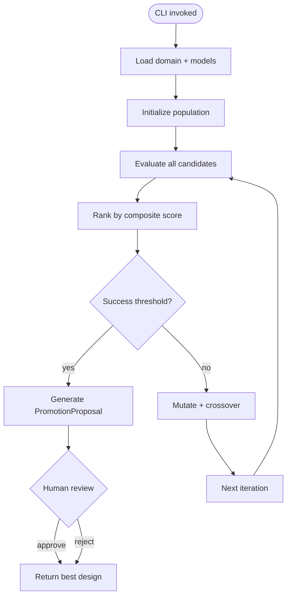
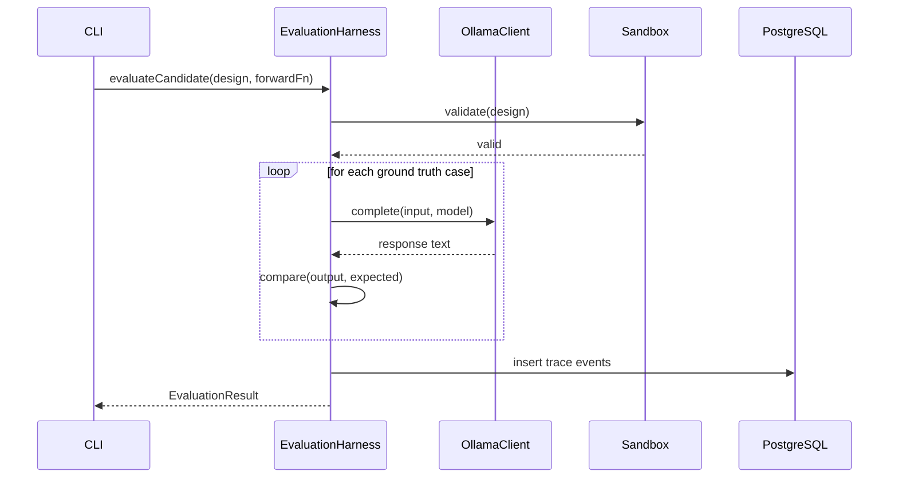

# ADAS Blueprint: Automated Agent Design & Assistant System

> [!NOTE]
> **AI-Assisted Documentation**
> Portions of this document were drafted with the assistance of an AI language model (Claude).
> Content has not yet been fully reviewed — this is a working design reference, not a final specification.
> AI-generated content may contain inaccuracies or omissions.
> When in doubt, defer to the source code, JSON schemas, and team consensus.

<!-- ADAS is an evolutionary design system for AI agents. It generates, evaluates, mutates, and promotes agent designs using real LLM inference (Ollama) and HITL governance. This blueprint covers the core concepts, requirements, and architecture for the ADAS system as implemented in the memory project. -->

---

## Table of Contents

- [1) Core Concepts](#1-core-concepts)
- [2) Requirements](#2-requirements)
- [3) Architecture](#3-architecture)
- [4) Diagrams](#4-diagrams)
- [5) Data Model](#5-data-model)
- [6) Execution Rules](#6-execution-rules)
- [7) Global Constraints](#7-global-constraints)
- [8) API Surface](#8-api-surface)
- [9) Logging \& Audit](#9-logging--audit)
- [10) Admin Workflow](#10-admin-workflow)
- [11) Event-Driven Architecture](#11-event-driven-architecture)
- [12) References](#12-references)

---

## 1) Core Concepts

### AgentDesign

An `AgentDesign` is a configurable blueprint for an AI agent. It specifies the domain, reasoning strategy, model selection, system prompt, and tool definitions. Designs are the primary artifact evolved by the search loop.

**States:** `draft` → `evaluating` → `ranked` → `proposed` → `approved` → `promoted` | `rejected`

**Key fields:**
- `design_id`: Unique identifier (UUID)
- `domain`: Domain this agent operates in (e.g., "math", "reasoning", "code")
- `config.model`: Selected Ollama model (`ModelConfig`)
- `config.reasoningStrategy`: Strategy — `cot`, `react`, `plan-and-execute`, `reflexion`
- `config.systemPrompt`: Base instruction prompt
- `config.tools`: Array of tool definitions the agent may call

---

### EvaluationHarness

The `EvaluationHarness` executes an `AgentDesign` against a `DomainConfig`'s ground-truth test cases and produces an `EvaluationResult`. It wraps the forward function, tracks latency/cost, compares outputs against expected outputs, and persists all events to PostgreSQL.

**Responsibilities:**
- Run agent forward function against each ground-truth case
- Compute accuracy (substring/regex match on expected output)
- Track token usage and latency
- Log every evaluation event to `adas_trace_events` table
- Compute composite score: `accuracyWeight * accuracy + costWeight * normalizedCost + latencyWeight * normalizedLatency`

---

### SearchLoop

The `SearchLoop` drives evolutionary search over the `AgentDesign` space. It maintains a population of designs, evaluates them, ranks by composite score, applies mutations (prompt mutation, model mutation, strategy mutation) and crossover, and iterates until convergence or max iterations.

**Key operations:**
- Initialize random population from `SearchSpace`
- Evaluate all candidates in parallel via `EvaluationHarness`
- Rank candidates by composite score
- Select elites (top N)
- Mutate elites to create children
- Optionally recombine two elites via crossover
- Loop until `maxIterations` or `successThreshold` reached

---

### Sandbox

The `Sandbox` provides isolation for executing untrusted agent code. ADAS supports two modes: `process` (Node.js child process with resource limits) and `docker` (nested container with read-only filesystem and no network).

**Constraints enforced:**
- CPU time limit
- Memory limit
- No network access (docker mode)
- Read-only filesystem (docker mode)
- All outputs captured and returned

---

### PromotionProposal & HITL Governance

Agents cannot autonomously promote to production. Every candidate that scores above threshold generates a `PromotionProposal`, which surfaces to a human reviewer for approval. The reviewer can approve, reject, or request modifications.

**Proposal states:** `pending` → `approved` | `rejected` | `modified`

**Fields:**
- `proposalId`: UUID
- `design`: The candidate `AgentDesign`
- `evaluationMetrics`: Scores at time of proposal
- `reviewerNotes`: Human feedback
- `humanDecision`: `approved` | `rejected`

---

### DomainConfig

Defines the evaluation context for a search — ground-truth cases, accuracy weighting, and cost/latency weights for composite scoring.

**Key fields:**
- `domainId`: Unique identifier
- `groundTruth[]`: Array of `{id, input, expectedOutput}` test cases
- `accuracyWeight`, `costWeight`, `latencyWeight`: Composite score weights (must sum to 1.0)

---

### ModelConfig

Describes an Ollama model available for agent inference.

**Key fields:**
- `modelId`: Ollama model identifier (e.g., `qwen3-coder-next:cloud`)
- `provider`: Always `"ollama"`
- `tier`: `"stable"` | `"experimental"` — stable for baseline, experimental opt-in
- `temperature`, `maxTokens`, `supportsTools`: Inference parameters

---

## 2) Requirements

### Business Requirements

| # | Requirement |
|---|-------------|
| B1 | Design AI agents automatically via evolutionary search — generate candidate designs, evaluate them against ground truth, evolve via mutation/crossover |
| B2 | Use real LLM inference (Ollama) for all agent execution — no mocked or stubbed responses in production |
| B3 | Govern agent promotion via HITL — no agent autonomously promoted to production; human reviews proposals |
| B4 | Provide a CLI entry point for standalone ADAS runs — `npx tsx src/lib/adas/cli.ts` |
| B5 | Persist all evaluation events and proposals to PostgreSQL — full audit trail of search history |
| B6 | Support two-tier model selection — stable models for reproducible baselines, experimental models opt-in |

---

### Functional Requirements

#### Agent Design (F1–F3)

| # | Requirement |
|---|-------------|
| F1 | Generate random `AgentDesign` from a `SearchSpace` — random model, strategy, and prompt |
| F2 | Mutate an `AgentDesign` — change prompt, swap model (within tier), change reasoning strategy |
| F3 | Crossover two `AgentDesign` instances — combine configs to produce a child design |

#### Evaluation (F4–F8)

| # | Requirement |
|---|-------------|
| F4 | Evaluate candidate against `DomainConfig` ground truth — run forward function, compare output to expected |
| F5 | Compute composite score: `accuracyWeight * accuracy + costWeight * normCost + latencyWeight * normLatency` |
| F6 | Log every evaluation event to PostgreSQL (`adas_trace_events` table) |
| F7 | Support multiple domains: `math`, `reasoning`, `code` — configurable via CLI |
| F8 | Rank candidates by composite score — descending order |

#### Search Loop (F9–F13)

| # | Requirement |
|---|-------------|
| F9 | Initialize population of random designs from `SearchSpace` |
| F10 | Run evolutionary iterations — evaluate, rank, mutate, crossover until max iterations |
| F11 | Track best design across all iterations |
| F12 | Support configurable population size, elite count, mutation rate, crossover rate |
| F13 | Early stopping when `successThreshold` met (top candidate score >= threshold) |

#### Sandbox (F14–F16)

| # | Requirement |
|---|-------------|
| F14 | Execute agent code in isolated process — resource limits (CPU, memory) |
| F15 | Execute agent code in Docker container — read-only filesystem, no network |
| F16 | Capture stdout/stderr, return structured output or error |

#### Governance (F17–F19)

| # | Requirement |
|---|-------------|
| F17 | Generate `PromotionProposal` when candidate score >= promotion threshold |
| F18 | Human reviewer approves/rejects/modifies proposal |
| F19 | Only `approved` designs may be promoted to active agent status |

#### Ollama Integration (F20–F22)

| # | Requirement |
|---|-------------|
| F20 | Route cloud models (`:cloud` suffix) to `https://ollama.com` with Bearer auth |
| F21 | Route local models to `http://localhost:11434` without auth |
| F22 | Track token usage and latency per Ollama call |

---

## 3) Architecture

### Components

| Component | Responsibility | Notes |
|-----------|---------------|-------|
| `OllamaClient` | HTTP client for Ollama API — local + cloud routing, Bearer auth | `src/lib/ollama/client.ts` |
| `EvaluationHarness` | Evaluate designs against ground truth, log to PostgreSQL | `src/lib/adas/evaluation-harness.ts` |
| `SearchLoop` | Evolutionary search — population, mutation, crossover, ranking | `src/lib/adas/search-loop.ts` |
| `Sandbox` | Isolated code execution (process or docker) | `src/lib/adas/sandbox.ts` |
| `PromotionDetector` | Detect when candidate qualifies for promotion | `src/lib/adas/promotion-detector.ts` |
| `PromotionProposal` | HITL review workflow — approve/reject/modify | `src/lib/adas/promotion-proposal.ts` |
| `SafetyMonitor` | Validate design safety before execution | `src/lib/adas/safety-monitor.ts` |
| `adas/cli.ts` | CLI entry point for standalone runs | `src/lib/adas/cli.ts` |
| PostgreSQL | Persistent storage — runs, trace events, proposals | `adas_runs`, `adas_trace_events` tables |
| Neo4j | (Future) agent memory graph | Connection via `src/lib/postgres/` |

---

## 4) Diagrams

### Component Overview

```mermaid
graph TD
    CLI["CLI (cli.ts)"]
    SL["SearchLoop"]
    EH["EvaluationHarness"]
    SC["Sandbox"]
    OC["OllamaClient"]
    PD["PromotionDetector"]
    PP["PromotionProposal"]
    SM["SafetyMonitor"]
    PG[(PostgreSQL)]
    N4J[(Neo4j)]

    CLI -->|creates| SL
    SL -->|evaluates via| EH
    EH -->|calls| OC
    EH -->|logs events| PG
    EH -->|runs in| SC
    SC -->|validates via| SM
    EH -->|detects promotion| PD
    PD -->|creates| PP
    PP -->|human review|
    SL -->|stores best| PG
```

### Execution Flow



### Evaluation Flow



---

## 5) Data Model

### `adas_runs`

PostgreSQL table — one row per evaluation run (one design evaluated once).

| Field | Type | Required | Description |
|-------|------|----------|-------------|
| `run_id` | uuid | Yes | Unique run identifier |
| `group_id` | string | Yes | Evaluation group (e.g., "adas-cli") |
| `design_id` | uuid | Yes | AgentDesign UUID |
| `design_name` | string | Yes | Human-readable name |
| `domain_id` | string | Yes | Domain identifier |
| `model_id` | string | Yes | Ollama model used |
| `strategy` | string | Yes | Reasoning strategy |
| `system_prompt` | text | Yes | System prompt at evaluation time |
| `accuracy` | numeric | Yes | Accuracy score (0–1) |
| `cost` | numeric | Yes | Token cost estimate |
| `latency_ms` | integer | Yes | End-to-end latency |
| `composite_score` | numeric | Yes | Weighted composite |
| `status` | string | Yes | `completed`, `failed`, `timeout` |
| `created_at` | datetime | Yes | Run start timestamp |

---

### `adas_trace_events`

PostgreSQL table — every event during evaluation for audit/debugging.

| Field | Type | Required | Description |
|-------|------|----------|-------------|
| `event_id` | uuid | Yes | Unique event identifier |
| `run_id` | uuid | Yes | FK → `adas_runs.run_id` |
| `event_type` | string | Yes | `evaluation_started`, `ollama_request`, `ollama_response`, `test_case_result`, `evaluation_completed` |
| `payload` | jsonb | Yes | Event-specific data |
| `created_at` | datetime | Yes | Event timestamp |

---

### `adas_promotion_proposals`

PostgreSQL table — HITL governance proposals.

| Field | Type | Required | Description |
|-------|------|----------|-------------|
| `proposal_id` | uuid | Yes | Unique proposal identifier |
| `design_id` | uuid | Yes | Candidate design UUID |
| `design_snapshot` | jsonb | Yes | Full design at proposal time |
| `evaluation_metrics` | jsonb | Yes | Scores at proposal time |
| `status` | string | Yes | `pending`, `approved`, `rejected`, `modified` |
| `reviewer_notes` | text | No | Human feedback |
| `human_decision` | string | No | `approved`, `rejected` |
| `created_at` | datetime | Yes | Proposal creation time |
| `decided_at` | datetime | No | Human decision timestamp |

---

## 6) Execution Rules

### Evaluation Order

1. Safety check — validate design tools and prompts
2. For each ground-truth case:
   a. Build prompt from system prompt + input
   b. Call Ollama via `OllamaClient.complete()`
   c. Compare output to `expectedOutput` (substring match or regex)
   d. Log `test_case_result` event
3. Compute accuracy = passed cases / total cases
4. Compute composite score using domain weights
5. Log `evaluation_completed` event with all metrics

### Mutation Rules

- **Prompt mutation**: Random character-level edit, word swap, or sentence restructure
- **Model mutation**: Switch to different model within same tier
- **Strategy mutation**: Random selection from `["cot", "react", "plan-and-execute", "reflexion"]`

### Crossover Rules

- Single-point crossover on `systemPrompt` string
- Inherit `model` and `tools` from parent 1
- Inherit `reasoningStrategy` from parent 2

### HITL Promotion Rules

- Threshold: composite score >= 0.85 (configurable per domain)
- Proposal surfaces to human with full design + metrics
- Human can: approve, reject, or request modification
- Only `approved` proposals may be instantiated as active agents

---

## 7) Global Constraints

- **No autonomous promotion**: An agent design MUST NOT be promoted to active status without human approval.
- **Sandbox isolation**: Agent code execution MUST be sandboxed — process mode with resource limits, or docker mode with read-only filesystem and no network.
- **Local/cloud routing**: Models with `:cloud` suffix MUST route to `OLLAMA_CLOUD_URL` with Bearer auth; all others route to `OLLAMA_BASE_URL` (default `http://localhost:11434`) with no auth.
- **Weight normalization**: `accuracyWeight + costWeight + latencyWeight` MUST sum to 1.0 per `DomainConfig`.
- **Unique run IDs**: Each `EvaluationHarness` instance MUST generate a unique `runId` (UUID) to avoid PostgreSQL unique constraint violations.

---

## 8) API Surface

### CLI

| Command | Description |
|---------|-------------|
| `npx tsx src/lib/adas/cli.ts --domain math --iterations 5 --population 5` | Run evolutionary search |
| `npx tsx src/lib/adas/cli.ts --help` | Show CLI options |

**CLI Options:**
- `--domain` — Domain name (default: `math`)
- `--iterations` — Number of search iterations (default: `3`)
- `--population` — Population size (default: `3`)
- `--elite-count` — Number of elites to keep (default: `2`)
- `--model-tier` — `stable`, `experimental`, or `all` (default: `stable`)

---

### Module API (src/lib/adas/)

| Export | Description |
|--------|-------------|
| `createEvaluationHarness(config)` | Create new harness instance |
| `rankCandidates(candidates, weights)` | Rank by composite score |
| `getStableModels()` | Get stable tier models |
| `getExperimentalModels()` | Get experimental tier models |
| `getModelsByTier(tier)` | Get models by tier |
| `createSearchConfig(options)` | Create search config for SearchLoop |
| `generateRandomDesign(domain, searchSpace)` | Generate random design |

---

### OllamaClient API

| Method | Description |
|--------|-------------|
| `complete(prompt, modelId, options?)` | Generate completion with token tracking |
| `listModels()` | List available Ollama models |
| `generate(req)` | Raw generate API |
| `streamGenerate(req)` | Streaming generate |

---

## 9) Logging & Audit

| What | Where stored | Notes |
|------|-------------|-------|
| Evaluation runs | `adas_runs` table | All metrics, design snapshot |
| Trace events | `adas_trace_events` table | Per-event JSON payload |
| Promotion proposals | `adas_promotion_proposals` table | Human decisions |
| Ollama errors | `adas_trace_events` (event_type=`ollama_error`) | For debugging |

**Redacted fields:** None — no credentials or PII in ADAS logs.

---

## 10) Admin Workflow

### Running ADAS Search

1. Ensure PostgreSQL is running (`docker ps knowledge-postgres`)
2. Ensure Ollama is accessible (`OLLAMA_BASE_URL` for local, `OLLAMA_API_KEY` for cloud)
3. Run CLI:
   ```bash
   cd /home/ronin704/dev/projects/memory
   npx tsx src/lib/adas/cli.ts --domain math --iterations 5 --population 5
   ```
4. Review best design + metrics in output
5. If proposal generated → review in PostgreSQL or via ADAS dashboard (future)

### Interpreting Results

- `Accuracy 100%` — All ground-truth test cases passed
- `Composite Score 0.9+` — Strong candidate, consider promotion
- `Latency high` — Consider faster/smaller model

---

## 11) Event-Driven Architecture

**Producer:** `EvaluationHarness`  
**Consumer(s):** SearchLoop (for ranking), future dashboard

| Event | Trigger |
|-------|---------|
| `evaluation_started` | Harness begins candidate evaluation |
| `ollama_request` | Before each Ollama call (logged for audit) |
| `ollama_response` | After each Ollama call (includes tokens + latency) |
| `test_case_passed` | Ground-truth case matched |
| `test_case_failed` | Ground-truth case did not match |
| `evaluation_completed` | All cases processed, metrics computed |
| `evaluation_failed` | Harness error (network, timeout, etc.) |
| `proposal_pending` | Candidate score >= promotion threshold |
| `proposal_approved` | Human approved |
| `proposal_rejected` | Human rejected |

---

## 12) References

### Project Documents
- [docs/api/adas.md](docs/api/adas.md) — Module API reference
- [src/lib/adas/index.ts](src/lib/adas/index.ts) — Public exports
- [src/lib/ollama/client.ts](src/lib/ollama/client.ts) — Ollama HTTP client

### JSON Schemas
- (None yet — ADAS state lives in PostgreSQL, not JSON schemas)

### External Resources
- [Ollama API docs](https://docs.ollama.com/api/) — API reference
- [Ollama authentication](https://docs.ollama.com/api/authentication.md) — Bearer token auth
