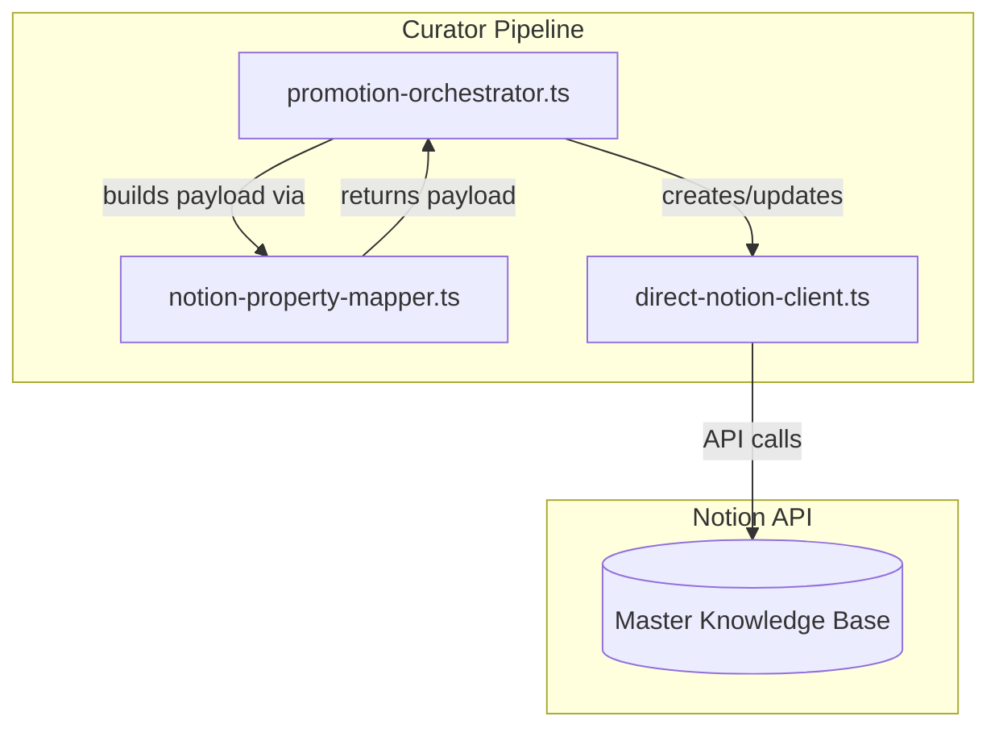
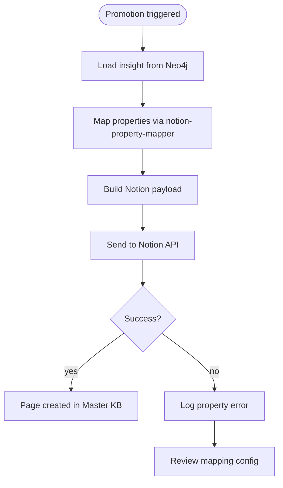
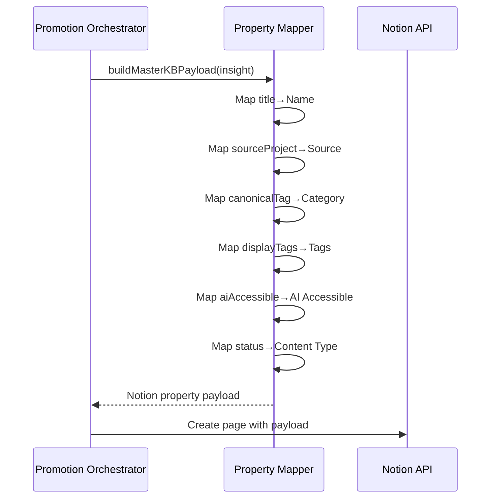
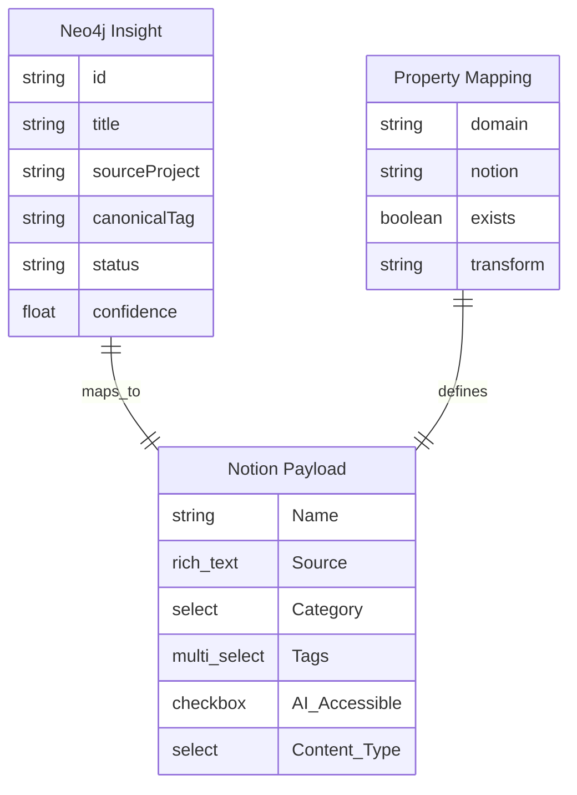

# Blueprint: Adapt Curator to Master Knowledge Base Schema

> [!NOTE]
> **AI-Assisted Documentation**
> Portions of this document were drafted with the assistance of an AI language model (Claude).
> Content has not yet been fully reviewed — this is a working design reference, not a final specification.
> AI-generated content may contain inaccuracies or omissions.
> When in doubt, defer to the source code, JSON schemas, and team consensus.

The curator pipeline connects the knowledge graph (Neo4j) to the human workspace (Notion) by promoting insights to the Master Knowledge Base. This blueprint documents the schema adaptation needed to align curator payloads with the actual Notion database structure.

---

## Table of Contents

- [1) Core Concepts](#1-core-concepts)
- [2) Requirements](#2-requirements)
- [3) Architecture](#3-architecture)
- [4) Diagrams](#4-diagrams)
- [5) Data Model](#5-data-model)
- [6) Execution Rules](#6-execution-rules)
- [7) Global Constraints](#7-global-constraints)
- [8) API Surface](#8-api-surface)
- [9) Logging & Audit](#9-logging--audit)
- [10) Admin Workflow](#10-admin-workflow)
- [11) Event-Driven Architecture](#11-event-driven-architecture)
- [12) References](#12-references)

---

## 1) Core Concepts

### Property Mapping

A `PropertyMapping` defines how curator domain properties (the internal names used in code) map to Notion database properties. Each mapping includes whether the target property exists in the Master Knowledge Base and any transformations required.

**Key fields:**
- `domain`: The curator internal property name (e.g., "title")
- `notion`: The Notion database property name (e.g., "Name")
- `exists`: Whether this property exists in Master KB
- `transform`: Optional transformation (e.g., "statusToContentType")

---

### Master Knowledge Base Schema

The actual Notion database structure that curator must target. Properties include:
- `Name` (title): Page title
- `Source` (rich_text): Origin project
- `Category` (select): Canonical tag mapped to display value
- `Tags` (multi_select): Display tags
- `AI Accessible` (checkbox): Runtime approval flag
- `Content Type` (select): Insight type classification

---

### Promotion Payload

The structured data sent to Notion API when creating or updating a knowledge base page. Built by `notion-property-mapper.ts` using the mapping configuration.

---

## 2) Requirements

### Business Requirements

| # | Requirement |
|---|-------------|
| B1 | Curator must successfully create pages in the correct Notion database (Master Knowledge Base) |
| B2 | Curator payloads must align with actual Notion database schema to avoid "property does not exist" errors |
| B3 | Property mappings must be centralized and maintainable — single source of truth for curator-to-Notion translation |
| B4 | Existing curator functionality must continue working after schema adaptation |

---

### Functional Requirements

#### Schema Mapping (F1–F4)

| # | Requirement |
|---|-------------|
| F1 | Create a property mapping module that defines all curator domain to Notion property mappings |
| F2 | Map curator `title` → Notion `Name` (title property) |
| F3 | Map curator `sourceProject` → Notion `Source` (rich_text property) |
| F4 | Map curator `canonicalTag` → Notion `Category` (select property) with display tag transformation |

#### Payload Building (F5–F8)

| # | Requirement |
|---|-------------|
| F5 | Map curator `displayTags` → Notion `Tags` (multi_select property) |
| F6 | Map curator `aiAccessible` → Notion `AI Accessible` (checkbox property) |
| F7 | Map curator `status` → Notion `Content Type` (select property) via transformation |
| F8 | Build complete Notion API payload with all mapped properties |

#### Client Updates (F9–F12)

| # | Requirement |
|---|-------------|
| F9 | Update `promotion-orchestrator.ts` to use property mapper for payload construction |
| F10 | Update `direct-notion-client.ts` to use mapped property names for reading existing pages |
| F11 | Update `config.ts` to reference correct Master Knowledge Base database ID |
| F12 | Skip properties that don't exist in Master KB without error |

---

## 3) Architecture

### Components

| Component | Responsibility | Notes |
|-----------|---------------|-------|
| `notion-property-mapper.ts` | Central property mapping and payload building | New module — single source of truth |
| `promotion-orchestrator.ts` | Orchestrates insight promotion workflow | Modified to use mapper |
| `direct-notion-client.ts` | Direct Notion API client with read operations | Modified to use mapped names |
| `config.ts` | Configuration including database IDs | Modified for Master KB ID |

---

## 4) Diagrams

### Component Overview

---

### Execution Flow

---

### Property Mapping Flow

---

### Data Model (ER Diagram)

---

## 5) Data Model

### `PROPERTY_MAPPINGS`

Configuration array defining all curator-to-Notion property mappings.

| Field | Type | Required | Description |
|-------|------|----------|-------------|
| `domain` | string | Yes | Curator internal property name (e.g., "title") |
| `notion` | string | Yes | Notion database property name (e.g., "Name") |
| `exists` | boolean | Yes | Whether property exists in Master KB |
| `transform` | enum | No | Transformation type: `canonicalToDisplay`, `statusToContentType` |

**`transform` values**

| Value | Description |
|-------|-------------|
| `canonicalToDisplay` | Convert canonical tag to display tag via DISPLAY_TAG_MAP |
| `statusToContentType` | Map status values to Content Type select options |

---

### `MASTER_KB_PROPERTIES`

Constant object defining Notion database property names in Master Knowledge Base.

| Field | Notion Type | Description |
|-------|-------------|-------------|
| `NAME` | title | Page title property |
| `SOURCE` | rich_text | Source project property |
| `CATEGORY` | select | Category select property |
| `TAGS` | multi_select | Tags multi-select property |
| `AI_ACCESSIBLE` | checkbox | AI Accessible checkbox |
| `CONTENT_TYPE` | select | Content Type select property |

---

### `STATUS_TO_CONTENT_TYPE`

Mapping of curator status values to Content Type select values.

| Status | Content Type |
|--------|--------------|
| `Proposed` | `Insight` |
| `Pending Review` | `Insight` |
| `Approved` | `Insight` |
| `Rejected` | `Insight` |
| `Superseded` | `Insight` |

---

## 6) Execution Rules

### Property Mapping Resolution

1. For each curator domain property, look up its mapping in `PROPERTY_MAPPINGS`
2. If `exists` is false, skip the property (do not include in payload)
3. If `transform` is specified, apply the transformation:
   - `canonicalToDisplay`: Lookup in `DISPLAY_TAG_MAP`
   - `statusToContentType`: Use `STATUS_TO_CONTENT_TYPE` mapping
4. Build Notion property value based on target property type

### Payload Building Rules

1. Only include properties where `exists` is true
2. Format values according to Notion API requirements for each property type
3. Include all required Master KB properties: Name, Category, Tags
4. Set `AI Accessible` to false for new promotions
5. Set `Content Type` to "Insight" for all knowledge base entries

### Read Mapping Rules

When reading existing Notion pages:
1. Use `MASTER_KB_PROPERTIES` to extract values from Notion response
2. Map back to curator domain names for internal processing
3. Filter out pages with Content Type values that indicate non-insight content

---

## 7) Global Constraints

| Constraint | Rationale |
|------------|-----------|
| Database ID must be correct | Wrong `NOTION_INSIGHTS_DB_ID` causes pages to be created in wrong database (Ronin Agents instead of Master KB) |
| All payload properties must exist in target database | Notion API returns "property does not exist" errors for missing properties |
| `Category` select options must match display tags | Mismatched values cause creation failures or data inconsistency |
| Property mapper is single source of truth | Centralizing mappings prevents drift between payload building and reading |

---

## 8) API Surface

### Module API (src/curator/notion-property-mapper.ts)

| Export | Description |
|--------|-------------|
| `MASTER_KB_PROPERTIES` | Constant object with Master KB property names |
| `STATUS_TO_CONTENT_TYPE` | Mapping of status to Content Type values |
| `PROPERTY_MAPPINGS` | Array of all property mappings |
| `getSupportedProperties()` | Returns Set of supported (existing) property names |
| `buildMasterKBPayload(insight, displayTagMap)` | Builds Notion API payload from curator insight |

### Internal APIs

| Component | Method | Description |
|-----------|--------|-------------|
| `promotion-orchestrator.ts` | `buildPromotionPayload()` | Uses mapper to construct creation payload |
| `promotion-orchestrator.ts` | `buildApprovalUpdatePayload()` | Uses mapper for approval update |
| `direct-notion-client.ts` | `mapInsightRow()` | Uses mapped names to read page properties |
| `direct-notion-client.ts` | `findExistingInsights()` | Filters by mapped Category property |

---

## 9) Logging & Audit

| What | Where stored | Notes |
|------|-------------|-------|
| Property mapping errors | Console output / logs | "property does not exist" errors |
| Created page IDs | Notion API response | Page ID for updates |
| Promotion events | PostgreSQL traces | Via existing trace system |

**Redacted fields:** Notion API key (never logged)

---

## 10) Admin Workflow

### Updating Database Configuration

1. Edit `.env` file
2. Change `NOTION_INSIGHTS_DB_ID` to Master Knowledge Base ID
3. Verify with: `bun run check_properties.ts`

### Deploying Schema Mapping

1. Create `notion-property-mapper.ts` with mapping configuration
2. Update `promotion-orchestrator.ts` to import and use mapper
3. Update `direct-notion-client.ts` to use mapped property names
4. Update `config.ts` with correct database ID
5. Run curator: `bun run curator:run`
6. Verify pages created in Master Knowledge Base with correct properties

### Troubleshooting

1. Check property errors in console output
2. Verify Master KB schema with `check_properties.ts`
3. Confirm `PROPERTY_MAPPINGS` has correct `exists` flags
4. Check that `Category` select options match expected values

---

## 11) Event-Driven Architecture

N/A — This adaptation is a synchronous schema mapping layer without event publishing.

---

## 12) References

### Project Documents

- [SOLUTION-ARCHITECTURE.md](SOLUTION-ARCHITECTURE.md) — System topology and interaction patterns
- [DATA-DICTIONARY.md](DATA-DICTIONARY.md) — Field-level definitions
- [REQUIREMENTS-MATRIX.md](REQUIREMENTS-MATRIX.md) — Requirement traceability
- [RISKS-AND-DECISIONS.md](RISKS-AND-DECISIONS.md) — Risks and architectural decisions
- [TASKS.md](TASKS.md) — Implementation tasks

### Source Code References

- `src/curator/promotion-orchestrator.ts` — Promotion workflow
- `src/curator/direct-notion-client.ts` — Notion API client
- `src/curator/config.ts` — Configuration
- `check_properties.ts` — Schema verification script

### External Resources

- [Notion API Documentation](https://developers.notion.com/) — Property types and payload formats
