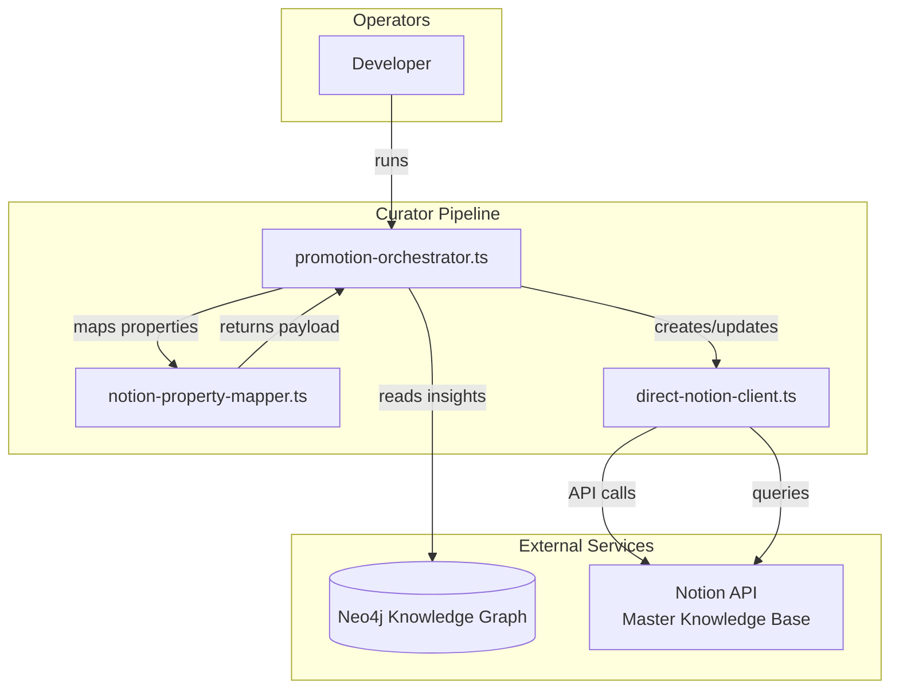
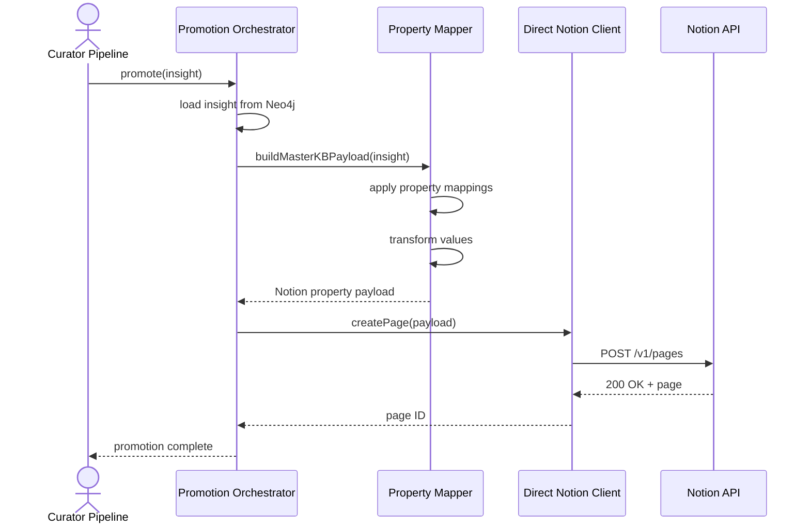
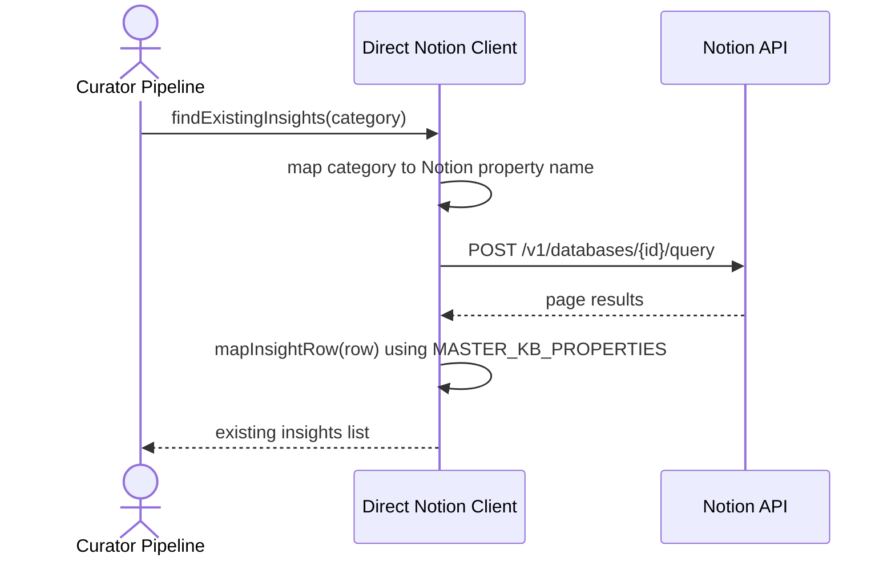

# Solution Architecture: Adapt Curator to Master Knowledge Base Schema

> [!NOTE]
> **AI-Assisted Documentation**
> Portions of this document were drafted with the assistance of an AI language model (Claude).
> Content has not yet been fully reviewed. This is a working design reference, not a final specification.
> AI-generated content may contain inaccuracies or omissions.
> When in doubt, defer to the source code, JSON schemas, and team consensus.

This document describes the topological structure of the curator-to-Notion adaptation layer. It covers who calls what, how the property mapping layer interfaces with Notion, and how architectural decisions shape interaction patterns.

---

## Table of Contents

- [1. Architectural Positioning](#1-architectural-positioning)
- [2. System Boundary and External Actors](#2-system-boundary-and-external-actors)
- [3. Logical Topologies](#3-logical-topologies)
  - [3.1 Promotion Path](#31-promotion-path)
  - [3.2 Reading Existing Pages](#32-reading-existing-pages)
- [4. Interface Catalogue](#4-interface-catalogue)
- [5. Risk-Architecture Traceability](#5-risk-architecture-traceability)
- [6. Key Architectural Constraints](#6-key-architectural-constraints)
- [7. References](#7-references)

---

## 1. Architectural Positioning

| Attribute | Value |
|-----------|-------|
| **Role** | Translation layer — maps curator domain concepts to Notion database schema |
| **Authoritative state** | Notion Master Knowledge Base (external) |
| **Operators** | Curator pipeline, developer running curator commands |
| **Consumes** | Neo4j insights (knowledge graph), Notion API responses |
| **Produces** | Notion API payloads, created/updated pages |

---

## 2. System Boundary and External Actors

---

## 3. Logical Topologies

### 3.1 Promotion Path

**Actor:** Curator pipeline (promotion-orchestrator.ts)  
**Trigger:** Knowledge promotion workflow initiated  
**Frequency:** On each insight promotion

**Key constraints:**
- All property names MUST exist in Master KB or be filtered out by mapper [RK-01]
- Payload MUST include required properties: Name, Category, Tags, AI Accessible, Content Type
- API calls MUST use correct database ID [AD-01]

---

### 3.2 Reading Existing Pages

**Actor:** Curator pipeline (direct-notion-client.ts)  
**Trigger:** Checking for duplicate insights before promotion  
**Frequency:** On each promotion attempt

**Key constraints:**
- Filter MUST use mapped property name (Category, not Canonical Tag) [AD-02]
- Results MUST exclude Rejected and Superseded pages
- Property extraction MUST handle both old and mapped names for backward compatibility

---

## 4. Interface Catalogue

| Interface | Direction | Channel | Payload / Contract | Risk / Decision |
|-----------|-----------|---------|-------------------|-----------------|
| Neo4j Knowledge Graph | Inbound | Bolt protocol | Insight nodes (title, sourceProject, canonicalTag, etc.) | — |
| Notion API (Create Page) | Outbound | HTTPS REST | `POST /v1/pages` with property payload | [AD-01](#ad-01-master-knowledge-base-database-id), [RK-01](#rk-01-schema-mismatch) |
| Notion API (Query Database) | Outbound | HTTPS REST | `POST /v1/databases/{id}/query` with filter | [AD-02](#ad-02-property-name-mapping) |

---

## 5. Risk-Architecture Traceability

| Section | Risks and Decisions Addressed |
|---------|------------------------------|
| §3.1 Promotion Path | [AD-01](#ad-01-master-knowledge-base-database-id), [AD-02](#ad-02-property-name-mapping), [RK-01](#rk-01-schema-mismatch), [RK-02](#rk-02-category-select-options) |
| §3.2 Reading Existing Pages | [AD-02](#ad-02-property-name-mapping), [RK-02](#rk-02-category-select-options) |

---

## 6. Key Architectural Constraints

| Constraint | Rationale |
|------------|-----------|
| Property mapper is single source of truth | Centralizing mappings prevents drift and ensures consistency between payload building and reading |
| Database ID MUST be environment-configurable | Hardcoded IDs cause deployments to target wrong databases |
| Properties not in Master KB MUST be skipped | Notion API rejects payloads with unknown properties |
| Category select values MUST match display tags | Mismatched values cause creation failures or data inconsistency |

---

## 7. References

- [BLUEPRINT.md](BLUEPRINT.md) — Core data model, API surface, execution rules
- [RISKS-AND-DECISIONS.md](RISKS-AND-DECISIONS.md) — Architectural decisions and risk mitigations
- [REQUIREMENTS-MATRIX.md](REQUIREMENTS-MATRIX.md) — Business and functional requirement traceability
- [TASKS.md](TASKS.md) — Implementation tasks
- `src/curator/promotion-orchestrator.ts` — Promotion orchestrator
- `src/curator/direct-notion-client.ts` — Notion client
- `src/curator/notion-property-mapper.ts` — Property mapper (new)

---

### AD-01: Master Knowledge Base Database ID

| Field | Detail |
|-------|--------|
| **Status** | Decided |
| **Decision** | Use environment variable `NOTION_INSIGHTS_DB_ID` set to Master Knowledge Base ID (`e5d3db1e-1290-4d33-bd1f-71f93cc36655`) instead of Ronin Agents database ID |
| **Rationale** | Curator was creating pages in wrong database (Ronin Agents instead of Master Knowledge Base). The Master KB is the canonical human workspace for curated insights. |
| **Alternatives considered** | Hardcode ID in code — rejected (environment-specific). Use database name lookup — rejected (Notion API requires ID). |
| **Consequences** | All existing curator runs must update `.env` before next execution. Old Ronin Agents database pages may need migration. |
| **Owner** | Curator team |
| **References** | `.env` file, `src/curator/config.ts` |

---

### AD-02: Property Name Mapping

| Field | Detail |
|-------|--------|
| **Status** | Decided |
| **Decision** | Create a centralized `notion-property-mapper.ts` module that maps curator domain names to Notion property names, with explicit handling for missing properties |
| **Rationale** | Curator was using property names that don't exist in Master KB (Summary, Confidence, Canonical Tag, etc.). A centralized mapper ensures single source of truth and prevents "property does not exist" errors. |
| **Alternatives considered** | Inline mappings in each file — rejected (duplication, error-prone). Rename Notion properties to match curator — rejected (Master KB has existing structure and usage). |
| **Consequences** | All curator-to-Notion interactions must route through mapper. New properties require mapping entry. |
| **Owner** | Curator team |
| **References** | `src/curator/notion-property-mapper.ts`, [BLUEPRINT.md](BLUEPRINT.md) §5 |

---

### RK-01: Schema Mismatch

| Field | Detail |
|-------|--------|
| **Severity** | High |
| **Likelihood** | High (current state) |
| **Status** | 🔴 Open (mitigation in progress) |
| **Description** | Curator payloads contain properties that don't exist in Master Knowledge Base (Summary, Confidence, Review Status, etc.), causing Notion API "property does not exist" errors and failed page creation. |
| **Mitigation** | Property mapper filters out non-existent properties. All payload building routes through mapper. |
| **Owner** | Curator team |
| **Related decision** | [AD-02](#ad-02-property-name-mapping) |

---

### RK-02: Category Select Options

| Field | Detail |
|-------|--------|
| **Severity** | Medium |
| **Likelihood** | Medium |
| **Status** | 🔴 Open |
| **Description** | The `Category` select property in Master KB may not have options matching all canonical tags. Creating pages with unknown select values fails or creates inconsistent data. |
| **Mitigation** | Pre-populate Category select options in Notion to match display tags. Add validation in mapper to warn on unknown categories. |
| **Owner** | Curator team |
| **Related decision** | [AD-02](#ad-02-property-name-mapping) |

---

### RK-03: Database ID Cache

| Field | Detail |
|-------|--------|
| **Severity** | Low |
| **Likelihood** | Low |
| **Status** | 🔴 Open |
| **Description** | Old database ID may be cached in environment variables, CI/CD configs, or developer environments. Curator runs using old ID continue creating pages in wrong database. |
| **Mitigation** | Update `.env` files. Audit CI/CD configs. Document migration for existing pages in Ronin Agents database. |
| **Owner** | Curator team |
| **Related decision** | [AD-01](#ad-01-master-knowledge-base-database-id) |
