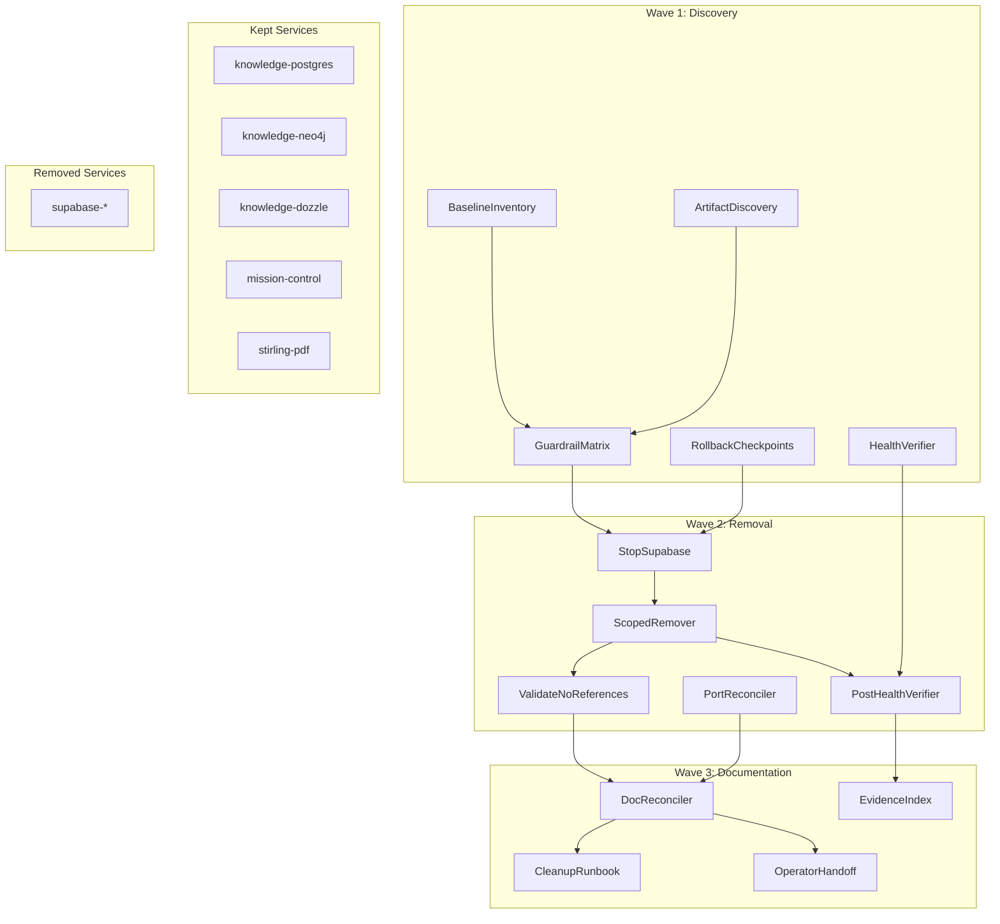
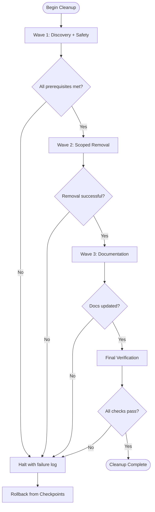

# Docker Cleanup for Single-Memory Architecture — Blueprint

> [!NOTE]
> **AI-Assisted Documentation**
> Portions of this document were drafted with the assistance of an AI language model.
> Content has not yet been fully reviewed — this is a working design reference, not a final specification.
> AI-generated content may contain inaccuracies or omissions.
> When in doubt, defer to the source code, JSON schemas, and team consensus.

This document describes the Docker infrastructure cleanup initiative to consolidate the runtime around a single-memory architecture (Ronin Memory) with required companion services, removing redundant Supabase artifacts while preserving Mission Control and Stirling-PDF.

---

## Table of Contents

- [1) Core Concepts](#1-core-concepts)
- [2) Requirements](#2-requirements)
  - [Business Requirements](#business-requirements)
  - [Functional Requirements](#functional-requirements)
- [3) Architecture](#3-architecture)
  - [Components](#components)
- [4) Diagrams](#4-diagrams)
  - [Component Overview](#component-overview)
  - [Execution Flow](#execution-flow)
- [5) Data Model](#5-data-model)
- [6) Execution Rules](#6-execution-rules)
- [7) Global Constraints](#7-global-constraints)
- [8) API Surface](#8-api-surface)
- [9) Logging & Audit](#9-logging--audit)
- [10) Admin Workflow](#10-admin-workflow)
- [11) References](#11-references)

---

## 1) Core Concepts

### Docker Runtime Target

The target Docker runtime consists of a curated set of services organized into functional layers: single-memory core (PostgreSQL + Neo4j), mission control services, and utilities (Stirling-PDF, Dozzle for log viewing).

**States:** Before cleanup (multiple memory systems) → After cleanup (single-memory architecture)

**Kept Services:**
- `knowledge-postgres` — Raw trace storage (PostgreSQL)
- `knowledge-neo4j` — Curated knowledge graph
- `knowledge-dozzle` — Log viewing interface
- Mission Control services — Task orchestration and control
- `stirling-pdf` — PDF processing utility

**Removed Services:**
- All Supabase containers, networks, and volumes (confirmed empty, no migration needed)

---

### Service Classification Matrix

Every discovered Docker resource must be classified into one of three actions:

| Action | Meaning | Examples |
|--------|---------|----------|
| **KEEP** | Required for runtime operation | knowledge-postgres, knowledge-neo4j, mission-control, stirling-pdf |
| **REMOVE** | Explicitly targeted for deletion | supabase-* containers, networks, volumes |
| **DO-NOT-TOUCH** | Out of scope for this cleanup | gateway, researcher, dashboard, mcp services, OpenClaw desktop |

---

### Evidence-Driven Verification

All cleanup phases produce command output saved to `docs/evidence/` files. This provides:
- Pre-cleanup baseline for rollback reference
- Proof of Supabase absence post-cleanup
- Health status verification for retained services

---

## 2) Requirements

### Business Requirements

| # | Requirement |
|---|-------------|
| B1 | Remove unused Supabase infrastructure from Docker runtime to reduce resource overhead and operational complexity |
| B2 | Preserve Ronin Memory (PostgreSQL + Neo4j) as the authoritative single-memory system |
| B3 | Maintain Mission Control operational continuity throughout cleanup |
| B4 | Keep Stirling-PDF service available for document processing needs |
| B5 | Generate auditable evidence of cleanup actions and service health |

---

### Functional Requirements

#### Discovery & Baseline (F1–F3)

| # | Requirement |
|---|-------------|
| F1 | Capture complete pre-cleanup Docker inventory: containers, volumes, networks, port mappings |
| F2 | Identify all Supabase-related artifacts by name prefix and label |
| F3 | Generate explicit keep/remove/do-not-touch classification for every discovered resource |

#### Safety & Guardrails (F4–F6)

| # | Requirement |
|---|-------------|
| F4 | Create rollback checkpoints with service-specific restart commands for all kept services |
| F5 | Verify pre-cleanup health for all retained services before any removal |
| F6 | Halt cleanup progression if any keep-service fails health check |

#### Removal Execution (F7–F9)

| # | Requirement |
|---|-------------|
| F7 | Stop Supabase services cleanly before container removal |
| F8 | Remove Supabase containers, networks, and scoped volumes without affecting other services |
| F9 | Validate no Supabase references remain in active runtime scripts or commands |

#### Documentation & Handoff (F10–F13)

| # | Requirement |
|---|-------------|
| F10 | Detect and document actual live port bindings for Mission Control and Stirling-PDF |
| F11 | Reconcile deployment documentation with verified runtime state |
| F12 | Update deployment runbook with final kept architecture and removed services |
| F13 | Create repeatable cleanup runbook section with scoped commands and safety cautions |
| F14 | Build evidence index mapping each task to its artifacts and expected outputs |
| F15 | Create operator handoff note documenting intentionally retained services and exclusions |

---

## 3) Architecture

### Components

| Component | Responsibility | Notes |
|-----------|---------------|-------|
| `BaselineInventory` | Capture pre-cleanup container/port/volume/network state | Docker CLI queries, output to evidence files |
| `ArtifactDiscovery` | Enumerate Supabase-related resources for removal | Name/label-based filtering, scoped to supabase prefix |
| `GuardrailMatrix` | Classify every resource into keep/remove/do-not-touch | Explicit decision record with rationale |
| `HealthVerifier` | Pre/post-cleanup health checks for kept services | pg_isready, HTTP endpoints, status verification |
| `ScopedRemover` | Execute Supabase removal without collateral damage | Container → network → volume sequence |
| `DocReconciler` | Align deployment docs with actual runtime state | Port binding verification, service table updates |
| `EvidenceIndex` | Track all evidence files and their verification criteria | Task-to-artifact mapping |

---

## 4) Diagrams

### Component Overview

---

### Execution Flow

---

## 5) Data Model

### Evidence Files

All evidence artifacts are stored in `docs/evidence/` with standardized naming:

| File Pattern | Content | Producer |
|--------------|---------|----------|
| `task-{N}-*.txt` | Task-specific command output | Corresponding task |
| `task-{N}-*.md` | Structured markdown reports | Tasks requiring tables/matrices |

**Evidence Retention:** Evidence files persist after cleanup completion for audit trail.

---

### Health Check Results

Health verification produces structured output containing:

| Field | Type | Description |
|-------|------|-------------|
| `service_name` | string | Name of the service checked |
| `check_type` | enum | `pg_isready`, `http_status`, `container_status` |
| `status` | enum | `healthy`, `unhealthy`, `unreachable` |
| `response_code` | integer | HTTP status code (for HTTP checks) |
| `timestamp` | datetime | When the check was performed |

---

### Guardrail Matrix Entry

Each discovered resource gets a matrix entry:

| Field | Type | Description |
|-------|------|-------------|
| `resource_id` | string | Docker container/volume/network identifier |
| `resource_type` | enum | `container`, `volume`, `network`, `image` |
| `action` | enum | `KEEP`, `REMOVE`, `DO_NOT_TOUCH` |
| `rationale` | string | Reason for classification |

---

## 6) Execution Rules

### Wave Execution Order

1. **Wave 1 (Foundation)** — All tasks can run in parallel
   - T1: Baseline inventory snapshot
   - T2: Supabase artifact discovery
   - T3: Guardrail matrix creation
   - T4: Rollback checkpoint preparation
   - T5: Pre-cleanup health verification

2. **Wave 2 (Removal)** — Sequential execution
   - T6: Stop Supabase services (blocked by T2, T3, T4)
   - T7: Remove Supabase artifacts (blocked by T2, T3, T6)
   - T8: Validate no Supabase references (blocked by T3, T7)
   - T9: Port reconciliation (blocked by T1)
   - T10: Post-removal health verification (blocked by T5, T7)

3. **Wave 3 (Documentation)** — Parallel documentation tasks
   - T11: Update deployment docs (blocked by T8, T9)
   - T12: Add cleanup runbook (blocked by T11)
   - T13: Build evidence index (blocked by T10)
   - T14: Operator handoff note (blocked by T11)

4. **Final Verification** — Parallel review tasks
   - F1–F4: Compliance, quality, replay, scope checks (blocked by T12, T13, T14)

---

### Health Check Rules

- **PostgreSQL:** `pg_isready -U ronin4life -d memory` must return exit code 0
- **Neo4j:** HTTP GET to `localhost:7474` must return 200 with valid JSON
- **HTTP Services:** GET request must return 2xx status
- **Container Status:** `docker ps` must list container as `healthy` or `running`

---

### Removal Safety Rules

1. **Never use broad destructive commands** (`docker system prune -a`)
2. **Always remove by explicit identifier** from scoped artifact list
3. **Verify keep-services intact** after each removal phase
4. **Halt on any unexpected service state change**

---

## 7) Global Constraints

- **Supabase confirmed empty:** No migration required; removal is safe
- **OpenClaw desktop untouched:** Separate installation, explicitly out of scope
- **Port ambiguity resolved by verification:** Document actual live ports, do not assume
- **Evidence required for every phase:** No phase completes without command output saved
- **Guardrails are mandatory:** Any deviation from keep/remove/do-not-touch matrix requires explicit approval

---

## 8) API Surface

### CLI Commands (Verification)

| Command | Purpose |
|---------|---------|
| `docker ps --format '{{.Names}}'` | List running containers |
| `docker ps --format '{{.Names}}\t{{.Status}}'` | List with status |
| `docker ps --format '{{.Names}}' \| grep -i supabase` | Verify Supabase absence |
| `docker exec knowledge-postgres pg_isready -U ronin4life -d memory` | PostgreSQL health |
| `curl -s -o /dev/null -w '%{http_code}' http://localhost:7474` | Neo4j health |
| `docker volume ls` | List volumes |
| `docker network ls` | List networks |

---

## 9) Logging & Audit

| What | Where Stored | Notes |
|------|-------------|-------|
| Baseline inventory | `docs/evidence/task-1-baseline.txt` | Pre-cleanup container/port/volume/network state |
| Supabase artifacts | `docs/evidence/task-2-supabase-artifacts.txt` | Exact identifiers for removal |
| Guardrail matrix | `docs/evidence/task-3-guardrail-matrix.md` | Classification decisions |
| Rollback checklist | `docs/evidence/task-4-rollback-checklist.md` | Recovery commands |
| Pre-cleanup health | `docs/evidence/task-5-prehealth.txt` | Baseline health status |
| Stop results | `docs/evidence/task-6-stop-supabase.txt` | Supabase shutdown confirmation |
| Removal results | `docs/evidence/task-7-removal-results.txt` | Deletion confirmation |
| Reference cleanup | `docs/evidence/task-8-reference-cleanup.txt` | Doc/script alignment |
| Port reconciliation | `docs/evidence/task-9-port-reconcile.txt` | Actual port bindings |
| Post-cleanup health | `docs/evidence/task-10-posthealth.txt` | Final health status |
| Doc consistency | `docs/evidence/task-11-doc-consistency.txt` | Doc/runtime alignment |
| Runbook validation | `docs/evidence/task-12-runbook-validation.txt` | Procedure verifiability |
| Evidence index | `docs/evidence/task-13-evidence-index.md` | Complete artifact catalog |
| Operator handoff | `docs/evidence/task-14-handoff-check.txt` | Retention confirmation |

---

## 10) Admin Workflow

### Running the Cleanup

1. **Execute Wave 1 tasks** (can run in parallel)
   - Capture baseline inventory
   - Discover Supabase artifacts
   - Create guardrail matrix
   - Prepare rollback checkpoints
   - Verify pre-cleanup health

2. **Execute Wave 2 tasks** (sequential)
   - Stop Supabase services
   - Remove Supabase artifacts
   - Validate no references remain
   - Reconcile port documentation
   - Verify post-removal health

3. **Execute Wave 3 tasks** (parallel)
   - Update deployment documentation
   - Add cleanup runbook section
   - Build evidence index
   - Create operator handoff note

4. **Execute Final Verification**
   - Plan compliance audit
   - Infrastructure quality review
   - QA scenario replay
   - Scope fidelity check

---

## 11) References

### Project Documents

- [SOLUTION-ARCHITECTURE.md](./SOLUTION-ARCHITECTURE.md) — System topology and interaction patterns
- [REQUIREMENTS-MATRIX.md](./REQUIREMENTS-MATRIX.md) — Requirement traceability
- [RISKS-AND-DECISIONS.md](./RISKS-AND-DECISIONS.md) — Guardrails and risk mitigations
- [DATA-DICTIONARY.md](./DATA-DICTIONARY.md) — Field-level definitions
- [TASKS.md](./TASKS.md) — Implementation task plan

### External Resources

- `docker-compose.yml` — Canonical service definitions
- `docs/DEPLOYMENT.md` — Existing deployment documentation (to be updated)
