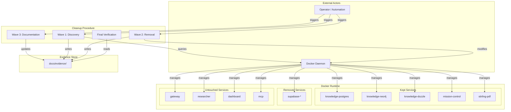
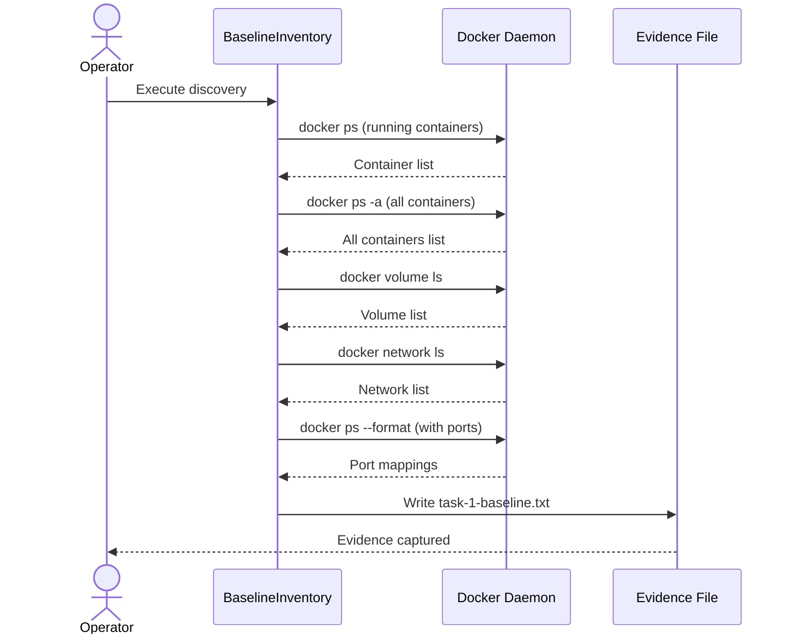
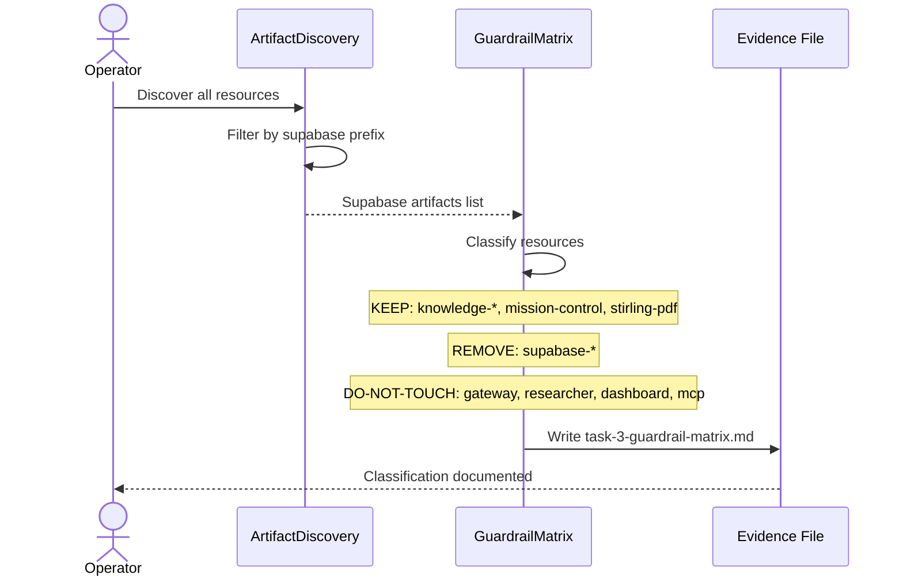
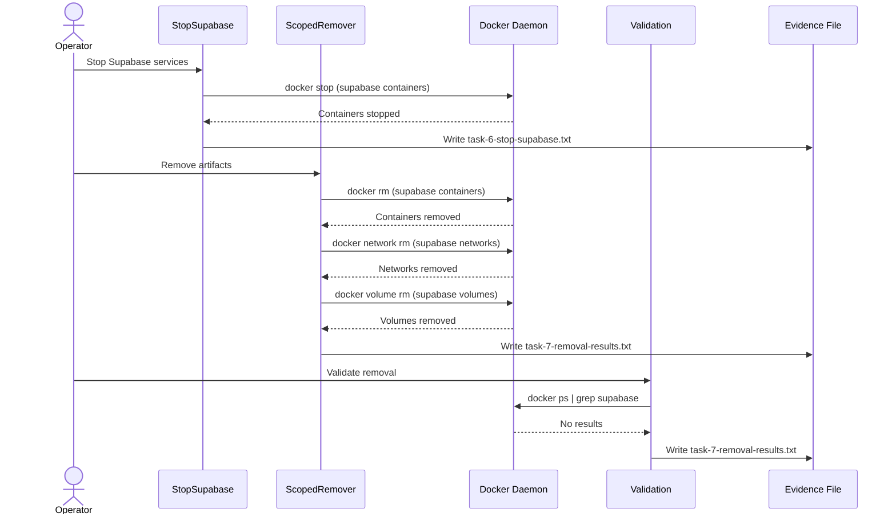
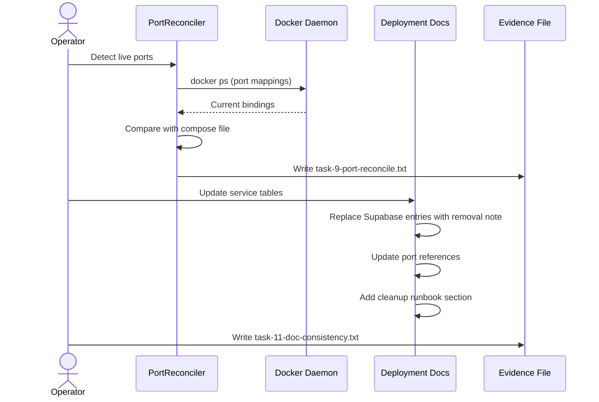

# Solution Architecture: Docker Cleanup for Single-Memory Architecture

> [!NOTE]
> **AI-Assisted Documentation**
> Portions of this document were drafted with the assistance of an AI language model.
> Content has not yet been fully reviewed. This is a working design reference, not a final specification.
> AI-generated content may contain inaccuracies or omissions.
> When in doubt, defer to the source code, JSON schemas, and team consensus.

This document covers the topology of the Docker cleanup operation: how the operator interfaces with the system, how waves of tasks execute, and how architectural decisions shape the interaction patterns for safe infrastructure removal.

---

## Table of Contents

- [1. Architectural Positioning](#1-architectural-positioning)
- [2. System Boundary and External Actors](#2-system-boundary-and-external-actors)
- [3. Logical Topologies](#3-logical-topologies)
  - [3.1 Discovery and Baseline Capture](#31-discovery-and-baseline-capture)
  - [3.2 Guardrail Classification](#32-guardrail-classification)
  - [3.3 Scoped Removal Execution](#33-scoped-removal-execution)
  - [3.4 Documentation Reconciliation](#34-documentation-reconciliation)
- [4. Interface Catalogue](#4-interface-catalogue)
- [5. Risk-Architecture Traceability](#5-risk-architecture-traceability)
- [6. Key Architectural Constraints](#6-key-architectural-constraints)
- [7. References](#7-references)

---

## 1. Architectural Positioning

The Docker cleanup is an **operational maintenance task** that modifies the runtime infrastructure state. It is not a control plane or data plane service, but rather a controlled procedure executed by an operator (or automation acting on behalf of an operator).

**Role:** Infrastructure hygiene and consolidation  
**Authority:** Modifies Docker runtime state (containers, networks, volumes)  
**Consumer:** System operator / automation scripts  
**Interaction Frequency:** One-time cleanup with potential for repeat runs

| Consumer Class | Interaction Mode | Notes |
|---|---|---|
| System Operator | CLI / Script-driven | Executes cleanup waves via Docker CLI commands |
| Automation Agent | Script-driven | Can execute verification commands autonomously |
| Runtime Services | Passive | Services being kept or removed do not actively participate |

---

## 2. System Boundary and External Actors

---

## 3. Logical Topologies

Each topology represents a distinct interaction pattern for the cleanup operation.

### 3.1 Discovery and Baseline Capture

**Purpose:** Capture complete pre-cleanup state for rollback reference and verification baseline.

**Key constraints:**
- Read-only queries; no modification of runtime state
- All output saved to evidence files before proceeding
- Must capture both running and stopped containers

---

### 3.2 Guardrail Classification

**Purpose:** Explicitly classify every discovered resource to prevent accidental removal.

**Key constraints:**
- Every resource must have explicit classification
- Rationale must be documented for each decision
- Ambiguous resources default to DO-NOT-TOUCH pending approval

---

### 3.3 Scoped Removal Execution

**Purpose:** Remove Supabase artifacts while protecting kept services.

**Key constraints:**
- Stop before remove (clean shutdown)
- Verify keep-services still running after each phase
- Never use wildcard or bulk delete commands
- Halt immediately on unexpected state change

---

### 3.4 Documentation Reconciliation

**Purpose:** Align deployment documentation with actual post-cleanup runtime state.

**Key constraints:**
- Document actual detected ports, not assumed values
- Note any compose-vs-runtime discrepancies explicitly
- Include handoff note for operators

---

## 4. Interface Catalogue

| Interface | Direction | Channel | Payload / Contract | Risk / Decision |
|---|---|---|---|---|
| Docker Daemon | Bidirectional | Docker API / CLI | Container/network/volume operations | RK-01 (Accidental removal) |
| Evidence Files | Outbound | Filesystem | Command output, health status | RK-03 (Missing audit trail) |
| Deployment Docs | Outbound | Markdown files | Updated service tables, runbook | RK-02 (Doc drift) |
| Health Endpoints | Inbound | HTTP / TCP | Status codes, ready checks | RK-04 (Health regression) |

---

## 5. Risk-Architecture Traceability

| Section | Risks and Decisions Addressed |
|---|---|
| §3.1 Discovery and Baseline Capture | RK-03 (Missing evidence), AD-01 (Evidence-first approach) |
| §3.2 Guardrail Classification | RK-01 (Accidental removal), AD-02 (Explicit classification) |
| §3.3 Scoped Removal Execution | RK-01 (Accidental removal), RK-04 (Health regression) |
| §3.4 Documentation Reconciliation | RK-02 (Doc drift), AD-03 (Runtime-verified documentation) |

---

## 6. Key Architectural Constraints

| Constraint | Rationale |
|---|---|
| **MUST** capture evidence before any modification | Provides rollback reference and audit trail (AD-01) |
| **MUST** classify every resource before removal | Prevents accidental deletion of services (AD-02, RK-01) |
| **MUST NOT** use broad destructive commands (`docker system prune -a`) | Avoids collateral damage to untargeted services (RK-01) |
| **MUST** verify keep-services health after each removal phase | Detects unintended side effects immediately (RK-04) |
| **MUST** document actual runtime ports, not assumed values | Prevents documentation drift from reality (AD-03, RK-02) |
| **MUST** halt on any health regression | Protects operational continuity (RK-04) |

---

## 7. References

- [BLUEPRINT.md](./BLUEPRINT.md) — Core design, requirements, data model, execution rules
- [RISKS-AND-DECISIONS.md](./RISKS-AND-DECISIONS.md) — Architectural decisions and risk mitigations
- [REQUIREMENTS-MATRIX.md](./REQUIREMENTS-MATRIX.md) — Requirement traceability
- [DATA-DICTIONARY.md](./DATA-DICTIONARY.md) — Canonical field definitions
- [TASKS.md](./TASKS.md) — Implementation task plan with waves and dependencies
