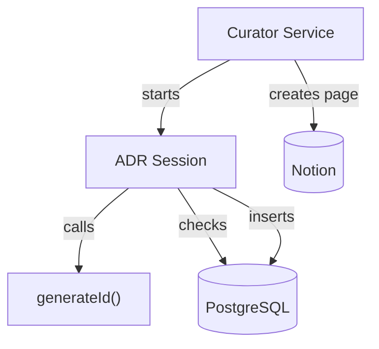
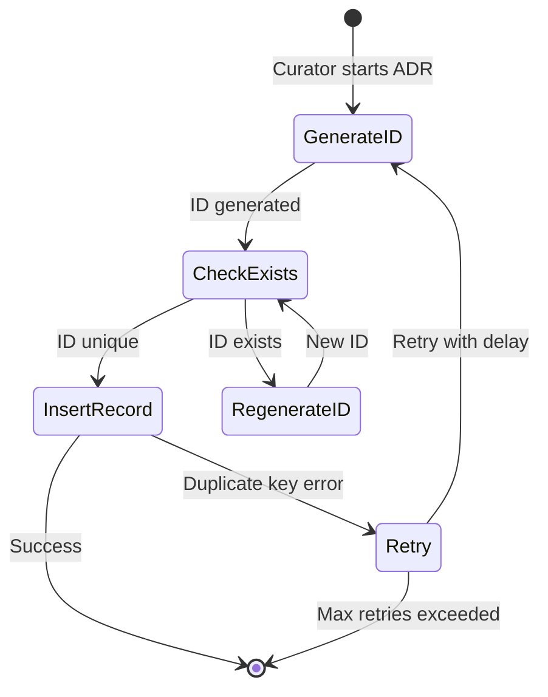
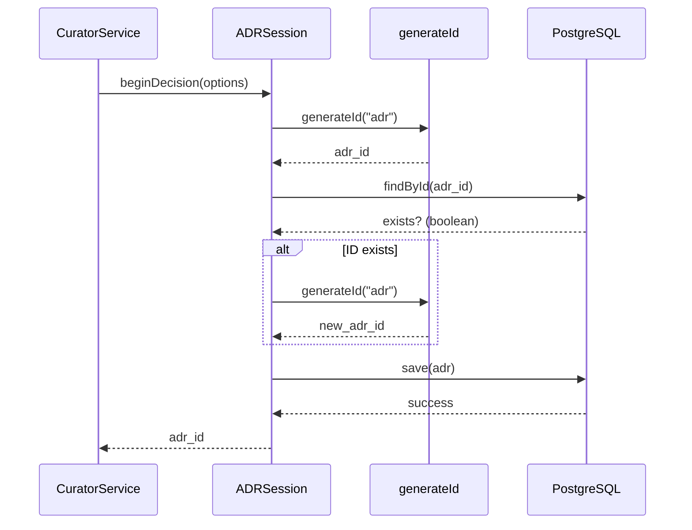

# Fix ADR Duplicate Key Issue: Blueprint

> [!NOTE]
> **AI-Assisted Documentation**
> Portions of this document were drafted with the assistance of an AI language model.
> Content has not yet been fully reviewed. This is a working design reference, not a final specification.
> AI-generated content may contain inaccuracies or omissions.
> When in doubt, defer to the source code, JSON schemas, and team consensus.

---

## Table of Contents

- [1) Core Concepts](#1-core-concepts)
- [2) Requirements](#2-requirements)
- [3) Architecture](#3-architecture)
- [4) Diagrams](#4-diagrams)
- [5) Data Model](#5-data-model)
- [6) Execution Rules](#6-execution-rules)
- [7) Global Constraints](#7-global-constraints)
- [8) References](#8-references)

---

## 1) Core Concepts

### Agent Decision Record (ADR)

An ADR is a 5-layer decision log that captures why an agent took a particular action. ADRs provide audit trails for compliance and debugging. Each ADR has a unique `adr_id` that serves as its primary key in PostgreSQL.

**Key fields:**
- `adr_id`: Unique identifier in format `adr_<random>_<timestamp>`
- `session_id`: The agent session this decision belongs to
- `action`: What action was taken
- `context`: Decision context and reasoning
- `created_at`: Timestamp of the decision

---

### Curator Agent

The Curator Agent runs the knowledge promotion pipeline, moving insights from raw traces to curated knowledge. It logs ADRs during its execution to maintain an audit trail of its decisions.

**Responsibilities:**
- Process pending insights
- Create Notion pages for human review
- Log ADRs to PostgreSQL
- Complete full pipeline without errors

---

### ADR ID Generation

The `generateId("adr")` function creates unique identifiers for ADRs. Collision occurs when:
1. Multiple calls happen within the same millisecond
2. The random component produces the same value
3. Parallel execution creates race conditions

---

## 2) Requirements

### Business Requirements

| # | Requirement |
|----|-------------|
| B1 | ADR logging must not fail with duplicate key errors |
| B2 | Each ADR must have unique `adr_id` per database constraint |
| B3 | Curator must complete full pipeline without ADR errors |

---

### Functional Requirements

| # | Requirement |
|----|-------------|
| F1 | `generateId()` must produce statistically unique IDs across 1000 sequential calls |
| F2 | `beginDecision()` must check ID uniqueness before inserting to PostgreSQL |
| F3 | ADR logging must implement retry logic with bounded attempts on duplicate key errors |
| F4 | ID generation must include additional entropy (microsecond, process ID, or counter) |
| F5 | Existing ADRs must remain accessible after the fix |
| F6 | Retry attempts must be logged for debugging purposes |

---

## 3) Architecture

### Components

| Component | Responsibility | Location |
|-----------|---------------|----------|
| `generateId()` | Generate unique identifiers with entropy | `src/lib/adr/types.ts` |
| `ADRSession.beginDecision()` | Start ADR session, check ID uniqueness | `src/lib/adr/capture.ts` |
| `ADRStorage.save()` | Persist ADR to PostgreSQL | `src/lib/adr/capture.ts` |
| `ADRStorage.findById()` | Check if ID already exists | `src/lib/adr/capture.ts` |
| `CuratorService` | Orchestrate ADR creation during pipeline | `src/curator/curator.service.ts` |

---

## 4) Diagrams

### Component Overview

### ID Generation State Machine

### ADR Creation Flow

---

## 5) Data Model

### `agent_decision_records`

PostgreSQL table storing ADR entries. Has unique constraint on `adr_id`.

| Field | Type | Required | Description |
|-------|------|----------|-------------|
| `adr_id` | varchar(255) | Yes | Unique ADR identifier (PK) |
| `session_id` | varchar(255) | Yes | Parent session identifier |
| `action` | text | Yes | Action taken by agent |
| `context` | jsonb | Yes | Decision context and reasoning |
| `created_at` | timestamp | Yes | Creation timestamp |

**Constraints:**
- `agent_decision_records_adr_id_key` - Unique constraint on `adr_id`

---

## 6) Execution Rules

### ID Generation

1. Generate ID with format: `adr_<random>_<timestamp>_<counter>`
2. Include a module-level counter for additional entropy
3. Counter increments on each `generateId()` call
4. Reset counter periodically to prevent overflow

### Uniqueness Check

1. Before `storage.save()`, call `storage.findById(adr_id)`
2. If ID exists, regenerate and retry
3. Maximum 3 attempts before throwing error
4. Log each retry attempt with warning level

### Retry Logic

1. Catch `duplicate key value violates unique constraint` error
2. Wait 10ms before retry
3. Regenerate ID and retry insert
4. Maximum 3 retries before failing

---

## 7) Global Constraints

### MUST

- **C1**: Preserve existing `agent_decision_records` table schema
- **C2**: Maintain backward compatibility with existing ADR ID format
- **C3**: Retry logic must not infinite loop (bounded attempts)
- **C4**: Log retry attempts for debugging

### MUST NOT

- **C5**: Do NOT disable the unique constraint (data integrity risk)
- **C6**: Do NOT use UUIDs (breaks existing ID format convention)

---

## 8) References

### Source Files

- `src/lib/adr/types.ts` - ID generation
- `src/lib/adr/capture.ts` - ADR capture and storage
- `src/curator/curator.service.ts` - Curator integration

### Related Documents

- [SOLUTION-ARCHITECTURE.md](SOLUTION-ARCHITECTURE.md) - System topology
- [REQUIREMENTS-MATRIX.md](REQUIREMENTS-MATRIX.md) - Requirement traceability
- [RISKS-AND-DECISIONS.md](RISKS-AND-DECISIONS.md) - ADs and risk register
- [TASKS.md](TASKS.md) - Implementation tasks
