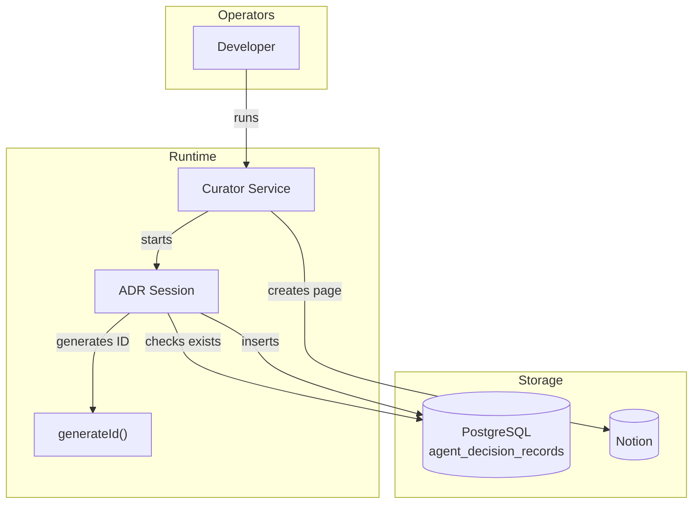
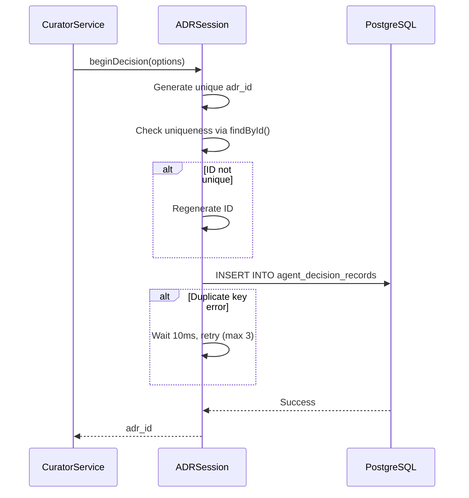
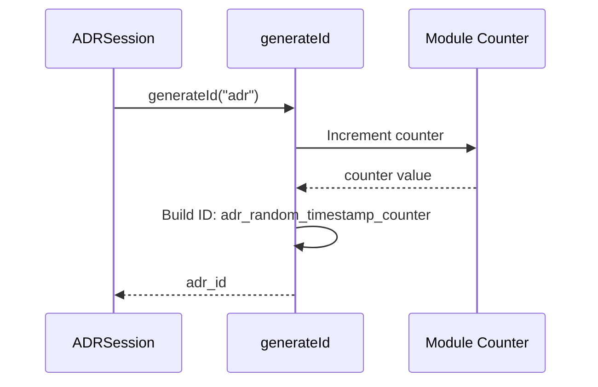

# Fix ADR Duplicate Key Issue: Solution Architecture

> [!NOTE]
> **AI-Assisted Documentation**
> Portions of this document were drafted with the assistance of an AI language model.
> Content has not yet been fully reviewed. This is a working design reference, not a final specification.
> AI-generated content may contain inaccuracies or omissions.
> When in doubt, defer to the source code, JSON schemas, and team consensus.

---

## Table of Contents

- [1. Architectural Positioning](#1-architectural-positioning)
- [2. System Boundary and External Actors](#2-system-boundary-and-external-actors)
- [3. Logical Topologies](#3-logical-topologies)
  - [3.1 ADR Creation Path](#31-adr-creation-path)
  - [3.2 ID Generation Path](#32-id-generation-path)
- [4. Interface Catalogue](#4-interface-catalogue)
- [5. Risk-Architecture Traceability](#5-risk-architecture-traceability)
- [6. Key Architectural Constraints](#6-key-architectural-constraints)
- [7. References](#7-references)

---

## 1. Architectural Positioning

| Attribute | Value |
|-----------|-------|
| **Role** | Fix for data integrity issue in ADR logging layer |
| **Authoritative state** | PostgreSQL (`agent_decision_records` table) |
| **Operators** | Curator Agent (automated), Developer (manual verification) |
| **Consumes** | PostgreSQL (state check), Notion API (page creation) |
| **Produces** | Unique ADR entries without duplicate key violations |

---

## 2. System Boundary and External Actors

---

## 3. Logical Topologies

### 3.1 ADR Creation Path

**Actor:** Curator Service  
**Trigger:** Curator processes an insight and needs to log a decision  
**Frequency:** Once per insight during curator run

**Key constraints:**
- Uniqueness check before insert prevents most collisions
- Retry logic handles edge case race conditions
- Maximum 3 retries to prevent infinite loops

---

### 3.2 ID Generation Path

**Actor:** ADRSession via generateId()  
**Trigger:** Need for new ADR identifier  
**Frequency:** Multiple times per curator run

**Key constraints:**
- Counter provides monotonic increment within process
- Timestamp provides millisecond-level uniqueness
- Random component provides cross-process uniqueness

---

## 4. Interface Catalogue

| Interface | Direction | Channel | Payload / Contract | Notes |
|---|---|---|---|---|
| PostgreSQL | Outbound | pg protocol | `SELECT` for `findById`, `INSERT` for `save` | Unique constraint on `adr_id` |
| Notion API | Outbound | HTTPS REST | Page creation for HITL review | Called after ADR insert succeeds |

---

## 5. Risk-Architecture Traceability

| Section | Risks and Decisions Addressed |
|---|---|
| §3.1 ADR Creation Path | RK-01 (ID collision), RK-02 (Race condition), AD-01 (Uniqueness check pattern) |
| §3.2 ID Generation Path | AD-02 (Entropy strategy) |

---

## 6. Key Architectural Constraints

| Constraint | Rationale |
|---|---|
| ID check MUST query PostgreSQL before insert | Prevents collision in single-threaded path |
| Retry logic MUST have maximum attempts | Prevents infinite loops on persistent errors |
| Counter MUST be module-level singleton | Provides monotonic increment within process |
| Existing ADR IDs MUST remain valid | Backward compatibility requirement |

---

## 7. References

- [BLUEPRINT.md](BLUEPRINT.md) - Core concepts, requirements, data model
- [REQUIREMENTS-MATRIX.md](REQUIREMENTS-MATRIX.md) - Business and functional requirements
- [RISKS-AND-DECISIONS.md](RISKS-AND-DECISIONS.md) - Architectural decisions and risks
- [TASKS.md](TASKS.md) - Implementation tasks
