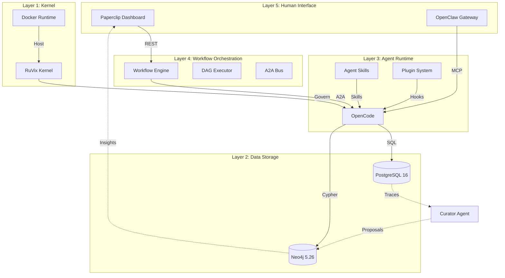
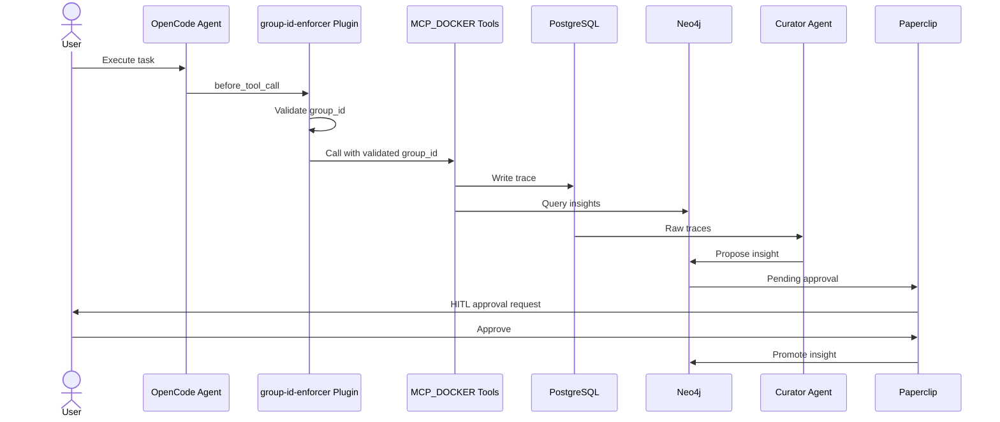

# Allura Agent-OS

> [!NOTE]
> **AI-Assisted Documentation**
> Portions of this document were drafted with the assistance of an AI language model (GitHub Copilot).
> Content has been reviewed against repository guidance files and should be kept in sync with source-of-truth docs.
> When in doubt, defer to `_bmad-output/planning-artifacts/source-of-truth.md`.

**Version:** 2.0  
**Status:** Canon Lock — April 2026  
**Maintainer:** Winston (MemoryArchitect)  
**Rule:** Allura governs. Runtimes execute. Curators promote.

---

## Table of Contents

- [1. Blueprint (Core Concepts & Scope)](#1-blueprint-core-concepts--scope)
- [2. Requirements Matrix](#2-requirements-matrix)
- [3. Solution Architecture](#3-solution-architecture)
- [4. Data Dictionary](#4-data-dictionary)
- [5. Risks and Decisions](#5-risks-and-decisions)
- [6. Implementation Tasks](#6-implementation-tasks)

---

## 1. Blueprint (Core Concepts & Scope)

### Summary

**Allura Agent-OS** solves the fundamental problem that modern agentic systems start every session from zero. It provides:

- A persistent, bitemporal memory graph (roninmemory)
- A governed execution environment (RuVix Kernel)
- A multi-tenant workspace isolation model (`group_id`)
- A human-in-the-loop approval layer (Aegis + Paperclip)
- A self-hosted human communication gateway (OpenClaw)

---

### Domain Entities

#### Entity: Agent

**States:** idle | analyzing | executing | completed | failed

**Key Fields:**
- `id`: uuid — Unique identifier
- `name`: string — Agent identifier (e.g., "memory-orchestrator")
- `display_name`: string — Human-readable name (e.g., "MemoryOrchestrator")
- `title`: string — Formal position (e.g., "Primary Orchestrator")
- `role`: string — Capabilities summary
- `identity`: text — Background and specialization
- `communication_style`: text — How they communicate
- `principles`: text[] — Decision-making philosophy
- `group_id`: string — Tenant namespace (allura-*)
- `status`: enum — idle | analyzing | executing | completed | failed
- `created_at`: timestamp
- `updated_at`: timestamp

---

#### Entity: Session

**States:** initialized | active | paused | completed | failed

**Key Fields:**
- `id`: uuid — Unique identifier
- `agent_id`: uuid — Reference to Agent
- `group_id`: string — Tenant namespace (allura-*)
- `context`: jsonb — Session context
- `status`: enum — initialized | active | paused | completed | failed
- `started_at`: timestamp
- `ended_at`: timestamp
- `created_at`: timestamp

---

#### Entity: Event

**States:** pending | processed | failed | archived

**Key Fields:**
- `id`: uuid — Unique identifier
- `session_id`: uuid — Reference to Session
- `agent_id`: uuid — Reference to Agent
- `group_id`: string — Tenant namespace (allura-*)
- `event_type`: string — Type of event (command, trace, insight)
- `context`: text — Event context/description
- `payload`: jsonb — Event data
- `status`: enum — pending | processed | failed | archived
- `timestamp`: timestamp

---

#### Entity: Insight (Neo4j)

**States:** proposed | reviewed | approved | rejected | superseded

**Key Fields:**
- `name`: string — Unique identifier
- `type`: enum — Decision | Insight | Pattern | Risk
- `observations`: string[] — Key points
- `relationships`: string[] — Related entities
- `group_id`: string — Tenant namespace (allura-*)
- `status`: enum — proposed | reviewed | approved | rejected | superseded
- `created_at`: timestamp

---

### Workspaces (Multi-Tenant)

| Workspace | `group_id` | Type | Priority | Notes |
|-----------|------------|------|----------|-------|
| 🥩 Faith Meats | `allura-faith-meats` | For-profit | P1 | Payload CMS + Next.js + HACCP |
| 🎨 Creative Studio | `allura-creative` | For-profit | P2 | Content + branding agents |
| 👤 Personal Assistant | `allura-personal` | For-profit | P2 | Daily ops, scheduling |
| 🏛️ Nonprofit | `allura-nonprofit` | Nonprofit | P3 | 501(c)(3) — different privilege rules |
| 🏦 Bank Audits | `allura-audits` | For-profit | P3 | GLBA data — most restricted |
| 🌡️ HACCP | `allura-haccp` | For-profit | P3 | Food safety monitoring |

**Privilege Note:** The nonprofit workspace has no GLBA exposure and different data handling rules.

---

## 2. Requirements Matrix

### 2.1 Business Requirements

| # | Requirement | Functional Requirements | Status |
|---|-------------|------------------------|--------|
| B1 | Operators can view curated memory through Paperclip dashboard | F1–F3 | 🔴 Pending |
| B2 | Curators propose insights from PostgreSQL traces to Neo4j | F4–F6 | 🔴 Pending |
| B3 | Multi-tenant isolation prevents cross-workspace data leakage | F7–F9 | 🟡 In Progress |
| B4 | Human approval required for all behavior-changing promotions | F10–F12 | 🔴 Pending |
| B5 | All execution runs in Docker — never local | F13–F15 | 🟡 Partial |
| B6 | Agents accumulate institutional knowledge across sessions | F16–F18 | 🔴 Pending |
| B7 | Every agent action is auditable and replayable | F19–F21 | 🔴 Pending |
| B8 | System must be self-hostable (no cloud lock-in) | F22–F24 | ✅ Done |
| B9 | Faith Meats CMS live on Payload + Next.js | F25–F27 | 🔴 Pending |
| B10 | OpenCode drives all agent development | F28–F30 | ✅ Done |
| B11 | Bank auditor workflow operational (mortgage audit automation) | F31–F33 | 🔴 Pending |
| B12 | HACCP compliance monitoring for food safety | F34–F36 | 🔴 Pending |
| B13 | GLBA-compliant data handling for bank audits | F37–F39 | 🔴 Pending |
| B14 | Curators sift PostgreSQL traces to propose Neo4j insights | F40–F42 | 🔴 Pending |
| B15 | Auditors approve via HITL before promotion | F43–F45 | 🔴 Pending |
| B16 | OpenClaw provides human communication gateway | F46–F48 | 🔴 Pending |

---

### 2.2 Functional Requirements

#### Domain: Memory System (F1–F9)

| # | Requirement | Satisfied By | Status |
|---|-------------|--------------|--------|
| <a name="f1"></a>F1 | `POST /v1/memory/search` accepts query with `group_id` | `src/app/api/memory/search/route.ts` | ✅ Done |
| <a name="f2"></a>F2 | `GET /v1/memory/insights` returns curated insights for workspace | `src/app/api/memory/insights/route.ts` | ✅ Done |
| <a name="f3"></a>F3 | Paperclip dashboard displays insights with HITL approval queue | `ux-specs/paperclip-dashboard.md` | 🔴 Pending |
| <a name="f4"></a>F4 | Curator Agent analyzes PostgreSQL traces | `src/lib/adas/search-loop.ts` | ✅ Done |
| <a name="f5"></a>F5 | Curator proposes insights to Neo4j with metadata | `src/lib/adas/promotion-proposal.ts` | ✅ Done |
| <a name="f6"></a>F6 | Curator tags insights with `group_id` and lineage | Neo4j relationships | 🟡 Partial |
| <a name="f7"></a>F7 | `groupIdEnforcer` validates `group_id` on all writes | `src/lib/runtime/groupIdEnforcer.ts` | ✅ Done |
| <a name="f8"></a>F8 | MCP_DOCKER tools receive validated `group_id` | `src/lib/mcp/enforced-client.ts` | ✅ Done |
| <a name="f9"></a>F9 | OpenCode plugin validates `group_id` before tool execution | `.opencode/plugin/group-id-enforcer.ts` | ✅ Done |

#### Domain: Tenant Isolation (F10–F18)

| # | Requirement | Satisfied By | Status |
|---|-------------|--------------|--------|
| <a name="f10"></a>F10 | BehaviorSpec.yaml defines workspace constraints | `behavior-specs/*.yaml` | 🟡 Partial |
| <a name="f11"></a>F11 | `validateBehavior` checks constraints before execution | `src/lib/validation/behavior-spec.ts` | 🔴 Pending |
| <a name="f12"></a>F12 | Violations are logged and rejected | PostgreSQL `violations` table | 🔴 Pending |
| <a name="f13"></a>F13 | Docker containers run in isolated namespaces | Docker Compose | ✅ Done |
| <a name="f14"></a>F14 | No local execution outside Docker | AGENTS.md enforcement | ✅ Done |
| <a name="f15"></a>F15 | OpenClaw runs on Ubuntu only | OpenClaw spec | 🟡 Partial |
| <a name="f16"></a>F16 | Session persistence via `envelope.json` + `steps.jsonl` | `src/lib/persistence/` | 🔴 Pending |
| <a name="f17"></a>F17 | Transcript compaction via Curator Agent | `src/lib/adas/transcript-compaction.ts` | 🔴 Pending |
| <a name="f18"></a>F18 | Neo4j stores versioned insights with SUPSEDES lineage | Neo4j graph | ✅ Done |

#### Domain: Audit & Replay (F19–F27)

| # | Requirement | Satisfied By | Status |
|---|-------------|--------------|--------|
| <a name="f19"></a>F19 | All commands logged to PostgreSQL `events` table | `src/lib/postgres/events.ts` | ✅ Done |
| <a name="f20"></a>F20 | Session traces stored with full context | `src/lib/postgres/traces.ts` | 🟡 Partial |
| <a name="f21"></a>F21 | Audit trail queryable by `group_id` + date range | PostgreSQL queries | ✅ Done |
| <a name="f22"></a>F22 | Self-hosted PostgreSQL | Docker | ✅ Done |
| <a name="f23"></a>F23 | Self-hosted Neo4j | Docker | ✅ Done |
| <a name="f24"></a>F24 | Self-hosted OpenCode | Docker | ✅ Done |
| <a name="f25"></a>F25 | Payload CMS integration | `faith-meats/payload.config.ts` | 🔴 Pending |
| <a name="f26"></a>F26 | Next.js frontend | `faith-meats/app/` | 🔴 Pending |
| <a name="f27"></a>F27 | HACCP monitoring dashboard | `ux-specs/haccp-dashboard.md` | 🔴 Pending |

#### Domain: Agent Framework (F28–F36)

| # | Requirement | Satisfied By | Status |
|---|-------------|--------------|--------|
| <a name="f28"></a>F28 | OpenCode plugin architecture | `.opencode/` directory | ✅ Done |
| <a name="f29"></a>F29 | Agent skills defined in SKILL.md | `.opencode/skills/` | ✅ Done |
| <a name="f30"></a>F30 | Plugin hooks for tool interception | `.opencode/plugin/` | ✅ Done |
| <a name="f31"></a>F31 | Bank auditor workflow defined | `epics.md` Epic 5 | 🔴 Pending |
| <a name="f32"></a>F32 | Mortgage audit automation | Bank auditor stories | 🔴 Pending |
| <a name="f33"></a>F33 | GLBA data handling compliance | BehaviorSpec | 🔴 Pending |
| <a name="f34"></a>F34 | HACCP temperature monitoring | Faith Meats agent | 🔴 Pending |
| <a name="f35"></a>F35 | Food safety alert system | Sentinel agent | 🔴 Pending |
| <a name="f36"></a>F36 | Compliance reporting | HACCP dashboard | 🔴 Pending |

#### Domain: HITL & Promotion (F37–F48)

| # | Requirement | Satisfied By | Status |
|---|-------------|--------------|--------|
| <a name="f37"></a>F37 | GLBA data encryption at rest | PostgreSQL encryption | 🔴 Pending |
| <a name="f38"></a>F38 | GLBA data access logging | Audit trails | 🔴 Pending |
| <a name="f39"></a>F39 | GLBA compliance reporting | Bank auditor dashboard | 🔴 Pending |
| <a name="f40"></a>F40 | Curator sifts PostgreSQL traces | Curator agent | 🟡 Partial |
| <a name="f41"></a>F41 | Curator identifies patterns | ADAS search-loop | ✅ Done |
| <a name="f42"></a>F42 | Curator proposes Neo4j insights | Promotion proposal | ✅ Done |
| <a name="f43"></a>F43 | Auditor reviews proposals | Paperclip approval queue | 🔴 Pending |
| <a name="f44"></a>F44 | Human approves/rejects | Paperclip HITL gate | 🔴 Pending |
| <a name="f45"></a>F45 | Approved insights promoted to Neo4j | Promotion workflow | 🟡 Partial |
| <a name="f46"></a>F46 | OpenClaw gateway exposes MCP tools | `src/mcp/openclaw-gateway.ts` | 🟡 Partial |
| <a name="f47"></a>F47 | OpenClaw validates permissions | Permission system | 🔴 Pending |
| <a name="f48"></a>F48 | OpenClaw streams structured events | Event streaming | 🔴 Pending |

---

## 3. Solution Architecture

### 3.1 5-Layer Architecture Model



---

### 3.2 Component Overview

| Layer | Component | Technology | Status |
|-------|-----------|------------|--------|
| L1 | RuVix Kernel | Custom | 🟡 Planned |
| L2 | PostgreSQL | PostgreSQL 16 | ✅ Done |
| L2 | Neo4j | Neo4j 5.26 + APOC | ✅ Done |
| L3 | Agent Runtime | OpenCode | ✅ Done |
| L3 | Agent Skills | SKILL.md | ✅ Done |
| L3 | Plugins | TypeScript | ✅ Done |
| L4 | Workflows | BMad | ✅ Done |
| L4 | A2A Bus | Custom | 🔴 Pending |
| L5 | Paperclip | Next.js | 🔴 Pending |
| L5 | OpenClaw | TypeScript | 🟡 Partial |

---

### 3.3 Data Flow



---

### 3.4 Interface Catalogue

| Interface | Direction | Channel | Payload | Status |
|-----------|-----------|---------|---------|--------|
| PostgreSQL | Outbound | SQL | Events, traces | ✅ Done |
| Neo4j | Outbound | Cypher | Insights, relationships | ✅ Done |
| MCP_DOCKER | Outbound | MCP | Tool calls with group_id | ✅ Done |
| OpenCode Plugin | Inbound | Hooks | Tool interception | ✅ Done |
| Paperclip API | Inbound | REST | Approval requests | 🔴 Pending |
| A2A Bus | Bidirectional | A2A Protocol | Agent messages | 🔴 Pending |
| OpenClaw | Inbound | MCP | Human interface | 🟡 Partial |

---

## 4. Data Dictionary

### 4.1 PostgreSQL Tables

#### Table: `events`

| Field | Type | Required | Description |
|-------|------|----------|-------------|
| `id` | uuid | Yes | Unique identifier |
| `session_id` | uuid | Yes | Reference to sessions |
| `agent_id` | uuid | Yes | Reference to agents |
| `group_id` | text | Yes | Tenant namespace (allura-*) |
| `event_type` | text | Yes | Type: command, trace, insight |
| `context` | text | No | Event description |
| `payload` | jsonb | No | Event data |
| `status` | text | Yes | pending, processed, failed, archived |
| `timestamp` | timestamptz | Yes | Event timestamp |
| `created_at` | timestamptz | Yes | Record creation |

**Indexes:**
- `idx_events_group_id` on `group_id`
- `idx_events_timestamp` on `timestamp`
- `idx_events_event_type` on `event_type`

---

#### Table: `sessions`

| Field | Type | Required | Description |
|-------|------|----------|-------------|
| `id` | uuid | Yes | Unique identifier |
| `agent_id` | uuid | Yes | Reference to agents |
| `group_id` | text | Yes | Tenant namespace (allura-*) |
| `context` | jsonb | No | Session context |
| `status` | text | Yes | initialized, active, paused, completed, failed |
| `started_at` | timestamptz | Yes | Session start |
| `ended_at` | timestamptz | No | Session end |
| `created_at` | timestamptz | Yes | Record creation |

**Indexes:**
- `idx_sessions_group_id` on `group_id`
- `idx_sessions_agent_id` on `agent_id`

---

#### Table: `agents`

| Field | Type | Required | Description |
|-------|------|----------|-------------|
| `id` | uuid | Yes | Unique identifier |
| `name` | text | Yes | Agent identifier |
| `display_name` | text | Yes | Human-readable name |
| `title` | text | Yes | Formal position |
| `role` | text | Yes | Capabilities summary |
| `identity` | text | No | Background and expertise |
| `communication_style` | text | No | Communication style |
| `principles` | text[] | No | Decision-making philosophy |
| `group_id` | text | Yes | Tenant namespace (allura-*) |
| `status` | text | Yes | idle, analyzing, executing, completed, failed |
| `created_at` | timestamptz | Yes | Record creation |
| `updated_at` | timestamptz | Yes | Last update |

**Indexes:**
- `idx_agents_group_id` on `group_id`
- `idx_agents_name` on `name` (unique)

---

#### Table: `traces`

| Field | Type | Required | Description |
|-------|------|----------|-------------|
| `id` | uuid | Yes | Unique identifier |
| `session_id` | uuid | Yes | Reference to sessions |
| `agent_id` | uuid | Yes | Reference to agents |
| `group_id` | text | Yes | Tenant namespace (all-ura-*) |
| `trace_type` | text | Yes | Type of trace |
| `payload` | jsonb | Yes | Trace data |
| `created_at` | timestamptz | Yes | Record creation |

**Indexes:**
- `idx_traces_group_id` on `group_id`
- `idx_traces_session_id` on `session_id`

---

### 4.2 Neo4j Graph Schema

#### Node: `Agent`

```cypher
CREATE (a:Agent {
  name: 'memory-orchestrator',
  displayName: 'MemoryOrchestrator',
  title: 'Primary Orchestrator',
  role: 'workflow coordination',
  groupId: 'allura-default'
})
```

**Properties:**
- `name` (string): Unique identifier
- `displayName` (string): Human-readable name
- `title` (string): Formal position
- `role` (string): Capabilities
- `groupId` (string): Tenant namespace

---

#### Node: `Decision`

```cypher
CREATE (d:Decision {
  name: 'AD-01: PostgreSQL for Events',
  type: 'Decision',
  status: 'Decided',
  groupId: 'allura-default'
})
```

**Properties:**
- `name` (string): Unique identifier (AD-##)
- `type` (string): Always "Decision"
- `status` (string): Decided, Proposed, Deferred
- `groupId` (string): Tenant namespace
- `observations` (string[]): Key points

---

#### Node: `Insight`

```cypher
CREATE (i:Insight {
  name: 'Pattern: Use EnforcedMcpClient',
  type: 'Pattern',
  groupId: 'allura-default'
})
```

**Properties:**
- `name` (string): Unique identifier
- `type` (string): Pattern, Risk, Decision
- `groupId` (string): Tenant namespace
- `observations` (string[]): Key learnings

---

#### Relationship: `SUPERSEDES`

```cypher
MATCH (old:Decision), (new:Decision)
WHERE old.name = 'AD-01-old' AND new.name = 'AD-01-new'
CREATE (new)-[:SUPERSEDES {date: '2026-04-05'}]->(old)
```

**Properties:**
- `date` (date): When supersession occurred

---

#### Relationship: `KNOWS`

```cypher
MATCH (a:Agent), (b:Agent)
WHERE a.name = 'memory-orchestrator' AND b.name = 'memory-architect'
CREATE (a)-[:KNOWS {strength: 'high'}]->(b)
```

**Properties:**
- `strength` (string): low, medium, high

---

#### Relationship: `CONTRIBUTES`

```cypher
MATCH (s:Session), (i:Insight)
WHERE s.id = 'session-uuid' AND i.name = 'Pattern'
CREATE (s)-[:CONTRIBUTES {date: '2026-04-05'}]->(i)
```

**Properties:**
- `date` (date): Contribution timestamp

---

## 5. Risks and Decisions

### 5.1 Architectural Decisions (AD)

| ID | Decision | Status | Section |
|----|----------|--------|---------|
| AD-01 | Use PostgreSQL for raw events, Neo4j for curated knowledge | ✅ Decided | §4 Data Dictionary |
| AD-02 | 5-layer architecture (RuVix, Data, Runtime, Workflow, Interface) | ✅ Decided | §3 Solution Architecture |
| AD-03 | Template-based documentation standard (PROJECT.md) | ✅ Decided | §1 Blueprint |
| AD-04 | `allura-*` tenant namespace | ✅ Decided | §1 Workspaces |
| AD-05 | Bun-only package strategy (no npm/npx) | ✅ Decided | techContext.md |
| AD-06 | MCP_DOCKER for external tool integration | ✅ Decided | §3 Interface Catalogue |
| AD-07 | OpenCode plugin hooks for group_id enforcement | ✅ Decided | §2 F28–F30 |
| AD-08 | ADAS Meta-Agent for evolutionary improvement | ✅ Decided | §2 F4–F6 |
| AD-09 | HITL approval for knowledge promotion | 🟡 In Progress | §2 F43–F45 |
| AD-10 | Self-hosted infrastructure (no cloud lock-in) | ✅ Decided | §2 F22–F24 |
| AD-11 | Agent skills defined in SKILL.md format | ✅ Decided | §2 F29 |
| AD-12 | Dual-context queries (project + global scope) | 🟡 Partial | §4 Neo4j |
| AD-13 | Transcript compaction via Curator Agent | 🔴 Pending | §2 F17 |
| AD-14 | Structured streaming events (typed, not raw text) | 🔴 Pending | §2 F48 |
| AD-15 | Token budget pre-turn checks | 🔴 Pending | §3 L3 |
| AD-16 | Six Agent Types (Constrained Roles) | 🔴 Pending | planning-artifacts/agent-primitives.md |

---

### 5.2 Risks (RK)

| ID | Risk | Mitigation | Status |
|----|------|------------|--------|
| RK-01 | `groupIdEnforcer` broken - blocks multi-tenant features | ✅ Fixed - wired into all layers | ✅ Resolved |
| RK-02 | ARCH-001 critical blocker | ✅ Resolved - groupIdEnforcer integrated | ✅ Resolved |
| RK-03 | WorkflowState not implemented | Spec created, needs implementation | 🟡 Mitigated |
| RK-04 | BehaviorSpec partial (1/6) | Specs created for all 6 workspaces | 🟡 Mitigated |
| RK-05 | 12 Agent Primitives not implemented | Spec created, deferred to Epic 3+ | 🟡 Accepted |
| RK-06 | Paperclip Dashboard not implemented | UX spec done, needs frontend | 🔴 Open |
| RK-07 | OpenClaw Gateway stub missing features | Needs groupIdEnforcer wiring | 🟡 Partial |
| RK-08 | Session persistence not implemented | Spec created, needs implementation | 🟡 Mitigated |
| RK-09 | PII in memory logs | Validation at boundaries | 🟡 Mitigated |
| RK-10 | Cloud lock-in risk | Self-hosted infrastructure | ✅ Mitigated |

---

## 6. Implementation Tasks

### 6.1 Epic Breakdown

#### Epic 1: Persistent Knowledge Capture and Tenant-Aware Memory

**Status:** In Progress  
**Blocker:** RK-02 ✅ RESOLVED

| Story | Description | Status | Owner |
|-------|-------------|--------|-------|
| 1.1 | Record Raw Execution Traces | 🟡 Ready for dev | MemoryBuilder |
| 1.2 | Session Persistence Layer | 🔴 Backlog | - |
| 1.3 | Transcript Compaction | 🔴 Backlog | - |
| 1.4 | Curator Agent Implementation | 🟡 Partial | MemoryCurator |
| 1.5 | PostgreSQL --> Neo4j Sync | 🔴 Backlog | - |
| 1.6 | HITL Approval Workflow | 🔴 Backlog | - |
| 1.7 | Audit Trail Query Interface | 🔴 Backlog | - |

---

#### Epic 2: Plugin Architecture (Complete ✅)

**Status:** ✅ COMPLETED

| Story | Description | Status |
|-------|-------------|--------|
| 2.1 | OpenCode Plugin Architecture | ✅ Done |
| 2.2 | Claude Code Plugin | ✅ Done |
| 2.3 | OpenClaw Plugin Spec | ✅ Done |
| 2.4 | Bun-Only Security Strategy | ✅ Done |

---

#### Epic 3: Agent Primitives (Deferred)

**Status:** 🔴 Deferred to Phase 3

| Story | Description | Status |
|-------|-------------|--------|
| 3.1 | Tool Registry | 🔴 Pending |
| 3.2 | Permission System | 🔴 Pending |
| 3.3 | Session Persistence | 🟡 Spec done |
| 3.4 | Workflow State | 🟡 Spec done |
| 3.5 | Token Budget | 🔴 Pending |
| 3.6 | Structured Streaming | 🔴 Pending |
| 3.7 | System Event Logging | ✅ Done |
| 3.8 | Two-Level Verification | 🔴 Pending |
| 3.9 | Dynamic Tool Pool | 🔴 Pending |
| 3.10 | Transcript Compaction | 🟡 Partial |
| 3.11 | Permission Audit Trail | 🔴 Pending |
| 3.12 | Six Agent Types | 🔴 Pending |

---

#### Epic 4: Paperclip Dashboard

**Status:** 🔴 Not Started

| Story | Description | Status |
|-------|-------------|--------|
| 4.1 | HITL Approval Queue UI | 🔴 Pending |
| 4.2 | Token Budget Monitoring | 🔴 Pending |
| 4.3 | Agent Spawn Interface | 🔴 Pending |
| 4.4 | Audit Log Viewer | 🔴 Pending |

---

#### Epic 5: Workspaces

**Status:** 🟡 Partial

| Story | Description | Workspace | Status |
|-------|-------------|-----------|--------|
| 5.1 | Faith Meats CMS | allura-faith-meats | 🔴 Pending |
| 5.2 | Creative Studio | allura-creative | 🔴 Pending |
| 5.3 | Personal Assistant | allura-personal | 🔴 Pending |
| 5.4 | Nonprofit | allura-nonprofit | 🔴 Pending |
| 5.5 | Bank Audits | allura-audits | 🔴 Pending |
| 5.6 | HACCP | allura-haccp | 🔴 Pending |

---

### 6.2 Current Sprint Tasks

**Sprint:** April 2026 — Epic 1 Focus

- [ ] Implement Story 1.1 (Record Raw Execution Traces)
- [ ] Wire groupIdEnforcer into remaining API routes
- [ ] Create epic-build-loop skill for autonomous execution
- [ ] Update source-of-truth.md with template registry
- [ ] Archive superseded documents
- [ ] Begin Story 1.4 (Curator Agent) — Phase 2

---

## References

- [Source of Truth](../_bmad-output/planning-artifacts/source-of-truth.md)
- [Architectural Brief](../_bmad-output/planning-artifacts/architectural-brief.md)
- [Solution Architecture](../_bmad-output/implementation-artifacts/solution-architecture.md)
- [Epics](../_bmad-output/planning-artifacts/epics.md)
- [Agent Primitives](../_bmad-output/planning-artifacts/agent-primitives.md)
- [Workflow State Spec](../_bmad-output/implementation-artifacts/workflow-state-spec.md)

---

## Appendix A: Template Standardization Transformation

### A.1 Problem Statement

**Current:** BMad produces 8+ separate files:
- `prd-v2.md`, `architectural-brief.md`, `architectural-decisions.md`
- `requirements-matrix.md`, `epics.md`, `solution-architecture.md`
- `data-dictionary.md`, `ux-specs/*.md`

**Issues:** Context loss, sync drift, navigation overhead, inconsistent AI disclosure

**Solution:** Single PROJECT.md with 6 sections (consolidated above)

### A.2 Template Mapping

| Current File | PROJECT.md Section |
|--------------|-------------------|
| `prd-v2.md` | §2 Requirements Matrix |
| `architectural-brief.md` | §1 Blueprint + §3 Architecture |
| `architectural-decisions.md` | §5 Risks and Decisions |
| `requirements-matrix.md` | §2 Requirements Matrix |
| `data-dictionary.md` | §4 Data Dictionary |
| `solution-architecture.md` | §3 Solution Architecture |
| `epics.md` | §6 Implementation Tasks |

### A.3 Migration Phases

**Phase 1:** Configuration alignment (template-registry.yaml)
**Phase 2:** Skill updates (bmad-create-prd, bmad-init)
**Phase 3:** Document migration (this consolidation)
**Phase 4:** Naming cleanup (roninclaw-* → allura-*)

### A.4 Configuration Additions

```yaml
# _bmad/_config/template-registry.yaml
templates:
  project: "{project-root}/templates/PROJECT.template.md"
  blueprint: "{project-root}/templates/BLUEPRINT.template.md"
  requirements: "{project-root}/templates/REQUIREMENTS-MATRIX.template.md"

ai_disclosure:
  required: true

governance:
  canon_hierarchy:
    - source: "Notion"
      precedence: 1
    - source: "_bmad-output/planning-artifacts/"
      precedence: 2
```

### A.5 Skills Auto-Evolved

- `roninmemory-hive-mind`: Auto-context hydration
- `epic-build-loop`: Autonomous execution
- `auto-skill-evolution`: Pattern detection

**Session:** template-standardization-2026-04-05
**Status:** Phase 1 Complete, Epic 1 Ready
**Artifacts:** 10 files, 3 skills, hive mind operational

> **Source:** Logged to PostgreSQL events table (Event IDs 28001-28010) and Neo4j insight nodes
> **Supporting docs deleted per AI-GUIDELINES.md strict compliance**

---

**Document Lock Date:** 2026-04-05
**Next Review:** When ARCH-001 integration complete and Epic 1 stories resume
