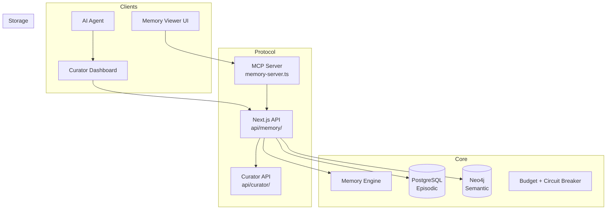
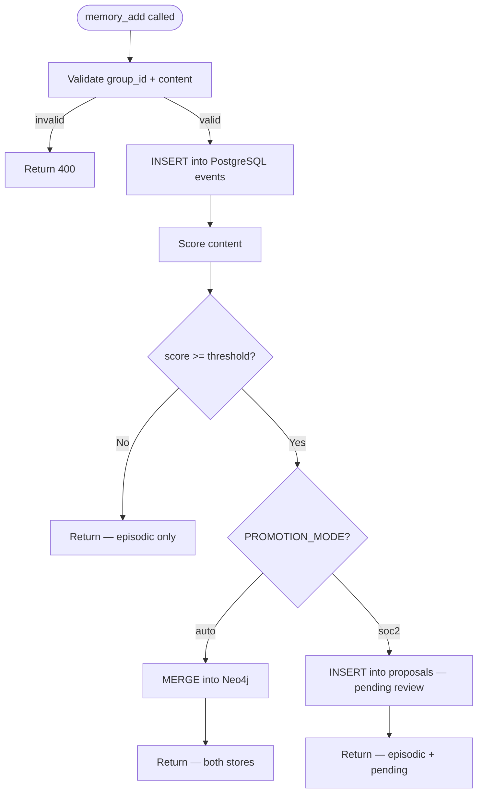
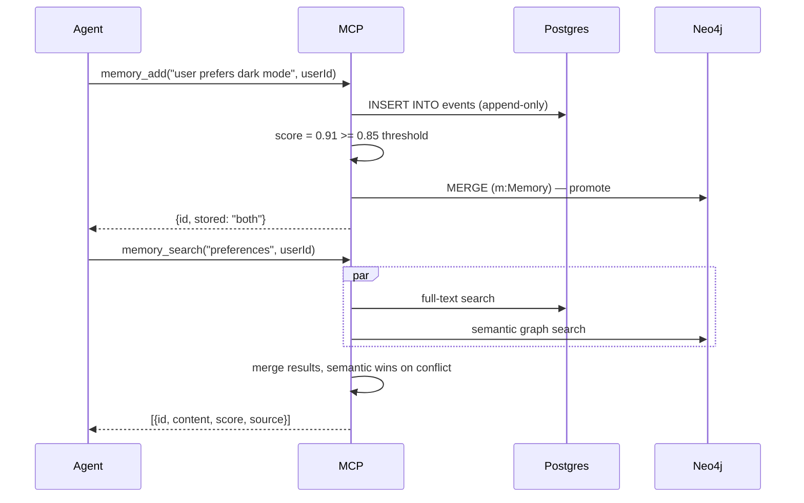
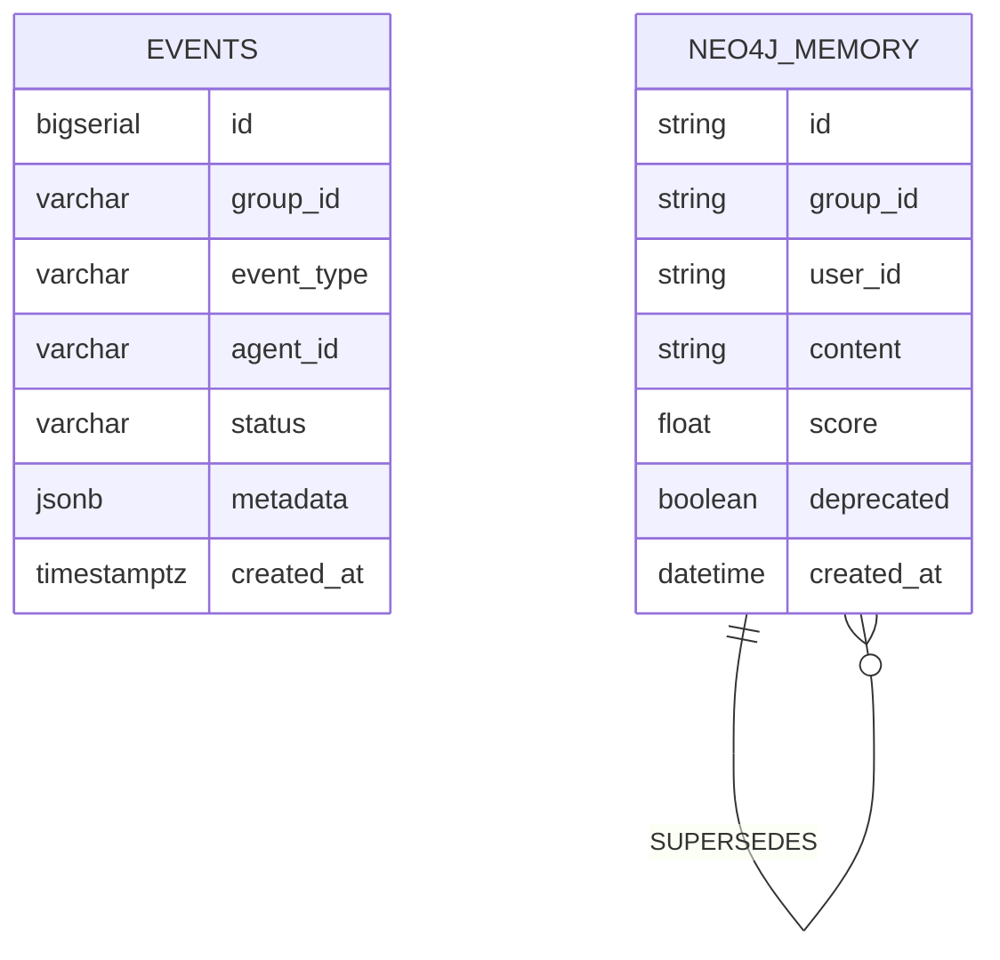

# Allura Blueprint

> [!NOTE]
> **AI-Assisted Documentation**
> Portions of this document were drafted with the assistance of an AI language model.
> Content has not yet been fully reviewed — this is a working design reference, not a final specification.
> When in doubt, defer to the source code, schemas, and team consensus.

Allura is a sovereign AI memory engine — a self-hosted, governed alternative to mem0.ai. It gives AI agents persistent, auditable, multi-tenant memory backed by a dual-database architecture (PostgreSQL for episodic traces, Neo4j for semantic knowledge). The system enforces tenant isolation, append-only history, and versioned knowledge at the schema level — not by policy.

---

## Table of Contents

- [1) Core Concepts](#1-core-concepts)
- [2) Requirements](#2-requirements)
- [3) Architecture](#3-architecture)
- [4) Diagrams](#4-diagrams)
- [5) Data Model](#5-data-model)
- [6) Execution Rules](#6-execution-rules)
- [7) Global Constraints](#7-global-constraints)
- [8) API Surface](#8-api-surface)
- [9) Logging & Audit](#9-logging--audit)
- [10) Admin Workflow](#10-admin-workflow)
- [11) References](#11-references)
- [12) Documentation Authority & Sync Contract](#12-documentation-authority--sync-contract)

---

## 1) Core Concepts

### Memory

A Memory is a unit of information an AI agent stores about a user, session, or context. Memories flow through two stores depending on their confidence score and the active promotion mode.

**States:** `episodic | semantic | deleted`

**Key fields:**

- `content` — the raw text of the memory
- `user_id` — the owner (scoped within a `group_id`)
- `group_id` — tenant namespace, must match `^allura-`
- `score` — confidence/relevance (0–1), determines promotion eligibility

---

### Episodic Memory (PostgreSQL)

Every memory write lands here first. Append-only. Never mutated. Provides the raw event log and audit trail.

**States:** `recorded` (terminal — no transitions)

**Key fields:**

- `event_type` — e.g. `memory_add`, `memory_delete`
- `metadata` — JSONB payload (content, query, score, etc.)
- `created_at` — immutable write timestamp

---

### Semantic Memory (Neo4j)

Promoted, curated knowledge. Versioned via `SUPERSEDES` relationships. Nodes are never edited — a new node is created that supersedes the prior one.

**States:** `active | deprecated`

**Key fields:**

- `id` — UUID
- `group_id` — tenant namespace
- `content` — memory content
- `score` — confidence score
- `deprecated` — true when a newer version exists

---

### Tenant (`group_id`)

The hard isolation boundary. Every read and write MUST include a valid `group_id`. Enforced by a PostgreSQL CHECK constraint (`group_id ~ '^allura-'`). No application-layer bypass is possible.

---

## 2) Requirements

### Business Requirements

| #   | Requirement                                                                                  |
| --- | -------------------------------------------------------------------------------------------- |
| B1  | Developers integrate Allura with a 5-tool API matching mem0's UX                             |
| B2  | All memory is isolated by tenant (`group_id`) at the schema level                            |
| B3  | Every write produces an immutable audit record in PostgreSQL                                 |
| B4  | Promoted knowledge is versioned and never mutated in Neo4j                                   |
| B5  | The system is deployable via a single `docker compose up` command                            |
| B6  | Agents connect via MCP (Model Context Protocol)                                              |
| B7  | Operators choose between human-gated (SOC2) and auto-promotion modes                         |
| B8  | Consumer memory viewer: no sidebar, search dominant, swipe to forget                         |
| B9  | Every memory shows provenance: "from conversation" or "added manually"                       |
| B10 | Memory usage indicator: "used N times this week" on expand                                   |
| B11 | Undo: recently forgotten memories recoverable within 30 days                                 |
| B12 | Enterprise admin view: tenant overview, SOC2 pending queue, audit log                        |
| B13 | Audit log exportable as CSV for compliance                                                   |
| B14 | TypeScript SDK (`@allura/sdk`)                                                               |
| B15 | BYOK encryption                                                                              |
| B16 | Curator dashboard: three-tab approval workflow (Traces, Approved, Pending)                   |
| B17 | Curator sees confidence scores (60-100%) with one-sentence reasoning for uncertain proposals |
| B18 | Approve/reject decisions logged to audit trail with curator ID and timestamp                 |
| B19 | Auto-promote proposals >85% confidence without curator review (configurable)                 |
| B20 | Dashboard deployable on Vercel with backend engine in user's VPC/cloud                       |
| B21 | Curator authentication via Clerk (SSO, RBAC)                                                 |
| B22 | Error tracking via Sentry; curator alerted on engine failures                                |
| B23 | Agents must persist all task activity as append-only raw traces for auditability             |
| B24 | A curator process must turn raw traces into proposed insights without promoting them directly |
| B25 | No insight may become active knowledge until approved by a human or policy-controlled flow    |
| B26 | Approved insights must be stored in Neo4j as immutable, versioned knowledge records          |
| B27 | Agents must retrieve approved knowledge through a controlled retrieval layer                 |
| B28 | All reads/writes must pass through controlled APIs with project-level access and audit        |
| B29 | The full loop from agent execution to knowledge reuse must be demonstrably end-to-end        |

---

### Functional Requirements

#### Memory Operations

| #   | Requirement                                                                                                |
| --- | ---------------------------------------------------------------------------------------------------------- |
| F1  | `memory_add(content, userId, metadata?)` — writes to Postgres; conditionally promotes to Neo4j             |
| F2  | `memory_search(query, userId, limit?)` — federated search across Postgres + Neo4j, merged by relevance     |
| F3  | `memory_get(memoryId)` — returns a single memory record by ID                                              |
| F4  | `memory_list(userId)` — returns all memories for a user within the tenant                                  |
| F5  | `memory_delete(memoryId)` — soft-delete: appends a deletion event to Postgres, marks Neo4j node deprecated |

#### Governance

| #   | Requirement                                                                                    |
| --- | ---------------------------------------------------------------------------------------------- |
| F6  | `PROMOTION_MODE=soc2` — score ≥ threshold queues for human approval; no autonomous Neo4j write |
| F7  | `PROMOTION_MODE=auto` — score ≥ `AUTO_APPROVAL_THRESHOLD` promotes immediately to Neo4j        |
| F8  | `group_id` CHECK constraint blocks writes with invalid tenant namespaces                       |
| F9  | `SUPERSEDES` relationship created on every Neo4j node update                                   |

#### Curator Dashboard

| #   | Requirement                                                                                         |
| --- | --------------------------------------------------------------------------------------------------- |
| F10 | `POST /api/curator/score` — scores proposal, returns {confidence, reasoning, tier}                  |
| F11 | `POST /api/curator/approve` — moves proposal to approved knowledge, promotes to Neo4j if tier ≥ 85% |
| F12 | `POST /api/curator/reject` — archives proposal to 7-day undo, logs to audit trail                   |
| F13 | `GET /api/curator/proposals` — returns pending proposals (emerging + adoption tiers only)           |
| F14 | Curator dashboard shows three tabs: Traces (raw), Approved (knowledge), Pending (decisions)         |
| F15 | Pending tab sorts by confidence (descending); shows confidence badge + reasoning + buttons          |
| F16 | Approved tab shows all approved knowledge (human + auto-promoted); sortable by date/confidence      |
| F17 | Tab 1 restricted to authenticated users with `admin` role (engineers only)                          |
| F18 | Audit log endpoint: `GET /api/audit/events` — returns curator decisions with timestamps             |
| F19 | Dashboard integrates Clerk for authentication and RBAC (curator, admin, viewer roles)               |

#### Infrastructure

| #   | Requirement                                                                                 |
| --- | ------------------------------------------------------------------------------------------- |
| F20 | MCP server exposes all 5 memory tools over stdio transport                                  |
| F21 | `docker compose up` starts Postgres, Neo4j, and MCP server                                  |
| F22 | Memory viewer UI at `/memory` lists, searches, and deletes memories                         |
| F23 | Curator dashboard deployed on Vercel; calls backend engine via `CURATOR_ENGINE_URL` env var |
| F24 | Vercel Functions (`/api/curator/*`) call Docker engine in VPC/cloud via HTTPS               |
| F25 | Error tracking: unhandled exceptions sent to Sentry; curator notified via email/Slack       |

#### Governed Memory Pipeline

| #   | Requirement                                                                                                          |
| --- | ------------------------------------------------------------------------------------------------------------------- |
| F26 | Agent task lifecycle events, tool calls, outputs, retries, and terminal status are persisted as append-only traces    |
| F27 | Raw trace storage is append-only; no UPDATE or DELETE on the `events` table                                        |
| F28 | Raw traces preserve provenance linking downstream insights back to source evidence                                   |
| F29 | Curator reads raw traces and generates proposed insights (not active insights)                                     |
| F30 | Each proposed insight includes summary, evidence links, confidence score, timestamp, and status                    |
| F31 | Proposed insights enter an approval flow before becoming active knowledge                                           |
| F32 | Every approval, rejection, or policy decision is recorded as an audit event with actor and timestamp                |
| F33 | Approved insights are written to Neo4j as immutable nodes; no in-place updates                                     |
| F34 | Changed insights create new nodes linked with `SUPERSEDES`, `DEPRECATED`, or `REVERTED` relationships             |
| F35 | Agents retrieve knowledge through a controlled retrieval service, not by querying databases directly                 |
| F36 | Retrieval supports semantic and structured queries with project and global scope                                    |
| F37 | All knowledge-system reads/writes pass through controlled endpoints enforcing project-level access                  |
| F38 | Agent permissions enforced and all access to trace/knowledge resources is audited                                  |
| F39 | A second agent can retrieve approved knowledge and use it correctly in a later task                                |
| F40 | The full lifecycle from trace capture to knowledge reuse is traceable, auditable, and reversible                   |

---

## 3) Architecture

### Components

| Component                | Responsibility                                 | Notes                                             |
| ------------------------ | ---------------------------------------------- | ------------------------------------------------- |
| MCP Server               | Exposes 5 memory tools to AI agents            | `src/mcp/memory-server.ts`                        |
| Next.js API              | REST endpoints for dashboard + curator APIs    | `src/app/api/memory/`, `src/app/api/curator/`     |
| Memory Engine            | Core read/write/score/route logic              | `src/lib/memory/`                                 |
| Curator Scorer           | Computes confidence (60-100%) + reasoning      | `src/lib/curator/score.ts` (rule-based or Claude) |
| Dedup Engine             | Prevents duplicate Neo4j promotions            | `src/lib/dedup/`                                  |
| Budget + Circuit Breaker | Prevents runaway agent writes                  | `src/lib/budget/`, `src/lib/circuit-breaker/`     |
| PostgreSQL 16            | Episodic memory + audit trail + proposals      | Docker service                                    |
| Neo4j 5.26               | Semantic memory — versioned knowledge graph    | Docker service                                    |
| Memory Viewer            | `/memory` page — list, search, delete          | `src/app/memory/page.tsx`                         |
| Curator Dashboard        | `/curator` page — three-tab HITL governance UI | `src/app/curator/page.tsx`                        |
| Clerk Auth               | Multi-tenant authentication + RBAC             | SaaS (vercel.com)                                 |
| Sentry Monitor           | Error tracking + alerts                        | SaaS (sentry.io)                                  |

---

## 4) Diagrams

### Component Overview



---

### Execution Flow — `memory_add`



---

### Sequence Diagram — Agent Write + Search



---

### Data Model (ER Diagram)



---

## 5) Data Model

### `events` — PostgreSQL (Episodic Memory)

The primary append-only log. Every memory operation produces a row here. No UPDATE or DELETE ever.

| Field         | Type         | Required | Description                                                     |
| ------------- | ------------ | -------- | --------------------------------------------------------------- |
| `id`          | bigserial    | Yes      | Auto-increment primary key                                      |
| `group_id`    | varchar(255) | Yes      | Tenant identifier. CHECK: `group_id ~ '^allura-'`               |
| `event_type`  | varchar(100) | Yes      | `memory_add` · `memory_search` · `memory_delete` · `memory_get` |
| `agent_id`    | varchar(255) | Yes      | Source agent or user identifier                                 |
| `workflow_id` | varchar(255) | No       | Optional workflow grouping                                      |
| `status`      | varchar(50)  | Yes      | Default: `completed`                                            |
| `metadata`    | jsonb        | No       | Content, query, score, result count, etc.                       |
| `created_at`  | timestamptz  | Yes      | Immutable. DEFAULT NOW()                                        |

**`event_type` values**

| Value           | Description                         |
| --------------- | ----------------------------------- |
| `memory_add`    | A memory was written                |
| `memory_search` | A search was performed              |
| `memory_get`    | A single memory was fetched         |
| `memory_list`   | All memories for a user were listed |
| `memory_delete` | A memory was soft-deleted           |

---

### `Memory` Node — Neo4j (Semantic Memory)

Promoted, curated knowledge. Immutable after creation. Versioning via SUPERSEDES.

| Property     | Type          | Required | Description                                    |
| ------------ | ------------- | -------- | ---------------------------------------------- |
| `id`         | string (UUID) | Yes      | Unique identifier                              |
| `group_id`   | string        | Yes      | Tenant namespace. Must match `^allura-`        |
| `user_id`    | string        | Yes      | Memory owner                                   |
| `content`    | string        | Yes      | The memory content                             |
| `score`      | float         | Yes      | Confidence score (0–1)                         |
| `deprecated` | boolean       | Yes      | True when a newer version supersedes this node |
| `created_at` | datetime      | Yes      | Creation timestamp                             |

**Relationships**

| Relationship | Pattern                    | Description                                     |
| ------------ | -------------------------- | ----------------------------------------------- |
| `SUPERSEDES` | `(v2)-[:SUPERSEDES]->(v1)` | v1 is marked `deprecated: true`. Never edit v1. |

---

## 6) Execution Rules

### Promotion Decision

1. Score the content using the memory engine scorer
2. Compare against `AUTO_APPROVAL_THRESHOLD` (default: 0.85)
3. If `score < threshold` → Postgres only, return
4. If `score >= threshold` AND `PROMOTION_MODE=auto` → promote to Neo4j immediately
5. If `score >= threshold` AND `PROMOTION_MODE=soc2` → insert into proposals table, return with `pending_review: true`

### Deduplication

Before any Neo4j write, search for an existing node with matching `content` + `group_id` + `user_id`. If found and `score` is within `DUPLICATE_THRESHOLD`, skip the write and return the existing node ID.

### Failure Semantics

- Postgres write failure → terminal error, return 500, nothing promoted
- Neo4j write failure → log to Postgres as `promotion_failed` event, return episodic-only result (non-fatal)
- Score computation failure → treat score as 0, write Postgres only

### Soft Delete

`memory_delete` never removes rows. It appends an event of type `memory_delete` to Postgres and sets `deprecated: true` on the Neo4j node (if promoted). The original rows remain for audit purposes.

---

## 7) Global Constraints

- **`group_id` MUST match `^allura-`** — enforced by PostgreSQL CHECK constraint. Failure is a schema error, not an application error.
- **Postgres rows are append-only** — no UPDATE or DELETE on the `events` table under any circumstance.
- **Neo4j nodes are immutable** — updates create a new node with a `SUPERSEDES` edge to the prior node.
- **Circuit breaker trips at budget threshold** — agent runaway is cut off at the infrastructure layer, not application layer.

---

## 8) API Surface

### MCP Tools (Agent Interface)

| Tool            | Description                        |
| --------------- | ---------------------------------- |
| `memory_add`    | Add a memory for a user            |
| `memory_search` | Semantic search across both stores |
| `memory_get`    | Fetch a single memory by ID        |
| `memory_list`   | List all memories for a user       |
| `memory_delete` | Soft-delete a memory               |

### REST API (Dashboard Interface)

| Method   | Path                            | Description          |
| -------- | ------------------------------- | -------------------- |
| `POST`   | `/api/memory`                   | Add a memory         |
| `GET`    | `/api/memory?userId=&groupId=`  | List memories        |
| `GET`    | `/api/memory/[id]`              | Get memory by ID     |
| `DELETE` | `/api/memory/[id]`              | Soft-delete a memory |
| `GET`    | `/api/memory/search?q=&userId=` | Search memories      |
| `GET`    | `/api/health`                   | System health check  |

---

## 9) Logging & Audit

| What                   | Where stored           | Notes                                               |
| ---------------------- | ---------------------- | --------------------------------------------------- |
| Every memory operation | `events` (Postgres)    | Append-only, permanent                              |
| Promotion decisions    | `events` (Postgres)    | `event_type: memory_promoted` or `promotion_failed` |
| Search queries         | `events` (Postgres)    | Includes result count in metadata                   |
| Neo4j node versions    | Neo4j SUPERSEDES chain | Full lineage preserved                              |

**Redacted fields:** passwords, API keys, raw credentials must never appear in `metadata` JSONB.

---

## 10) Admin Workflow

1. Copy `.env.example` to `.env` and set `POSTGRES_PASSWORD`, `NEO4J_PASSWORD`, `PROMOTION_MODE`
2. Run `docker compose up -d` — starts Postgres, Neo4j, and MCP server
3. Configure your MCP client to point at `src/mcp/memory-server.ts`
4. Set `group_id` to your tenant namespace (e.g. `allura-myproject`)
5. Agents call `memory_add` / `memory_search` — memories flow automatically
6. Open `/memory` in the dashboard to inspect and manage memories

---

## 11) References

- [SOLUTION-ARCHITECTURE.md](./SOLUTION-ARCHITECTURE.md)
- [DATA-DICTIONARY.md](./DATA-DICTIONARY.md)
- [RISKS-AND-DECISIONS.md](./RISKS-AND-DECISIONS.md)
- [DESIGN-ALLURA.md](./DESIGN-ALLURA.md) — UI/UX wireframes and design rules
- [DESIGN-MEMORY-SYSTEM.md](./DESIGN-MEMORY-SYSTEM.md) — Governed memory pipeline design
- [REQUIREMENTS-MATRIX.md](./REQUIREMENTS-MATRIX.md) — Competitive analysis and use case fit
- [VALIDATION-GATE.md](../archive/allura/VALIDATION-GATE.md) — Acceptance checklist and benchmark matrix
- `src/mcp/memory-server.ts` — MCP tool implementations
- `src/lib/memory/` — memory engine
- `postgres-init/` — PostgreSQL schema SQL
- [MCP Protocol](https://modelcontextprotocol.io)
- [mem0.ai](https://mem0.ai) — primary competitor benchmark

---

## Appendix A: Personal AI OS Vision

Allura is the memory layer of a larger Personal AI Operating System:

```
┌──────────────────────────────────┐
│ Claude Code / OpenClaw / Cursor  │
│ (Agent Layer)                    │
└────────────┬─────────────────────┘
             │ MCP Protocol
             ↓
┌──────────────────────────────────┐
│ Allura MCP Server                │
│ - memory_retrieve()              │
│ - memory_write()                 │
│ - memory_propose_insight()       │
└────────────┬─────────────────────┘
             │
    ┌────────┴────────┐
    ↓                 ↓
PostgreSQL        Neo4j
(Episodic)        (Semantic)
Raw events        Approved facts
    ↓                 ↓
    └────────┬────────┘
             │
    ┌────────┴────────┐
    ↓                 ↓
Paperclip UI    Memory Dashboard
(Approval)      (Browse + Search)
(Optional)      (Always)
```

**Three Layers:**

1. **Agent Layer:** OpenClaw, Claude Code, Cursor — any MCP-compatible agent
2. **Memory Layer:** PostgreSQL (episodic) + Neo4j (semantic)
3. **Governance Layer:** Optional curator dashboard for human approval

**Core Workflows:**

- Agent Task → Automatic Logging → PostgreSQL
- Claude Code Memory Commands → MCP retrieval → Merged results
- Manual Insight Proposal → Pending queue → Neo4j (if approved)

---

## 12) Documentation Authority & Sync Contract

This section defines the single authority map between Notion templates/policy and repo implementation docs so agents never guess which surface owns truth.

### Authority Invariants

1. **Policy and templates are upstream in Notion.**
2. **Implementation canon is downstream in `docs/allura/` (exactly six files).**
3. **Agents do not auto-write repo content back to Notion template pages.**
4. **Residue** (reports, deliverables, ADR standalones, validation snapshots, benchmarks, prompts) goes to `docs/archive/allura/` or Allura Brain.

### Authority Map

| Notion Page                               | Repo Counterpart                                       | Authority Direction             | Who Edits                               |
| ----------------------------------------- | ------------------------------------------------------ | ------------------------------- | --------------------------------------- |
| Allura Blueprint                          | `docs/allura/BLUEPRINT.md`                             | Notion → repo                   | Edit Notion, sync to repo               |
| Solution Architecture: Allura             | `docs/allura/SOLUTION-ARCHITECTURE.md`                 | Notion → repo                   | Edit Notion, sync to repo               |
| ✨ AI Guidelines: Documentation Standards | `docs/AI-GUIDELINES.md` + `.opencode/AI-GUIDELINES.md` | Notion → repo                   | Edit Notion, patch both repo files      |
| Design                                    | `docs/allura/DESIGN-ALLURA.md`                         | Repo canonical (no Notion twin) | Edit repo directly                      |
| Requirements Matrix                       | `docs/allura/REQUIREMENTS-MATRIX.md`                   | Repo canonical (no Notion twin) | Edit repo directly                      |
| Risks & Decisions                         | `docs/allura/RISKS-AND-DECISIONS.md`                   | Repo canonical (no Notion twin) | Edit repo directly                      |
| Data Dictionary                           | `docs/allura/DATA-DICTIONARY.md`                       | Repo canonical (no Notion twin) | Edit repo directly                      |
| BROOKS_ARCHITECT persona                  | `.claude/agents/brooks.md`                             | Notion → repo                   | Edit Notion persona, sync to agent file |

### Preflight Gate (mandatory before doc writes)

Before creating or updating documentation artifacts, agents must read this authority map and apply this check:

- If target is not one of the canonical six under `docs/allura/` and not an approved archive/memory destination, **abort and reroute**.
- No net-new file creation is allowed in `docs/allura/` beyond the canonical six.

---

## Appendix B: MCP Tool Reference

For Claude Code integration, Allura exposes three core tools via MCP:

### `memory_retrieve(query: string)`

**Purpose:** Search for memories

**Returns:**

```typescript
{
  episodic: string[],  // Raw traces from PostgreSQL
  semantic: string[],  // Approved facts from Neo4j
  count: number
}
```

**Use case:** Ask Claude Code "What's my coding style?" and get remembered patterns.

### `memory_write(event: string, metadata?: object)`

**Purpose:** Log an event to PostgreSQL

**Use case:** Claude Code auto-logs all tool calls. You can manually add context.

### `memory_propose_insight(title: string, statement: string)`

**Purpose:** Propose an insight for approval

**Use case:** You notice a pattern in your work, propose it explicitly for curator approval.

---

_See [SOLUTION-ARCHITECTURE.md](./SOLUTION-ARCHITECTURE.md) for implementation phases and deployment scenarios._
