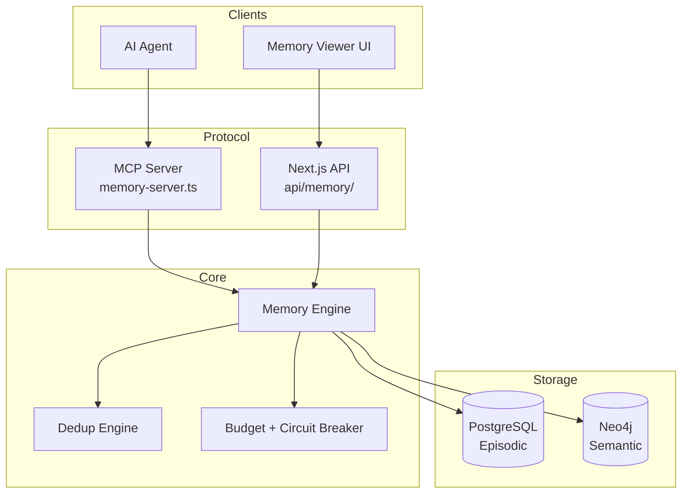
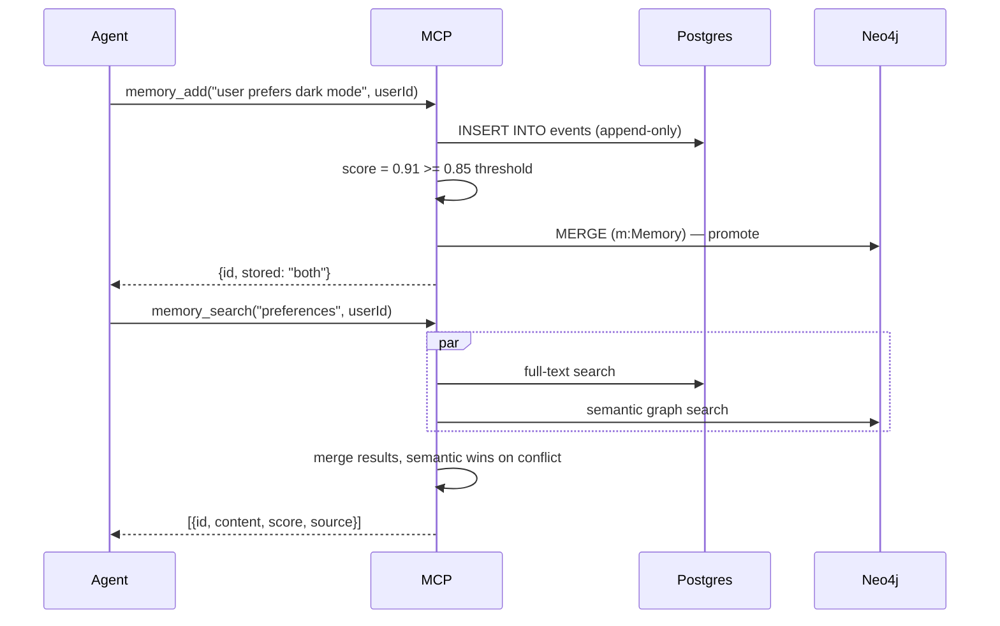
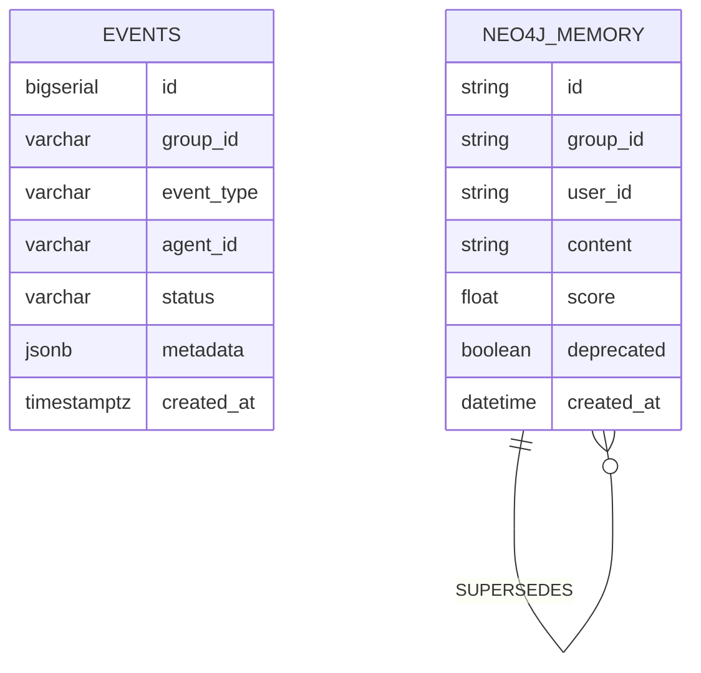

# Allura Blueprint

> [!NOTE]
> **AI-Assisted Documentation**
> Portions of this document were drafted with the assistance of an AI language model.
> Content has not yet been fully reviewed — this is a working design reference, not a final specification.
> When in doubt, defer to the source code, schemas, and team consensus.

Allura is a sovereign AI memory engine — a self-hosted, governed alternative to mem0.ai. It gives AI agents persistent, auditable, multi-tenant memory backed by a dual-database architecture (PostgreSQL for episodic traces, Neo4j for semantic knowledge). The system enforces tenant isolation, append-only history, and versioned knowledge at the schema level — not by policy.

---

## Table of Contents

- [1) Core Concepts](#1-core-concepts)
- [2) Requirements](#2-requirements)
- [3) Architecture](#3-architecture)
- [4) Diagrams](#4-diagrams)
- [5) Data Model](#5-data-model)
- [6) Execution Rules](#6-execution-rules)
- [7) Global Constraints](#7-global-constraints)
- [8) API Surface](#8-api-surface)
- [9) Logging & Audit](#9-logging--audit)
- [10) Admin Workflow](#10-admin-workflow)
- [11) References](#11-references)

---

## 1) Core Concepts

### Memory

A Memory is a unit of information an AI agent stores about a user, session, or context. Memories flow through two stores depending on their confidence score and the active promotion mode.

**States:** `episodic | semantic | deleted`

**Key fields:**
- `content` — the raw text of the memory
- `user_id` — the owner (scoped within a `group_id`)
- `group_id` — tenant namespace, must match `^allura-`
- `score` — confidence/relevance (0–1), determines promotion eligibility

---

### Episodic Memory (PostgreSQL)

Every memory write lands here first. Append-only. Never mutated. Provides the raw event log and audit trail.

**States:** `recorded` (terminal — no transitions)

**Key fields:**
- `event_type` — e.g. `memory_add`, `memory_delete`
- `metadata` — JSONB payload (content, query, score, etc.)
- `created_at` — immutable write timestamp

---

### Semantic Memory (Neo4j)

Promoted, curated knowledge. Versioned via `SUPERSEDES` relationships. Nodes are never edited — a new node is created that supersedes the prior one.

**States:** `active | deprecated`

**Key fields:**
- `id` — UUID
- `group_id` — tenant namespace
- `content` — memory content
- `score` — confidence score
- `deprecated` — true when a newer version exists

---

### Tenant (`group_id`)

The hard isolation boundary. Every read and write MUST include a valid `group_id`. Enforced by a PostgreSQL CHECK constraint (`group_id ~ '^allura-'`). No application-layer bypass is possible.

---

## 2) Requirements

### Business Requirements

| # | Requirement |
|---|-------------|
| B1 | Developers integrate Allura with a 5-tool API matching mem0's UX |
| B2 | All memory is isolated by tenant (`group_id`) at the schema level |
| B3 | Every write produces an immutable audit record in PostgreSQL |
| B4 | Promoted knowledge is versioned and never mutated in Neo4j |
| B5 | The system is deployable via a single `docker compose up` command |
| B6 | Agents connect via MCP (Model Context Protocol) |
| B7 | Operators choose between human-gated (SOC2) and auto-promotion modes |
| B8 | The memory viewer UI shows, searches, and deletes memories |

---

### Functional Requirements

#### Memory Operations

| # | Requirement |
|---|-------------|
| F1 | `memory_add(content, userId, metadata?)` — writes to Postgres; conditionally promotes to Neo4j |
| F2 | `memory_search(query, userId, limit?)` — federated search across Postgres + Neo4j, merged by relevance |
| F3 | `memory_get(memoryId)` — returns a single memory record by ID |
| F4 | `memory_list(userId)` — returns all memories for a user within the tenant |
| F5 | `memory_delete(memoryId)` — soft-delete: appends a deletion event to Postgres, marks Neo4j node deprecated |

#### Governance

| # | Requirement |
|---|-------------|
| F6 | `PROMOTION_MODE=soc2` — score ≥ threshold queues for human approval; no autonomous Neo4j write |
| F7 | `PROMOTION_MODE=auto` — score ≥ `AUTO_APPROVAL_THRESHOLD` promotes immediately to Neo4j |
| F8 | `group_id` CHECK constraint blocks writes with invalid tenant namespaces |
| F9 | `SUPERSEDES` relationship created on every Neo4j node update |

#### Infrastructure

| # | Requirement |
|---|-------------|
| F10 | MCP server exposes all 5 memory tools over stdio transport |
| F11 | `docker compose up` starts Postgres, Neo4j, and MCP server |
| F12 | Memory viewer UI at `/memory` lists, searches, and deletes memories |

---

## 3) Architecture

### Components

| Component | Responsibility | Notes |
|-----------|---------------|-------|
| MCP Server | Exposes 5 memory tools to AI agents | `src/mcp/memory-server.ts` |
| Next.js API | REST endpoints for dashboard UI | `src/app/api/memory/` |
| Memory Engine | Core read/write/score/route logic | `src/lib/memory/` |
| Dedup Engine | Prevents duplicate Neo4j promotions | `src/lib/dedup/` |
| Budget + Circuit Breaker | Prevents runaway agent writes | `src/lib/budget/`, `src/lib/circuit-breaker/` |
| PostgreSQL 16 | Episodic memory — append-only event log | Docker service |
| Neo4j 5.26 | Semantic memory — versioned knowledge graph | Docker service |
| Memory Viewer | `/memory` page — list, search, delete | `src/app/memory/page.tsx` |

---

## 4) Diagrams

### Component Overview

---

### Execution Flow — `memory_add`

---

### Sequence Diagram — Agent Write + Search

---

### Data Model (ER Diagram)

---

## 5) Data Model

### `events` — PostgreSQL (Episodic Memory)

The primary append-only log. Every memory operation produces a row here. No UPDATE or DELETE ever.

| Field | Type | Required | Description |
|-------|------|----------|-------------|
| `id` | bigserial | Yes | Auto-increment primary key |
| `group_id` | varchar(255) | Yes | Tenant identifier. CHECK: `group_id ~ '^allura-'` |
| `event_type` | varchar(100) | Yes | `memory_add` · `memory_search` · `memory_delete` · `memory_get` |
| `agent_id` | varchar(255) | Yes | Source agent or user identifier |
| `workflow_id` | varchar(255) | No | Optional workflow grouping |
| `status` | varchar(50) | Yes | Default: `completed` |
| `metadata` | jsonb | No | Content, query, score, result count, etc. |
| `created_at` | timestamptz | Yes | Immutable. DEFAULT NOW() |

**`event_type` values**

| Value | Description |
|-------|-------------|
| `memory_add` | A memory was written |
| `memory_search` | A search was performed |
| `memory_get` | A single memory was fetched |
| `memory_list` | All memories for a user were listed |
| `memory_delete` | A memory was soft-deleted |

---

### `Memory` Node — Neo4j (Semantic Memory)

Promoted, curated knowledge. Immutable after creation. Versioning via SUPERSEDES.

| Property | Type | Required | Description |
|----------|------|----------|-------------|
| `id` | string (UUID) | Yes | Unique identifier |
| `group_id` | string | Yes | Tenant namespace. Must match `^allura-` |
| `user_id` | string | Yes | Memory owner |
| `content` | string | Yes | The memory content |
| `score` | float | Yes | Confidence score (0–1) |
| `deprecated` | boolean | Yes | True when a newer version supersedes this node |
| `created_at` | datetime | Yes | Creation timestamp |

**Relationships**

| Relationship | Pattern | Description |
|---|---|---|
| `SUPERSEDES` | `(v2)-[:SUPERSEDES]->(v1)` | v1 is marked `deprecated: true`. Never edit v1. |

---

## 6) Execution Rules

### Promotion Decision

1. Score the content using the memory engine scorer
2. Compare against `AUTO_APPROVAL_THRESHOLD` (default: 0.85)
3. If `score < threshold` → Postgres only, return
4. If `score >= threshold` AND `PROMOTION_MODE=auto` → promote to Neo4j immediately
5. If `score >= threshold` AND `PROMOTION_MODE=soc2` → insert into proposals table, return with `pending_review: true`

### Deduplication

Before any Neo4j write, search for an existing node with matching `content` + `group_id` + `user_id`. If found and `score` is within `DUPLICATE_THRESHOLD`, skip the write and return the existing node ID.

### Failure Semantics

- Postgres write failure → terminal error, return 500, nothing promoted
- Neo4j write failure → log to Postgres as `promotion_failed` event, return episodic-only result (non-fatal)
- Score computation failure → treat score as 0, write Postgres only

### Soft Delete

`memory_delete` never removes rows. It appends an event of type `memory_delete` to Postgres and sets `deprecated: true` on the Neo4j node (if promoted). The original rows remain for audit purposes.

---

## 7) Global Constraints

- **`group_id` MUST match `^allura-`** — enforced by PostgreSQL CHECK constraint. Failure is a schema error, not an application error.
- **Postgres rows are append-only** — no UPDATE or DELETE on the `events` table under any circumstance.
- **Neo4j nodes are immutable** — updates create a new node with a `SUPERSEDES` edge to the prior node.
- **Circuit breaker trips at budget threshold** — agent runaway is cut off at the infrastructure layer, not application layer.

---

## 8) API Surface

### MCP Tools (Agent Interface)

| Tool | Description |
|------|-------------|
| `memory_add` | Add a memory for a user |
| `memory_search` | Semantic search across both stores |
| `memory_get` | Fetch a single memory by ID |
| `memory_list` | List all memories for a user |
| `memory_delete` | Soft-delete a memory |

### REST API (Dashboard Interface)

| Method | Path | Description |
|--------|------|-------------|
| `POST` | `/api/memory` | Add a memory |
| `GET` | `/api/memory?userId=&groupId=` | List memories |
| `GET` | `/api/memory/[id]` | Get memory by ID |
| `DELETE` | `/api/memory/[id]` | Soft-delete a memory |
| `GET` | `/api/memory/search?q=&userId=` | Search memories |
| `GET` | `/api/health` | System health check |

---

## 9) Logging & Audit

| What | Where stored | Notes |
|------|-------------|-------|
| Every memory operation | `events` (Postgres) | Append-only, permanent |
| Promotion decisions | `events` (Postgres) | `event_type: memory_promoted` or `promotion_failed` |
| Search queries | `events` (Postgres) | Includes result count in metadata |
| Neo4j node versions | Neo4j SUPERSEDES chain | Full lineage preserved |

**Redacted fields:** passwords, API keys, raw credentials must never appear in `metadata` JSONB.

---

## 10) Admin Workflow

1. Copy `.env.example` to `.env` and set `POSTGRES_PASSWORD`, `NEO4J_PASSWORD`, `PROMOTION_MODE`
2. Run `docker compose up -d` — starts Postgres, Neo4j, and MCP server
3. Configure your MCP client to point at `src/mcp/memory-server.ts`
4. Set `group_id` to your tenant namespace (e.g. `allura-myproject`)
5. Agents call `memory_add` / `memory_search` — memories flow automatically
6. Open `/memory` in the dashboard to inspect and manage memories

---

## 11) References

- [SOLUTION-ARCHITECTURE.md](./SOLUTION-ARCHITECTURE.md)
- [DATA-DICTIONARY.md](./DATA-DICTIONARY.md)
- [RISKS-AND-DECISIONS.md](./RISKS-AND-DECISIONS.md)
- `src/mcp/memory-server.ts` — MCP tool implementations
- `src/lib/memory/` — memory engine
- `postgres-init/` — PostgreSQL schema SQL
- [MCP Protocol](https://modelcontextprotocol.io)
- [mem0.ai](https://mem0.ai) — primary competitor benchmark
