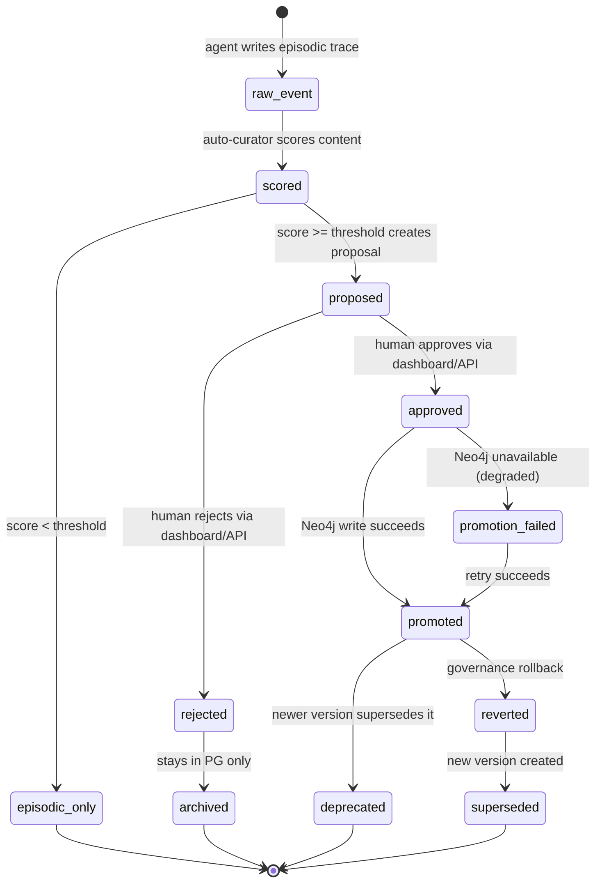

# Design Specification: Allura Dashboard, Curator & Settings

> [!NOTE]
> **AI-Assisted Documentation**
> Portions of this document were drafted with the assistance of an AI language model.
> Content has not yet been fully reviewed — this is a working design reference, not a final specification.
> When in doubt, defer to the source code, schemas, and team consensus.

> **Visual identity** (colors, typography, shadows, spacing, iconography) and consumer/admin wireframes live in [`docs/design/DESIGN-UI.md`](../design/DESIGN-UI.md). This document covers functional design only.

---

## Table of Contents

- [Overview](#overview)
- [Functional Requirements](#functional-requirements)
- [API Reference](#api-reference)
- [State Machine](#state-machine)
- [Business Rules](#business-rules)
- [Use Cases](#use-cases)
- [Important Constraints](#important-constraints)

---

## Overview

The Allura Dashboard, Curator, and Settings surfaces provide the human-facing control plane for the Allura Memory Engine. They are not the memory system itself — they are the window into it.

**Three roles, three surfaces:**

| Surface | Role | Purpose |
|---------|------|---------|
| **Dashboard** (`/dashboard`) | Operator / Admin | Observe system health, browse memories, inspect audit trails, visualize the knowledge graph |
| **Curator** (`/dashboard/curator`) | Curator / Reviewer | Review, approve, or reject proposed insights before they become active knowledge |
| **Settings** (`/dashboard/settings`) | Admin | Configure tenant, manage users, set promotion mode |

The Dashboard is the primary operational surface. It surfaces real data from Allura Brain (PostgreSQL + Neo4j), not mocks. Every component consumes mapped UI contracts from `src/lib/dashboard/`; raw Brain API shapes stay behind `api.ts`, `queries.ts`, and `mappers.ts` (AD-26).

**What this document is:**
- Functional requirements for what the dashboard, curator, and settings surfaces must do
- API reference for all dashboard and curator endpoints
- State machines for the curator proposal lifecycle
- Business rules derived from architectural decisions

**What this document is not:**
- A UI style guide (see [`DESIGN-UI.md`](../design/DESIGN-UI.md))
- Component-level wireframes (see [`DESIGN-UI.md`](../design/DESIGN-UI.md))
- An implementation roadmap (see [`SOLUTION-ARCHITECTURE.md`](./SOLUTION-ARCHITECTURE.md))

### UX Philosophy

**Sarah's Law:** If an 18-year-old intern has questions after two minutes, it's not done. iPhone clean means one thing on screen. You do it. You learn. No reading required.

**13-16-18 Validation Framework:** 13-year-olds spot emerging trends, 16-year-olds identify popularity gaps, 18-year-olds confirm mainstream readiness. Applied to all consumer-facing surfaces. Target score: 0.85+.

**Consumer mental model:** "Your AI remembers" — not "Neo4j node." The machine is always invisible.

---

## Functional Requirements

### Dashboard Requirements

| # | Requirement | Satisfied by |
|---|-------------|-------------|
| F17 | Curator Dashboard — view pending proposals, approve/reject with rationale | `/dashboard/curator` · `GET /api/curator/proposals` · `POST /api/curator/approve` · `POST /api/curator/reject` |
| F18 | Audit Log — view all memory events with filtering and CSV export | `/dashboard/audit` · `GET /api/audit/events` |
| F19 | System Health Dashboard — view service status, metrics, and degradation warnings | `/dashboard` (overview) · `GET /api/health?detailed=true` · `GET /api/health/metrics` |

### Curator Requirements

| # | Requirement | Satisfied by |
|---|-------------|-------------|
| F10 | `POST /api/curator/score` — score proposal, return confidence + reasoning + tier | `src/lib/curator/score.ts` |
| F11 | `POST /api/curator/approve` — approve proposal, promote to Neo4j | `src/app/api/curator/approve/route.ts` |
| F12 | `POST /api/curator/reject` — reject proposal, archive with rationale | `src/app/api/curator/reject/route.ts` |
| F13 | `GET /api/curator/proposals` — list pending proposals (emerging + adoption tiers) | `src/app/api/curator/proposals/route.ts` |
| F14 | Curator dashboard shows three tabs: Traces, Approved, Pending | `/dashboard/curator` |
| F15 | Pending tab sorts by confidence (descending); shows confidence badge + reasoning + action buttons | `ConfidenceBadge` component |
| F16 | Approved tab shows all approved knowledge (human + auto); sortable by date/confidence | `/dashboard/curator` approved tab |
| F17 | Tab 1 (Traces) restricted to authenticated users with `admin` role | Clerk RBAC |

### Audit & Health Requirements

| # | Requirement | Satisfied by |
|---|-------------|-------------|
| F18 | Audit log endpoint returns all events with filtering and pagination; CSV export for compliance | `GET /api/audit/events` |
| F19 | Dashboard integrates Clerk for authentication and RBAC (curator, admin, viewer roles) | `src/lib/auth/clerk.ts` |
| F26 | Agent task lifecycle events persisted as append-only traces | `src/lib/postgres/queries/insert-trace.ts` |
| F27 | Raw trace storage is append-only; no UPDATE/DELETE on events table | Schema enforcement |
| F28 | Traces preserve provenance linking downstream insights to source evidence | `trace_ref` field |
| F32 | Every approval, rejection, or policy decision recorded as audit event with actor and timestamp | `proposal_approved` / `proposal_rejected` event types |

### Governance Requirements

| # | Requirement | Satisfied by |
|---|-------------|-------------|
| F6 | `PROMOTION_MODE=soc2` — score ≥ threshold queues for human approval | Environment variable |
| F7 | `PROMOTION_MODE=auto` — score ≥ threshold promotes immediately | Environment variable |
| F34 | Changed insights create new nodes linked with `SUPERSEDES`/`DEPRECATED`/`REVERTED` | `createInsightVersion()` · `deprecateInsight()` |
| F37 | All knowledge-system reads/writes pass through controlled endpoints | RBAC middleware |
| F38 | Agent permissions enforced and all access audited | Auth middleware + event logging |

---

## API Reference

### Health & Metrics

#### `GET /api/health?detailed=true`

System health check with optional component-level detail.

**Query parameters:**

| Parameter | Type | Default | Description |
|-----------|------|---------|-------------|
| `detailed` | boolean | `false` | Include per-component health status |
| `include` | string | — | Comma-separated component names to include |
| `exclude` | string | — | Comma-separated component names to exclude |

**Response** (`200 OK`):

```json
{
  "status": "healthy | degraded | unhealthy",
  "timestamp": "2026-04-28T12:00:00Z",
  "uptime": 86400,
  "version": "0.1.0",
  "mode": "http",
  "interface": "rest",
  "dependencies": {
    "postgres": { "status": "up", "required": true, "latency_ms": 3 },
    "neo4j": { "status": "up", "required": false, "latency_ms": 12 }
  },
  "degraded": {
    "enabled": false,
    "reason": null,
    "capabilities_lost": []
  },
  "components": [
    { "name": "postgresql", "status": "healthy", "message": "Database connection verified", "latency": 3 },
    { "name": "neo4j", "status": "healthy", "message": "Graph database connection verified", "latency": 12 }
  ]
}
```

**Degraded mode:** When Neo4j is unavailable, `status` returns `"degraded"` and `capabilities_lost` lists lost semantic capabilities. HTTP status remains `200` for degraded state; `503` for unhealthy (PostgreSQL down).

---

#### `GET /api/health/metrics`

Operational metrics for the dashboard overview.

**Response** (`200 OK`):

```json
{
  "timestamp": "2026-04-28T12:00:00Z",
  "queue": {
    "pending_count": 3,
    "oldest_age_hours": 48,
    "approved_24h": 12,
    "rejected_24h": 2
  },
  "recall": {
    "search_available": true,
    "last_latency_ms": 45
  },
  "storage": {
    "postgres": { "status": "up", "latency_ms": 3, "total_memories": 247 },
    "neo4j": { "status": "up", "latency_ms": 12, "total_nodes": 189 }
  },
  "degraded": {
    "neo4j_unavailable": 0,
    "scope_error": 0,
    "embedding_failures": 0,
    "promotion_failures_24h": 0
  }
}
```

---

### Memory Operations (Dashboard)

#### `GET /api/memory`

List memories scoped by tenant. Supports user filtering and pagination.

**Query parameters:**

| Parameter | Type | Required | Description |
|-----------|------|----------|-------------|
| `group_id` | string | Yes | Tenant identifier (must match `^allura-`) |
| `user_id` | string | No | Filter to specific user |
| `limit` | integer | No | Max results (default 50) |
| `offset` | integer | No | Pagination offset |

---

#### `GET /api/memory/[id]`

Fetch a single memory by ID with tenant scope.

**Query parameters:**

| Parameter | Type | Required | Description |
|-----------|------|----------|-------------|
| `group_id` | string | Yes | Tenant scope |

---

#### `GET /api/memory/count`

Return total count of unique active memories (deduplicated across PG + Neo4j).

**Query parameters:**

| Parameter | Type | Required | Description |
|-----------|------|----------|-------------|
| `group_id` | string | Yes | Tenant scope |
| `user_id` | string | No | Filter to specific user |

---

#### `GET /api/memory/traces`

List raw trace events with filtering.

**Query parameters:**

| Parameter | Type | Required | Description |
|-----------|------|----------|-------------|
| `group_id` | string | Yes | Tenant scope |
| `agent_id` | string | No | Filter by agent |
| `event_type` | string | No | Filter by event type |
| `limit` | integer | No | Max results |
| `offset` | integer | No | Pagination offset |

---

#### `GET /api/memory/insights`

List approved insights with pagination.

**Query parameters:**

| Parameter | Type | Required | Description |
|-----------|------|----------|-------------|
| `group_id` | string | Yes | Tenant scope |
| `status` | string | No | Filter by status (`active`, `deprecated`, `superseded`) |
| `limit` | integer | No | Max results (default 20) |
| `offset` | integer | No | Pagination offset |

---

#### `GET /api/memory/insights/[id]/history`

Version history for a specific insight (SUPERSEDES chain).

**Query parameters:**

| Parameter | Type | Required | Description |
|-----------|------|----------|-------------|
| `group_id` | string | Yes | Tenant scope |

---

#### `GET /api/memory/graph`

Read-only tenant-scoped knowledge graph visualization.

Returns real Neo4j nodes and edges for the dashboard graph tab. Capped display sample plus `total_edges` count. Performs no mutations.

**Query parameters:**

| Parameter | Type | Required | Description |
|-----------|------|----------|-------------|
| `group_id` | string | Yes | Tenant scope (required, validated) |

**Response:** `MemoryGraphResponse` — `{ nodes: GraphNode[], edges: GraphEdge[], total_edges?: number }`

---

### Curator Operations

#### `GET /api/curator/proposals`

List proposed insights awaiting review.

**Query parameters:**

| Parameter | Type | Required | Description |
|-----------|------|----------|-------------|
| `group_id` | string | Yes | Tenant scope |
| `status` | string | No | Filter by status (default: `pending`) |
| `limit` | integer | No | Max results (default 20) |

---

#### `POST /api/curator/approve`

Approve a proposed insight. Promotes to Neo4j as immutable knowledge node.

**Request body:**

```json
{
  "proposal_id": "uuid",
  "group_id": "allura-system",
  "decision": "approve",
  "curator_id": "human_reviewer",
  "rationale": "Validated against runtime evidence."
}
```

**Response** (`200 OK`):

```json
{
  "success": true,
  "memory_id": "uuid",
  "decided_at": "2026-04-28T12:00:00Z",
  "notion_sync": "pending"
}
```

**Error responses:**

| Status | Condition |
|--------|-----------|
| `404` | Proposal not found |
| `409` | Proposal already decided or insight already promoted |
| `503` | Neo4j unavailable — proposal queued but not promoted |

---

#### `POST /api/curator/reject`

Reject a proposed insight. Archives with rationale.

**Request body:**

```json
{
  "proposal_id": "uuid",
  "group_id": "allura-system",
  "curator_id": "human_reviewer",
  "rationale": "Duplicate of existing knowledge."
}
```

---

### Audit

#### `GET /api/audit/events`

Full audit trail with pagination, filtering, and CSV export.

**Query parameters:**

| Parameter | Type | Required | Description |
|-----------|------|----------|-------------|
| `group_id` | string | Yes | Tenant scope (must match `^allura-`) |
| `format` | string | No | `json` (default) or `csv` |
| `from` | ISO 8601 | No | Start date filter |
| `to` | ISO 8601 | No | End date filter |
| `agent_id` | string | No | Filter by agent |
| `event_type` | string | No | Filter by event type |
| `limit` | integer | No | Max rows (default 1000, max 10000) |
| `offset` | integer | No | Pagination offset |

**Auth:** Requires `viewer` role or above.

**CSV response** includes `Content-Disposition: attachment; filename="audit-events-{group_id}-{date}.csv"` header.

---

### Governed Retrieval

#### `POST /api/memory/retrieval`

The controlled retrieval layer — the sole read path for agents (AD-19). Agents MUST NOT query PostgreSQL or Neo4j directly.

**Request body:**

```json
{
  "group_id": "allura-system",
  "agent_id": "agent_executor",
  "query": "What image tag should postgres use?",
  "mode": "hybrid",
  "scope": { "project": true, "global": true },
  "include_traces": false,
  "filters": { "status": "active", "min_confidence": 0.7 },
  "limit": 10
}
```

**Response** (`200 OK`):

```json
{
  "results": [
    {
      "insight_id": "uuid",
      "content": "Postgres image must remain pinned to pgvector:0.7.0-pg16...",
      "source": "neo4j",
      "confidence": 0.95,
      "scope": "project",
      "version": 2,
      "provenance": {
        "proposal_id": "uuid",
        "approved_by": "human_reviewer",
        "approved_at": "2026-04-19T20:50:00Z"
      }
    }
  ],
  "total": 1,
  "metadata": {
    "retrieved_at": "2026-04-28T21:00:00Z",
    "project_count": 1,
    "global_count": 0
  }
}
```

**Retrieval modes:**

| Mode | Description | Sources |
|------|-------------|---------|
| `semantic` | Content-based search across approved insights | Neo4j `searchInsights()` |
| `structured` | Filter-based query (status, confidence, date range) | Neo4j `listInsights()` |
| `hybrid` | Dual-context: project + global insights merged by confidence | `getDualContextSemanticMemory()` |
| `traces` | Raw trace retrieval (policy-gated, not default) | PostgreSQL `queryTraces()` |

---

## State Machine

### Event Types

The following event types are recorded in the PostgreSQL `events` table (append-only):

| Event Type | Description | Source |
|------------|-------------|--------|
| `memory_add` | Agent writes episodic trace to PostgreSQL | Memory engine |
| `memory_search` | Agent searches memories (federated PG + Neo4j) | Memory engine |
| `memory_get` | Agent retrieves single memory | Memory engine |
| `memory_delete` | Soft-delete with 30-day recovery | Memory engine |
| `memory_restore` | Restore from soft-delete within recovery window | Memory engine |
| `memory_promote` | Request promotion to Neo4j (creates proposal) | Curator |
| `proposal_created` | Curator creates canonical proposal | Curator scorer |
| `proposal_approved` | Human approves proposal | Curator approve route |
| `proposal_rejected` | Human rejects proposal | Curator reject route |
| `memory_promoted` | Memory written to Neo4j (semantic layer) | Promotion worker |
| `memory_deprecated` | Old version marked deprecated via SUPERSEDES | Version workflow |

### Curator Pipeline State Machine



**State descriptions:**

| State | Entry Trigger | Next States | Description |
|-------|--------------|-------------|-------------|
| `raw_event` | Agent calls `memory_add` | `scored` | Episodic trace in PostgreSQL |
| `scored` | Curator scorer evaluates content | `proposed`, `episodic_only` | Content has confidence score |
| `proposed` | Score ≥ threshold, proposal created in `canonical_proposals` | `approved`, `rejected` | Awaiting human review |
| `approved` | Human approves via curator dashboard | `promoted`, `promotion_failed` | Cleared for Neo4j write |
| `rejected` | Human rejects with rationale | `archived` | Denied, stays in PG only |
| `promoted` | Neo4j write succeeds | `deprecated`, `reverted` | Active semantic knowledge |
| `promotion_failed` | Neo4j unavailable | `promoted` (retry) | Degraded mode |
| `deprecated` | Newer version supersedes | — (terminal) | Historical record only |
| `archived` | Rejected proposal | — (terminal) | Kept for audit |
| `episodic_only` | Score below threshold | — (terminal) | PG trace, no promotion |
| `reverted` | Governance rollback | `superseded` | Replaced by earlier version |
| `superseded` | New version created | — (terminal) | Old version replaced |

---

## Business Rules

| Rule ID | Rule | Source | Enforcement |
|---------|------|--------|-------------|
| AD-04 | `PROMOTION_MODE` governs writes. `soc2` mode requires human approval before Neo4j promotion. `auto` mode promotes immediately if score ≥ threshold. | RISKS-AND-DECISIONS | Environment variable + code path |
| AD-08 | Soft-delete only. No hard deletes. Deletion records are append-only events, not erasures. | RISKS-AND-DECISIONS | `memory_delete` appends event + sets `deprecated: true` on Neo4j node |
| AD-09 | Neo4j write failure is non-fatal. PostgreSQL write is truth. Neo4j is a promotion — its failure degrades gracefully (206 + Warning header). | RISKS-AND-DECISIONS | `readJson()` in dashboard client detects 206 status |
| AD-19 | Agents MUST NOT query PostgreSQL or Neo4j directly. All reads go through `POST /api/memory/retrieval`. | RISKS-AND-DECISIONS | Code review gate + `direct-access-blocker.ts` |
| AD-20 | Curator marks events as `promoted` after proposal creation. Without this, the curator re-scores the same traces on every run. | RISKS-AND-DECISIONS | Curator query excludes `status = 'promoted'` |
| AD-22 | `VALIDATION-GATE.md` is archived in `docs/archive/allura/`, not canonical. Per the canonical surface rule. | RISKS-AND-DECISIONS | Cross-linked from BLUEPRINT, not in `docs/allura/` |
| — | `group_id` must match `^allura-` pattern. Enforced by PostgreSQL CHECK constraint. | BLUEPRINT §7 | Schema-level, not application-level |
| — | 30-day recovery window for soft-deleted memories. After 30 days, memories are permanently gone. | BLUEPRINT §11 | `memory_restore` validates recovery window |
| — | Append-only events table. No UPDATE or DELETE mutations on `events`. | BLUEPRINT §7 | No UPDATE/DELETE code paths in application |
| — | Proposals require human approval in `soc2` mode. In `auto` mode, proposals above threshold auto-promote. | BLUEPRINT §2 F6/F7 | `PROMOTION_MODE` environment variable |
| — | Audit trail is append-only and exportable as CSV. | BLUEPRINT §9 F18 | `GET /api/audit/events?format=csv` |
| — | `DashboardResult<T>` wraps all API responses with `{ data, error, degraded, warnings }`. | Dashboard architecture | `src/lib/dashboard/types.ts` |
| — | Dashboard scoped to `group_id` (tenant isolation). All API calls include `group_id`. | Tenant isolation | `withGroupId()` in dashboard client |
| — | Degraded mode returns HTTP 206 + `Warning` header when Neo4j unavailable. | AD-09 | Dashboard client checks `response.status === 206` |

---

## Use Cases

### MEM-UC10: Curator reviews and approves/rejects pending proposals

**Actor:** Curator (authenticated with `admin` or `curator` role)

**Precondition:** At least one proposal exists in `pending` status.

**Steps:**
1. Curator navigates to `/dashboard/curator`
2. Dashboard calls `GET /api/curator/proposals?status=pending`
3. Proposals display with confidence badge, reasoning, and source evidence
4. Curator reviews summary, evidence links, and confidence score
5. Curator approves: `POST /api/curator/approve` with `decision: "approve"` and rationale
6. System promotes approved insight to Neo4j as immutable node
7. Audit event `proposal_approved` written to PostgreSQL with curator ID and timestamp
8. Curator rejects: `POST /api/curator/reject` with rationale
9. System archives rejected proposal; audit event `proposal_rejected` written

**Postcondition:** Proposal transitions to `approved` (promoted to Neo4j) or `rejected` (archived in PG) with full audit trail.

**Requirements:** F10–F13, F17

---

### MEM-UC11: Admin views audit log with filtering and CSV export

**Actor:** Admin (authenticated with `admin` role)

**Precondition:** At least one event exists in the `events` table.

**Steps:**
1. Admin navigates to `/dashboard/audit`
2. Dashboard calls `GET /api/audit/events` with optional filters (`event_type`, `agent_id`, `from`, `to`)
3. Events display in chronological order with pagination
4. Admin clicks "Export CSV"
5. Dashboard calls `GET /api/audit/events?format=csv` with current filters
6. Browser downloads `audit-events-{group_id}-{date}.csv`

**Postcondition:** Admin has a complete, filtered audit trail in JSON or CSV format.

**Requirements:** F18

---

### MEM-UC12: Operator monitors system health and degradation

**Actor:** Operator

**Precondition:** Allura services are running.

**Steps:**
1. Operator navigates to `/dashboard` (overview)
2. Dashboard calls `GET /api/health?detailed=true` and `GET /api/health/metrics`
3. Overview displays: system status, queue depth, recall latency, storage stats, degraded component count
4. If Neo4j is down, status shows "degraded" with `Warning` header and lost capabilities listed
5. Operator sees metric cards: total memories, pending proposals, active agents, system uptime
6. Activity panel shows recent events

**Postcondition:** Operator has full visibility into system health, including degradation state.

**Requirements:** F19

---

### MEM-UC13: Agent performs governed memory retrieval

**Actor:** AI Agent

**Precondition:** Agent has valid `group_id` and `agent_id`.

**Steps:**
1. Agent calls `POST /api/memory/retrieval` with query, scope, and mode
2. Retrieval layer validates `group_id` and agent permissions
3. For `semantic` mode: `searchInsights()` from Neo4j
4. For `structured` mode: `listInsights()` from Neo4j
5. For `hybrid` mode: `getDualContextSemanticMemory()` merges project + global insights
6. For `traces` mode (policy-gated): `queryTraces()` from PostgreSQL
7. Results returned with provenance metadata (proposal ID, approver, approval timestamp)
8. Retrieval call logged as audit event

**Postcondition:** Agent receives scoped, policy-controlled memory context. No direct database access occurred.

**Requirements:** AD-19, F10, F26–F40

---

### MEM-UC14: User soft-deletes and restores a memory within 30-day window

**Actor:** End User

**Precondition:** Memory exists and is not already soft-deleted.

**Steps:**
1. User swipes/hovers on a memory in `/memory` view
2. User taps [Forget] (soft-delete)
3. System calls `DELETE /api/memory/[id]`
4. System appends `memory_delete` event to PostgreSQL
5. System marks Neo4j node as `deprecated: true` (if promoted)
6. Memory appears in "Recently Forgotten" view (`/memory?view=forgotten`)
7. Within 30 days, user taps [Restore]
8. System calls `POST /api/memory/[id]/restore`
9. System appends `memory_restore` event to PostgreSQL
10. System removes `deprecated` flag from Neo4j node

**Postcondition:** Memory is either soft-deleted (recoverable within 30 days) or restored to active state.

**Requirements:** AD-08, F5

---

### MEM-UC15: Dashboard displays knowledge graph visualization

**Actor:** Operator / Admin

**Precondition:** Neo4j contains Memory, Agent, Team, and Project nodes.

**Steps:**
1. Operator navigates to `/dashboard/graph`
2. Dashboard calls `GET /api/memory/graph?group_id=allura-system`
3. API returns `MemoryGraphResponse` with nodes, edges, and `total_edges`
4. Dashboard renders interactive graph with `GraphSummary` component
5. Operator clicks a node to see detail in `NodeDetailPanel`
6. Graph shows `AUTHORED_BY`, `RELATES_TO`, `MEMBER_OF`, `CONTRIBUTES_TO` relationships

**Postcondition:** Operator has visual understanding of knowledge graph structure and relationships.

**Requirements:** F17 (dashboard scope), AD-24 (structural context layer)

---

## Important Constraints

1. **Dashboard scoped to `group_id`.** Every API call includes `group_id` for tenant isolation. No cross-tenant data access is possible.

2. **Proposals require human approval in `soc2` mode.** `PROMOTION_MODE=soc2` blocks autonomous Neo4j writes. Every promotion goes through the curator queue.

3. **Audit trail is append-only and exportable.** No UPDATE or DELETE on the `events` table. CSV export supports SOC2 compliance requirements.

4. **Degraded mode returns 206 + Warning header.** When Neo4j is unavailable, the system continues serving episodic data from PostgreSQL. API responses include `degraded: true` and a `Warning` header. `DashboardResult<T>` surfaces this to components.

5. **`DashboardResult<T>` wraps all responses.** Every dashboard API call returns `{ data: T | null, error: string | null, degraded: boolean, warnings: DashboardWarning[] }`. Components handle null data and degraded state explicitly.

6. **Curator marks events as promoted (AD-20).** Without this, the curator re-scores the same traces on every run, creating duplicate proposals.

7. **Agents MUST NOT query PG/Neo4j directly (AD-19).** All retrieval goes through `POST /api/memory/retrieval`. Code review gate checks for direct database imports in agent-facing code.

8. **No direct graph writes outside approved promotion flow.** Services and agents cannot write directly to Neo4j. All writes go through the curator pipeline.

9. **Immutable insight nodes.** Neo4j nodes are never updated in place. Any change requires a new proposal → approval → new node with `SUPERSEDES` edge.

10. **30-day soft-delete recovery.** Memories can be restored within 30 days of soft-deletion. After that, they are permanently gone.

---

## Dashboard Architecture

### Pages

| Path | Purpose |
|------|---------|
| `/dashboard` | Overview — system health, metrics, recent activity |
| `/dashboard/insights` | Approved insights list with pagination |
| `/dashboard/memories` | Memory browser with search and filtering |
| `/dashboard/curator` | Three-tab curator: Traces, Approved, Pending |
| `/dashboard/audit` | Full audit trail with filtering and CSV export |
| `/dashboard/traces` | Raw trace viewer (admin-only) |
| `/dashboard/graph` | Knowledge graph visualization |
| `/dashboard/agents` | Agent roster and activity |
| `/dashboard/projects` | Project list and status |
| `/dashboard/skills` | MCP skill catalog and status |
| `/dashboard/settings` | Tenant configuration, promotion mode, user management |
| `/dashboard/evidence/[id]` | Evidence detail for a specific trace |
| `/dashboard/feed` | Live activity feed |

### Components

| Component | Purpose |
|-----------|---------|
| `MetricCard` | KPI display card (memory count, pending proposals, etc.) |
| `InsightCard` | Approved insight with confidence badge |
| `MemoryCard` | Memory entry with provenance and status |
| `EvidenceCard` | Raw trace evidence display |
| `ActivityPanel` | Chronological event feed |
| `GraphSummary` | Graph node/edge count summary |
| `NodeDetailPanel` | Click-through detail for a graph node |
| `SearchInput` | Dashboard search with group_id scoping |
| `StatusPill` | Health/degradation status indicator |
| `ConfidenceBadge` | Confidence score display (60–100%) |
| `WarningList` | Degradation warnings display |
| `PageHeader` | Page title and action buttons |
| `EmptyState` | Zero-data placeholder |
| `LoadingState` | Skeleton loading placeholder |
| `ErrorState` | Error display with retry |
| `Tabs` | Tab navigation (Curator: Traces / Approved / Pending) |

### Types

```typescript
interface DashboardResult<T> {
  data: T | null
  error: string | null
  degraded: boolean
  warnings: DashboardWarning[]
}

interface DashboardWarning {
  id: string
  message: string
  source: string
}
```

### API Client

```typescript
class DashboardApiError extends Error {
  constructor(message: string, readonly status: number, readonly url: string)
}

// All calls include group_id for tenant scoping
function withGroupId(params?: Record<string, QueryValue>): URLSearchParams

// readJson handles 206 (degraded) responses transparently
async function readJson<T>(path: string, init?: RequestInit): Promise<{ data: T; degraded: boolean; warning: string | null }>
```

---

## References

- [BLUEPRINT.md](./BLUEPRINT.md) — requirements this design satisfies
- [DESIGN-MEMORY-SYSTEM.md](./DESIGN-MEMORY-SYSTEM.md) — governed memory pipeline design
- [RISKS-AND-DECISIONS.md](./RISKS-AND-DECISIONS.md) — architectural decisions and risk register
- [SOLUTION-ARCHITECTURE.md](./SOLUTION-ARCHITECTURE.md) — system topology and deployment
- [DATA-DICTIONARY.md](./DATA-DICTIONARY.md) — canonical field and entity definitions
- [DESIGN-UI.md](../design/DESIGN-UI.md) — visual identity, wireframes, and design rules