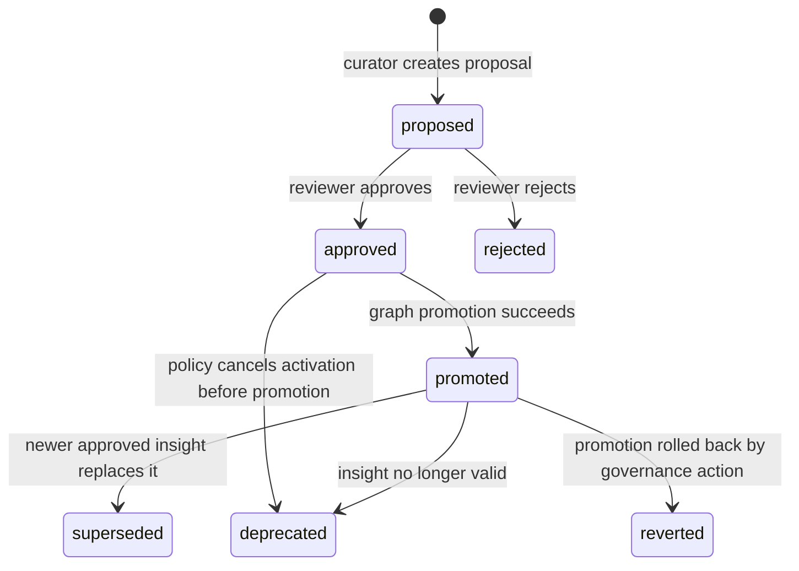

# Memory System Design: Governed Agent Memory

> [!NOTE]
> **AI-Assisted Documentation**
> Portions of this document were drafted with the assistance of an AI language model (GitHub Copilot).
> Content has not yet been fully reviewed — this is a working design reference, not a final specification.
> AI-generated content may contain inaccuracies or omissions.
> When in doubt, defer to the source code, JSON schemas, and team consensus.

This document describes how the Allura Memory system captures raw agent activity, curates proposed insights, enforces approval before activation, persists immutable versioned knowledge in Neo4j, and serves approved knowledge back to agents through a controlled retrieval layer. It maps the memory-system behavior to the functional requirements defined in [BLUEPRINT.md](./BLUEPRINT.md), the traceability rules in [REQUIREMENTS-MATRIX.md](./REQUIREMENTS-MATRIX.md), and the governance model documented across the repository.

---

## Table of Contents

- [Overview](#overview)
- [Functional Requirements](#functional-requirements)
- [API Reference](#api-reference)
  - [POST /api/memory/traces](#post-apimemorytraces)
  - [POST /api/curator/proposals](#post-apicuratorproposals)
  - [GET /api/curator/proposals](#get-apicuratorproposals)
  - [POST /api/curator/approve](#post-apicuratorapprove)
  - [POST /api/memory/insights](#post-apimemoryinsights)
  - [POST /api/memory/retrieval](#post-apimemoryretrieval)
- [State Machine](#state-machine)
- [Trace Ingestion](#trace-ingestion)
- [Insight Curation and Approval](#insight-curation-and-approval)
- [Knowledge Graph Versioning](#knowledge-graph-versioning)
- [Retrieval Layer](#retrieval-layer)
- [Use Cases](#use-cases)
- [Important Constraints](#important-constraints)

---

## Overview

The memory system is infrastructure, not a chat feature. Its purpose is to let agents accumulate usable knowledge over time without collapsing raw logs, inferred knowledge, approvals, and retrieval into a single opaque layer.

This design governs five core responsibilities:

1. **Trace persistence** — stores all agent activity in an append-only raw trace store (PostgreSQL)
2. **Curator pipeline** — derives *proposed* insights from those traces without promoting them directly
3. **Approval governance** — enforces human or policy approval before any insight becomes active knowledge
4. **Immutable graph writes** — writes approved insights to Neo4j as immutable, versioned graph records
5. **Controlled retrieval** — returns scoped, policy-controlled context to agents without allowing direct DB queries

Agent-side inspection and recall flows use packaged MCP servers activated through `MCP_DOCKER`:
- `neo4j-memory` first for approved-memory recall
- `database-server` second for trace/audit evidence
- `neo4j-cypher` only for read-only graph fallback

Governed writes do **not** go through MCP inspection servers; they remain controlled by application endpoints and approval policy.

This document is the consolidated design surface for the memory system. If the system later grows enough complexity, it can be split into `DESIGN-TRACE-INGESTION.md`, `DESIGN-CURATION.md`, `DESIGN-APPROVAL.md`, `DESIGN-RETRIEVAL.md`, and `DESIGN-KNOWLEDGE-GRAPH.md`, but until then this file is the authoritative implementation design.

---

## Functional Requirements

| # | Requirement | Satisfied by |
|---|-------------|-------------|
| F1 | The system must persist agent task lifecycle events, tool calls, outputs, retries, and terminal status into a raw trace store. | `insertEvent()` · `src/lib/postgres/queries/insert-trace.ts` · `POST /api/memory/traces` |
| F2 | Raw trace storage must be append-only and must not overwrite prior events in place. | Append-only write policy · `events` table schema · `00-traces.sql` |
| F3 | Raw traces must preserve provenance sufficient to link downstream insights back to source evidence. | `trace_ref` field on proposals · `evidence_refs` in promotion metadata |
| F4 | A curator service must read raw traces and generate proposed insights rather than active insights. | `src/curator/index.ts` · `curatorScore()` · `canonical_proposals` table |
| F5 | Each proposed insight must include summary, evidence links, confidence score, timestamp, and status. | Proposal schema · `score`, `reasoning`, `tier`, `trace_ref` fields |
| F6 | Proposed insights must enter an approval flow before they can become active. | `POST /api/curator/approve` · `status: pending` gate |
| F7 | Every approval, rejection, or policy-based decision must be recorded as an audit event. | `proposal_approved` / `proposal_rejected` event types · witness hash |
| F8 | Approved insights must be written to Neo4j as immutable nodes and must never be updated in place. | `createInsight()` · `src/lib/neo4j/queries/insert-insight.ts` |
| F9 | When an insight changes, the system must create a new insight node linked with `SUPERSEDES`, `DEPRECATED`, or `REVERTED`. | `createInsightVersion()` · `deprecateInsight()` · `revertInsightVersion()` |
| F10 | Agents must retrieve knowledge through a retrieval service rather than by directly querying PostgreSQL or Neo4j. | `POST /api/memory/retrieval` · `src/lib/memory/retrieval-layer.ts` |
| F11 | The retrieval service must support semantic and structured queries and return scoped context from approved insights, with optional raw-trace access. | `searchInsights()` · `getDualContextSemanticMemory()` · `queryTraces()` |
| F12 | All knowledge-system reads and writes must pass through controlled endpoints that enforce project-level access. | `requireRole()` · `validateGroupId()` · RBAC middleware |
| F13 | The system must enforce agent permissions and audit all access to trace and knowledge resources. | Auth middleware · audit event logging on every operation |
| F14 | A second agent must be able to retrieve approved knowledge as context and use it in a later task correctly. | Retrieval endpoint · validation gate scenario MEM-UC8 |
| F15 | The full lifecycle from trace capture to knowledge reuse must be traceable, auditable, and reversible. | Evidence chain: trace → proposal → approval → Neo4j → retrieval |

---

## API Reference

### POST /api/memory/traces

**Description:** Appends one or more raw trace events for an agent task run.

**Request body** (`application/json`)

```json
{
  "group_id": "allura-roninmemory",
  "agent_id": "agent_executor",
  "event_type": "tool_call",
  "status": "completed",
  "metadata": {
    "toolName": "search_web",
    "input": { "queries": ["neo4j docker image"] },
    "output": { "results": 3 }
  }
}
```

**Success response** — `202 Accepted`

```json
{
  "accepted": true,
  "id": 42
}
```

**Error responses**

| Status | Condition |
|--------|-----------|
| `400` | Missing required fields or invalid `group_id` |
| `403` | Caller lacks write permission for the project |

**Implementation:** `src/lib/postgres/queries/insert-trace.ts` → `insertEvent()`

---

### POST /api/curator/proposals

**Description:** Creates a proposed insight from curator analysis of raw traces. Proposals are always created with `status: pending` — they are never active knowledge.

**Request body** (`application/json`)

```json
{
  "group_id": "allura-roninmemory",
  "content": "Postgres image must remain pinned to pg16 to match persisted volume data.",
  "score": 0.93,
  "reasoning": "Volume data was created with PG16; auto-upgrade causes incompatibility.",
  "tier": "mainstream",
  "trace_ref": 1001
}
```

**Success response** — `201 Created`

```json
{
  "id": "a1b2c3d4-...",
  "status": "pending",
  "created_at": "2026-04-19T20:45:00Z"
}
```

**Implementation:** `src/curator/index.ts` → `runCurator()` writes to `canonical_proposals`

---

### GET /api/curator/proposals

**Description:** Returns proposed insights visible to the caller for review.

**Query parameters**

| Parameter | Type | Default | Description |
|-----------|------|---------|-------------|
| `group_id` | string | required | Tenant scope |
| `status` | string | `pending` | Filter by proposal state |
| `limit` | integer | 20 | Max records |

**Success response** — `200 OK`

```json
{
  "proposals": [
    {
      "id": "a1b2c3d4-...",
      "content": "Postgres image must remain pinned to pg16...",
      "status": "pending",
      "score": 0.93,
      "reasoning": "Volume data was created with PG16...",
      "tier": "mainstream"
    }
  ]
}
```

**Implementation:** `src/app/api/curator/proposals/route.ts`

---

### POST /api/curator/approve

**Description:** Approves or rejects a proposed insight. On approval, the insight is promoted to Neo4j as an immutable node. An audit event is always recorded.

**Request body** (`application/json`)

```json
{
  "proposal_id": "a1b2c3d4-...",
  "group_id": "allura-roninmemory",
  "decision": "approve",
  "curator_id": "human_reviewer",
  "rationale": "Validated against runtime evidence and compose config."
}
```

**Success response** — `200 OK`

```json
{
  "success": true,
  "memory_id": "m5n6o7p8-...",
  "decided_at": "2026-04-19T20:50:00Z",
  "notion_sync": "pending"
}
```

**Error responses**

| Status | Condition |
|--------|-----------|
| `404` | Proposal not found |
| `409` | Proposal already decided or insight already promoted |
| `503` | Neo4j unavailable — proposal queued but not promoted |

**Implementation:** `src/app/api/curator/approve/route.ts` → `createInsight()` on approve

---

### POST /api/memory/insights

**Description:** Creates a new insight version for an existing insight (SUPERSEDES workflow). Used when an approved insight needs to be updated.

**Request body** (`application/json`)

```json
{
  "insight_id": "m5n6o7p8-...",
  "group_id": "allura-roninmemory",
  "content": "Postgres image must remain pinned to pgvector:0.7.0-pg16 (specific version, not just pg16).",
  "confidence": 0.95
}
```

**Success response** — `201 Created`

```json
{
  "id": "q9r0s1t2-...",
  "version": 2,
  "status": "active",
  "supersedes": "m5n6o7p8-..."
}
```

**Implementation:** `src/lib/neo4j/queries/insert-insight.ts` → `createInsightVersion()`

---

### POST /api/memory/retrieval

**Description:** Returns context to an agent using approved insights and, when allowed, raw-trace evidence. This is the **controlled retrieval layer** — agents must use this endpoint instead of querying databases directly.

**Request body** (`application/json`)

```json
{
  "group_id": "allura-roninmemory",
  "agent_id": "agent_executor_2",
  "query": "What image tag should postgres use?",
  "mode": "hybrid",
  "scope": {
    "project": true,
    "global": true
  },
  "include_traces": false,
  "filters": {
    "status": "active",
    "min_confidence": 0.7
  },
  "limit": 10
}
```

**Success response** — `200 OK`

```json
{
  "results": [
    {
      "insight_id": "q9r0s1t2-...",
      "content": "Postgres image must remain pinned to pgvector:0.7.0-pg16...",
      "source": "neo4j",
      "confidence": 0.95,
      "scope": "project",
      "version": 2,
      "provenance": {
        "proposal_id": "a1b2c3d4-...",
        "approved_by": "human_reviewer",
        "approved_at": "2026-04-19T20:50:00Z"
      }
    }
  ],
  "total": 1,
  "metadata": {
    "retrieved_at": "2026-04-19T21:00:00Z",
    "project_count": 1,
    "global_count": 0
  }
}
```

**Error responses**

| Status | Condition |
|--------|-----------|
| `400` | Missing query or invalid retrieval mode |
| `403` | Caller lacks retrieval permission in scope |

**Implementation:** `src/app/api/memory/retrieval/route.ts` → `src/lib/memory/retrieval-layer.ts`

---

## State Machine



**State descriptions**

| State | Description | Entry trigger | Allowed next states |
|-------|-------------|---------------|---------------------|
| `proposed` | Curated insight awaiting review | Curator writes proposal to `canonical_proposals` | `approved`, `rejected` |
| `approved` | Approved for activation but not yet graph-promoted | Approval action via `POST /api/curator/approve` | `promoted`, `deprecated` |
| `rejected` | Proposal denied and excluded from active retrieval | Rejection action | — (terminal) |
| `promoted` | Approved insight written to Neo4j and active for retrieval | `createInsight()` succeeds | `superseded`, `deprecated`, `reverted` |
| `superseded` | Older active insight replaced by a newer version | `createInsightVersion()` with `SUPERSEDES` edge | — (terminal) |
| `deprecated` | Insight no longer active but retained for audit history | `deprecateInsight()` | — (terminal) |
| `reverted` | Insight invalidated in favor of an earlier state | `revertInsightVersion()` with `REVERTED` edge | `superseded` (if new version created) |

---

## Trace Ingestion

Raw traces are the system of record for what actually happened during agent execution. They must include enough information to reconstruct task flow, tool usage, retries, errors, and outputs without relying on later summaries.

**Implementation path:**

1. Agent calls `insertEvent()` from `src/lib/postgres/queries/insert-trace.ts`
2. Event is validated (required fields: `group_id`, `event_type`, `agent_id`, `status`)
3. `group_id` is validated against `^allura-` pattern via `validateGroupId()`
4. Event is appended to `events` table (append-only, no UPDATE/DELETE)
5. Event ID is returned for downstream traceability

**Append-only enforcement:**

- The `events` table has no UPDATE or DELETE paths in application code
- The `00-traces.sql` schema defines the table with no UPDATE/DELETE grants
- Any correction must be a new event, not a mutation of an existing one

---

## Insight Curation and Approval

The curator pipeline reads raw traces and identifies repeated patterns, stable facts, or high-value lessons worth proposing as reusable knowledge. It does **not** create active knowledge directly.

**Implementation path:**

1. `src/curator/index.ts` queries unpromoted events from `events` table
2. `curatorScore()` from `src/lib/curator/score.ts` scores each event
3. High-confidence events (score ≥ 0.7) are inserted into `canonical_proposals` with `status: pending`
4. The curator marks scored events as `promoted` in the `events` table to prevent re-scoring
5. Proposals appear in `GET /api/curator/proposals` for review

**Approval flow:**

1. Reviewer calls `POST /api/curator/approve` with `decision: approve` or `decision: reject`
2. On approve: `createInsight()` writes immutable node to Neo4j
3. An audit event (`proposal_approved` or `proposal_rejected`) is written to `events`
4. A witness hash (SHAKE-256) is computed and stored on the proposal for tamper evidence
5. A `notion_sync_pending` event is emitted for async Notion page creation

---

## Knowledge Graph Versioning

Neo4j stores only approved, versioned insight records. These insight nodes are immutable snapshots of approved knowledge at a point in time.

**Version relationships:**

| Relationship | Pattern | When used |
|-------------|---------|-----------|
| `SUPERSEDES` | `(v2)-[:SUPERSEDES]->(v1)` | New version replaces old; v1 status → `superseded` |
| `DEPRECATED` | Set via `deprecateMemory()` | Memory no longer valid but retained for history |
| `REVERTED` | `(v3)-[:REVERTED]->(v1)` | Revert to earlier version; creates new node copying v1 content |

**Key invariants:**

- No service may update an active graph insight node in place
- Any "edit" must result in: new proposal → new approval → new immutable node
- `Memory` nodes track the current version pointer; updated atomically on version change
- Full version history is queryable via `getInsightHistory()`

---

## Graph Topology: Agents, Teams, and Projects

The Neo4j knowledge graph contains four node types: **Memory**, **Agent**, **Team**, and **Project**. Memory nodes hold the knowledge content; Agent, Team, and Project nodes provide **structural context** that makes knowledge retrievable by ownership, project scope, and organizational path.

### Why Structural Context Nodes?

A graph without structure is just a list. Agent, Team, and Project nodes enable traversal queries that flat metadata properties cannot support:

- "What does this agent know?" → traverse `AUTHORED_BY` from Agent to Memory
- "What knowledge relates to this project?" → traverse `RELATES_TO` from Project to Memory
- "Who should I escalate to?" → traverse `ESCALATES_TO` from Agent to Agent
- "What does the Durham team produce?" → traverse `MEMBER_OF` → `CONTRIBUTES_TO`

### Seeded Data

The structural context layer is seeded via `scripts/neo4j-seed-agents.cypher` (idempotent MERGE):

- **19 Agent nodes** (10 RAM + 6 Durham + 3 Governance/Ship)
- **2 Team nodes** (RAM, Durham)
- **3 Project nodes** (Allura Memory, Agent OS, Creative Studio)
- **35 Memory nodes** from Notion (approved knowledge)
- **133 relationships** total (AUTHORED_BY, RELATES_TO, CONTRIBUTES_TO, MEMBER_OF, DELEGATES_TO, ESCALATES_TO, HANDS_OFF_TO, PROPOSES_TO, APPROVES_PROMOTION)

Bidirectional traceability is maintained via Notion's Neo4j ID field and Neo4j's `notion_id` property on Memory nodes.

### Eliminating the Shadow Org Chart

Previously, 7 "Memory Framework" agents existed as a shadow hierarchy separate from the actual agent team. Phase 6 eliminated this in favor of the existing surgical team pattern (RAM + Durham), with governance agents (Curator, Auditor) connected via `PROPOSES_TO` and `APPROVES_PROMOTION` relationships.

---

## Retrieval Layer

Agents retrieve memory through a dedicated service boundary. They do **not** query PostgreSQL, Neo4j, or vector infrastructure directly.

### Operational Access Path

Agent-side memory inspection and recall use packaged MCP servers activated through `MCP_DOCKER`:

- **`neo4j-memory`** — primary approved-memory recall surface
- **`database-server`** — trace/audit evidence and SQL inspection  
- **`neo4j-cypher`** — read-only graph fallback for targeted traversal (use only when needed)

The supported agent-side operational path is packaged MCP activation through `MCP_DOCKER`. Governed writes do not go through MCP inspection servers; they remain controlled by application endpoints and approval policy.

**Implementation path:**

1. Agent calls `POST /api/memory/retrieval` with query, scope, and filters
2. `retrieval-layer.ts` validates `group_id` and agent permissions
3. For structured queries: `listInsights()` or `searchInsights()` from Neo4j
4. For semantic/dual-context queries: `getDualContextSemanticMemory()` from Neo4j
5. For agent-context queries: traverse `AUTHORED_BY` from Agent to Memory nodes
6. For project-scoped queries: traverse `RELATES_TO` from Project to Memory nodes
7. For trace-augmented queries: `queryTraces()` from PostgreSQL (optional, policy-gated)
8. Results are merged, scoped, and returned with provenance metadata
9. Every retrieval call is logged as an audit event

**Retrieval modes:**

| Mode | Description | Sources |
|------|-------------|---------|
| `semantic` | Content-based search across approved insights | Neo4j `searchInsights()` |
| `structured` | Filter-based query (status, confidence, date range) | Neo4j `listInsights()` |
| `hybrid` | Dual-context: project + global insights merged by confidence | `getDualContextSemanticMemory()` |
| `traces` | Raw trace retrieval (policy-gated, not default) | PostgreSQL `queryTraces()` |

---

## Use Cases

### MEM-UC1: Record agent execution trace

**Actor:** Runtime agent
**Precondition:** Agent is authorized for the target project and begins a task run.
**Steps:**
1. The agent emits task start, tool usage, output, retry, and completion events.
2. The ingestion service validates order, scope, and schema.
3. The trace store appends the events and returns an accepted event ID.

**Postcondition:** A complete append-only trace exists for the task run.
**Requirements:** F1, F2, F3

---

### MEM-UC2: Reject non-append trace write

**Actor:** Runtime service or operator tool
**Precondition:** A write attempts to modify prior trace ordering or mutate an existing event.
**Steps:**
1. The caller submits an invalid write.
2. The ingestion layer detects a mutation or sequence violation.
3. The request is rejected and an audit event is recorded if policy requires.

**Postcondition:** Existing trace history remains unchanged.
**Requirements:** F2

---

### MEM-UC3: Curate a proposed insight from traces

**Actor:** Curator agent/service
**Precondition:** Relevant raw traces exist for one or more completed runs.
**Steps:**
1. The curator reads traces and detects a stable pattern or lesson.
2. The curator composes a summary, evidence set, and confidence score.
3. The service stores the result as a proposed insight with `status: pending`.
4. The source events are marked as `promoted` to prevent re-scoring.

**Postcondition:** A non-active proposal is available in the approval queue.
**Requirements:** F4, F5

---

### MEM-UC4: Approve a proposed insight

**Actor:** Human reviewer or policy engine
**Precondition:** A proposal is in `proposed` state.
**Steps:**
1. The reviewer inspects summary, evidence, and confidence.
2. The reviewer approves or rejects the proposal.
3. The system records the decision as an audit event with witness hash.
4. On approval, the insight is promoted to Neo4j as an immutable node.

**Postcondition:** The proposal transitions to `approved` or `rejected` with audit history.
**Requirements:** F6, F7

---

### MEM-UC5: Promote an approved insight to Neo4j

**Actor:** Promotion worker (inline in approve route)
**Precondition:** An insight is approved and eligible for activation.
**Steps:**
1. The promoter loads the approved proposal.
2. The service creates a new immutable Neo4j insight node via `createInsight()`.
3. If replacing prior knowledge, the service creates the correct version relationship via `createInsightVersion()`.

**Postcondition:** The approved knowledge becomes graph-backed, immutable, and version-linked.
**Requirements:** F8, F9

---

### MEM-UC6: Retrieve approved knowledge for an agent

**Actor:** Runtime agent
**Precondition:** At least one approved insight exists within accessible scope.
**Steps:**
1. The agent submits a retrieval query with scope and mode.
2. The retrieval layer evaluates policy, structured filters, and semantic matching.
3. The service returns ranked context with provenance.

**Postcondition:** The agent receives only authorized, scoped memory context.
**Requirements:** F10, F11

---

### MEM-UC7: Enforce access and audit on all reads/writes

**Actor:** Any caller
**Precondition:** Caller attempts any trace, proposal, approval, promotion, or retrieval operation.
**Steps:**
1. The gateway or service middleware evaluates project access and caller permissions.
2. Unauthorized requests are rejected.
3. Authorized requests are logged in the audit trail.

**Postcondition:** All operations are policy-controlled and auditable.
**Requirements:** F12, F13

---

### MEM-UC8: Reuse approved knowledge in a later agent run

**Actor:** Second runtime agent
**Precondition:** A previously approved and promoted insight exists.
**Steps:**
1. The second agent calls the retrieval layer during a later task.
2. The retrieval layer returns the approved insight as context.
3. The agent uses that context correctly in task execution.

**Postcondition:** The system demonstrates end-to-end memory reuse with traceable provenance.
**Requirements:** F14, F15

---

## Important Constraints

- **Append-only traces:** The raw trace store MUST be append-only. Existing trace events MUST NOT be overwritten or deleted through normal application flows.
- **No direct graph writes:** Services and agents MUST NOT write directly to Neo4j outside the approved promotion flow.
- **Approval before activation:** No proposed insight may become active or retrievable as approved knowledge before an approval event exists.
- **Immutable insights:** Approved graph insight nodes MUST NOT be updated in place. Any change requires a new proposal, approval, and node creation.
- **Controlled retrieval only:** Agents MUST retrieve knowledge through the retrieval service and MUST NOT query Postgres, Neo4j, or vector indexes directly.
- **Scoped access:** Every read and write MUST enforce project scope, caller permissions, and audit logging.
- **Logs are not knowledge:** Raw traces and audit logs MUST NOT be treated as active knowledge unless curated and approved.
- **Reversibility:** Any change to active knowledge MUST preserve historical lineage so it can be traced, superseded, deprecated, or reverted later.

---

## References

- [BLUEPRINT.md](./BLUEPRINT.md) — requirements this design satisfies
- [SOLUTION-ARCHITECTURE.md](./SOLUTION-ARCHITECTURE.md) — system topology and boundaries
- [REQUIREMENTS-MATRIX.md](./REQUIREMENTS-MATRIX.md) — requirement traceability
- [RISKS-AND-DECISIONS.md](./RISKS-AND-DECISIONS.md) — architectural decisions and risk register
- [DATA-DICTIONARY.md](./DATA-DICTIONARY.md) — canonical field and entity definitions
- [VALIDATION-GATE.md](../archive/allura/VALIDATION-GATE.md) — acceptance checklist and benchmark matrix