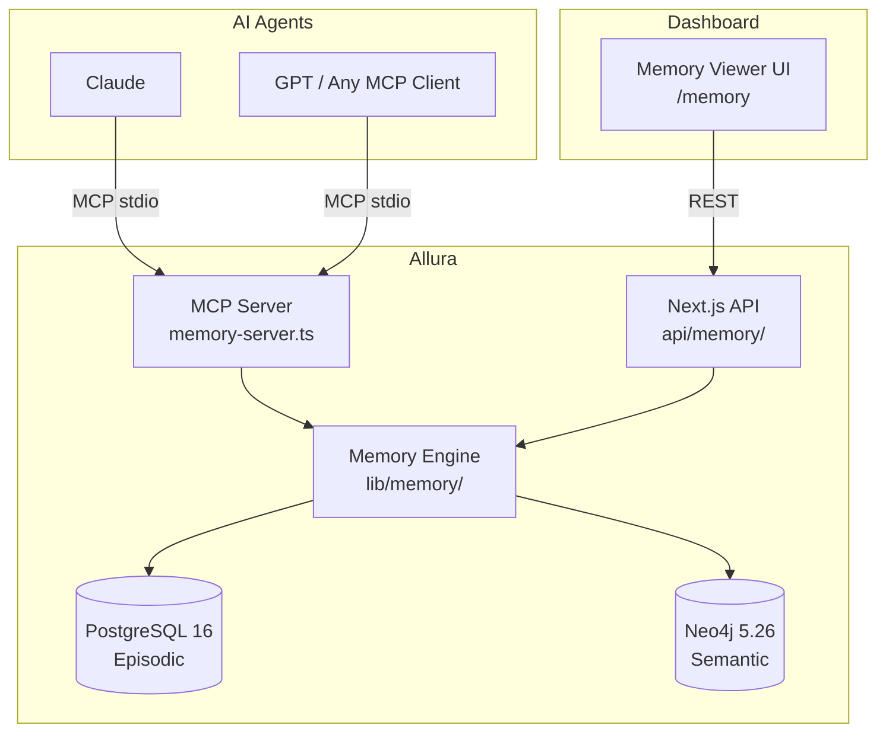
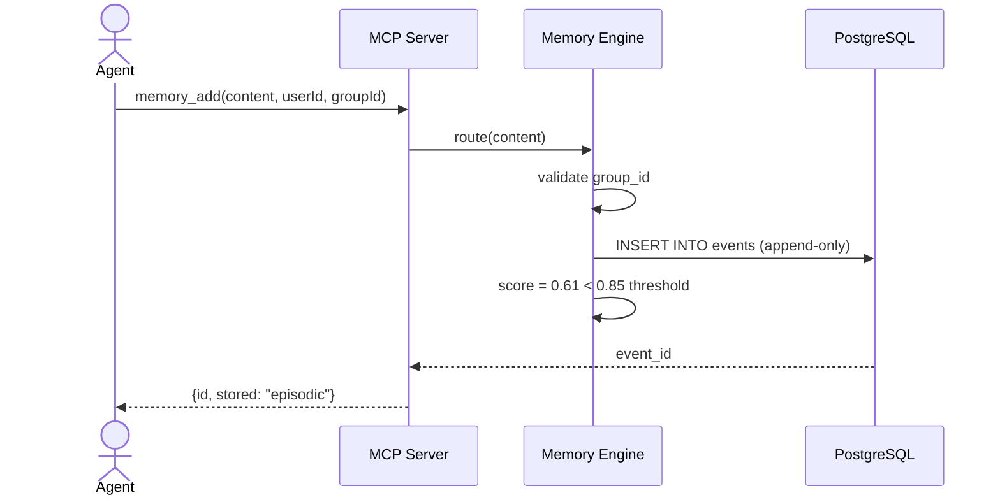
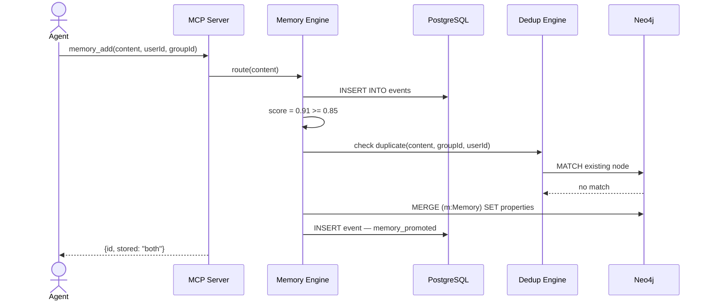
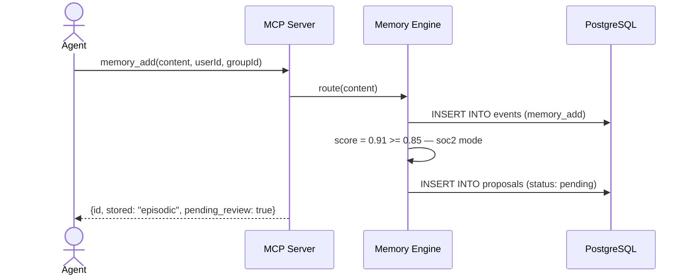
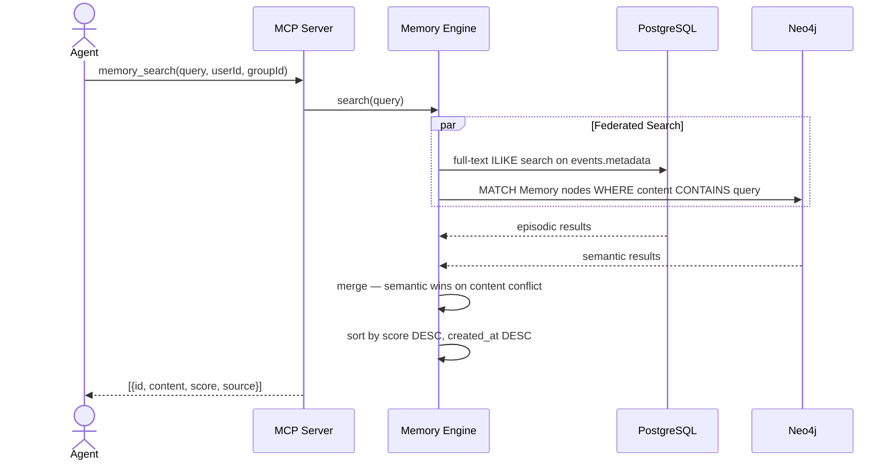
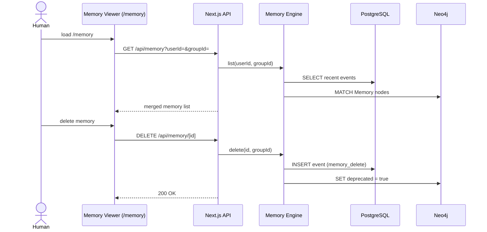
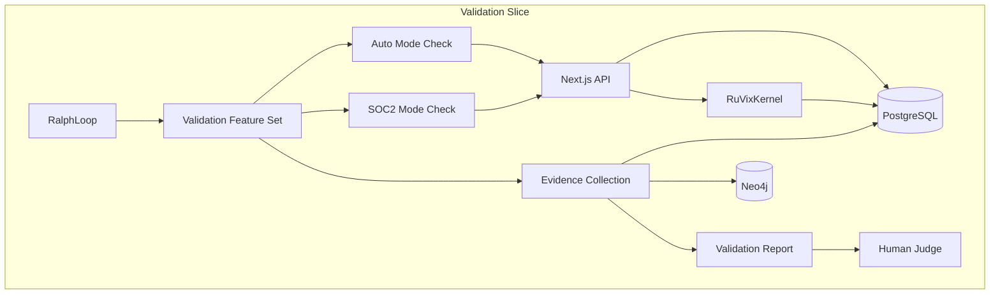
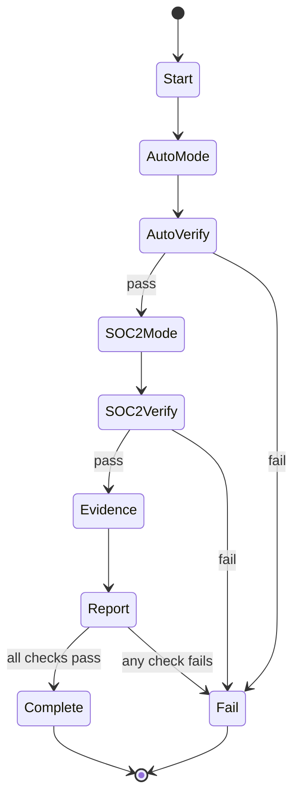

# Solution Architecture: Allura

> [!NOTE]
> **AI-Assisted Documentation**
> Portions of this document were drafted with the assistance of an AI language model.
> Content has not yet been fully reviewed. This is a working design reference, not a final specification.
> When in doubt, defer to the source code, schemas, and team consensus.

This document covers Allura's deployment topologies, integration interfaces, and architectural constraints. The data model and API surface are defined in [BLUEPRINT.md](./BLUEPRINT.md).

---

## Table of Contents

- [1. Architectural Positioning](#1-architectural-positioning)
- [2. System Boundary and External Actors](#2-system-boundary-and-external-actors)
- [3. Logical Topologies](#3-logical-topologies)
- [4. Interface Catalogue](#4-interface-catalogue)
- [5. Risk-Architecture Traceability](#5-risk-architecture-traceability)
- [6. Key Architectural Constraints](#6-key-architectural-constraints)
- [7. References](#7-references)

---

## 1. Architectural Positioning

Allura is a **memory data plane** — it holds no business logic about what an agent does, only what an agent remembers. It is the authoritative source of truth for all agent memory within a tenant namespace.

| Consumer Class | Interaction Mode | Notes |
|---|---|---|
| AI Agents (Claude, GPT, etc.) | MCP over stdio | Primary interface — all 5 memory tools |
| Dashboard UI | Sync REST | Next.js server actions → `/api/memory/` routes |
| DevOps / Admin | Docker Compose + env vars | Deployment and configuration |

Allura does **not** orchestrate agents, run workflows, or make decisions. It stores and retrieves memory. Period.

---

## 2. System Boundary and External Actors



---

## 3. Logical Topologies

### 3.1 Agent Memory Write (Fast Lane)

An AI agent adds a memory during a conversation. Score is below promotion threshold. Memory lands in Postgres only.



**Key constraints:**
- `group_id` CHECK enforced at Postgres level — invalid tenant rejected by schema (AD-06)
- Postgres write is synchronous — agent receives confirmation only after commit
- Score below threshold means no Neo4j write — no promotion queue entry

---

### 3.2 Agent Memory Write (Governed Lane — Auto Mode)

Score meets threshold and `PROMOTION_MODE=auto`. Memory promotes to Neo4j immediately.



**Key constraints:**
- Dedup check MUST precede any Neo4j write (RK-01)
- Neo4j failure is non-fatal — falls back to episodic-only result
- One Neo4j write per `memory_add` call maximum (AD-04)

---

### 3.3 Agent Memory Write (Governed Lane — SOC2 Mode)

Score meets threshold but `PROMOTION_MODE=soc2`. No autonomous Neo4j write.



**Key constraints:**
- No Neo4j write may occur without explicit human approval (AD-04)
- Proposal state machine: `pending → approved | rejected`
- Approved proposals trigger a Neo4j write identical to the auto-mode path

---

### 3.4 Agent Memory Search (Federated)



**Key constraints:**
- Both stores searched in parallel — latency bounded by slower of the two
- `group_id` + `user_id` scoping applied to both queries (RK-02)
- Semantic results take precedence when content matches across both stores

---

### 3.5 Dashboard Memory Viewer

Human operator uses the `/memory` page to inspect, search, and delete memories.



---

## 4. Interface Catalogue

| Interface | Direction | Channel | Payload / Contract | Risk / Decision |
|---|---|---|---|---|
| AI Agent | Inbound | MCP stdio | `memory_add`, `memory_search`, `memory_get`, `memory_list`, `memory_delete` | AD-03 |
| Dashboard UI | Inbound | REST HTTP | JSON — memory records | AD-05 |
| PostgreSQL 16 | Outbound | TCP (pg driver) | SQL — append-only INSERTs + SELECTs | AD-01, RK-02 |
| Neo4j 5.26 | Outbound | Bolt (neo4j driver) | Cypher — MERGE + MATCH | AD-02, RK-01 |

---

## 5. Risk-Architecture Traceability

| Section | Risks and Decisions Addressed |
|---|---|
| §3.1 Fast Lane Write | AD-01 (Postgres for episodic), AD-06 (group_id CHECK) |
| §3.2 Auto-Mode Promotion | AD-02 (Neo4j for semantic), AD-04 (promotion mode), RK-01 (dedup) |
| §3.3 SOC2-Mode Promotion | AD-04 (HITL gate), RK-03 (low-quality promotion) |
| §3.4 Federated Search | RK-02 (tenant isolation in queries) |
| §3.5 Dashboard Viewer | AD-05 (5-tool surface) |

---

## 6. Key Architectural Constraints

| Constraint | Rationale |
|---|---|
| Every operation MUST include a valid `group_id` matching `^allura-` | Tenant isolation enforced at schema level — AD-06 |
| Postgres rows MUST NOT be updated or deleted | Append-only audit trail — AD-01 |
| Neo4j nodes MUST NOT be edited in place | SUPERSEDES versioning preserves full lineage — AD-02 |
| Neo4j writes MUST be preceded by a dedup check | Prevents knowledge graph bloat — RK-01 |
| `PROMOTION_MODE=soc2` MUST prevent all autonomous Neo4j writes | Regulatory compliance gate — AD-04 |
| Circuit breaker MUST trip before budget exhaustion | Prevents agent runaway — kernel/circuit-breaker |

---

## 7. References

- [BLUEPRINT.md](./BLUEPRINT.md) — Core data model, API surface, execution rules
- [DATA-DICTIONARY.md](./DATA-DICTIONARY.md) — Field-level definitions
- [RISKS-AND-DECISIONS.md](./RISKS-AND-DECISIONS.md) — AD-## and RK-## entries
- `src/mcp/memory-server.ts` — MCP implementation
- `src/lib/memory/` — Memory engine
- `src/lib/dedup/` — Deduplication logic

---

## 8. Integration Plan

### 8.1 Deployment Scenarios

#### Scenario 1: Local Development (Stdio)

```bash
# Terminal 1: API server
bun run api

# Terminal 2: Claude Code
claude mcp add --transport stdio bun run src/mcp/allura-server.ts

# Terminal 3: OpenClaw
openclaw gateway restart
# (loads allura plugin from config)
```

#### Scenario 2: Remote Deployment (HTTP + OAuth)

```bash
# Cloud: Allura MCP Server
bun run api --port 3100 --auth-enabled

# Claude Code config
{
  "mcpServers": {
    "allura": {
      "command": "node",
      "args": ["allura-mcp-client.js"],
      "env": {
        "ALLURA_MCP_URL": "https://allura-mcp.example.com",
        "ALLURA_API_KEY": "..."
      }
    }
  }
}
```

#### Scenario 3: Containerized (Docker)

```yaml
# docker-compose.yml
services:
  allura-mcp:
    build: .
    command: bun run api
    ports:
      - "3100:3100"
    environment:
      - DATABASE_URL=...
      - NEO4J_URI=...
      - AUTH_ENABLED=true

  claude-code:
    # Your development container
    environment:
      - ALLURA_MCP_URL=http://allura-mcp:3100/mcp
```

### 8.2 Plugin Wrappers

**One MCP Server. Three Optional Wrappers.**

```
Allura MCP Server (src/mcp/allura-server.ts)
├─ Transport: stdio (local) + HTTP (remote)
├─ Tools: memory_retrieve, memory_write, memory_propose_insight
└─ Auth: JWT + API key validation
    ↓
    ├─ Claude Code Plugin (~50 lines)
    │   └─ Registers MCP server in .mcp.json
    │
    ├─ OpenCode Plugin (~80 lines)
    │   └─ Auto-registers in opencode.json
    │   └─ NPM: npm install @allura/opencode-plugin
    │
    └─ OpenClaw Plugin (~100 lines)
        └─ Gateway plugin entry point
```

### 8.3 Implementation Phases

| Phase | Component | Status |
|-------|-----------|--------|
| 1 | MCP Server (Core) — Base server with stdio transport | Ready |
| 2 | HTTP Wrapper — Express wrapper for remote deployment | Ready |
| 3 | OpenCode Plugin — Auto-register MCP server | Future |
| 4 | Claude Code Plugin — Marketplace integration | Future |
| 5 | OpenClaw Plugin — Gateway integration | Future |

### 8.4 Success Metrics

- ✓ MCP server handles 100+ concurrent queries
- ✓ Plugin installs in <30 seconds
- ✓ Auth (JWT/OAuth) works end-to-end
- ✓ All three tools can retrieve, write, and propose insights

---

## 9. Validation Topology (merged)

This section carries forward the essential validation topology from the retired standalone validation diagrams artifact.

### 9.1 Validation slice architecture



### 9.2 Validation state machine



### 9.3 Validation constraints

| Constraint | Enforcement |
|---|---|
| `group_id` required | PostgreSQL schema check + request validation |
| Append-only traces | No UPDATE/DELETE contract on events |
| `trace_ref` integrity in SOC2 | FK and numeric verification |
| Human gate per slice | Explicit reviewer sign-off before progression |
