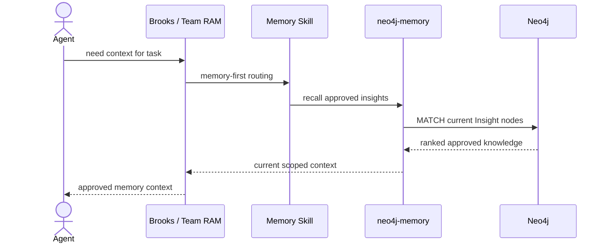
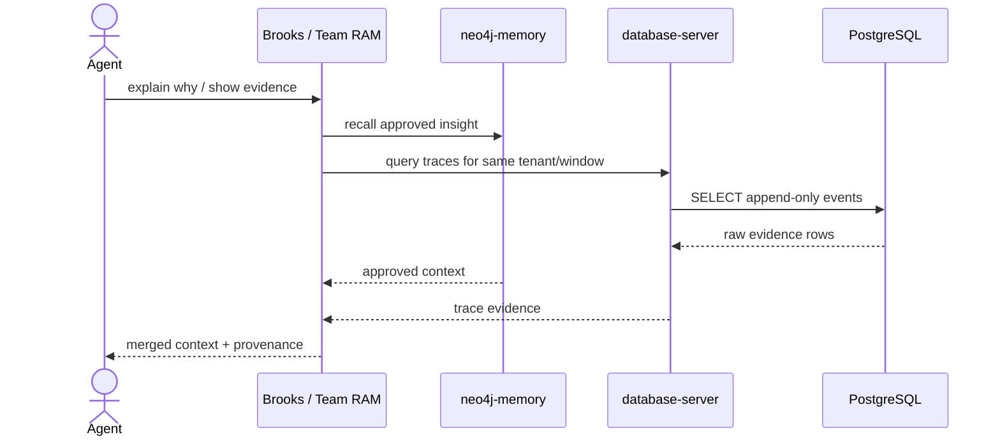
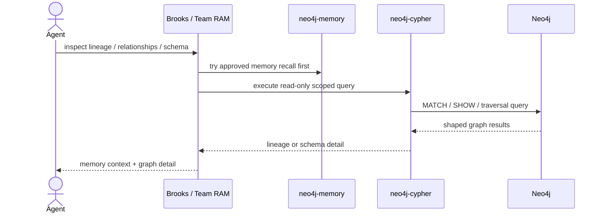
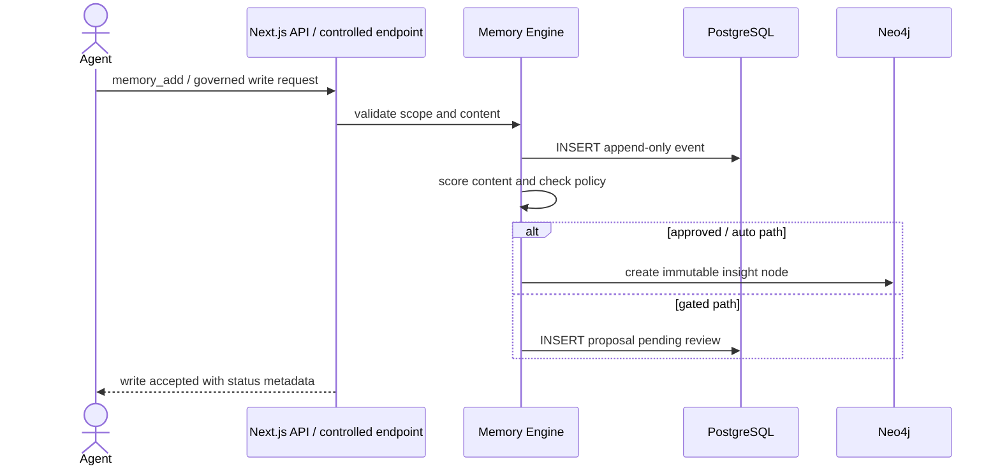
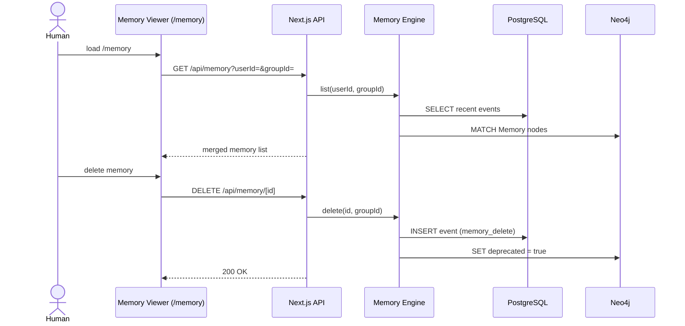
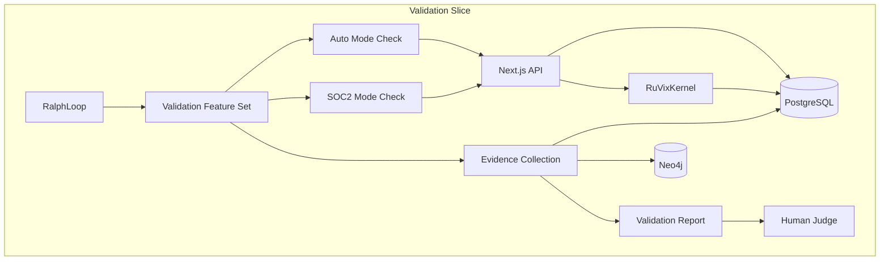
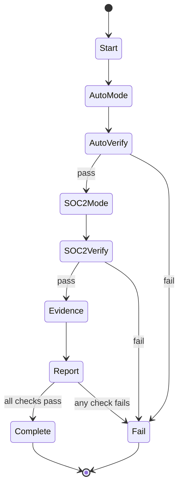

# Solution Architecture: Allura

> [!NOTE]
> **AI-Assisted Documentation**
> Portions of this document were drafted with the assistance of an AI language model.
> Content has not yet been fully reviewed. This is a working design reference, not a final specification.
> When in doubt, defer to the source code, schemas, and team consensus.

This document covers Allura's deployment topologies, integration interfaces, and architectural constraints. The data model and API surface are defined in [BLUEPRINT.md](./BLUEPRINT.md).

---

## Table of Contents

- [1. Architectural Positioning](#1-architectural-positioning)
- [2. System Boundary and External Actors](#2-system-boundary-and-external-actors)
- [3. Logical Topologies](#3-logical-topologies)
- [4. Interface Catalogue](#4-interface-catalogue)
- [5. Risk-Architecture Traceability](#5-risk-architecture-traceability)
- [6. Key Architectural Constraints](#6-key-architectural-constraints)
- [7. References](#7-references)

---

## 1. Architectural Positioning

Allura is a **memory data plane** — it holds no business logic about what an agent does, only what an agent remembers. It is the authoritative source of truth for all agent memory within a tenant namespace.

| Consumer Class | Interaction Mode | Notes |
|---|---|---|
| AI Agents (Claude, GPT, etc.) | Brooks / Team RAM + skills | Skills enforce memory-first routing to packaged MCP servers |
| Dashboard UI | Sync REST | Next.js server actions → `/api/memory/` routes |
| DevOps / Admin | Docker Compose + MCP_DOCKER config | Deployment, configuration, and packaged MCP server activation |

Allura does **not** orchestrate agents, run workflows, or make decisions. It stores and retrieves memory. Period.

---

## 2. System Boundary and External Actors

```mermaid
graph TD
    subgraph Agents["AI Agents"]
        A1[Claude]
        A2[GPT / Any MCP Client]
    end

    subgraph Dashboard["Dashboard"]
        B1[Memory Viewer UI<br/>/memory]
    end

    subgraph Orchestration["Brooks / Team RAM"]
        C1[Brooks]
        C2[Memory Skills]
    end

    subgraph MCPServers["Packaged MCP Servers"]
        C3[neo4j-memory]
        C4[database-server]
        C5[neo4j-cypher<br/>(fallback)]
    end

    subgraph Allura["Allura"]
        C6[Next.js API<br/>api/memory/]
        C7[Memory Engine<br/>lib/memory/]
        C8[(PostgreSQL 16<br/>Episodic)]
        C9[(Neo4j 5.26<br/>Semantic)]
    end

    A1 --> C1
    A2 --> C1
    C1 --> C2
    C2 --> C3
    C2 --> C4
    C2 --> C5
    B1 -->|REST| C6
    C6 --> C7
    C7 --> C8
    C7 --> C9
    C3 --> C9
    C4 --> C8
    C5 --> C9
```

---

## 3. Logical Topologies

### 3.1 Agent Memory Recall (Primary Path)

An AI agent needs prior context. Brooks routes to the memory skill, which queries `neo4j-memory` first.



**Key constraints:**
- `neo4j-memory` is the default first hop for reusable context
- Retrieval remains tenant-scoped via `group_id`
- No raw Cypher is needed when approved memory recall is sufficient

---

### 3.2 Evidence Escalation (Trace Verification)

If the agent needs provenance, audit detail, or incident evidence, Brooks adds `database-server` after memory recall.



**Key constraints:**
- `database-server` is for evidence and trace validation, not as the default memory interface
- PostgreSQL remains append-only and tenant-scoped
- Raw evidence may refine or contradict approved memory, but does not silently mutate it

---

### 3.3 Graph Escalation (Cypher Fallback)

If approved memory recall is insufficient and targeted graph traversal is required, Brooks adds `neo4j-cypher` as a read-only fallback.



**Key constraints:**
- `neo4j-cypher` is never the first-choice memory interface
- Cypher queries are read-only and must remain tenant-scoped unless schema inspection is explicit
- Hand-written Cypher is reserved for targeted inspection, not normal memory recall

---

### 3.4 Governed Memory Write Path



**Key constraints:**
- Agents do not write through packaged MCP inspection servers
- Controlled service endpoints remain the only write path for governed memory changes
- Neo4j writes preserve immutable lineage and approval policy
- The Curator Approve CLI (`src/curator/approve-cli.ts`) is an alternative entry point to the same governed write path — it uses the same `createInsight()` code path as the API route, enforces the same invariants (group_id validation, SHAKE-256 witness hash, append-only events), and emits `notion_sync_pending` events for async Notion sync

---

### 3.5 Dashboard Memory Viewer

Human operator uses the `/memory` page to inspect, search, and delete memories.



---

## 4. Interface Catalogue

| Interface | Direction | Channel | Payload / Contract | Risk / Decision |
|---|---|---|---|---|
| AI Agent via Brooks / Team RAM | Inbound | Skills + packaged MCP servers | `neo4j-memory` first, `database-server` for evidence, `neo4j-cypher` only when needed | AD-23, AD-03 |
| Dashboard UI | Inbound | REST HTTP | JSON — memory records | AD-05 |
| Curator Approve CLI | Inbound | CLI (`bun run curator:approve`) | Processes pending proposals from PostgreSQL, promotes approved ones to Neo4j via `createInsight()` | F6, B18, B19 |
| PostgreSQL 16 | Outbound | TCP (pg driver) | SQL — append-only INSERTs + SELECTs | AD-01, RK-02 |
| Neo4j 5.26 | Outbound | Bolt (neo4j driver) | Approved memory recall + read-only Cypher fallback + governed writes | AD-02, RK-01, AD-23 |

---

## 5. Risk-Architecture Traceability

| Section | Risks and Decisions Addressed |
|---|---|
| §3.1 Primary Memory Recall | AD-23 (skills-first packaged MCP), AD-19 (controlled retrieval intent) |
| §3.2 Evidence Escalation | AD-01 (Postgres for episodic), RK-02 (tenant isolation in queries) |
| §3.3 Graph Escalation | AD-02 (Neo4j for semantic), AD-23 (read-only graph fallback) |
| §3.4 Governed Memory Write Path | AD-04 (promotion mode), RK-01 (dedup), RK-03 (low-quality promotion) |
| §3.5 Dashboard Viewer | AD-05 (5-tool surface) |

---

## 6. Key Architectural Constraints

| Constraint | Rationale |
|---|---|
| Every operation MUST include a valid `group_id` matching `^allura-` | Tenant isolation enforced at schema level — AD-06 |
| Postgres rows MUST NOT be updated or deleted | Append-only audit trail — AD-01 |
| Neo4j nodes MUST NOT be edited in place | SUPERSEDES versioning preserves full lineage — AD-02 |
| Neo4j writes MUST be preceded by a dedup check | Prevents knowledge graph bloat — RK-01 |
| `PROMOTION_MODE=soc2` MUST prevent all autonomous Neo4j writes | Regulatory compliance gate — AD-04 |
| Circuit breaker MUST trip before budget exhaustion | Prevents agent runaway — kernel/circuit-breaker |

---

## 7. References

- [BLUEPRINT.md](./BLUEPRINT.md) — Core data model, API surface, execution rules
- [DATA-DICTIONARY.md](./DATA-DICTIONARY.md) — Field-level definitions
- [RISKS-AND-DECISIONS.md](./RISKS-AND-DECISIONS.md) — AD-## and RK-## entries
- `.opencode/skills/allura-memory-skill/` — memory workflow rules
- `.opencode/skills/memory-client/` — default retrieval behavior
- `.opencode/skills/mcp-docker-memory-system/` — packaged MCP server discovery/configuration guidance
- `src/lib/memory/` — Memory engine
- `src/lib/dedup/` — Deduplication logic

---

## 8. Integration Plan

### 8.1 Deployment Scenarios

#### Scenario 1: Local Development (Packaged MCP Servers)

```bash
# Terminal 1: API server
bun run api

# Attach packaged MCP servers through MCP_DOCKER as needed:
# - neo4j-memory
# - database-server
# - neo4j-cypher (only if needed)
```

#### Scenario 2: Skills + External MCP Server Activation

```bash
Use `MCP_DOCKER_mcp-find`, `MCP_DOCKER_mcp-config-set`, and `MCP_DOCKER_mcp-add`
to activate the packaged server set required for the current task.
```

#### Scenario 3: Containerized Core Stack

```yaml
# docker-compose.yml
services:
  web:
    build: .
    command: bun run start
    environment:
      - POSTGRES_DB=...
      - NEO4J_URI=...
```

### 8.2 Runtime Layers

**Brooks orchestrates. Skills decide. Packaged MCP servers execute.**

```
Brooks / Team RAM
├─ memory-client
├─ allura-memory-skill
└─ mcp-docker-memory-system
    ↓
    ├─ neo4j-memory      (primary approved-memory recall)
    ├─ database-server   (trace and audit evidence)
    └─ neo4j-cypher      (read-only fallback)
```

### 8.3 Implementation Phases

| Phase | Component | Status |
|-------|-----------|--------|
| 1 | Skills-first runtime contract | Ready |
| 2 | Packaged `neo4j-memory` + `database-server` integration | Ready |
| 3 | Read-only `neo4j-cypher` fallback | Ready |
| 4 | Brooks staged routing (memory first, evidence second, Cypher last) | Planned |
| 5 | Legacy custom MCP removal from runtime docs and config | Planned |

### 8.4 Success Metrics

- ✓ Skills route normal recall to `neo4j-memory` first
- ✓ `database-server` is used for evidence, not default recall
- ✓ `neo4j-cypher` is reserved for read-only graph fallback
- ✓ Core stack remains deployable independently of a custom monolithic MCP runtime

---

## 9. Validation Topology (merged)

This section carries forward the essential validation topology from the retired standalone validation diagrams artifact.

### 9.1 Validation slice architecture



### 9.2 Validation state machine



### 9.3 Validation constraints

| Constraint | Enforcement |
|---|---|
| `group_id` required | PostgreSQL schema check + request validation |
| Append-only traces | No UPDATE/DELETE contract on events |
| `trace_ref` integrity in SOC2 | FK and numeric verification |
| Human gate per slice | Explicit reviewer sign-off before progression |
