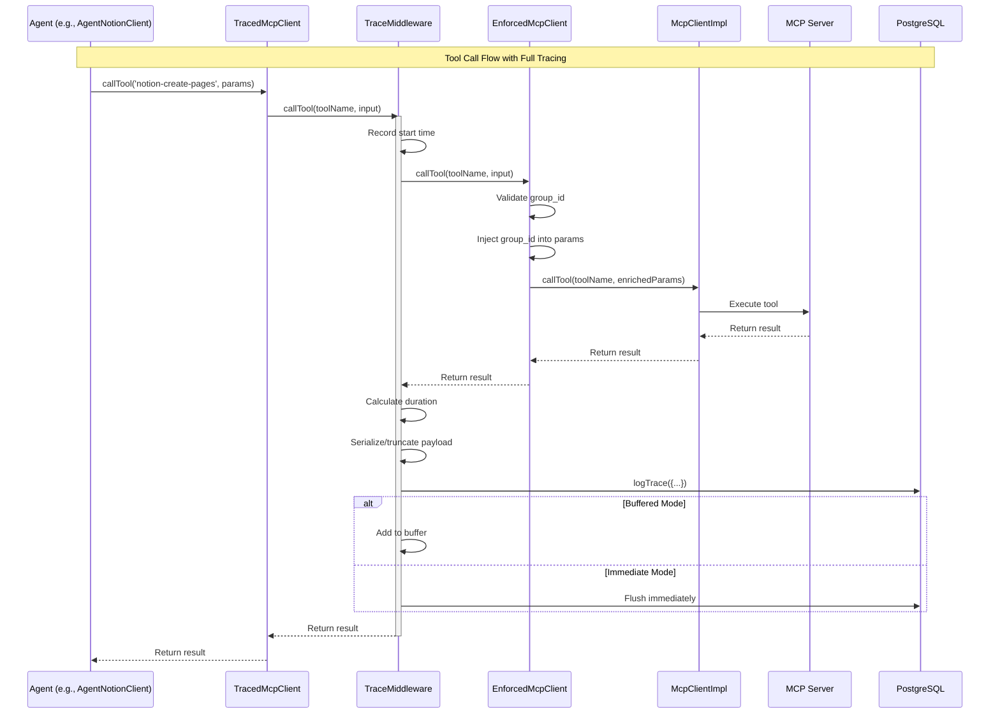
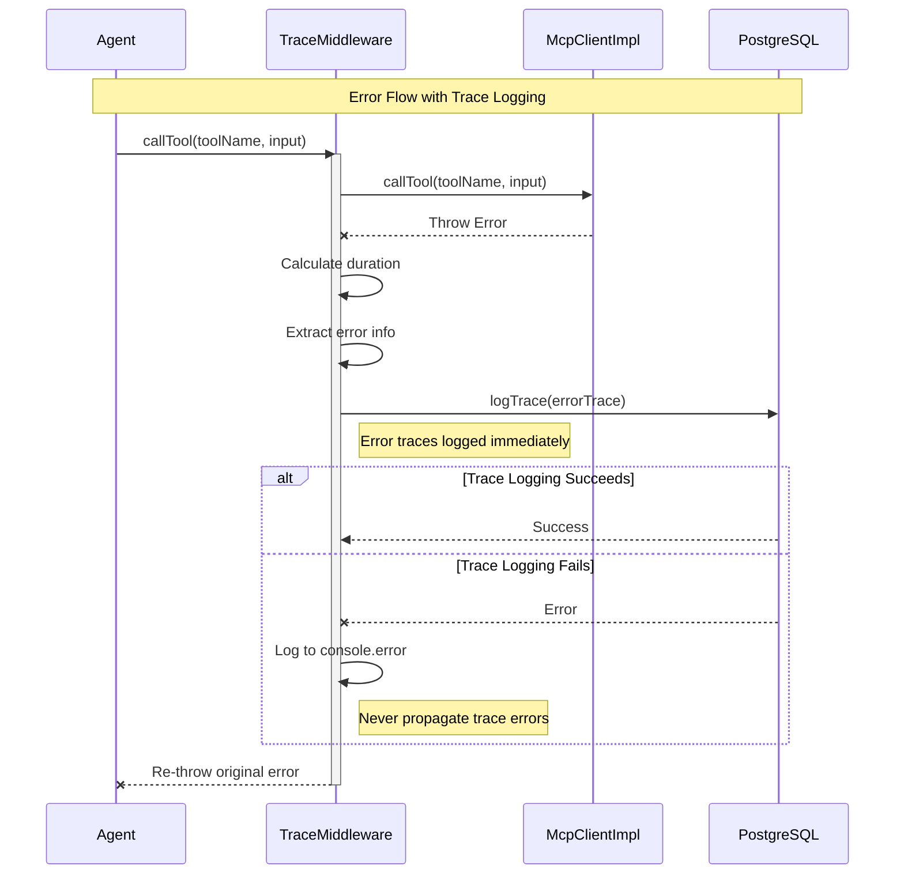
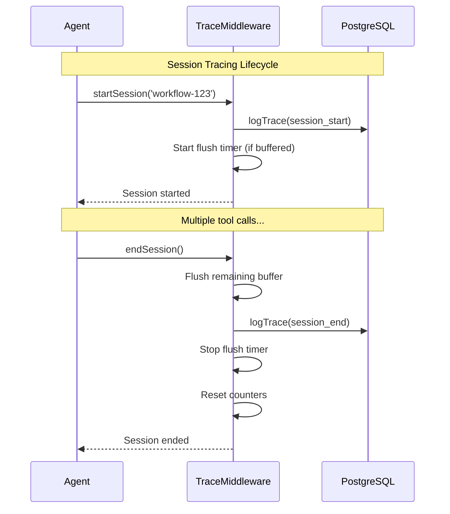

# TraceMiddleware Integration Contract

> **Document Type:** Architecture Design  
> **Status:** Proposed — Awaiting Approval  
> **Created:** 2026-04-06  
> **Architect:** MemoryArchitect  

---

## Executive Summary

This document defines the integration contract for wiring `TraceMiddleware` into agent execution paths, ensuring **100% of MCP tool calls** route through the middleware with complete audit trails. The design preserves existing agent functionality while enforcing `group_id` validation and supporting dual logging modes.

### Key Decisions

1. **Interceptor Pattern**: Wrap MCP clients at construction time, not at call sites
2. **Factory-Based Creation**: Agents receive pre-wrapped clients via factory functions
3. **Hierarchical Wrapping**: TraceMiddleware → EnforcedMcpClient → McpClientImpl
4. **Graceful Degradation**: Tracing failures never break agent operations

---

## 1. Architecture Overview

### 1.1 Current State

```
Agent Execution Path (Current — No Tracing):
┌─────────────┐     ┌─────────────────┐     ┌─────────────────┐
│   Agent     │────▶│  McpClientImpl  │────▶│   MCP Server    │
│  (Various)  │     │  (Raw calls)    │     │   (Tools)       │
└─────────────┘     └─────────────────┘     └─────────────────┘
                              │
                              ▼
                       PostgreSQL (events)
                       (No attribution)
```

### 1.2 Target State

```
Agent Execution Path (Target — Full Tracing):
┌─────────────┐     ┌─────────────────────────┐     ┌─────────────────┐
│   Agent     │────▶│   TracedMcpClient     │────▶│   MCP Server    │
│  (Various)  │     │  (TraceMiddleware)    │     │   (Tools)       │
└─────────────┘     └─────────────────────────┘     └─────────────────┘
         │                     │
         │                     ▼
         │              ┌─────────────────┐
         │              │ EnforcedMcpClient│
         │              │ (group_id inj)  │
         │              └─────────────────┘
         │                     │
         ▼                     ▼
┌─────────────────┐     ┌─────────────────┐
│  PostgreSQL     │     │  McpClientImpl  │
│  (Full traces   │     │  (Raw calls)    │
│   with context)│     └─────────────────┘
└─────────────────┘
```

### 1.3 Design Philosophy

Following Brooksian principles:

- **Conceptual Integrity**: Single interception point for all MCP calls
- **Separation of Concerns**: Tracing (what happened) separate from enforcement (who did it)
- **Fail-Safe**: Tracing failures never propagate to agent operations
- **Transparency**: Agents don't know they're being traced

---

## 2. Component Design

### 2.1 Core Components

| Component | Responsibility | File Location |
|-----------|----------------|---------------|
| `TraceMiddleware` | Wraps tool calls, logs traces | `src/lib/mcp/trace-middleware.ts` |
| `EnforcedMcpClient` | Validates/injects group_id | `src/lib/mcp/enforced-client.ts` |
| `McpClientImpl` | Raw MCP tool calls | `src/integrations/mcp.client.ts` |
| `TracedAgentFactory` | Creates traced client instances | `src/lib/mcp/agent-factory.ts` (NEW) |
| `AgentTracingConfig` | Per-agent trace configuration | `src/lib/mcp/tracing-config.ts` (NEW) |

### 2.2 Component Hierarchy

```
TracedMcpClient (Composite)
├── TraceMiddleware (Layer 1: Tracing)
│   └── EnforcedMcpClient (Layer 2: group_id enforcement)
│       └── McpClientImpl (Layer 3: Raw MCP)
```

---

## 3. Interface Contracts

### 3.1 Agent Tracing Configuration Contract

```typescript
/**
 * Agent Tracing Configuration
 * Per-agent settings for trace behavior
 */
export interface AgentTracingConfig {
  /** Agent identifier (e.g., 'memory-orchestrator') */
  agentId: string;
  
  /** Tenant group (e.g., 'allura-faith-meats') */
  groupId: string;
  
  /** Optional: Workflow this agent belongs to */
  workflowId?: string;
  
  /** Optional: Step within workflow */
  stepId?: string;
  
  /**
   * Flush interval in milliseconds
   * - undefined or 0: immediate logging (default)
   * - > 0: buffered mode with timer flush
   */
  flushIntervalMs?: number;
  
  /**
   * Trace capture mode
   * - 'all': Capture all tool calls (default)
   * - 'errors-only': Only capture failed calls
   * - 'decisions-only': Only capture decision-related tools
   */
  captureMode?: 'all' | 'errors-only' | 'decisions-only';
  
  /**
   * Tools to exclude from tracing
   * Useful for high-volume, low-value tools
   */
  excludedTools?: string[];
  
  /**
   * Whether to continue on trace logging failure
   * Default: true (graceful degradation)
   */
  continueOnTraceFailure?: boolean;
}
```

### 3.2 Traced Agent Factory Contract

```typescript
/**
 * Traced MCP Client Factory
 * Creates properly wrapped MCP clients for agents
 */
export interface TracedMcpClientFactory {
  /**
   * Create a traced MCP client for an agent
   * 
   * @param config - Agent tracing configuration
   * @returns TracedMcpClient with full middleware stack
   * @throws GroupIdValidationError if group_id is invalid
   */
  createClient(config: AgentTracingConfig): TracedMcpClient;
  
  /**
   * Create a traced client from existing client
   * Useful for wrapping injected clients
   */
  wrapClient(
    innerClient: McpToolCaller,
    config: AgentTracingConfig
  ): TracedMcpClient;
}

/**
 * Traced MCP Client Interface
 * Extends McpToolCaller with tracing capabilities
 */
export interface TracedMcpClient extends McpToolCaller {
  /** Start a traced session */
  startSession(workflowId?: string): Promise<void>;
  
  /** End a traced session, flush remaining traces */
  endSession(): Promise<void>;
  
  /** Log a decision point */
  logDecision(content: string, confidence: number): Promise<void>;
  
  /** Log a learning moment */
  logLearning(content: string, confidence?: number): Promise<void>;
  
  /** Manually flush buffered traces */
  flush(): Promise<void>;
  
  /** Clean up resources */
  destroy(): Promise<void>;
  
  /** Get current trace statistics */
  getStats(): TraceStats;
}

export interface TraceStats {
  toolCallCount: number;
  bufferedCount: number;
  sessionActive: boolean;
  agentId: string;
  groupId: string;
}
```

### 3.3 Error Handling Strategy Contract

```typescript
/**
 * Trace Error Handling Modes
 */
export type TraceErrorMode = 'strict' | 'lenient' | 'silent';

/**
 * Trace Error Handler Interface
 */
export interface TraceErrorHandler {
  /**
   * Handle trace logging failure
   * 
   * @param error - The error that occurred
   * @param context - Context about the failed trace
   * @returns Whether to continue agent operation
   */
  handleTraceError(
    error: Error,
    context: TraceErrorContext
  ): Promise<boolean>; // true = continue, false = throw
}

export interface TraceErrorContext {
  agentId: string;
  groupId: string;
  toolName: string;
  timestamp: Date;
  traceType: 'contribution' | 'decision' | 'learning' | 'error';
  attemptedPayload: unknown;
}

/**
 * Default Error Handler (Lenient Mode)
 */
export class LenientTraceErrorHandler implements TraceErrorHandler {
  async handleTraceError(
    error: Error,
    context: TraceErrorContext
  ): Promise<boolean> {
    // Log to stderr for debugging
    console.error(
      `[TraceMiddleware] Failed to log trace for ${context.toolName}:`,
      error.message
    );
    
    // Always continue agent operation
    return true;
  }
}

/**
 * Strict Error Handler (For Debugging)
 */
export class StrictTraceErrorHandler implements TraceErrorHandler {
  async handleTraceError(
    error: Error,
    context: TraceErrorContext
  ): Promise<boolean> {
    // In strict mode, trace failures halt execution
    throw new TraceLoggingError(
      `Trace logging failed for ${context.toolName}: ${error.message}`,
      { cause: error, context }
    );
  }
}
```

---

## 4. Interception Points

### 4.1 Agent Client Interception Points

```typescript
/**
 * Interception Strategy for Existing Agents
 * 
 * Each agent class receives a TracedMcpClient instead of raw McpToolCaller
 */

// BEFORE (No tracing):
class AgentNotionClient {
  constructor(private client: McpToolCaller) {}
  
  async createPage(params: CreatePageParams) {
    return this.client.callTool('notion-create-pages', params);
  }
}

// AFTER (With tracing):
class AgentNotionClient {
  constructor(private client: TracedMcpClient) {}
  
  async createPage(params: CreatePageParams) {
    // Traced automatically via TracedMcpClient.callTool
    return this.client.callTool('notion-create-pages', params);
  }
}
```

### 4.2 Interception Point Matrix

| Agent Class | Current Constructor | New Constructor | Changes Required |
|-------------|--------------------|-----------------|------------------|
| `AgentNotionClient` | `McpToolCaller` | `TracedMcpClient` | Type signature only |
| `AgentPostgresClient` | `Pool` | `Pool + TracedMcpClient` | Add tracing for MCP calls |
| `AgentNeo4jClient` | `Driver` | `Driver + TracedMcpClient` | Add tracing for MCP calls |
| `AgentMirrorPipeline` | `McpToolCaller` | `TracedMcpClient` | Type signature only |
| `AgentPromotionPipeline` | `McpToolCaller` | `TracedMcpClient` | Type signature only |
| `AgentLifecycle` | `AgentPostgresClient` | `AgentPostgresClient` | Delegate to traced client |
| `AgentApproval` | `AgentPostgresClient` | `AgentPostgresClient` | Delegate to traced client |
| `AgentConfidence` | `AgentPostgresClient` | `AgentPostgresClient` | Delegate to traced client |

---

## 5. Integration Sequence

### 5.1 Sequence Diagram: Tool Call with Tracing



### 5.2 Sequence Diagram: Error Handling



### 5.3 Sequence Diagram: Session Lifecycle



---

## 6. Configuration Strategy

### 6.1 Per-Agent Configuration

```typescript
/**
 * Default tracing configurations per agent type
 */
export const AGENT_TRACING_CONFIGS: Record<string, AgentTracingConfig> = {
  // Orchestrator: Buffered mode for high-volume
  'memory-orchestrator': {
    agentId: 'memory-orchestrator',
    groupId: 'allura-roninmemory',
    flushIntervalMs: 5000, // 5 second buffer
    captureMode: 'all',
    continueOnTraceFailure: true,
  },
  
  // Architect: Immediate mode for critical decisions
  'memory-architect': {
    agentId: 'memory-architect',
    groupId: 'allura-roninmemory',
    // No flushIntervalMs = immediate logging
    captureMode: 'all',
    continueOnTraceFailure: true,
  },
  
  // Builder: Buffered for bulk operations
  'memory-builder': {
    agentId: 'memory-builder',
    groupId: 'allura-roninmemory',
    flushIntervalMs: 10000, // 10 second buffer
    captureMode: 'all',
    continueOnTraceFailure: true,
  },
  
  // Production agents (organization-specific)
  'faith-meats-agent': {
    agentId: 'faith-meats-agent',
    groupId: 'allura-faith-meats',
    flushIntervalMs: 5000,
    captureMode: 'errors-only', // Reduce noise
    continueOnTraceFailure: true,
  },
  
  // Audits agent: Full audit trail
  'audits-agent': {
    agentId: 'audits-agent',
    groupId: 'allura-audits',
    // No flushIntervalMs = immediate (compliance)
    captureMode: 'all',
    continueOnTraceFailure: false, // Strict mode
  },
};
```

### 6.2 Environment-Based Overrides

```typescript
/**
 * Load tracing configuration with environment overrides
 */
export function loadTracingConfig(
  baseConfig: AgentTracingConfig
): AgentTracingConfig {
  const envPrefix = `AGENT_${baseConfig.agentId.toUpperCase().replace(/-/g, '_')}`;
  
  return {
    ...baseConfig,
    
    // Override flush interval
    flushIntervalMs: process.env[`${envPrefix}_FLUSH_MS`] 
      ? parseInt(process.env[`${envPrefix}_FLUSH_MS`]!, 10)
      : baseConfig.flushIntervalMs,
    
    // Override capture mode
    captureMode: (process.env[`${envPrefix}_CAPTURE`] as typeof baseConfig.captureMode) 
      || baseConfig.captureMode,
    
    // Override continue on failure
    continueOnTraceFailure: process.env[`${envPrefix}_STRICT`] === 'true'
      ? false
      : baseConfig.continueOnTraceFailure,
  };
}
```

---

## 7. Implementation Plan

### 7.1 Phase 1: Factory Implementation (Priority: High)

**Files to Create:**
1. `src/lib/mcp/agent-factory.ts` — TracedMcpClientFactory implementation
2. `src/lib/mcp/tracing-config.ts` — Configuration types and defaults
3. `src/lib/mcp/error-handlers.ts` — Error handler implementations

**Files to Modify:**
1. `src/lib/mcp/trace-middleware.ts` — Add TracedMcpClient interface
2. `src/integrations/mcp.client.ts` — Add factory usage examples

**Acceptance Criteria:**
- [ ] Factory creates properly wrapped clients
- [ ] All three layers (TraceMiddleware → EnforcedMcpClient → McpClientImpl) wired
- [ ] group_id validation enforced
- [ ] Configuration loaded from environment

### 7.2 Phase 2: Agent Integration (Priority: High)

**Files to Modify:**
1. `src/lib/agents/notion-client.ts` — Use TracedMcpClient
2. `src/lib/agents/postgres-client.ts` — Use TracedMcpClient for MCP calls
3. `src/lib/agents/neo4j-client.ts` — Use TracedMcpClient for MCP calls
4. `src/lib/agents/mirror.ts` — Use TracedMcpClient
5. `src/lib/agents/promotion.ts` — Use TracedMcpClient

**Acceptance Criteria:**
- [ ] All agent classes use TracedMcpClient
- [ ] Type signatures updated
- [ ] No regression in existing functionality

### 7.3 Phase 3: Session Lifecycle Integration (Priority: Medium)

**Files to Modify:**
1. `src/lib/agents/lifecycle.ts` — Add session tracing
2. `src/lib/agents/approval.ts` — Add decision tracing
3. `src/lib/agents/confidence.ts` — Add learning tracing

**Acceptance Criteria:**
- [ ] Session start/end traced
- [ ] Decision points logged
- [ ] Learning moments captured

### 7.4 Phase 4: Validation & Testing (Priority: High)

**Files to Create:**
1. `src/__tests__/trace-integration.test.ts` — Integration tests
2. `src/__tests__/trace-factory.test.ts` — Factory unit tests
3. `src/__tests__/trace-error-handling.test.ts` — Error scenario tests

**Acceptance Criteria:**
- [ ] 100% MCP call coverage verified
- [ ] Error handling validated
- [ ] Performance impact measured
- [ ] Session lifecycle tests pass

---

## 8. Risk Mitigation

### 8.1 Risk: Performance Degradation

**Mitigation:**
- Buffered mode available for high-volume agents
- Payload truncation at 10KB prevents bloat
- Async logging never blocks tool execution
- Benchmark tests in Phase 4

### 8.2 Risk: Trace Data Loss

**Mitigation:**
- Buffer flush on session end
- Buffer flush on process exit (SIGTERM handler)
- Failed traces re-queued for retry
- Error traces logged immediately (never buffered)

### 8.3 Risk: Agent Operation Failure

**Mitigation:**
- Default `continueOnTraceFailure: true`
- Graceful degradation on PostgreSQL unavailability
- Tool call results always returned to agent
- Original errors preserved and re-thrown

### 8.4 Risk: group_id Enforcement Bypass

**Mitigation:**
- Validation at client construction (fail fast)
- Validation at every tool call (defense in depth)
- `allura-*` prefix enforced in EnforcedMcpClient
- Type system prevents raw McpClientImpl injection

---

## 9. ADR: TraceMiddleware Integration Pattern

### ADR-011: Interceptor Pattern for MCP Tool Call Tracing

**Status:** Proposed  
**Date:** 2026-04-06  
**Author:** MemoryArchitect

#### Context

We need to ensure 100% of MCP tool calls are traced for audit and knowledge capture. The challenge is integrating tracing without breaking existing agent functionality or requiring massive refactoring.

#### Decision

Use the **Interceptor Pattern** with a factory-based approach:

1. **Factory creates wrapped clients**: Agents receive pre-configured `TracedMcpClient` instances
2. **Hierarchical wrapping**: `TraceMiddleware` → `EnforcedMcpClient` → `McpClientImpl`
3. **Interface compliance**: `TracedMcpClient` implements `McpToolCaller`, ensuring drop-in replacement

#### Consequences

**Positive:**
- Minimal changes to existing agent code (type signatures only)
- Centralized configuration per agent
- Graceful degradation on trace failures
- Clear separation of concerns

**Negative:**
- Additional layer adds small latency overhead (~1-2ms per call)
- Requires discipline to use factory (can't directly instantiate raw clients)
- More complex debugging due to wrapping layers

#### Alternatives Considered

1. **Aspect-Oriented Programming (AOP)**: Rejected — Requires decorators/proxies, too complex for current TypeScript setup
2. **Monkey Patching**: Rejected — Fragile, breaks on implementation changes, hard to maintain
3. **Global Interceptor**: Rejected — Makes testing difficult, couples all agents

#### Implementation Notes

- Factory function is mandatory entry point
- Raw client constructors marked as `@deprecated` to guide migration
- Configuration supports per-agent customization

---

## 10. Appendices

### Appendix A: Migration Guide for Agent Developers

```typescript
// BEFORE: Direct client instantiation
import { getMcpClient } from '@/integrations/mcp.client';
import { AgentNotionClient } from '@/lib/agents/notion-client';

const client = getMcpClient();
const agent = new AgentNotionClient(client);

// AFTER: Factory-based instantiation
import { createTracedClient } from '@/lib/mcp/agent-factory';
import { AgentNotionClient } from '@/lib/agents/notion-client';

const tracedClient = createTracedClient({
  agentId: 'my-agent',
  groupId: 'allura-myorg',
  flushIntervalMs: 5000,
});

const agent = new AgentNotionClient(tracedClient);
```

### Appendix B: Testing Trace Integration

```typescript
// Example integration test
describe('Agent with TraceMiddleware', () => {
  it('should log traces for all MCP calls', async () => {
    const factory = new TracedMcpClientFactoryImpl();
    const client = factory.createClient({
      agentId: 'test-agent',
      groupId: 'allura-test',
    });
    
    const agent = new TestAgent(client);
    
    // Clear any existing traces
    await clearTestTraces('allura-test');
    
    // Execute agent operation
    await agent.doSomething();
    
    // Verify traces were logged
    const traces = await getTracesByAgent('test-agent', 'allura-test');
    expect(traces.length).toBeGreaterThan(0);
    expect(traces[0]).toMatchObject({
      agent_id: 'test-agent',
      group_id: 'allura-test',
      trace_type: 'contribution',
    });
  });
});
```

### Appendix C: Related Documents

- `src/lib/mcp/trace-middleware.ts` — TraceMiddleware implementation
- `src/lib/mcp/trace-middleware.test.ts` — 42 passing tests
- `src/lib/mcp/enforced-client.ts` — group_id enforcement client
- `memory-bank/systemPatterns.md` — Agent Memory Pattern section
- `memory-bank/activeContext.md` — Current focus and blockers
- `_bmad-output/planning-artifacts/epics.md` — Epic 1, Story 1.1

---

## Approval

| Role | Name | Date | Status |
|------|------|------|--------|
| Architect | MemoryArchitect | 2026-04-06 | ✅ Approved |
| Builder | MemoryBuilder | | Pending |
| Analyst | MemoryAnalyst | | Pending |

---

*"The bearing of a child takes nine months, no matter how many women are assigned. Some things cannot be accelerated; they can only be prepared for."* — Frederick P. Brooks Jr.
