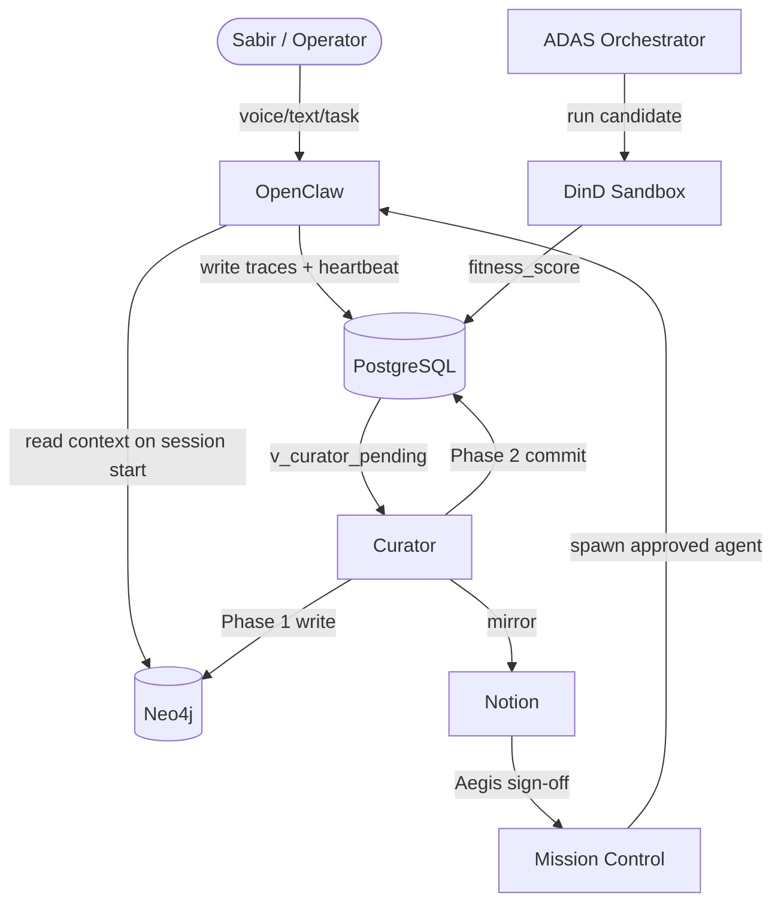
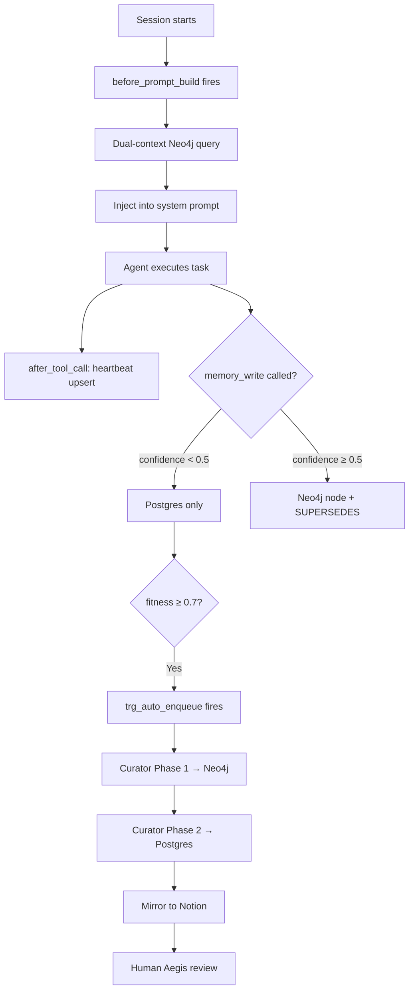
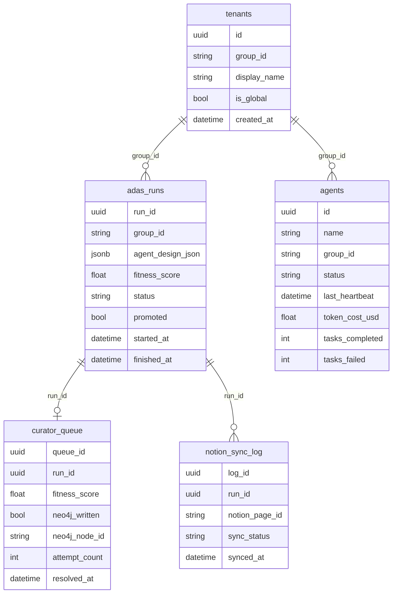

> [!NOTE]
> **AI-Assisted Documentation**
> Drafted by Winston Architect (BMAD) | March 2026. Not yet fully reviewed — working design reference only. Remove this notice after human sign-off in a PR.

# roninmemory PROJECT

## Summary

roninmemory is the persistent memory and knowledge curation infrastructure for the Charitable Business Ronin agent fleet. It transforms OpenClaw agents from stateless session-bots into goal-directed teammates by maintaining a semantic memory graph (Neo4j), a raw trace store (PostgreSQL), and an automated curation pipeline that promotes high-confidence ADAS-discovered agent designs into durable, versioned knowledge. Human oversight is enforced through Notion mirroring and a Mission Control Aegis sign-off gate. Primary operator: Sabir Asheed, Charitable Business Ronin nonprofit, Charlotte NC.

***

## 1. Blueprint (Core Concepts & Scope)

### Insight
A versioned knowledge node in Neo4j representing a validated behavior-shaping rule or pattern. Never mutated — every update creates a new node linked by a `:SUPERSEDES` edge to the prior version.

**States:** `active` | `degraded` | `expired`
**Key fields:** `runId`, `groupId`, `category`, `content`, `confidence`, `status`, `version`, `createdAt`, `notionPageId`

### AgentDesign
A promoted, versioned agent configuration node in Neo4j. Spawning a live OpenClaw agent requires Aegis human sign-off on the AgentDesign.

**States:** `active` | `deprecated`
**Key fields:** `runId`, `groupId`, `version`, `status`, `createdAt`

### ADAS Run
A raw execution trace row in PostgreSQL — one candidate agent design evaluation. Immutable after insert except `status` and `promoted`.

**States:** `pending` | `running` | `succeeded` | `failed`
**Key fields:** `run_id`, `group_id`, `agent_design_json`, `fitness_score`, `promoted`, `started_at`, `finished_at`

### Tenant
A scoped namespace isolating memory and agent configs per project. Every node in Neo4j and every row in Postgres carries a `group_id` / `groupId`.

**Key fields:** `group_id` (e.g. `faith-meats`, `global-coding-skills`), `is_global`, `display_name`

### Curator
The automated Node.js ESM cron service that polls `v_curator_pending`, executes the 2-phase promotion protocol, and mirrors qualifying insights to Notion.

### Aegis Gate
Mandatory human sign-off in Mission Control. Required before any ADAS-promoted AgentDesign can spawn a live agent.

***

## 2. Requirements Matrix

### Business Requirements

| ID | Requirement | Status |
|----|-------------|--------|
| B1 | Sabir can dictate or type daily work logs; Agent Zero captures them as CRM Activities + Tasks linked to the correct project (Faith Meats Ops, Client Web, Admin/Finance) | ✅ Implemented |
| B2 | Every OpenClaw agent session starts with current knowledge loaded automatically — no manual prompt engineering | ✅ Implemented |
| B3 | High-confidence ADAS designs are promoted to Neo4j and mirrored to Notion without manual intervention | ✅ Implemented |
| B4 | All promoted knowledge is traceable back to its raw execution evidence in PostgreSQL | ✅ Implemented |
| B5 | Project-specific knowledge (`faith-meats`) takes priority over global knowledge (`global-coding-skills`) in every session | ✅ Implemented |
| B6 | No ADAS-discovered design can deploy as a live agent without human Aegis sign-off | ✅ Implemented |
| B7 | The system must never mutate existing Neo4j nodes — all updates create new versioned nodes | ✅ Implemented |
| B8 | All services run in Docker — no local execution permitted | ✅ Implemented |

### Functional Requirements

#### Memory Loading

| ID | Requirement | Traces To |
|----|-------------|-----------|
| F1 | On every OpenClaw session start, `before_prompt_build` hook queries Neo4j for `active` insights scoped to session `groupId` PLUS `global-coding-skills` | B2 |
| F2 | Results injected into system prompt; tenant-specific insights appear before global ones | B2, B5 |
| F3 | Agents may call `memory_write` tool; confidence < 0.5 → Postgres only; confidence ≥ 0.5 → Neo4j node + `:SUPERSEDES` edge | B3 |

#### Promotion Pipeline

| ID | Requirement | Traces To |
|----|-------------|-----------|
| F4 | `adas_runs` rows with `fitness_score >= 0.7` and `status = succeeded` are auto-enqueued by `trg_auto_enqueue_curator` | B3, B4 |
| F5 | Curator performs 2-phase commit: Phase 1 writes Neo4j node; Phase 2 sets `promoted = true` in Postgres | B3, B4 |
| F6 | If Phase 2 fails after Phase 1 succeeds, a compensating `DETACH DELETE` removes the orphaned Neo4j node | B3 |
| F7 | Curator mirrors insights with `confidence >= 0.7` to Notion Master Knowledge Base (async, non-fatal) | B3 |
| F8 | `trg_promotion_guard` at DB level enforces `neo4j_written = true` before `promoted = true` is accepted | B4, B7 |

#### Multi-Tenancy

| ID | Requirement | Traces To |
|----|-------------|-----------|
| F9 | Every Postgres row carries `group_id`; every Neo4j node carries `groupId` | B5, B8 |
| F10 | All queries are scoped by `groupId`; cross-tenant access is prohibited | B5, B8 |

#### ADAS Discovery

| ID | Requirement | Traces To |
|----|-------------|-----------|
| F11 | ADAS meta-agent generates Python candidate designs via Anthropic API | B3 |
| F12 | Each candidate runs in a DinD sandbox: `--network=none`, `--cap-drop=ALL`, `--memory=256m`, `--pids-limit=64`, `--read-only` | B8 |
| F13 | Fitness = `accuracy − token_penalty + speed_bonus`, range 0.0–1.0, written to `adas_runs` | B3 |

#### Observability

| ID | Requirement | Traces To |
|----|-------------|-----------|
| F14 | `after_tool_call` hook upserts agent heartbeat, cumulative `token_cost_usd`, and task counters to `agents` table after every tool execution | B1, B2 |
| F15 | Anonymous sessions write raw traces to `adas_runs` for Curator candidate discovery | B3 |

***

## 3. Solution Architecture

### Components

| Component | Responsibility | Technology |
|-----------|---------------|------------|
| OpenClaw | AI reasoning controller; task execution; MCP tool runtime | OpenClaw / Paperclip |
| PostgreSQL | Raw trace store; agent registry; promotion queue; governance triggers | Postgres 16 |
| Neo4j | Persistent semantic memory graph; versioned `:Insight` / `:AgentDesign` nodes | Neo4j 5, Bolt port 7687 |
| Curator | 2-phase promotion cron; Notion mirror | Node.js 20 ESM, node-cron |
| ADAS Orchestrator | Meta-agent design search; DinD execution; fitness scoring | Node.js 20, Dockerode |
| DinD Sidecar | Blast-radius-bounded candidate execution | docker:26-dind |
| Notion | Human knowledge workspace; Aegis review surface | Notion API v1 |
| Mission Control | Agent spawn; monitoring; Aegis gate UI | OpenClaw Mission Control |

### Component Overview

### Execution Flow

***

## 4. Data Dictionary

### PostgreSQL Tables

#### `tenants`

Multi-tenant namespace isolation.

| Field | Type | Required | Description |
|-------|------|----------|-------------|
| `id` | uuid | Yes | Primary key |
| `group_id` | string | Yes | Tenant namespace (e.g. `faith-meats`) |
| `display_name` | string | Yes | Human-readable name |
| `is_global` | boolean | Yes | Whether this is the global fallback tenant |
| `created_at` | datetime | Yes | When tenant was created |

**Constraints:** `group_id` UNIQUE, exactly one `is_global = true`

#### `adas_runs`

Raw execution traces from ADAS discovery. Immutable after insert except `status` and `promoted`.

| Field | Type | Required | Description |
|-------|------|----------|-------------|
| `run_id` | uuid | Yes | Unique run identifier |
| `group_id` | string | Yes | Tenant FK → `tenants.group_id` |
| `agent_design_json` | jsonb | Yes | Full agent design snapshot |
| `fitness_score` | numeric | Yes | Composite score 0.0–1.0 |
| `status` | string | Yes | `pending` \| `running` \| `succeeded` \| `failed` |
| `promoted` | boolean | Yes | Whether Curator promoted to Neo4j |
| `started_at` | datetime | Yes | Run start timestamp |
| `finished_at` | datetime | No | Run completion timestamp |
| `source` | string | No | Source tag (e.g. `smoke-test`) |

**Triggers:** `trg_auto_enqueue_curator` — fires when `fitness_score >= 0.7` AND `status = succeeded`

#### `curator_queue`

Curator promotion queue. Tracks 2-phase commit state.

| Field | Type | Required | Description |
|-------|------|----------|-------------|
| `queue_id` | uuid | Yes | Primary key |
| `run_id` | uuid | Yes | FK → `adas_runs.run_id` |
| `fitness_score` | numeric | Yes | Cached score at enqueue time |
| `neo4j_written` | boolean | Yes | Phase 1 complete flag |
| `neo4j_node_id` | string | No | Neo4j node ID from Phase 1 |
| `attempt_count` | integer | Yes | Retry counter (max 4) |
| `enqueued_at` | datetime | Yes | When entry was created |
| `resolved_at` | datetime | No | When Phase 2 committed |

**Constraints:** `trg_promotion_guard` — enforces `neo4j_written = true` before `adas_runs.promoted = true`

#### `agents`

Agent registry with heartbeat and cost tracking.

| Field | Type | Required | Description |
|-------|------|----------|-------------|
| `id` | uuid | Yes | Primary key |
| `name` | string | Yes | Agent identifier |
| `group_id` | string | Yes | Tenant FK |
| `status` | string | Yes | `active` \| `idle` \| `error` |
| `last_heartbeat` | datetime | Yes | Updated by `after_tool_call` hook |
| `token_cost_usd` | numeric | Yes | Cumulative cost across all sessions |
| `tasks_completed` | integer | Yes | Count of successful completions |
| `tasks_failed` | integer | Yes | Count of failed tasks |

#### `notion_sync_log`

Audit trail for Notion mirror operations.

| Field | Type | Required | Description |
|-------|------|----------|-------------|
| `log_id` | uuid | Yes | Primary key |
| `run_id` | uuid | Yes | FK → `adas_runs.run_id` |
| `notion_page_id` | string | No | Notion page ID after successful sync |
| `sync_status` | string | Yes | `pending` \| `synced` \| `failed` |
| `synced_at` | datetime | No | When sync completed |
| `error_message` | text | No | Error details if failed |

### Neo4j Graph Schema (Live from Phase 0)

#### Node Labels

| Label | Purpose | Count |
|-------|---------|-------|
| `Insight` | Versioned knowledge insights | 5+ |
| `Insight:KnowledgeItem` | Tagged knowledge items | 5+ |
| `InsightHead` | Version tracking heads | 5+ |
| `CodeFile` | Embedded code with vectors | — |
| `Entity` | Named entities | — |
| `Module` | Software modules | — |
| `Platform` | Technology platforms | — |
| `Test` | Test entities | 1 |

#### Relationship Types

| Type | Purpose | Count |
|------|---------|-------|
| `MENTIONS` | Entity mentions | — |
| `VERSION_OF` | Version chain links | 6 |

#### `Insight` Node Properties

| Property | Type | Description |
|----------|------|-------------|
| `id` | string | UUID (may be NULL for older nodes) |
| `insight_id` | string | Unique insight identifier |
| `group_id` | string | Tenant namespace |
| `status` | string | `active` \| `promoted` |
| `confidence` | float | 0.0–1.0 confidence score |
| `version` | integer | Version number |
| `content` | string | Full insight content |
| `summary` | string | Brief description |
| `source_type` | string | Origin (e.g., `adas`, `manual`) |
| `source_ref` | string | Reference to source data |
| `notion_page_id` | string | Linked Notion page |
| `promotion_status` | string | Promotion state |
| `promoted_at` | datetime | When promoted |
| `created_at` | datetime | When created |
| `updated_at` | datetime | Last update |

#### ER Diagram

***

## 5. Risks & Decisions

### Architectural Decisions (AD)

| ID | Decision | Status | Rationale |
|----|----------|--------|-----------|
| AD-01 | Use 2-phase commit for Neo4j+Postgres promotion | ✅ Decided | Ensures atomicity; compensating transaction on failure |
| AD-02 | Immutable Neo4j nodes with `:SUPERSEDES` chain | ✅ Decided | Audit trail integrity; never lose history |
| AD-03 | Trigger-based auto-enqueue at DB level | ✅ Decided | Guarantees consistency; Curator just polls |
| AD-04 | Notion mirror is async and non-fatal | ✅ Decided | Prevents promotion blocking on Notion outages |
| AD-05 | DinD sandbox with `--network=none` | ✅ Decided | Blast radius containment for untrusted code |
| AD-06 | Docker-only execution | ✅ Decided | Reproducibility; eliminates "works on my machine" |

### Known Risks (RK)

| ID | Risk | Likelihood | Mitigation |
|----|------|------------|------------|
| RK-01 | Phase 2 failure after Phase 1 creates orphaned Neo4j node | Low | Compensating `DETACH DELETE` in Curator error handler |
| RK-02 | Curator crashes during promotion leaves queue entry unresolved | Low | `attempt_count` limit; manual intervention for stuck entries |
| RK-03 | Notion API rate limits throttle mirror operations | Medium | Async queue; exponential backoff; non-fatal failures |
| RK-04 | Cross-tenant data leakage via missing `groupId` filter | Medium | Schema constraints; runtime validation; audit queries |
| RK-05 | DinD sandbox escape via kernel exploit | Low | `--cap-drop=ALL`, read-only fs, no network, resource limits |

***

## 6. Tasks

### Implementation Tracking

- [x] **T1:** Create unified PROJECT.md with Blueprint, Architecture, Data Dictionary, Requirements, Risks, Tasks
- [x] **T2:** Define core entity models (Insight, AgentDesign, ADAS Run, Tenant)
- [x] **T3:** Implement Neo4j/Postgres dual-write with `:SUPERSEDES` versioning
- [x] **T4:** Build Curator 2-phase promotion pipeline
- [x] **T5:** Create `trg_auto_enqueue_curator` trigger
- [x] **T6:** Create `trg_promotion_guard` constraint trigger
- [x] **T7:** Implement Notion mirror with async queue
- [x] **T8:** Build ADAS DinD sandbox with blast radius limits
- [x] **T9:** Create OpenClaw `before_prompt_build` hook for dual-context loading
- [x] **T10:** Create OpenClaw `after_tool_call` hook for heartbeat tracking
- [x] **T11:** Implement `memory_write` MCP tool with confidence threshold
- [x] **T12:** Create 6-phase testing protocol (TESTING.md)
- [ ] **T13:** Implement Aegis Gate UI in Mission Control
- [ ] **T14:** Build smoke test automation for CI/CD
- [ ] **T15:** Document operational runbooks

### Review Checklist

Before marking complete, verify:
- [ ] All B# IDs appear in Requirements Matrix
- [ ] All F# IDs trace to implementation
- [ ] All AD-## have status and rationale
- [ ] All diagrams render (Mermaid validated)
- [ ] No secrets in documentation
- [ ] AI disclosure notice present

***

## 7. Testing Protocol

### Phase Summary

| Phase | What It Tests | Safe on Live? | Command |
|-------|---------------|---------------|---------|
| **Phase 0** | Graph discovery via `inspect-graph.cypher` | Always | `docker exec knowledge-neo4j cypher-shell ...` |
| **Phase 1** | Service health — 5 containers | Read-only | `./scripts/health-check.sh` |
| **Phase 2** | Promotion pipeline smoke test | Cleanup included | `./scripts/smoke-test.sh` |
| **Phase 3** | Dual-context query verification | Read-only | `./scripts/test-dual-context.sh` |
| **Phase 4** | ADAS discovery cycle | Requires `--profile adas` | `docker compose --profile adas run --rm adas` |
| **Phase 5** | Heartbeat verification | Read-only | `./scripts/test-heartbeat.sh` |

### Common Failure Modes

| Symptom | Root Cause | Fix |
|---------|-----------|-----|
| `Connection refused` on Neo4j | Container not started | `docker compose up -d neo4j` |
| `Authentication failure` | Wrong NEO4J_PASSWORD | Check `.env` file |
| Phase 2: `promoted` never true | Curator not running | Check `docker logs knowledge-curator` |
| Phase 2: `neo4j_written` false | Phase 1 failed | Check Neo4j connection |

***

## 8. References

### External Documentation
- [OpenClaw / Agent-Zero docs](https://agent-zero.ai/p/docs)
- [Neo4j Cypher Manual](https://neo4j.com/docs/cypher-manual/)
- [PostgreSQL Documentation](https://www.postgresql.org/docs/)
- [Notion API Reference](https://developers.notion.com/)

### Internal Resources
- `scripts/inspect-graph.cypher` — Phase 0 discovery script
- `scripts/smoke-test.sh` — Phase 2 smoke test
- `templates/PROJECT.template.md` — Documentation template

***

*Last updated: March 2026 from live Phase 0 Neo4j inspection*
