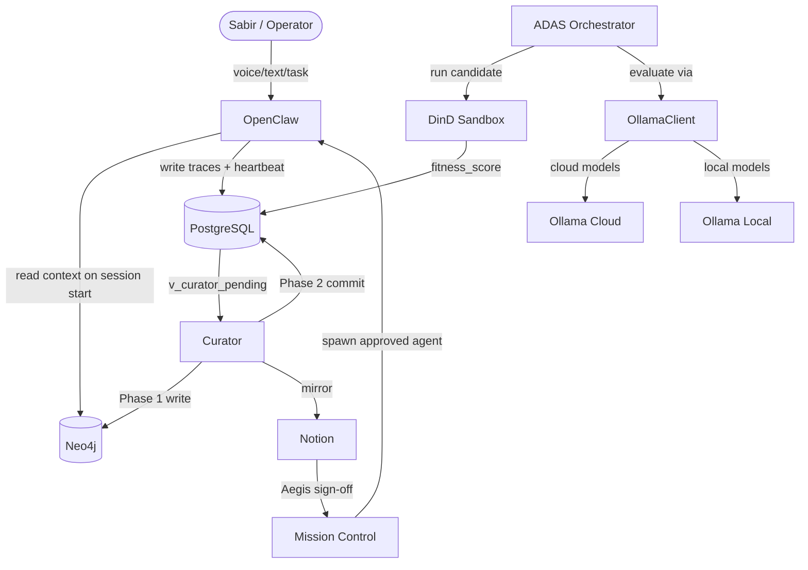
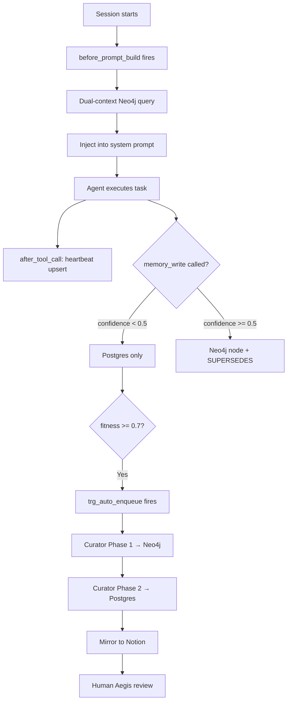
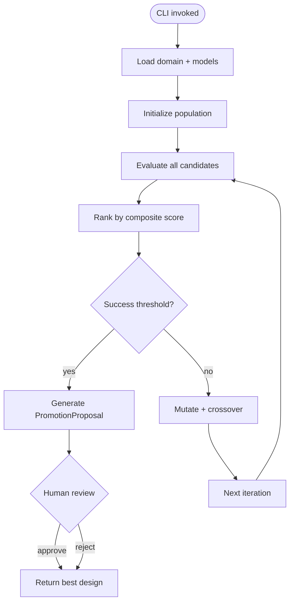
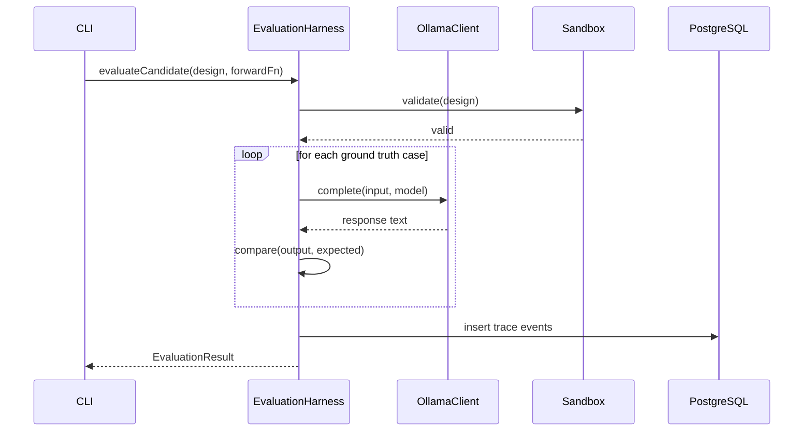

# roninmemory Solution Architecture

> [!NOTE]
> **AI-Assisted Documentation**
> Content has not yet been fully reviewed. This is a working design reference.

## 1. Components & Execution Surface

### Core Components
| Component | Responsibility | Technology |
|-----------|---------------|------------|
| OpenClaw | AI reasoning controller; task execution; MCP tool runtime | OpenClaw / Paperclip |
| PostgreSQL | Raw trace store; agent registry; promotion queue | Postgres 16 |
| Neo4j | Persistent semantic memory graph | Neo4j 5, Bolt port 7687 |
| Curator | 2-phase promotion cron; Notion mirror | Node.js 20 ESM, node-cron |
| ADAS Orchestrator | Meta-agent design search; evolutionary SearchLoop | Node.js 20, Dockerode |
| OllamaClient | HTTP client for Ollama API | TypeScript |
| DinD Sidecar | Blast-radius-bounded candidate execution | docker:26-dind |
| Mission Control | Agent spawn; monitoring; Aegis gate UI | OpenClaw Mission Control |

### API Surface
roninmemory has no external REST API. All integration is via:

| Method | Channel | Used By |
|--------|---------|---------|
| `before_prompt_build` hook | OpenClaw plugin | Context load on session start |
| `after_tool_call` hook | OpenClaw plugin | Heartbeat + cost tracking |
| `memory_write` tool | OpenClaw MCP tool | Agent-initiated graph writes |
| ADAS CLI | Terminal | Standalone evolutionary search |
| Bolt (port 7687) | Neo4j driver | Curator, context-loader |
| Postgres TCP | pg client | Curator, ADAS, heartbeat hook |
| Notion REST API | HTTPS | Curator mirror |
| Mission Control | OpenClaw internal | Agent spawn, Aegis gate |

---

## 2. Logical Topologies

### 2.1 Overall Component Topology

### 2.2 Memory Session Flow

### 2.3 ADAS Execution Flow

### 2.4 Evaluation Sequence

