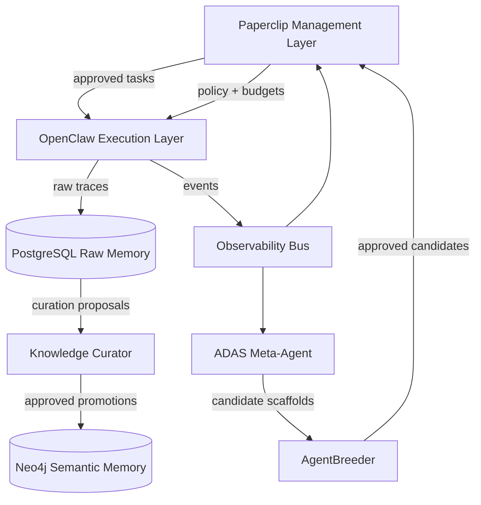
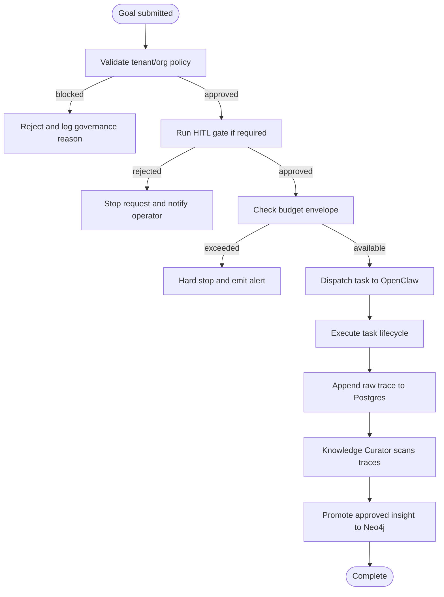
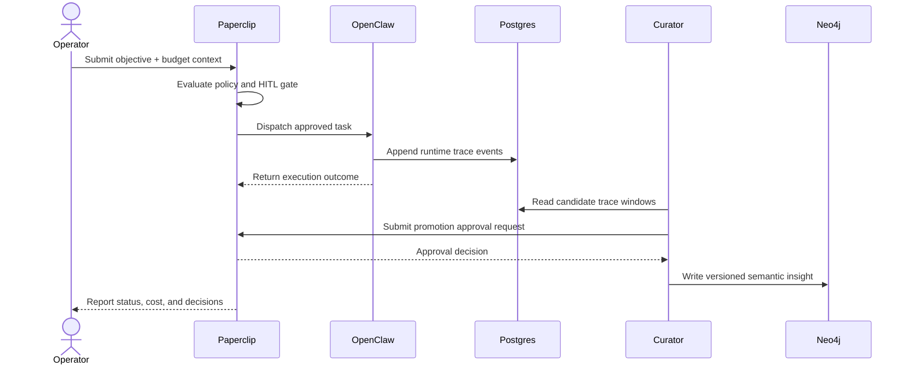
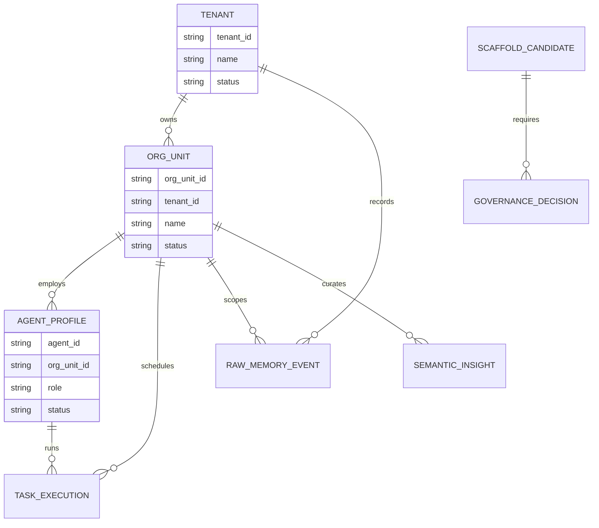
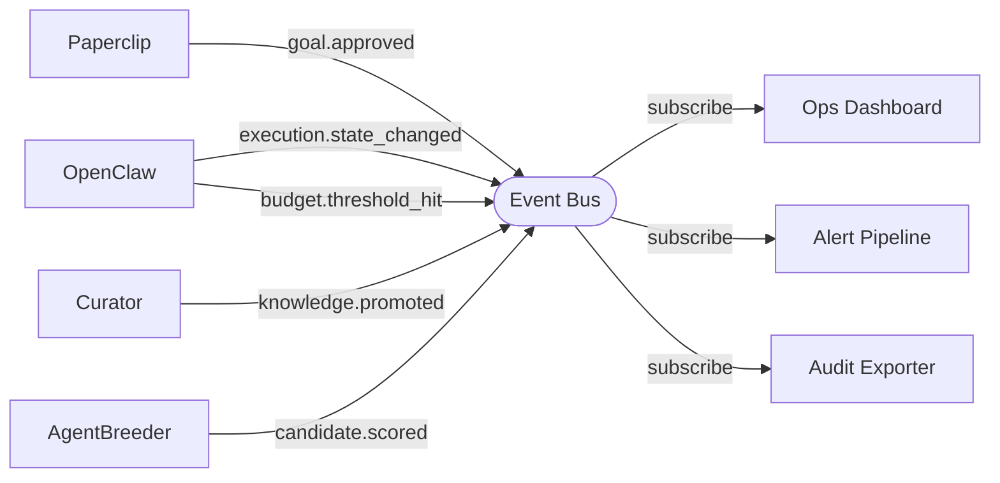

# Autonomous Enterprise Blueprint

> [!NOTE]
> **AI-Assisted Documentation**
> Portions of this document were drafted with the assistance of an AI language model (GitHub Copilot).
> Content has not yet been fully reviewed — this is a working design reference, not a final specification.
> AI-generated content may contain inaccuracies or omissions.
> When in doubt, defer to the source code, JSON schemas, and team consensus.

This blueprint defines a unified autonomous enterprise stack that separates management and governance (Paperclip), execution runtime (OpenClaw), and persistence (roninmemory), with a Meta-Agent sidecar for continuous design optimization and safety validation.

---

## Table of Contents

- [1) Core Concepts](#1-core-concepts)
- [2) Requirements](#2-requirements)
  - [Business Requirements](#business-requirements)
  - [Functional Requirements](#functional-requirements)
- [3) Architecture](#3-architecture)
  - [Components](#components)
- [4) Diagrams](#4-diagrams)
  - [Component Overview](#component-overview)
  - [Execution Flow](#execution-flow)
  - [Sequence Diagram](#sequence-diagram)
  - [Data Model (ER Diagram)](#data-model-er-diagram)
  - [Event-Driven Architecture](#event-driven-architecture)
- [5) Data Model](#5-data-model)
- [6) Execution Rules](#6-execution-rules)
- [7) Global Constraints](#7-global-constraints)
- [8) API Surface](#8-api-surface)
- [9) Logging & Audit](#9-logging--audit)
- [10) Admin Workflow](#10-admin-workflow)
- [11) Event-Driven Architecture](#11-event-driven-architecture)
- [12) References](#12-references)

---

## 1) Core Concepts

### Tenant

A tenant is the top-level isolation boundary for an autonomous enterprise deployment (for example, a company or business unit umbrella).

**States:** `active | paused | archived`

**Key fields:** `tenant_id`, `name`, `isolation_mode`, `status`

---

### Org Unit

An org unit is a department-level management scope inside a tenant (for example, Sales, Engineering, Operations). It owns goals, budgets, and agent rosters.

**States:** `active | frozen | retired`

**Key fields:** `org_unit_id`, `tenant_id`, `name`, `budget_policy_id`

---

### Agent Profile

An agent profile describes a digital employee identity (role, model/runtime defaults, permissions, tool policy, budget envelope) managed by Paperclip and executed by OpenClaw.

**States:** `candidate | approved | active | suspended | retired`

**Key fields:** `agent_id`, `role`, `runtime_target`, `policy_bundle`, `token_budget_monthly`

---

### Task Execution

A task execution is a single runtime work item routed to an OpenClaw agent, with deterministic lifecycle, retries, and auditable outcomes.

**States:** `queued | running | succeeded | failed | canceled | blocked`

**Key fields:** `execution_id`, `goal_id`, `agent_id`, `status`, `attempt_count`

---

### Raw Memory Event

Raw memory events are immutable Postgres records capturing runtime traces, decisions, tool calls, and outcomes.

**States:** `recorded` (append-only)

**Key fields:** `event_id`, `group_id`, `event_type`, `payload`, `occurred_at`

---

### Semantic Insight

A semantic insight is curated, versioned knowledge in Neo4j promoted from raw traces after curator and operator review.

**States:** `proposed | approved | published | superseded | rejected`

**Key fields:** `insight_id`, `group_id`, `version`, `confidence`, `source_event_refs`

---

### Scaffold Candidate

A scaffold candidate is an ADAS/AgentBreeder-produced agent design variant evaluated for capability and safety before promotion to production use.

**States:** `generated | benchmarked | safety_review | approved | rejected`

**Key fields:** `candidate_id`, `objective_set`, `capability_score`, `safety_score`, `lineage`

---

## 2) Requirements

### Business Requirements

| #   | Requirement                                                                                                                               |
| --- | ----------------------------------------------------------------------------------------------------------------------------------------- |
| B1  | Operators can define organizational structure, goals, and governance policies with explicit human approval gates for high-stakes actions. |
| B2  | Teams can run autonomous digital employees through OpenClaw while preserving controllability and communication across channels.           |
| B3  | The enterprise retains institutional memory with strict tenant isolation and promotion of trustworthy knowledge.                          |
| B4  | The system continuously improves agent designs while balancing capability and safety outcomes.                                            |
| B5  | Operators can enforce token/cost budgets and prevent runaway execution loops.                                                             |
| B6  | Auditors can reconstruct what happened, why it happened, and who approved it.                                                             |

---

### Functional Requirements

#### Management & Governance

| #                 | Requirement                                                                                                                 |
| ----------------- | --------------------------------------------------------------------------------------------------------------------------- |
| F1 | The system MUST provide tenant and org-unit management APIs with lifecycle state transitions.                               |
| F2 | The system MUST model goal ancestry from company goal to epic to task and bind execution to that lineage.                   |
| F3 | The system MUST enforce configurable HITL approval gates for high-risk actions (hire, promote, terminate, policy override). |
| F4 | The system MUST enforce monthly and per-run token budgets per agent and per org unit, with hard-stop semantics.             |

#### Runtime Execution

| #                 | Requirement                                                                                                 |
| ----------------- | ----------------------------------------------------------------------------------------------------------- |
| F5 | The system MUST register and version agent profiles that map Paperclip roles to OpenClaw runtime settings.  |
| F6 | The system MUST dispatch approved tasks from Paperclip into OpenClaw and capture task lifecycle events.     |
| F7 | The system MUST support retry policies, cancellation, and blocked-state handling for task execution.        |
| F8 | The system MUST support operator override controls across supported OpenClaw channels and control UI paths. |

#### Memory & Knowledge

| #                   | Requirement                                                                                                        |
| ------------------- | ------------------------------------------------------------------------------------------------------------------ |
| F9   | The system MUST append immutable raw memory traces to Postgres for every significant runtime and governance event. |
| F10 | The system MUST promote only curator-reviewed semantic insights into Neo4j with versioning metadata.               |
| F11 | The system MUST enforce strict `group_id` isolation for all read/write memory operations.                          |
| F12 | The system MUST support scoped recall queries by tenant, org unit, goal lineage, time window, and provenance.      |

#### Meta-Agent Optimization & Safety

| #                   | Requirement                                                                                                    |
| ------------------- | -------------------------------------------------------------------------------------------------------------- |
| F13 | The ADAS meta-agent MUST generate, execute, and score scaffold candidates in an isolated evaluation lane.      |
| F14 | AgentBreeder MUST run blue-mode and red-mode evaluations and record multi-objective safety/capability metrics. |
| F15 | Candidate promotion into production MUST require policy conformance checks and HITL approval.                  |
| F16 | Failure trajectories MUST be transformed into reusable lessons/skills with traceable provenance links.         |

#### Observability & Audit

| #                   | Requirement                                                                                          |
| ------------------- | ---------------------------------------------------------------------------------------------------- |
| F17 | The system MUST emit audit records for governance decisions, budget actions, and execution outcomes. |
| F18 | The system MUST provide alerts for budget drift, safety regressions, and policy violations.          |

---

## 3) Architecture

### Components

| Component               | Responsibility                                                         | Notes                             |
| ----------------------- | ---------------------------------------------------------------------- | --------------------------------- |
| Paperclip Control Plane | Org structure, goals, policy, approvals, budget governance             | Management and governance layer   |
| OpenClaw Runtime        | Agent execution, channel mediation, tool access, session orchestration | Execution layer                   |
| roninmemory Postgres    | Immutable raw traces and operational event storage                     | Persistence layer (raw)           |
| roninmemory Neo4j       | Curated semantic graph and versioned insights                          | Persistence layer (semantic)      |
| Knowledge Curator       | Proposes promotions from raw traces to semantic memory                 | Human-approved promotion workflow |
| ADAS Meta-Agent         | Searches scaffold design space and generates candidates                | Isolated evaluation runtime       |
| AgentBreeder Evaluator  | Blue/red safety and capability evaluation of candidates                | Feeds promotion decisions         |
| Observability Bus       | Event fan-out, alerts, lineage tracking                                | Supports dashboards and audits    |

---

## 4) Diagrams

### Component Overview

---

### Execution Flow

---

### Sequence Diagram

---

### Data Model (ER Diagram)

---

### Event-Driven Architecture

---

## 5) Data Model

### `tenant`

Top-level management and isolation boundary.

| Field            | Type     | Required | Description                |
| ---------------- | -------- | -------- | -------------------------- |
| `tenant_id`      | string   | Yes      | Stable tenant identifier   |
| `name`           | string   | Yes      | Display name               |
| `status`         | enum     | Yes      | Lifecycle state            |
| `isolation_mode` | enum     | Yes      | Isolation enforcement mode |
| `created_at`     | datetime | Yes      | Creation timestamp         |
| `updated_at`     | datetime | Yes      | Last update timestamp      |

**`status` values**

| Value      | Description                                    |
| ---------- | ---------------------------------------------- |
| `active`   | Tenant can run work                            |
| `paused`   | New work blocked; read-only operations allowed |
| `archived` | Tenant removed from active scheduling          |

---

### `task_execution`

Runtime execution records for approved goals.

| Field           | Type     | Required | Description                            |
| --------------- | -------- | -------- | -------------------------------------- |
| `execution_id`  | string   | Yes      | Stable execution identifier            |
| `goal_id`       | string   | Yes      | Goal lineage leaf this task belongs to |
| `agent_id`      | string   | Yes      | Assigned execution agent               |
| `group_id`      | string   | Yes      | Isolation partition key                |
| `status`        | enum     | Yes      | Task lifecycle status                  |
| `attempt_count` | integer  | Yes      | Number of attempts made                |
| `started_at`    | datetime | No       | First run start timestamp              |
| `finished_at`   | datetime | No       | Terminal timestamp                     |

**`status` values**

| Value       | Description                           |
| ----------- | ------------------------------------- |
| `queued`    | Accepted and waiting for runtime slot |
| `running`   | Currently executing                   |
| `succeeded` | Terminal success                      |
| `failed`    | Terminal failure                      |
| `canceled`  | Operator-initiated stop               |
| `blocked`   | Prevented by policy/budget/approval   |

---

## 6) Execution Rules

### Effective Definition Resolution

Runtime configuration resolves in order: tenant policy -> org-unit policy -> agent profile -> task overrides. Later scopes MAY narrow permissions but MUST NOT bypass higher-scope governance constraints.

### Eligibility Rules

Dispatch proceeds only when: tenant and org unit are active, required approvals are granted, budget headroom is available, and agent profile is approved/active.

### Failure Semantics

If execution fails, the system marks the attempt as failed, appends raw trace events, evaluates retry policy, and never mutates historical traces.

### Retry Semantics

Retries use bounded attempts and exponential backoff, and are disabled for explicit policy denials and budget-stop events.

### Cancellation

Cancellation transitions an active task to `canceled`, emits audit and event records, and frees associated runtime reservations.

---

## 7) Global Constraints

- A task MUST carry a valid `group_id` before any persistence write.
- Governance-denied actions MUST NOT execute through fallback channels.
- Budget hard stops MUST be atomic for each execution admission decision.
- Semantic promotions MUST reference immutable raw event IDs.
- Candidate scaffold promotion MUST require both safety thresholds and HITL approval.

---

## 8) API Surface

### Management APIs

| Method | Path                                | Description            |
| ------ | ----------------------------------- | ---------------------- |
| `POST` | `/v1/tenants`                       | Create tenant          |
| `GET`  | `/v1/tenants/{tenantId}`            | Get tenant             |
| `POST` | `/v1/org-units`                     | Create org unit        |
| `POST` | `/v1/approvals/{requestId}/resolve` | Resolve HITL gate      |
| `POST` | `/v1/budgets/check`                 | Budget admission check |

### Execution APIs

| Method | Path                             | Description                        |
| ------ | -------------------------------- | ---------------------------------- |
| `POST` | `/v1/tasks/dispatch`             | Dispatch approved task to OpenClaw |
| `POST` | `/v1/tasks/{executionId}/cancel` | Cancel execution                   |
| `GET`  | `/v1/tasks/{executionId}`        | Fetch execution status             |

### Memory APIs

| Method | Path                                          | Description                        |
| ------ | --------------------------------------------- | ---------------------------------- |
| `POST` | `/v1/memory/raw-events`                       | Append raw trace event             |
| `POST` | `/v1/memory/promotions`                       | Submit semantic promotion proposal |
| `POST` | `/v1/memory/promotions/{promotionId}/approve` | Approve promotion                  |
| `GET`  | `/v1/memory/insights`                         | Query semantic insights            |

### Meta-Agent APIs

| Method | Path                                         | Description                 |
| ------ | -------------------------------------------- | --------------------------- |
| `POST` | `/v1/meta/candidates/generate`               | Generate ADAS candidate     |
| `POST` | `/v1/meta/candidates/{candidateId}/evaluate` | Run AgentBreeder evaluation |
| `POST` | `/v1/meta/candidates/{candidateId}/promote`  | Promote approved candidate  |

---

## 9) Logging & Audit

| What                              | Where stored                     | Notes                                           |
| --------------------------------- | -------------------------------- | ----------------------------------------------- |
| Governance requests and decisions | Postgres (`governance_decision`) | Includes approver identity and rationale        |
| Task lifecycle events             | Postgres (`raw_memory_event`)    | Immutable append-only traces                    |
| Budget admissions and hard stops  | Postgres (`budget_ledger_entry`) | Used for compliance and alerts                  |
| Knowledge promotions              | Postgres + Neo4j                 | Proposal in Postgres, approved insight in Neo4j |
| Candidate evaluation metrics      | Postgres (`scaffold_candidate`)  | Includes capability and safety vectors          |

**Redacted fields:** `api_key`, `auth_token`, `secret_ref`, raw user PII, full prompt payloads containing credentials.

---

## 10) Admin Workflow

1. Define tenant and org units, then register governance policies and budget envelopes.
2. Register agent profiles and execution channels in OpenClaw.
3. Submit goals and review HITL approvals for high-risk actions.
4. Monitor execution status, costs, and alerts in control dashboards.
5. Review curator promotion requests and approve selected semantic insights.
6. Review ADAS/AgentBreeder candidate scores and approve or reject production promotion.

---

## 11) Event-Driven Architecture

**Producer (all events):** Paperclip, OpenClaw, Knowledge Curator, AgentBreeder
**Consumer(s):** audit exporter, alerting system, dashboards, model governance workflows

| Event                          | Trigger                                            |
| ------------------------------ | -------------------------------------------------- |
| `goal.approved`                | HITL gate resolves to approved for a goal dispatch |
| `execution.state_changed`      | Any task lifecycle transition                      |
| `budget.threshold_hit`         | Budget soft or hard threshold reached              |
| `knowledge.promotion.proposed` | Curator submits a semantic promotion proposal      |
| `knowledge.promotion.approved` | Operator approves promotion and publish occurs     |
| `candidate.scored`             | AgentBreeder evaluation completed                  |
| `candidate.promoted`           | Candidate approved for production profile use      |

---

## 12) References

### Project Documents

- [SOLUTION-ARCHITECTURE.md](SOLUTION-ARCHITECTURE.md)
- [DESIGN-MANAGEMENT.md](DESIGN-MANAGEMENT.md)
- [DESIGN-EXECUTION.md](DESIGN-EXECUTION.md)
- [DESIGN-MEMORY.md](DESIGN-MEMORY.md)
- [DESIGN-META-AGENT.md](DESIGN-META-AGENT.md)
- [REQUIREMENTS-MATRIX.md](REQUIREMENTS-MATRIX.md)
- [RISKS-AND-DECISIONS.md](RISKS-AND-DECISIONS.md)
- [DATA-DICTIONARY.md](DATA-DICTIONARY.md)

### JSON Schemas

- [`tenant.schema.json`](json-schema/tenant.schema.json)
- [`org-unit.schema.json`](json-schema/org-unit.schema.json)
- [`agent-profile.schema.json`](json-schema/agent-profile.schema.json)
- [`task-execution.schema.json`](json-schema/task-execution.schema.json)
- [`raw-memory-event.schema.json`](json-schema/raw-memory-event.schema.json)
- [`semantic-insight.schema.json`](json-schema/semantic-insight.schema.json)
- [`knowledge-promotion.schema.json`](json-schema/knowledge-promotion.schema.json)
- [`scaffold-candidate.schema.json`](json-schema/scaffold-candidate.schema.json)

### External Resources

- The Architectural Blueprints of Autonomy (internal source deck)
