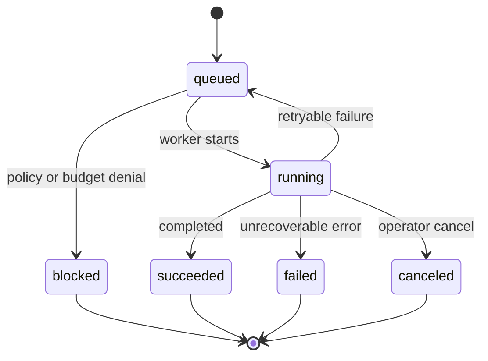

# Execution Design: /v1/tasks

> [!NOTE]
> **AI-Assisted Documentation**
> Portions of this document were drafted with the assistance of an AI language model (GitHub Copilot).
> Content has not yet been fully reviewed — this is a working design reference, not a final specification.
> AI-generated content may contain inaccuracies or omissions.
> When in doubt, defer to the source code, JSON schemas, and team consensus.

This document describes how approved work is dispatched to OpenClaw, executed through agent profiles, and tracked through deterministic task lifecycle semantics.

---

## Overview

The execution layer is responsible for taking governance-admitted work and running it safely. It maps management decisions into runtime envelopes, enforces tool/policy constraints, and emits full execution telemetry.

---

## Functional Requirements

| #                       | Requirement                                    | Satisfied by                              |
| ----------------------- | ---------------------------------------------- | ----------------------------------------- |
| [F5](BLUEPRINT.md#f5)   | Versioned agent profile registration           | runtime profile resolver                  |
| [F6](BLUEPRINT.md#f6)   | Dispatch from Paperclip to OpenClaw            | `POST /v1/tasks/dispatch`                 |
| [F7](BLUEPRINT.md#f7)   | Retry, cancellation, and blocked handling      | lifecycle state machine + cancel endpoint |
| [F8](BLUEPRINT.md#f8)   | Operator overrides through channels/control UI | override API and policy checks            |
| [F11](BLUEPRINT.md#f11) | Enforce `group_id` for isolation               | request validation guardrail              |
| [F18](BLUEPRINT.md#f18) | Alerting on regressions and policy violations  | event emission and alert hooks            |

---

## API Reference

### POST /v1/tasks/dispatch

Dispatches admitted work to an execution agent.

```json
{
  "executionId": "exe-001",
  "goalId": "goal-q2-release",
  "agentId": "agent-cto",
  "groupId": "acme-eng",
  "payload": {
    "instruction": "Prepare release readiness report"
  }
}
```

**Success:** `202 Accepted`

### POST /v1/tasks/{executionId}/cancel

Cancels an active execution.

**Success:** `200 OK`

### GET /v1/tasks/{executionId}

Returns task status and latest attempt metadata.

**Success:** `200 OK`

---

## State Machine



| State       | Description                           | Allowed next states                         |
| ----------- | ------------------------------------- | ------------------------------------------- |
| `queued`    | Accepted and waiting for execution    | `running`, `blocked`                        |
| `running`   | Currently executing                   | `succeeded`, `failed`, `queued`, `canceled` |
| `blocked`   | Denied by policy, approval, or budget | terminal                                    |
| `succeeded` | Terminal success                      | terminal                                    |
| `failed`    | Terminal failure                      | terminal                                    |
| `canceled`  | Canceled by operator or system        | terminal                                    |

---

## Retry Policy

Retries are bounded (`maxAttempts`), with exponential backoff and jitter. Non-retryable categories include policy denials, approval denials, and budget hard-stop denials.

---

## Use Cases

### EXE-UC1: Execute Admitted Task Successfully

**Actor:** Paperclip scheduler
**Precondition:** Request admitted by management layer
**Steps:**

1. Scheduler dispatches task.
2. OpenClaw resolves agent profile and executes.
3. Runtime emits lifecycle updates and terminal success.

**Postcondition:** Task status is `succeeded` with full trace.
**Requirement(s) satisfied:** [F5](BLUEPRINT.md#f5), [F6](BLUEPRINT.md#f6)

### EXE-UC2: Cancel Long-Running Task

**Actor:** Operator
**Precondition:** Task currently `running`
**Steps:**

1. Operator invokes cancel endpoint.
2. Runtime issues cancellation signal.
3. Task transitions to `canceled`.

**Postcondition:** Task is terminal canceled and no further attempts run.
**Requirement(s) satisfied:** [F7](BLUEPRINT.md#f7), [F8](BLUEPRINT.md#f8)

---

## Important Constraints

- Every dispatch MUST include a valid `group_id` and lineage references.
- Runtime MUST NOT execute tasks admitted under stale approval tokens.
- Cancellation MUST be idempotent.
- Retry attempts MUST re-check budget and approval before re-run.

**See also:**

- [BLUEPRINT.md](BLUEPRINT.md)
- [DESIGN-MANAGEMENT.md](DESIGN-MANAGEMENT.md)
- [DESIGN-MEMORY.md](DESIGN-MEMORY.md)
