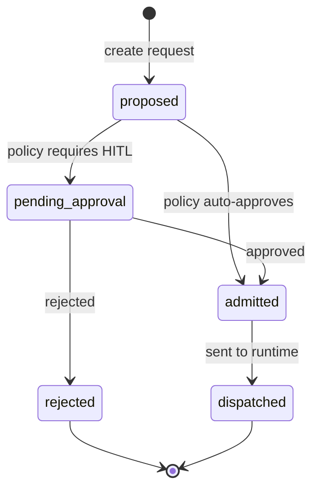

# Management Design: /v1/management

> [!NOTE]
> **AI-Assisted Documentation**
> Portions of this document were drafted with the assistance of an AI language model (GitHub Copilot).
> Content has not yet been fully reviewed — this is a working design reference, not a final specification.
> AI-generated content may contain inaccuracies or omissions.
> When in doubt, defer to the source code, JSON schemas, and team consensus.

This document specifies management and governance behavior for tenant/org administration, goal alignment, approval gates, and budget enforcement. It maps governance features to requirements in [BLUEPRINT.md](BLUEPRINT.md).

---

## Table of Contents

- [Overview](#overview)
- [Functional Requirements](#functional-requirements)
- [API Reference](#api-reference)
  - [POST /v1/tenants](#post-v1tenants)
  - [POST /v1/org-units](#post-v1org-units)
  - [POST /v1/goals](#post-v1goals)
  - [POST /v1/approvals/{requestId}/resolve](#post-v1approvalsrequestidresolve)
  - [POST /v1/budgets/check](#post-v1budgetscheck)
- [State Machine](#state-machine)
- [Goal Ancestry](#goal-ancestry)
- [Use Cases](#use-cases)
- [Important Constraints](#important-constraints)

---

## Overview

The management layer is the enterprise control plane. It creates organizational boundaries, tracks objective hierarchy, and gates runtime actions through explicit policy and approvals.

This design integrates closely with [DESIGN-EXECUTION.md](DESIGN-EXECUTION.md) because execution dispatch depends on admission outputs from this layer. It also integrates with [DESIGN-MEMORY.md](DESIGN-MEMORY.md) for durable decision traces.

---

## Functional Requirements

| #                       | Requirement                                               | Satisfied by                                                    |
| ----------------------- | --------------------------------------------------------- | --------------------------------------------------------------- |
| [F1](BLUEPRINT.md#f1)   | Tenant and org-unit management APIs with lifecycle states | `POST /v1/tenants`, `POST /v1/org-units`, state machine         |
| [F2](BLUEPRINT.md#f2)   | Goal ancestry from company goal to task                   | `POST /v1/goals`, goal lineage model                            |
| [F3](BLUEPRINT.md#f3)   | Configurable HITL approval gates                          | `POST /v1/approvals/{requestId}/resolve`, approval policy rules |
| [F4](BLUEPRINT.md#f4)   | Budget checks and hard-stop semantics                     | `POST /v1/budgets/check`                                        |
| [F15](BLUEPRINT.md#f15) | Promotion requires policy + HITL approval                 | approval gate handling for promotion class                      |
| [F17](BLUEPRINT.md#f17) | Governance decisions are auditable                        | governance decision write path                                  |

---

## API Reference

### POST /v1/tenants

Creates a tenant boundary.

**Request body**

```json
{
  "tenantId": "acme",
  "name": "Acme Corporation",
  "isolationMode": "strict"
}
```

**Success:** `201 Created`

### POST /v1/org-units

Creates an org unit under a tenant.

**Request body**

```json
{
  "orgUnitId": "acme-eng",
  "tenantId": "acme",
  "name": "Engineering",
  "monthlyTokenBudget": 3000000
}
```

**Success:** `201 Created`

### POST /v1/goals

Creates a goal node with ancestry links.

**Request body**

```json
{
  "goalId": "goal-q2-release",
  "tenantId": "acme",
  "orgUnitId": "acme-eng",
  "parentGoalId": "goal-company-revenue",
  "title": "Ship Q2 platform release"
}
```

**Success:** `201 Created`

### POST /v1/approvals/{requestId}/resolve

Resolves a pending approval request.

**Request body**

```json
{
  "decision": "approved",
  "actorId": "owner-123",
  "rationale": "Risk acceptable with sandbox constraints"
}
```

**Error responses:**

| Status | Code                         | Condition                |
| ------ | ---------------------------- | ------------------------ |
| `404`  | `APPROVAL_REQUEST_NOT_FOUND` | Unknown request          |
| `409`  | `APPROVAL_ALREADY_RESOLVED`  | Request already terminal |

### POST /v1/budgets/check

Evaluates whether an execution can be admitted under budget policy.

**Request body**

```json
{
  "tenantId": "acme",
  "orgUnitId": "acme-eng",
  "agentId": "agent-cto",
  "estimatedTokens": 12000
}
```

**Success:** `200 OK`

```json
{
  "allowed": true,
  "remainingTokens": 488000,
  "hardStop": false
}
```

---

## State Machine



| State              | Description                           | Allowed next states            |
| ------------------ | ------------------------------------- | ------------------------------ |
| `proposed`         | Request accepted and policy evaluated | `pending_approval`, `admitted` |
| `pending_approval` | Awaiting human decision               | `admitted`, `rejected`         |
| `admitted`         | Cleared for dispatch                  | `dispatched`                   |
| `rejected`         | Denied by governance                  | terminal                       |
| `dispatched`       | Sent to runtime layer                 | terminal                       |

---

## Goal Ancestry

Goal hierarchy is a directed acyclic graph rooted in company-level objectives. Each task admission MUST include a lineage path (`company -> initiative -> epic -> task`) for audit and reporting.

---

## Use Cases

### MGT-UC1: Approve High-Risk Candidate Promotion

**Actor:** Operator approver
**Precondition:** Candidate marked `safety_review`
**Steps:**

1. Operator reviews capability/safety scorecard.
2. Operator resolves approval with rationale.
3. System emits governance decision event.

**Postcondition:** Candidate becomes `approved` or `rejected`.
**Requirement(s) satisfied:** [F3](BLUEPRINT.md#f3), [F15](BLUEPRINT.md#f15), [F17](BLUEPRINT.md#f17)

### MGT-UC2: Block Dispatch on Budget Hard Stop

**Actor:** Paperclip scheduler
**Precondition:** Budget threshold reached
**Steps:**

1. Scheduler calls budget check.
2. Controller returns `hardStop=true`.
3. Scheduler marks request as denied.

**Postcondition:** No runtime dispatch occurs.
**Requirement(s) satisfied:** [F4](BLUEPRINT.md#f4), [F17](BLUEPRINT.md#f17)

---

## Important Constraints

- Admission MUST fail closed for unresolved or ambiguous approvals.
- Budget checks MUST run before every dispatch attempt, including retries.
- Approval decisions MUST include actor identity and rationale.
- Goal ancestry references MUST be immutable once a task is dispatched.

**See also:**

- [BLUEPRINT.md](BLUEPRINT.md)
- [DESIGN-EXECUTION.md](DESIGN-EXECUTION.md)
- [DESIGN-MEMORY.md](DESIGN-MEMORY.md)
