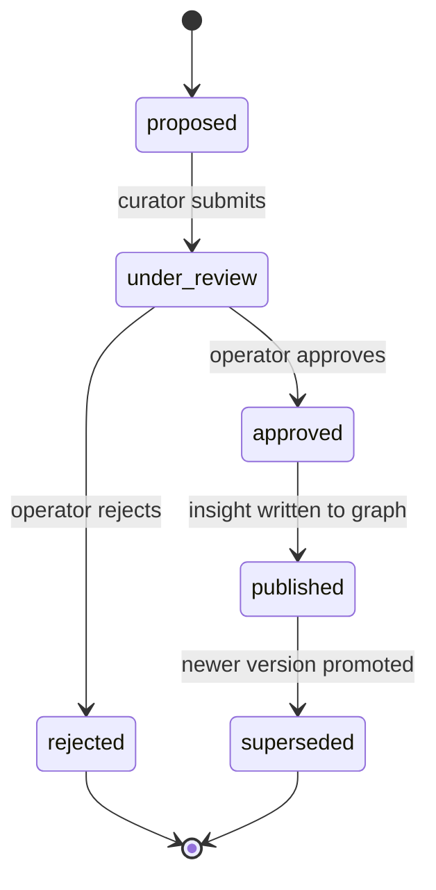

# Memory Design: /v1/memory

> [!NOTE]
> **AI-Assisted Documentation**
> Portions of this document were drafted with the assistance of an AI language model (GitHub Copilot).
> Content has not yet been fully reviewed — this is a working design reference, not a final specification.
> AI-generated content may contain inaccuracies or omissions.
> When in doubt, defer to the source code, JSON schemas, and team consensus.

This document defines dual-persistence memory behavior: immutable raw traces in Postgres and curated semantic insights in Neo4j.

---

## Overview

The memory layer captures enterprise history and institutional knowledge. It separates high-volume, append-only event recording from higher-quality semantic memory promotion.

---

## Functional Requirements

| #                       | Requirement                                  | Satisfied by                            |
| ----------------------- | -------------------------------------------- | --------------------------------------- |
| [F9](BLUEPRINT.md#f9)   | Immutable raw traces in Postgres             | `POST /v1/memory/raw-events`            |
| [F10](BLUEPRINT.md#f10) | Curator-reviewed semantic promotions         | promotion workflow APIs                 |
| [F11](BLUEPRINT.md#f11) | Strict `group_id` isolation                  | mandatory scope fields and query guards |
| [F12](BLUEPRINT.md#f12) | Scoped recall queries with provenance        | `GET /v1/memory/insights` filters       |
| [F16](BLUEPRINT.md#f16) | Failure trajectories become reusable lessons | curator transformation pipeline         |
| [F17](BLUEPRINT.md#f17) | Auditable memory actions                     | promotion and approval audit entries    |

---

## API Reference

### POST /v1/memory/raw-events

Appends an immutable event.

```json
{
  "eventId": "evt-001",
  "groupId": "acme-eng",
  "eventType": "execution.state_changed",
  "payload": {
    "executionId": "exe-001",
    "state": "failed"
  },
  "occurredAt": "2026-03-27T10:00:00Z"
}
```

### POST /v1/memory/promotions

Creates a promotion proposal.

### POST /v1/memory/promotions/{promotionId}/approve

Approves a proposal and writes versioned insight to Neo4j.

### GET /v1/memory/insights

Queries semantic memory by tenant scope and provenance filters.

---

## State Machine



---

## Use Cases

### MEM-UC1: Promote High-Value Failure Pattern

**Actor:** Knowledge Curator
**Precondition:** Raw traces contain repeated failure trajectory
**Steps:**

1. Curator aggregates relevant raw events.
2. Curator submits promotion proposal.
3. Operator approves proposal.
4. System writes semantic insight with source links.

**Postcondition:** Neo4j has published insight version linked to source traces.
**Requirement(s) satisfied:** [F10](BLUEPRINT.md#f10), [F16](BLUEPRINT.md#f16)

### MEM-UC2: Tenant-Scoped Recall Query

**Actor:** Execution agent
**Precondition:** Valid tenant and `group_id`
**Steps:**

1. Agent requests insights with scope filter.
2. Service validates scope alignment.
3. Service returns only scoped insights.

**Postcondition:** Query returns no cross-tenant leakage.
**Requirement(s) satisfied:** [F11](BLUEPRINT.md#f11), [F12](BLUEPRINT.md#f12)

---

## Important Constraints

- Raw events MUST be immutable and append-only.
- Promotion requests MUST include source event references.
- Graph updates MUST be versioned and reversible via supersession.
- Memory queries MUST enforce tenant and `group_id` constraints before retrieval.

**See also:**

- [BLUEPRINT.md](BLUEPRINT.md)
- [DESIGN-MANAGEMENT.md](DESIGN-MANAGEMENT.md)
- [DATA-DICTIONARY.md](DATA-DICTIONARY.md)
