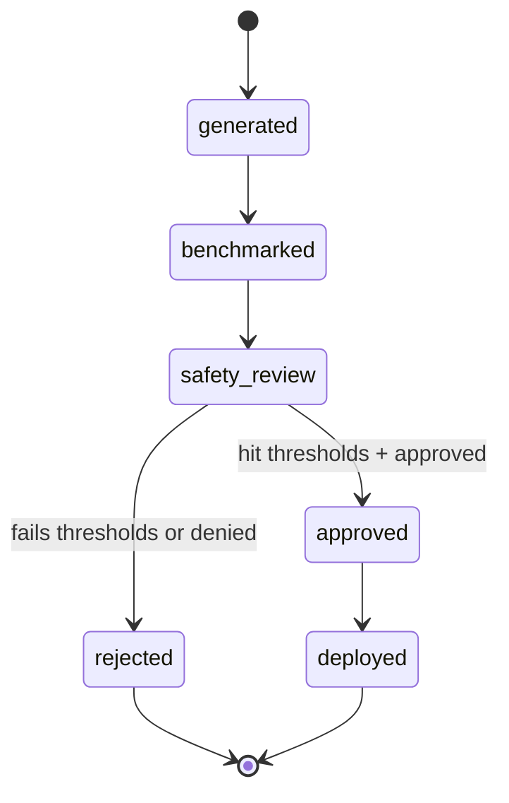

# Meta-Agent Design: /v1/meta

> [!NOTE]
> **AI-Assisted Documentation**
> Portions of this document were drafted with the assistance of an AI language model (GitHub Copilot).
> Content has not yet been fully reviewed — this is a working design reference, not a final specification.
> AI-generated content may contain inaccuracies or omissions.
> When in doubt, defer to the source code, JSON schemas, and team consensus.

This document defines how ADAS and AgentBreeder generate, evaluate, and promote scaffold candidates with joint capability and safety objectives.

---

## Overview

The meta-agent lane treats agent design as a search problem. ADAS proposes scaffold variants, AgentBreeder runs blue/red evaluations, and Paperclip decides promotion through governance constraints.

---

## Functional Requirements

| #                       | Requirement                                    | Satisfied by                               |
| ----------------------- | ---------------------------------------------- | ------------------------------------------ |
| [F13](BLUEPRINT.md#f13) | Candidate generation and isolated scoring lane | `POST /v1/meta/candidates/generate`        |
| [F14](BLUEPRINT.md#f14) | Blue/red multi-objective evaluation            | `POST /v1/meta/candidates/{id}/evaluate`   |
| [F15](BLUEPRINT.md#f15) | Governance-gated promotion                     | `POST /v1/meta/candidates/{id}/promote`    |
| [F16](BLUEPRINT.md#f16) | Failure trajectories become lessons            | lesson synthesis step in evaluation output |
| [F18](BLUEPRINT.md#f18) | Safety and drift alerts                        | regression alert events                    |

---

## API Reference

### POST /v1/meta/candidates/generate

Generates a scaffold candidate from objective set and seed lineage.

### POST /v1/meta/candidates/{candidateId}/evaluate

Runs benchmark suite in red and blue modes and stores scorecard.

### POST /v1/meta/candidates/{candidateId}/promote

Promotes candidate only if policy and approval conditions pass.

---

## State Machine

---

## Evaluation Metrics

- **Capability metric:** normalized task completion and quality score.
- **Safety metric:** adversarial robustness and policy-compliance score.
- **Pareto classification:** candidate position on capability/safety frontier.

---

## Use Cases

### META-UC1: Promote Balanced Candidate

**Actor:** Platform operator
**Precondition:** Candidate in `safety_review` with acceptable scorecard
**Steps:**

1. Operator reviews red/blue outputs.
2. Operator approves promotion request.
3. Candidate is promoted to active profile revision.

**Postcondition:** Candidate status is `deployed` and lineage is recorded.
**Requirement(s) satisfied:** [F14](BLUEPRINT.md#f14), [F15](BLUEPRINT.md#f15)

### META-UC2: Reject Unsafe High-Capability Candidate

**Actor:** Automated policy engine
**Precondition:** Capability score high, safety score below threshold
**Steps:**

1. Evaluation completes and emits scorecard.
2. Policy engine flags safety violation.
3. Candidate is rejected and alert emitted.

**Postcondition:** Candidate cannot be promoted without remediation.
**Requirement(s) satisfied:** [F14](BLUEPRINT.md#f14), [F18](BLUEPRINT.md#f18)

---

## Important Constraints

- Evaluation runtime MUST be isolated from production secrets and data.
- Promotion MUST require both threshold pass and approval resolution.
- Scorecards MUST be retained with full benchmark metadata for audit.
- Rejected candidates MUST remain queryable for postmortem analysis.

**See also:**

- [BLUEPRINT.md](BLUEPRINT.md)
- [DESIGN-MANAGEMENT.md](DESIGN-MANAGEMENT.md)
- [RISKS-AND-DECISIONS.md](RISKS-AND-DECISIONS.md)
