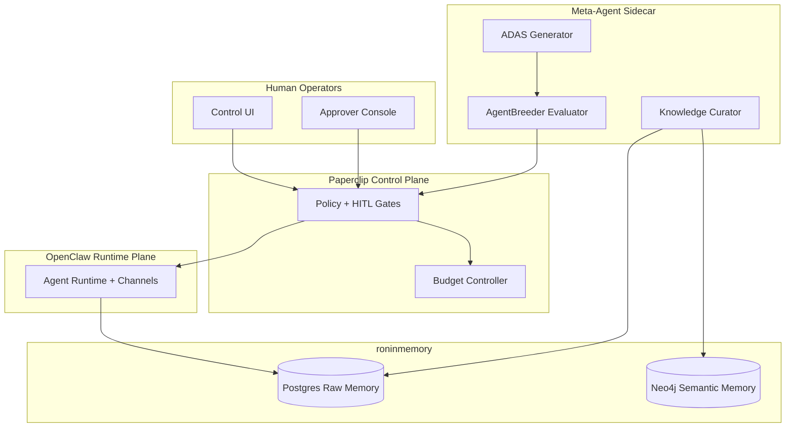
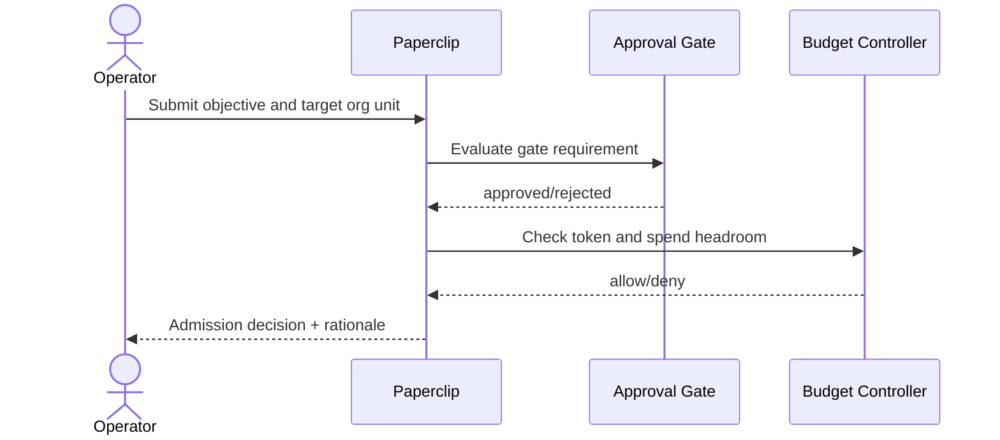
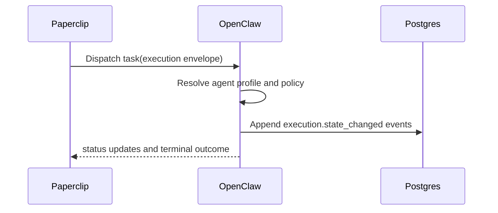
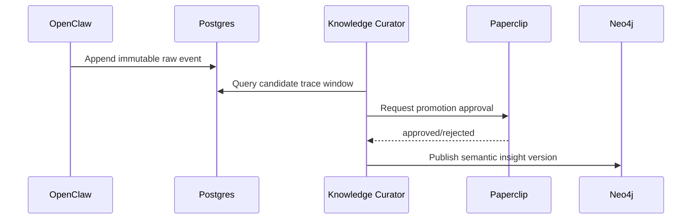
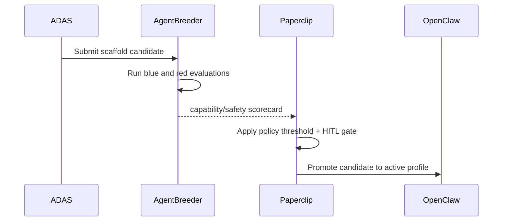

# Solution Architecture: Autonomous Enterprise Stack

> [!NOTE]
> **AI-Assisted Documentation**
> Portions of this document were drafted with the assistance of an AI language model (GitHub Copilot).
> Content has not yet been fully reviewed. This is a working design reference, not a final specification.
> AI-generated content may contain inaccuracies or omissions.
> When in doubt, defer to the source code, JSON schemas, and team consensus.

This document describes topology and interaction patterns for the autonomous enterprise stack defined in [BLUEPRINT.md](BLUEPRINT.md). The blueprint focuses on requirements, data, and API surface; this document focuses on who calls what and how architecture constraints govern those interactions.

---

## Table of Contents

- [1. Architectural Positioning](#1-architectural-positioning)
- [2. System Boundary and External Actors](#2-system-boundary-and-external-actors)
- [3. Logical Topologies](#3-logical-topologies)
  - [3.1 Governance and Admission Topology](#31-governance-and-admission-topology)
  - [3.2 Runtime Execution Topology](#32-runtime-execution-topology)
  - [3.3 Memory Curation Topology](#33-memory-curation-topology)
  - [3.4 Meta-Agent Evolution Topology](#34-meta-agent-evolution-topology)
- [4. Interface Catalogue](#4-interface-catalogue)
- [5. Risk-Architecture Traceability](#5-risk-architecture-traceability)
- [6. Key Architectural Constraints](#6-key-architectural-constraints)
- [7. References](#7-references)

---

## 1. Architectural Positioning

The stack is a hybrid control-plane plus execution-plane architecture. Paperclip is the control plane that owns goals, approvals, budgets, and policy. OpenClaw is the execution plane for digital employees. roninmemory is the persistence plane with dual storage (Postgres raw traces, Neo4j semantic knowledge). ADAS and AgentBreeder form a sidecar optimization plane.

| Consumer Class                   | Interaction Mode                        | Notes                                  |
| -------------------------------- | --------------------------------------- | -------------------------------------- |
| Operators and approvers          | Sync REST + async alerts                | Latency tolerant, correctness-critical |
| OpenClaw runtime agents          | Sync control calls + async event stream | Medium latency, high throughput        |
| Knowledge Curator                | Batch read/write pipeline               | Scheduled periodic jobs                |
| ADAS and AgentBreeder evaluators | Batch and asynchronous                  | Isolated from production runtime       |
| Audit and observability tools    | Streaming/event-driven                  | Must preserve provenance and ordering  |

---

## 2. System Boundary and External Actors

---

## 3. Logical Topologies

### 3.1 Governance and Admission Topology

This topology covers objective intake, approval gates, and budget admission checks before runtime dispatch.

**Key constraints:**

- Admission MUST fail closed when approval state is unknown. (AD-01)
- Budget checks MUST be atomic for each admission request. (AD-02, RK-02)

---

### 3.2 Runtime Execution Topology

This topology covers dispatch from Paperclip to OpenClaw and lifecycle event tracking.

**Key constraints:**

- Runtime MUST reject tasks missing `group_id`. (AD-03, RK-01)
- Operator cancel MUST transition to a terminal state exactly once. (AD-04)

---

### 3.3 Memory Curation Topology

This topology covers raw trace ingestion and curated promotion into semantic memory.

**Key constraints:**

- Semantic promotion MUST reference immutable source event IDs. (AD-05)
- Curator writes MUST be blocked without approval for policy-defined classes. (AD-06, RK-04)

---

### 3.4 Meta-Agent Evolution Topology

This topology covers ADAS candidate generation and AgentBreeder red/blue evaluation before production promotion.

**Key constraints:**

- Candidate promotion MUST require both safety threshold pass and explicit approval. (AD-07, RK-05)
- Evaluation lanes MUST remain isolated from production credentials/data. (AD-08, RK-06)

---

## 4. Interface Catalogue

| Interface                 | Direction     | Channel         | Payload / Contract                           | Risk / Decision |
| ------------------------- | ------------- | --------------- | -------------------------------------------- | --------------- |
| Operator UI -> Paperclip  | Inbound       | REST            | Goal requests, governance updates, approvals | AD-01, RK-03    |
| Paperclip -> OpenClaw     | Outbound      | REST / RPC      | Task dispatch envelope and policy context    | AD-03, RK-01    |
| OpenClaw -> Postgres      | Outbound      | SQL write       | Raw immutable trace events                   | AD-05, RK-04    |
| Curator -> Paperclip      | Bidirectional | REST            | Promotion request and decision status        | AD-06, RK-04    |
| Curator -> Neo4j          | Outbound      | Cypher write    | Versioned semantic insights                  | AD-05           |
| ADAS -> AgentBreeder      | Outbound      | Job queue / RPC | Candidate scaffold package                   | AD-07, RK-06    |
| AgentBreeder -> Paperclip | Outbound      | REST / event    | Capability and safety scorecards             | AD-07, RK-05    |
| Event bus -> Alerting     | Outbound      | Event stream    | Threshold alerts, policy violations          | AD-02, RK-02    |

---

## 5. Risk-Architecture Traceability

| Section                                | Risks and Decisions Addressed |
| -------------------------------------- | ----------------------------- |
| §3.1 Governance and Admission Topology | AD-01, AD-02, RK-02, RK-03    |
| §3.2 Runtime Execution Topology        | AD-03, AD-04, RK-01           |
| §3.3 Memory Curation Topology          | AD-05, AD-06, RK-04           |
| §3.4 Meta-Agent Evolution Topology     | AD-07, AD-08, RK-05, RK-06    |

---

## 6. Key Architectural Constraints

| Constraint                                                                                            | Rationale                                                       |
| ----------------------------------------------------------------------------------------------------- | --------------------------------------------------------------- |
| All execution requests MUST be admitted through governance and budget checks before runtime dispatch. | Prevents bypass of policy and budget controls (AD-01, AD-02)    |
| Persistence writes MUST carry tenant and `group_id` scoping metadata.                                 | Enforces multi-tenant isolation and provenance (AD-03, RK-01)   |
| Raw traces MUST remain immutable and append-only.                                                     | Preserves forensics and reconstruction guarantees (AD-05)       |
| Semantic memory writes MUST be promotion-based and reviewable.                                        | Avoids contamination from unverified trace noise (AD-06, RK-04) |
| Candidate promotion MUST NOT happen from capability-only metrics.                                     | Mitigates unsafe high-capability scaffolds (AD-07, RK-05)       |
| Meta-agent evaluation lanes MUST NOT share production credentials.                                    | Limits blast radius from red-mode exploration (AD-08, RK-06)    |

---

## 7. References

- [BLUEPRINT.md](BLUEPRINT.md) — Core data model, API surface, execution rules, and event catalogue
- [RISKS-AND-DECISIONS.md](RISKS-AND-DECISIONS.md) — Architectural decisions and risk mitigations
- [REQUIREMENTS-MATRIX.md](REQUIREMENTS-MATRIX.md) — Business and functional requirement traceability
- [DATA-DICTIONARY.md](DATA-DICTIONARY.md) — Canonical field-level definitions and event payloads
- [DESIGN-MANAGEMENT.md](DESIGN-MANAGEMENT.md)
- [DESIGN-EXECUTION.md](DESIGN-EXECUTION.md)
- [DESIGN-MEMORY.md](DESIGN-MEMORY.md)
- [DESIGN-META-AGENT.md](DESIGN-META-AGENT.md)
