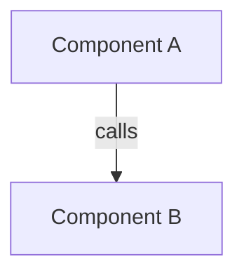
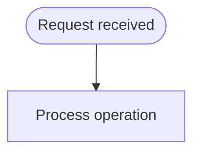

# [Project/Feature Name]

> [!NOTE]
> **AI-Assisted Documentation**
> Portions of this document were drafted with the assistance of an AI language model (GitHub Copilot).
> Content has not yet been fully reviewed — this is a working design reference, not a final specification.

---

## 1. Blueprint (Core Concepts & Scope)
<!-- Define the primary domain entities that this service introduces. -->

### [Entity A]
**States:** <!-- e.g., online | offline -->
**Key fields:** <!-- Bullet list of important fields -->

---

## 2. Requirements Matrix
<!-- Split into Business and Functional Requirements. Ensure Requirement IDs map correctly. -->

### Business Requirements
| # | Requirement |
|---|-------------|
| B1 | <!-- Operator-facing goal --> |

### Functional Requirements
| # | Requirement |
|---|-------------|
| F1 | <!-- System behavior that satisfies B1 --> |

---

## 3. Solution Architecture
<!-- Describe system components and interactions using Mermaid diagrams -->

### Component Overview

### Execution Flow

---

## 4. Data Dictionary
<!-- One section per database table / entity. List canonical field-level definitions. -->

### `[table_name]`
| Field | Type | Required | Description |
|-------|------|----------|-------------|
| `id` | uuid | Yes | Unique identifier |

---

## 5. Risks and Decisions
<!-- Log Architectural Decisions (AD) and Risks (RK) -->
- **AD-01**: <!-- Decision description -->
- **RK-01**: <!-- Risk description -->

---

## 6. Implementation Tasks
<!-- Implementation tasks and tracking format -->
- [ ] Task 1
- [ ] Task 2
